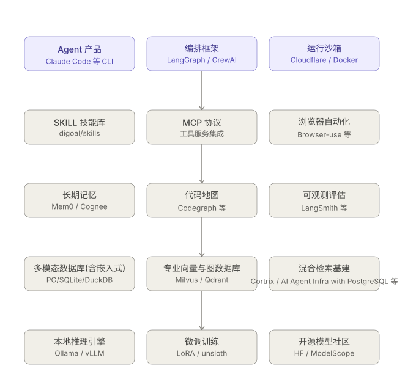

AI 相关技术栈热门项目 handbook.
  
  
  
Agent 真身栖息地/安全沙箱运行环境:
- [Cloudflare Computer](computer_handbook)  
- [Docker image](https://github.com/digoal/blog/blob/master/202607/20260730_02.md)  
  
Agent: 
- [Hermes 产品](https://hermes-agent.nousresearch.com/docs/user-stories)  
- [Claude Code CLI 产品](claude_handbook)
- [Claude Code CLI 产品, 另一本开源手册](https://github.com/luongnv89/claude-howto)
- [Claude Code 泄漏源码 handbook](claude_leaked_source_handbook)
- [Pi 源码](pi_handbook)  
- [KiloCode 产品](https://github.com/Kilo-Org/kilocode)  
- [freebuff(免费的 Agent)产品](https://github.com/CodebuffAI/freebuff)  
  
Agent 设计:
- [Agentic Design Patterns(智能体设计模式) 中文翻译, 仅作学习交流, 请勿传播](agi-cn/output/agi-zh-by-chapter)
  
Agent 编排:
- [Ruflo](ruflo_handbook)
- [CrewAI](https://github.com/crewAIInc/crewAI)
  
SKILL:   
- [常用 SKILL](https://github.com/digoal/skills)
  
记忆:
- [Mem0](mem0_handbook)
- [Cognee](cognee_handbook)
- [PowerMem](powermem_handbook)
    
代码地图:
- [Codegraph](codegraph_handbook)
- [Understand Anything](understand_anything_handbook)
  
数据库、多模态存储与召回:  
- PG及插件, SQLite及插件, DuckDB及插件, SeekDB.    
    - 提供 全文检索、关键词检索、向量检索、图检索、RRF混合检索、reranking 重排. chunk、关联、embedding.    
- [SeekDB](seekdb_handbook)
- [Cortrix](cortrix_handbook)
- [AI Agent Infra with PostgreSQL](ai_infra_with_postgresql_handbook)
- [Palantir semantica 开源平替](https://github.com/semantica-agi/semantica)  
  
本地模型部署:
- [MLX-LM 或 LM Studio](https://github.com/ml-explore/mlx-lm)
- [Ollama](https://ollama.com)
- [vLLM](https://github.com/vllm-project/vllm)
- [LocalAI](https://github.com/mudler/LocalAI)
  
开源模型:
- [huggingface](https://huggingface.co/)
- [modelscope](https://www.modelscope.cn/home)
  
AI 应用:
- [股票分析](https://github.com/TauricResearch/TradingAgents)  
  
AI 论文:
- [Huggingface AI paper trending](https://huggingface.co/papers/trending)  


----

# 附录
## submodules
添加 submodules
```
# 1. 先浅克隆到目标目录
git clone --depth 1 https://github.com/author/project.git path/to/subdirectory

# 2. 再把它注册为子模块
git submodule add https://github.com/author/project.git path/to/subdirectory
```
  
更新 submodules  
```
# 1. 初始化并更新所有子模块
git submodule update --init --recursive --remote

# 2. 添加所有更改（包括子模块的更新）
git add .

# 3. 提交更改
git commit -m "Update all submodules to latest versions"

# 4. 推送到 GitHub
git push origin main  # 或你的分支名
```
  
克隆 submodules
```
git clone --depth 1 https://github.com/digoal/ai-handbook
cd ai-handbook
git submodule update --init --recursive --depth 1
```
