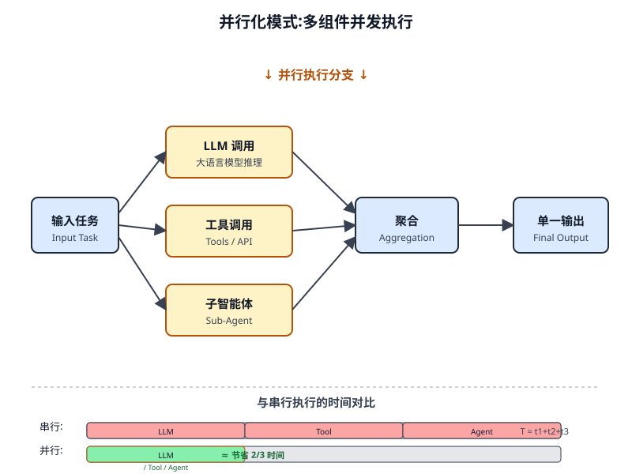
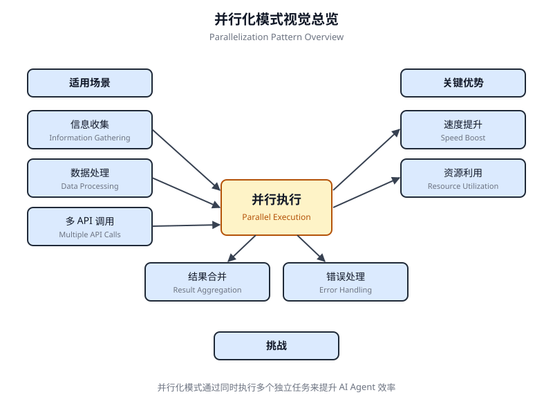

# 第 3 章 并行化(Parallelization)

<!-- chapter: 3 | part: I | pages: 69-83 | translated_from: pdf/069-083 -->

## 并行化模式概述



在前面的章节中，我们已经探讨了用于顺序工作流的提示链(Prompt Chaining)和用于动态决策及不同路径之间转换的路由(Routing)。虽然这些模式至关重要，但许多复杂的智能体式任务涉及可以同时执行而非依次执行的多个子任务。这正是并行化(Parallelization)模式变得关键的地方。

并行化涉及并发执行多个组件，例如 LLM 调用、工具使用，甚至是整个子智能体(参见图 3.1)。并行化执行无需等待一个步骤完成后再开始下一步，而是允许独立的任务同时运行，从而显著缩短可分解为独立部分的任务的整体执行时间。

考虑一个旨在研究某个主题并总结其发现的智能体。顺序方法可能：

1. 搜索来源 A。
2. 总结来源 A。
3. 搜索来源 B。
4. 总结来源 B。
5. 根据摘要 A 和 B 合成最终答案。

可以采用并行化方法代替：

1. 同时搜索资料来源 A 和资料来源 B。
2. 当两次搜索都完成后，同时对资料来源 A 和资料来源 B 进行摘要。
3. 从摘要 A 和摘要 B 综合出最终答案(此步骤通常是顺序执行的，需等待并行化步骤完成)。核心思想是识别工作流中不依赖于其他部分输出的环节，并行化执行它们。当涉及具有延迟的外部服务(如 API 或数据库)时，这种方法尤其有效，因为可以并发地发出多个请求。

实现并行化通常需要支持异步执行或多线程/多进程的框架。现代智能体式框架在设计时就考虑了异步操作，使得定义可并行化运行的步骤变得容易。

LangChain、LangGraph 和 Google ADK 等框架提供了并行化执行的机制。在 LangChain Expression Language (LCEL)中，你可以通过使用 `|` 等运算符组合可运行对象(用于顺序执行),以及通过将链或图结构设计为具有并发执行的分支，从而实现并行化执行。LangGraph 凭借其图结构，允许你定义可从单一状态转换执行的多个节点，从而在工作流中有效地实现并行化分支。Google ADK 提供了强大的原生机制来促进和管理智能体的并行化执行，显著提升了复杂多智能体系统的效率和可扩展性。ADK 框架的这一固有能力使开发者能够设计并实现多个智能体并发而非顺序运行的解决方案。

并行化模式对于提升智能体式系统的效率和响应能力至关重要，尤其在处理涉及多个独立查询、计算或与外部服务交互的任务时。

它是优化复杂智能体(Agent)工作流(Workflow)性能的关键技术。

## 实际应用与用例

并行化(Parallelization)是优化智能体在各类应用中性能的强大模式：

### 信息收集与研究

同时从多个来源收集信息是典型的用例。

- **用例**:一个研究某公司的智能体。
  - **并行化任务**:同时搜索新闻文章、抓取股票数据、检查社交媒体提及，并查询公司数据库。
  - **优势**:比顺序查找更快地汇集全面的视图。

### 数据处理与分析

并发应用不同的分析技术或处理不同的数据片段。

- **用例**:一个分析客户反馈的智能体。
  - **并行化任务**:在一批反馈条目上同时运行情感分析、提取关键词、分类反馈，并识别紧急问题。
  - **优势**:快速提供多维度的分析结果。

### 多 API 或工具交互

调用多个独立的 API 或工具以收集不同类型的信息或执行不同的操作。

- **用例**:一个旅行规划智能体。
  - **并行化任务**:并发地检查航班价格、搜索酒店可用性、查询本地活动，并查找餐厅推荐。
  - **优势**:更快地呈现完整的旅行规划。

### 多组件内容生成

并行化生成复杂内容的不同部分。

- **用例**:一个创建营销邮件的智能体。
  - **并行化任务**:同时生成主题行、起草邮件正文、查找相关图片，并创建行动召唤按钮文本。
  - **优势**:更高效地组装最终邮件。

### 验证与核实

并发执行多个独立的检查或验证。

- **用例**:一个验证用户输入的智能体。
  - **并行化任务**:同时检查电子邮件格式、验证电话号码、根据数据库核实地址，并检查脏话。
  - **优势**:对输入有效性提供更快的反馈。

### 多模态处理

并发处理同一输入的不同模态(文本、图像、音频)。

- **用例**:一个分析包含文本和图像的社交媒体帖子的智能体。
  - **并行化任务**:同时分析文本的情感和关键词，并分析图像中的物体和场景描述。
  - **优势**:更快地整合来自不同模态的洞察。

### A/B 测试或多方案生成

并行化生成响应的多个变体或输出，以选择最佳方案。

- **用例**:一个生成不同创意文本方案的智能体。
  - **并行化任务**:使用略有不同的提示或模型，同时为一篇文章生成三个不同的标题。
  - **优势**:能够快速比较并选择最佳方案。

并行化(Parallelization)是智能体式设计中的一项基础优化技术，允许开发者通过利用独立任务的并发执行来构建性能更高、响应更快的应用。

## 动手代码示例(LangChain)

在 LangChain 框架中，并行化执行通过 LangChain 表达式语言(LCEL)实现。主要方法是先在字典或列表结构中组织多个可运行组件(Runnable)。当该集合作为输入传递给链中的下游组件时，LCEL 运行时就会并发执行其中包含的可运行组件。在 LangGraph 的语境下，该原理同样适用于图的拓扑结构：通过将图设计为多个彼此无直接顺序依赖的节点从同一公共节点出发，即可定义并行化工作流。这些并行化分支独立执行，其结果随后在图的某个汇聚节点处被聚合。下面的实现演示了一个使用 LangChain 框架构建的并行化处理工作流。该工作流针对单次用户查询，并发执行两个相互独立的操作。这两个并行化流程被实例化为不同的链或函数，其各自的输出最终被聚合成一个统一的结果。运行该实现的前置条件包括安装所需的 Python 包，例如 langchain、langchain-community,以及某个模型提供商的库(如 langchain-openai)。

此外，必须在本地环境中配置所选语言模型的有效 API 密钥，以便进行身份验证。

```python
import os
import asyncio
from typing import Optional
from langchain_openai import ChatOpenAI
from langchain_core.prompts import ChatPromptTemplate
from langchain_core.output_parsers import StrOutputParser
from langchain_core.runnables import Runnable, RunnableParallel, RunnablePassthrough

# --- Configuration ---
# Ensure your API key environment variable is set (e.g., OPENAI_API_KEY)
try:
    llm: Optional[ChatOpenAI] = ChatOpenAI(model="gpt-4o-mini", temperature=0.7)
except Exception as e:
    print(f"Error initializing language model: {e}")
    llm = None

# --- Define Independent Chains ---
# These three chains represent distinct tasks that can be executed in parallel.
summarize_chain: Runnable = (
    ChatPromptTemplate.from_messages([
        ("system", "Summarize the following topic concisely:"),
        ("user", "{topic}")
    ])
    | llm
    | StrOutputParser()
)

questions_chain: Runnable = (
    ChatPromptTemplate.from_messages([
        ("system", "Generate three interesting questions about the following topic:"),
        ("user", "{topic}")
    ])
    | llm
    | StrOutputParser()
)

terms_chain: Runnable = (
    ChatPromptTemplate.from_messages([
        ("system", "Identify 5-10 key terms from the following topic, separated by commas:"),
        ("user", "{topic}")
    ])
    | llm
    | StrOutputParser()
)

# --- Build the Parallel + Synthesis Chain ---
# 1. Define the block of tasks to run in parallel.
```

```python
# The results of these, along with the original topic, will be fed into the next step.
map_chain = RunnableParallel(
    {
        "summary": summarize_chain,
        "questions": questions_chain,
        "key_terms": terms_chain,
        "topic": RunnablePassthrough(),    # Pass the original topic through
    }
)
# 2. Define the final synthesis prompt which will combine the parallel results.
synthesis_prompt = ChatPromptTemplate.from_messages([
    ("system", """Based on the following information:
    Summary: {summary}
    Related Questions: {questions}
    Key Terms: {key_terms}
    Synthesize a comprehensive answer."""),
    ("user", "Original topic: {topic}")
])
# 3. Construct the full chain by piping the parallel results directly
#    into the synthesis prompt, followed by the LLM and output parser.
full_parallel_chain = map_chain | synthesis_prompt | llm | StrOutputParser()
# --- Run the Chain ---
async def run_parallel_example(topic: str) -> None:
    """
    Asynchronously invokes the parallel processing chain with a specific topic
    and prints the synthesized result. Args:
        topic: The input topic to be processed by the LangChain chains.
    """
    if not llm:
        print("LLM not initialized. Cannot run example.")
        return
    print(f"\n--- Running Parallel LangChain Example for Topic: '{topic}' ---")
    try:
        # The input to 'ainvoke' is the single 'topic' string,
        # then passed to each runnable in the 'map_chain'.
        response = await full_parallel_chain.ainvoke(topic)
        print("\n--- Final Response ---")
        print(response)
    except Exception as e:
        print(f"\nAn error occurred during chain execution: {e}")
if __name__ == "__main__":
    test_topic = "The history of space exploration"
    # In Python 3.7+, asyncio.run is the standard way to run an async function.
    asyncio.run(run_parallel_example(test_topic))
```

所提供 Python 代码实现了一个 LangChain 应用，旨在通过利用并行化执行高效地处理给定主题。需要注意的是，asyncio 提供的是并发(concurrency)而非并行化(parallelism)。它在单线程上通过事件循环实现这一点：当某个任务处于空闲状态(例如，等待网络请求)时，事件循环会在任务之间智能切换。这营造出多个任务同时推进的效果，但代码本身仍仅由一个线程执行，并受 Python 全局解释器锁(GIL)的约束。该代码首先从 `langchain_openai` 和 `langchain_core` 导入必要的模块，包括用于语言模型、提示、输出解析和可运行结构的组件。代码尝试初始化一个 `ChatOpenAI` 实例，具体使用 `gpt-4o-mini` 模型，并设定一个特定的 temperature 参数来控制创造性。在语言模型初始化过程中，使用了 try-except 块以增强鲁棒性。随后定义了三条独立的 LangChain "链",每条链被设计为对输入主题执行不同任务。第一条链用于简洁地总结主题，使用一条系统消息和一条包含主题占位符的用户消息。第二条链被配置为生成与主题相关的三个有趣问题。第三条链被设置为从输入主题中识别五到十个关键术语，并要求以逗号分隔的形式输出。这些独立的链均由针对其特定任务量身定制的 `ChatPromptTemplate` 组成，后接初始化好的语言模型和用于将输出格式化为字符串的 `StrOutputParser`。随后构建一个 `RunnableParallel` 块，将这三条链打包，以允许它们同时执行。该并行化可运行对象还包含一个 `RunnablePassthrough`,以确保后续步骤能够访问原始输入主题。

为最终的合成步骤定义了一个独立的 `ChatPromptTemplate`,它将摘要、问题、关键词和原始主题作为输入，以生成一个综合性的回答。这个完整的端到端处理链被命名为 `full_parallel_chain`,它通过将 `map_chain`(并行化块)按顺序接入合成提示，再接入语言模型和输出解析器来构建。提供了一个异步函数 `run_parallel_example` 来演示如何调用这个 `full_parallel_chain`。该函数接收主题作为输入，并使用 `ainvoke` 来运行异步链。最后，标准的 Python `if __name__ == "__main__":` 块展示了如何使用一个示例主题(此处为 "The history of space exploration")来执行 `run_parallel_example`,并使用 `asyncio.run` 来管理异步执行。

本质上，这段代码搭建了一个工作流：对于给定的主题，多个 LLM 调用(用于摘要、问题和关键词)是同时发生的，然后它们的结果由最后一次 LLM 调用进行合并。这展示了在 LangChain 的智能体工作流中，并行化的核心思想。

## 动手代码示例(Google ADK)

好的，现在让我们将注意力转向一个具体的示例，在 Google ADK 框架内展示这些概念。我们将考察 ADK 的原语(如 ParallelAgent 与 SequentialAgent)如何被应用于构建一个利用并发执行以提升效率的智能体流程。

```python
from google.adk.agents import LlmAgent, ParallelAgent, SequentialAgent
from google.adk.tools import google_search

GEMINI_MODEL = "gemini-2.0-flash"

# --- 1. Define Researcher Sub-Agents (to run in parallel) ---

# Researcher 1: Renewable Energy
researcher_agent_1 = LlmAgent(
    name="RenewableEnergyResearcher",
    model=GEMINI_MODEL,
    instruction="""You are an AI Research Assistant specializing in energy. Research the latest advancements in 'renewable energy sources'. Use the Google Search tool provided. Summarize your key findings concisely (1-2 sentences). Output *only* the summary.
""",
    description="Researches renewable energy sources.",
    tools=[google_search],
    # Store result in state for the merger agent
    output_key="renewable_energy_result"
)

# Researcher 2: Electric Vehicles
researcher_agent_2 = LlmAgent(
    name="EVResearcher",
    model=GEMINI_MODEL,
    instruction="""You are an AI Research Assistant specializing in transportation. Research the latest developments in 'electric vehicle technology'. Use the Google Search tool provided. Summarize your key findings concisely (1-2 sentences). Output *only* the summary.
""",
    description="Researches electric vehicle technology.",
    tools=[google_search],
    # Store result in state for the merger agent
    output_key="ev_technology_result"
)

# Researcher 3: Carbon Capture
researcher_agent_3 = LlmAgent(
    name="CarbonCaptureResearcher",
    model=GEMINI_MODEL,
    instruction="""You are an AI Research Assistant specializing in climate solutions. Research the current state of 'carbon capture methods'. Use the Google Search tool provided. Summarize your key findings concisely (1-2 sentences).
```

```python
Output *only* the summary.
     """,
         description="Researches carbon capture methods.",
         tools=[google_search],
         # Store result in state for the merger agent
         output_key="carbon_capture_result"
     )
     # --- 2. Create the ParallelAgent (Runs researchers concurrently) ---
     # This agent orchestrates the concurrent execution of the researchers.
     # It finishes once all researchers have completed and stored their results in state.
     parallel_research_agent = ParallelAgent(
     �   name="ParallelWebResearchAgent",
         sub_agents=[researcher_agent_1, researcher_agent_2, researcher_agent_3],
         description="Runs multiple research agents in parallel to gather information."
     )
     # --- 3. Define the Merger Agent (Runs *after* the parallel agents) ---
     # This agent takes the results stored in the session state by the parallel agents
     # and synthesizes them into a single, structured response with attributions.
     merger_agent = LlmAgent(
     �   name="SynthesisAgent",
         model=GEMINI_MODEL, # Or potentially a more powerful model if needed for synthesis
         instruction="""You are an AI Assistant responsible for combining research findings into a structured report. Your primary task is to synthesize the following research summaries, clearly attributing findings to their source areas. Structure your response using headings for each topic. Ensure the report is coherent and integrates the key points smoothly.
     **Crucially: Your entire response MUST be grounded *exclusively* on the information provided in the 'Input Summaries' below.
```

Do NOT add any external knowledge, facts, or details not
present in these specific summaries.**
**Input Summaries:**
*   **Renewable Energy:**
    {renewable_energy_result}
*   **Electric Vehicles:**
    {ev_technology_result}
*   **Carbon Capture:**
    {carbon_capture_result}
**Output Format:**
## 近期可持续技术进展总结
### 可再生能源发现
(基于 RenewableEnergyResearcher 的发现)
[仅综合并详述上方提供的可再生能源输入摘要。]
### 电动汽车发现
(基于 EVResearcher 的发现)
[仅综合并详述上方提供的电动汽车输入摘要。]
### 碳捕集发现
(基于 CarbonCaptureResearcher 的发现)
[仅综合并详述上方提供的碳捕集输入摘要。]
### 总体结论
[提供一个简短的(1-2 句话)总结性陈述，仅串联上述呈现的发现。]
仅输出遵循此格式的结构化报告。不要在此结构之外包含介绍性或结论性的措辞，并严格遵循仅使用所提供的输入摘要内容。
    # No tools needed for merging
    # No output_key needed here, as its direct response is the
final output of the sequence
)
     # --- 4. Create the SequentialAgent (Orchestrates the overall flow) ---
     # This is the main agent that will be run.

它首先执行 `ParallelAgent` 以填充状态，然后执行 `MergerAgent` 以生成最终输出。

```python
sequential_pipeline_agent = SequentialAgent(
    name="ResearchAndSynthesisPipeline",
    # Run parallel research first, then merge
    sub_agents=[parallel_research_agent, merger_agent],
    description="Coordinates parallel research and synthesizes the results."
)
root_agent = sequential_pipeline_agent
```

此代码定义了一个多智能体系统，用于研究并综合有关可持续技术进步的信息。它设置了三个 `LlmAgent` 实例作为专项研究员。`ResearcherAgent_1` 专注于可再生能源，`ResearcherAgent_2` 研究电动汽车技术，`ResearcherAgent_3` 调查碳捕集方法。每个研究员智能体均配置使用 `GEMINI_MODEL` 和 `google_search` 工具。它们被指示以简洁的方式(1–2 句话)总结其发现，并通过 `output_key` 将这些摘要存储到会话状态中。随后创建一个名为 `ParallelWebResearchAgent` 的 `ParallelAgent`,用于并发运行这三个研究员智能体。这使得研究能够并行化进行，从而可能节省时间。当所有子智能体(研究员)完成执行并填充状态后，`ParallelAgent` 即完成执行。接着，定义一个 `MergerAgent`(同样为 `LlmAgent`)以综合研究结果。该智能体以并行化研究员存储在会话状态中的摘要作为输入。其指令强调输出必须严格基于所提供的输入摘要，禁止添加外部知识。`MergerAgent` 被设计为将合并后的发现组织为一份报告，其中包含每个主题的标题以及一段简要的整体结论。最后，创建一个名为 `ResearchAndSynthesisPipeline` 的 `SequentialAgent`,以编排整个工作流。作为主控制器，该主智能体首先执行 `ParallelAgent` 以开展研究。`ParallelAgent` 完成后，`SequentialAgent` 再执行 `MergerAgent` 以综合收集到的信息。`sequential_pipeline_agent` 被设置为 `root_agent`,代表运行该多智能体系统的入口点。

该整体流程旨在高效地并行化从多个来源收集信息，然后将其合并为一份统一的、结构化的报告。

## 概览

在许多智能体式工作流中，需要完成多个子任务才能实现最终目标。如果采用纯顺序执行——每个任务都要等待前一个任务完成——通常效率低下且速度缓慢。当任务依赖于外部 I/O 操作(例如调用不同的 API 或查询多个数据库)时，这种延迟会成为显著的瓶颈。如果缺乏并发执行机制，总处理时间就是所有单个任务时长的累加，从而阻碍系统的整体性能和响应能力。

并行化(Parallelization)模式通过支持独立任务的并发执行，提供了一种标准化的解决方案。它的工作机制是识别工作流中不依赖于彼此即时输出的组件(例如工具调用或大语言模型调用)。LangChain 和 Google ADK 等智能体框架提供了内置的结构来定义和管理这些并发操作。例如，主流程可以并行化调用多个子任务，并在所有子任务完成后才进入下一步。通过同时运行这些独立任务而非依次执行，该模式大幅缩短了总执行时间。

Rule of Thumb:当工作流包含多个可以同时运行的独立操作时，使用此模式，例如从多个 API 获取数据、处理不同的数据块，或生成多个内容片段以便后续合成。

**可视化总结** (Fig. 3.2)

### 关键要点

以下是关键要点：

- 并行化是一种通过并发执行独立任务以提升效率的模式。
- 当任务涉及等待外部资源(如 API 调用)时，它特别有用。
- 采用并发或并行化架构会引入显著的复杂性与成本，影响设计、调试和系统日志记录等关键开发阶段。
- LangChain 和 Google ADK 等框架提供内置支持，用于定义和管理并行化执行。
- 在 LangChain 表达式语言(LCEL)中，RunnableParallel 是并排运行多个 Runnable 的关键构造。
- Google ADK 可以通过 LLM 驱动的委派来促进并行化执行：由协调器智能体的 LLM 识别独立的子任务，并触发专门的子智能体并发处理这些子任务。
- 并行化有助于降低整体延迟，使智能体系统在处理复杂任务时响应更加迅速。

### 结论

并行化模式是一种通过并发执行独立子任务来优化计算工作流的方法。该方法能够降低整体延迟，尤其是在涉及多次模型推理或多次外部服务调用的复杂操作中。

各框架提供了实现此模式的不同机制。在 LangChain 中，RunnableParallel 等构造用于显式地定义并同时执行多条处理链。相比之下，Google Agent Developer Kit (ADK) 等框架可以通过多智能体委派实现并行化，由主协调器模型将不同子任务分配给能够并发运行的专门智能体。

通过将并行化处理与顺序(链式)和条件(路由)控制流相结合，就能够构建出复杂且高性能的计算系统，从而高效地处理多样且复杂的任务。

## 参考文献

- Google Agent Developer Kit (ADK) 文档(多智能体系统): https://google.github.io/adk-docs/agents/multi-agents/
- LangChain Expression Language (LCEL) 文档(并行化): https://python.langchain.com/docs/concepts/lcel/
- Python asyncio 文档： https://docs.python.org/3/library/asyncio.html

