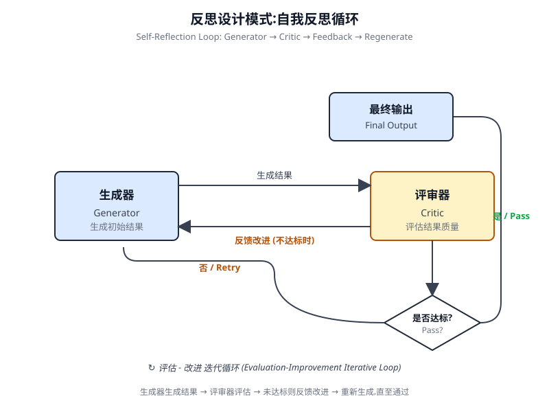
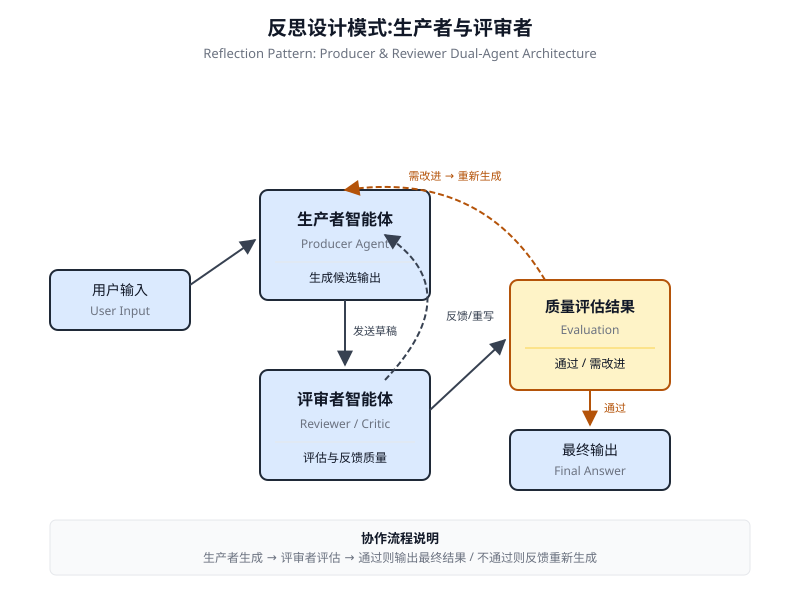

# 第 4 章 反思(Reflection)

<!-- chapter: 4 | part: I | pages: 84-96 | translated_from: pdf/084-096 -->

## 反思模式概述

在前面的章节中，我们已经探讨了基本的智能体式设计模式：用于顺序执行的提示链(Prompt Chaining)、用于动态路径选择的路由(Routing),以及用于并发任务执行的并行化(Parallelization)。这些模式使智能体能够更高效、更灵活地执行复杂任务。然而，即使采用了复杂的工作流，智能体的初始输出或规划也可能并非最优、准确或完整。这正是反思模式(Reflection Pattern)发挥作用的地方。

反思模式涉及智能体评估自身的工作、输出或内部状态，并利用该评估来改进其性能或优化其响应。这是一种自我修正或自我改进的形式，允许智能体基于反馈、内部评审或与期望标准的对比，迭代地优化其输出或调整其方法。反思有时可以由一个专门的智能体来协助完成，该智能体的特定角色是分析初始智能体的输出。

与输出直接传递给下一步的简单顺序链不同，反思引入了反馈循环。智能体不仅生成输出，还会审视该输出(或生成该输出的过程),识别潜在的问题或可改进之处，并利用这些洞察生成更好的版本或修改其后续动作。

## 实际应用与用例

反思(Reflection)模式在以下场景中具有重要价值：输出质量、准确性或对复杂约束的遵循至关重要时：

### 创意写作与内容生成

润色生成的文本、故事、诗歌或营销文案。

- **用例**:智能体撰写博客文章。
  - **反思**:生成草稿，对其流畅性、语气和清晰度进行评审，然后基于评审意见重写。

  重复上述过程，直至文章达到质量标准。
  - **收益**:产出更精致、更有效的内容。

### 代码生成与调试

编写代码、识别错误并修复。

-

Repeat until the post meets quality
       standards.
     – 收益：产出更精炼、更有效的内容。

代码生成与调试
编写代码、识别错误并修复它们。
- 应用场景：一个智能体(Agent)编写 Python 函数。
  - 反思(Reflection):编写初始代码，运行测试或静态分析，识别错误或低效之处，然后根据发现修改代码。
  – 收益：生成更健壮且功能正确的代码。

复杂问题求解
在多步推理任务中评估中间步骤或拟议方案。
- 应用场景：一个智能体求解逻辑谜题。
  - 反思(Reflection):提出一步，评估其是否更接近解或引入矛盾，必要时回溯或选择另一步。
  – 收益：提升智能体在复杂问题空间中导航的能力。

摘要与信息综合
优化摘要的准确性、完整性与简洁性。
- 应用场景：一个智能体对长文档进行摘要。
  - 反思(Reflection):生成初版摘要，对照原文档的关键点进行比较，完善摘要以补充缺失信息或提升准确性。
  – 收益：产出更准确、更全面的摘要。

规划与策略
评估拟议规划并识别潜在缺陷或改进点。
- 应用场景：一个智能体规划一系列行动以达成目标。
  - 反思(Reflection):生成规划，模拟执行或在约束条件下评估可行性，根据评估结果修订规划。
  – 收益：制定更有效且更贴近实际的规划。

对话智能体
回顾对话中的先前轮次以维持上下文、纠正误解或提升回复质量。
- 应用场景：客服聊天机器人。
  - 反思(Reflection):在用户回复后，审视对话历史与上一条生成的消息，确保连贯性并准确回应用户的最新输入。
  – 收益：带来更自然、更有效的对话。

反思(Reflection)为智能体系统添加了一层元认知能力，使它们能够从自身的输出和流程中学习，从而产生更智能、更可靠、质量更高的结果。

## 实践代码示例 (LangChain)

实现完整、迭代式的反思过程需要状态管理与循环执行的机制。虽然这些在基于图的框架(如 LangGraph)中由框架原生处理，也可以通过自定义过程式代码实现，但单一反思周期的核心原理可以通过 LCEL(LangChain Expression Language)的组合式语法有效演示。

本示例使用 LangChain 库和 OpenAI 的 GPT-4o 模型实现一个反思循环，以迭代方式生成并优化用于计算数字阶乘的 Python 函数。流程从任务提示开始，生成初始代码，然后根据模拟的资深软件工程师角色的评审意见反复对代码进行反思，在每次迭代中优化代码，直到评审阶段判定代码已完美，或达到最大迭代次数。最后，程序打印输出优化后的最终代码。

首先，确保已安装所需的库：

```bash
pip install langchain langchain-community langchain-openai
```

```python
import os
     from dotenv import load_dotenv
     from langchain_openai import ChatOpenAI
     from langchain_core.prompts import ChatPromptTemplate
     from langchain_core.messages import SystemMessage, HumanMessage
     # --- Configuration ---
     #
     Load environment variables from .env file (for OPENAI_API_KEY)
     load_dotenv()
     # Check if the API key is set
     if not os.getenv("OPENAI_API_KEY"):
        raise ValueError("OPENAI_API_KEY not found in .env file.
     Please add it.")
     # Initialize the Chat LLM. We use gpt-4o for better reasoning.
     # A lower temperature is used for more deterministic outputs.
     llm = ChatOpenAI(model="gpt-4o", temperature=0.1)
     def run_reflection_loop():
        """
        Demonstrates a multi-step AI reflection loop to progressively
     improve a Python function.
        """
        # --- The Core Task ---
        task_prompt = """
        Your   task   is   to   create  a   Python   function   named
     `calculate_factorial`.
        This function should do the following:
        1. Accept a single integer `n` as input.
        2. Calculate its factorial (n!).
        3.   Include a clear docstring explaining what the func-
     tion does.
        4. Handle edge cases: The factorial of 0 is 1.
        5. Handle invalid input: Raise a ValueError if the input is
     a negative number.
        """
        # --- The Reflection Loop ---
        max_iterations = 3
        current_code = ""
        # We will build a conversation history to provide context in
     each step.
   message_history = [HumanMessage(content=task_prompt)]
   for i in range(max_iterations):
       print("\n" + "="*25 + f" REFLECTION LOOP: ITERATION {i +
1} " + "="*25)
       # --- 1. GENERATE / REFINE STAGE ---
       # In the first iteration, it generates. In subsequent
iterations, it refines.
       if i == 0:
           print("\n>>> STAGE 1: GENERATING initial code...")
           # The first message is just the task prompt.
           response = llm.invoke(message_history)
           current_code = response.content
       else:
           print("\n>>> STAGE 1: REFINING code based on previous
critique...")
           # The message history now contains the task,
           # the last code, and the last critique.
           # We instruct the model to apply the critiques.
           message_history.append(HumanMessage(content="Please
refine the code using the critiques provided."))
           response = llm.invoke(message_history)
           current_code = response.content
       print("\n--- Generated Code (v" + str(i + 1) + ") ---\n"
+ current_code)
       message_history.append(response) # Add the generated code
to history
       # --- 2. REFLECT STAGE ---
       print("\n>>> STAGE 2: REFLECTING on the generated
code...")
       # Create a specific prompt for the reflector agent.
       # This asks the model to act as a senior code reviewer.
       reflector_prompt = [
           SystemMessage(content="""
               You are a senior software engineer and an expert
               in Python.
               Your role is to perform a meticulous code review.
               Critically evaluate the provided Python code based
               on the original task requirements.
               Look for bugs, style issues, missing edge cases,
               and areas for improvement.
               If the code is perfect and meets all requirements,
               respond with the single phrase 'CODE_IS_PERFECT'.
               Otherwise, provide a bulleted list of your
critiques.
           """),
           HumanMessage(content=f"Original          Task:\n{task_
prompt}\n\nCode to Review:\n{current_code}")
       ]
       critique_response = llm.invoke(reflector_prompt)
            critique = critique_response.content
            # --- 3. STOPPING CONDITION ---
            if "CODE_IS_PERFECT" in critique:
                print("\n--- Critique ---\nNo further critiques found.
     The code is satisfactory.")
                break
            print("\n--- Critique ---\n" + critique)
            # Add the critique to the history for the next refine-
     ment loop.
            message_history.append(HumanMessage(content=f"Critique
     of the previous code:\n{critique}"))
        print("\n" + "="*30 + " FINAL RESULT " + "="*30)
        print("\nFinal refined code after the reflection process:\n")
        print(current_code)
     if __name__ == "__main__":
        run_reflection_loop()
```

你还需要设置好所选语言模型(例如 OpenAI、Google Gemini、Anthropic)的 API 密钥环境。代码首先设置环境、加载 API 密钥，并初始化一个强大的语言模型(如 GPT-4o),使用较低的温度参数以获得聚焦的输出。核心任务由一段提示(Prompt)定义，要求编写一个用于计算数字阶乘的 Python 函数，具体要求包括：添加文档字符串(docstring)、处理边界情况(0 的阶乘),以及针对负数输入进行错误处理。`run_reflection_loop` 函数编排整个迭代优化过程。在循环的第一次迭代中，语言模型根据任务提示生成初始代码；在后续迭代中，模型基于上一步的评审意见对代码进行优化。一个独立的"反思器(reflector)"角色(同样由语言模型扮演，但使用不同的系统提示)充当资深软件工程师，根据原始任务要求对生成的代码进行评审。该评审以项目符号列表的形式给出问题清单，若未发现问题则返回短语 `CODE_IS_PERFECT`。循环将持续进行，直至评审表明代码已完美，或达到最大迭代次数为止。对话历史在每一步都被维护并传递给语言模型，从而为生成/优化和反思阶段提供上下文。最后，脚本在循环结束后打印最后生成的代码版本。

## 动手代码示例(ADK)

现在我们来看一个使用 Google ADK 实现的概念性代码示例。

具体而言，该代码通过采用生成器-评审器(Generator-Critic)结构来展示这一点：其中一个组件(生成器)生成初始结果或方案，另一个组件(评审器)提供批判性反馈或评审意见，从而引导生成器朝着更精细或更准确的最终输出方向改进。

```python
from google.adk.agents import SequentialAgent, LlmAgent

# The first agent generates the initial draft.
generator = LlmAgent(
    name="DraftWriter",
    description="Generates initial draft content on a given subject.",
    instruction="Write a short, informative paragraph about the user's subject.",
    output_key="draft_text" # The output is saved to this state key.
)

# The second agent critiques the draft from the first agent.
reviewer = LlmAgent(
    name="FactChecker",
    description="Reviews a given text for factual accuracy and provides a structured critique.",
    instruction="""
    You are a meticulous fact-checker.
    1. Read the text provided in the state key 'draft_text'.
    2. Carefully verify the factual accuracy of all claims.
    3. Your final output must be a dictionary containing two keys:
      - "status": A string, either "ACCURATE" or "INACCURATE".
      - "reasoning": A string providing a clear explanation for your status, citing specific issues if any are found.
    """,
    output_key="review_output" # The structured dictionary is saved here.
)

# The SequentialAgent ensures the generator runs before the reviewer.
review_pipeline = SequentialAgent(
    name="WriteAndReview_Pipeline",
    sub_agents=[generator, reviewer]
)

# Execution Flow:
#    1.   generator    runs    ->   saves   its    paragraph   to
state['draft_text'].
# 2. reviewer runs -> reads state['draft_text'] and saves its
dictionary output to state['review_output'].
```

此代码演示了在 Google ADK 中使用顺序代理 (Sequential Agent) 流水线来生成和审查文本。

它定义了两个 `LlmAgent` 实例：生成器(generator)和评审器(reviewer)。生成器智能体负责针对给定主题创建初始草稿段落。系统指示其撰写一段简短且信息丰富的内容，并将其输出保存到状态键 `draft_text` 中。评审器智能体充当生成器所产出的文本的事实核查器。系统指示其从 `draft_text` 中读取文本，并核实其事实准确性。评审器的输出是一个包含两个键的结构化字典：`status` 和 `reasoning`。`status` 表明文本是"ACCURATE"(准确)还是"INACCURATE"(不准确),而 `reasoning` 则为该状态提供解释。该字典被保存到状态键 `review_output` 中。一个名为 `review_pipeline` 的 `SequentialAgent` 被创建，用于管理这两个智能体的执行顺序。它确保生成器先运行，然后评审器紧随其后。整体执行流程是：生成器产出文本，然后将其保存到状态中。随后，评审器从状态中读取该文本，执行事实核查，并将其发现(即 `status` 和 `reasoning`)保存回状态。该流水线使得使用独立的智能体进行结构化的内容创建与评审过程成为可能。注：对于感兴趣者，也可采用利用 ADK 的 `LoopAgent` 的替代实现方案。

在结束之前，需要考虑的是，尽管反思(Reflection)模式显著提升了输出质量，但它也伴随着重要的权衡。迭代过程虽然强大，却可能导致更高的成本和延迟，因为每次精炼循环都可能需要一次新的 LLM 调用，使其在时间敏感的应用中并非最优。此外，该模式对内存的需求较高：随着每次迭代，对话历史不断扩展，包括初始输出、批评意见以及后续的精炼内容。

## 概览

**是什么** 智能体(Agent)的初始输出常常并非最优，会存在不准确、不完整，或无法满足复杂要求的问题。基础的智能体式工作流缺少让智能体识别并修正自身错误的内建机制。该模式的解决方案是让智能体评估自身工作，或更稳健地引入一个独立的逻辑智能体充当评审器(Critic),从而无论初始响应质量如何，都避免其成为最终输出。

**为什么** 反思(Reflection)模式通过引入自我修正与精炼机制提供了解决方案。它建立了一个反馈循环：由"生成者"智能体产出输出，然后由"评审者"智能体(或生成者自身)依据预定义标准对其进行评估。该评估意见随后被用于生成改进版本。这种生成、评估、精炼的迭代过程逐步提升最终结果的质量，带来更准确、更连贯、更可靠的产出。

**经验法则(Rule of Thumb)** 当最终输出的质量、准确性和细节比速度和成本更重要时，使用反思(Reflection)模式。该模式特别适用于以下任务：生成润色过的长篇内容、编写和调试代码，以及制定详细规划。当任务需要高度客观性或专业评估(而通用生成器智能体可能忽略这些方面)时，应采用独立的评审器智能体(Critic Agent)。



图 4.1 反思(Reflection)设计模式，自我反思



图 4.2 反思(Reflection)设计模式，生产者(Producer)智能体与评审(Critique)智能体

**关键要点**

- 反思(Reflection)模式的主要优势在于能够迭代式地自我修正与精炼输出，从而显著提升质量、准确性以及对复杂指令的遵循度。
- 该模式涉及执行、评估/评审与精炼的反馈循环。反思对于需要高质量、准确或细致输出的任务至关重要。
- 一种强大的实现方式是生成器-评审器(Producer-Critic)模型，其中由一个独立的智能体(或受提示驱动的角色)评估初始输出。这种关注点分离增强了客观性，并允许提供更专业、结构化的反馈。
- 然而，这些优势也伴随着更高的延迟与计算开销，以及超出模型上下文窗口或被 API 服务限流的更高风险。
- 虽然完整的迭代式反思通常需要具备状态管理的工作流(例如 LangGraph),但单次反思步骤可以在 LangChain 中通过 LCEL 实现，以将输出传递给评审并进行后续精炼。
- Google ADK 可以通过顺序工作流促进反思，其中由另一个智能体对一个智能体的输出进行评审，从而支持后续的精炼步骤。
- 该模式使智能体能够执行自我修正，并随着时间推移提升其性能。

**结论**

反思模式为智能体工作流中的自我修正提供了关键机制，使得在单次执行之外实现迭代改进成为可能。这是通过构建一个循环来实现的：系统生成输出，依据特定标准对其进行评估，然后利用该评估产生精炼后的结果。该评估可由智能体自身完成(自我反思),或通常更有效的是由一个独立的评审智能体完成——这构成了该模式中一项关键的架构选择。

虽然完全自主的多步反思过程需要稳健的状态管理架构，但其核心原理能够在单次"生成-评审-优化"循环中得到有效演示。作为一种控制结构，反思可以与其他基础模式相集成，以构建更加稳健、功能更复杂的智能体系统(Agentic System)。

## 参考文献

1. Google Agent Developer Kit (ADK) 文档(多智能体系统): <https://google.github.io/adk-docs/agents/multi-agents/>
2. LangChain Expression Language (LCEL) 文档: <https://python.langchain.com/docs/introduction/>
3. LangGraph 文档: <https://www.langchain.com/langgraph>
4. Kumar, A., et al. (2024). 《Training Language Models to Self-Correct via Reinforcement Learning》. arXiv 预印本, arXiv:2409.12917. <https://arxiv.org/abs/2409.12917>


