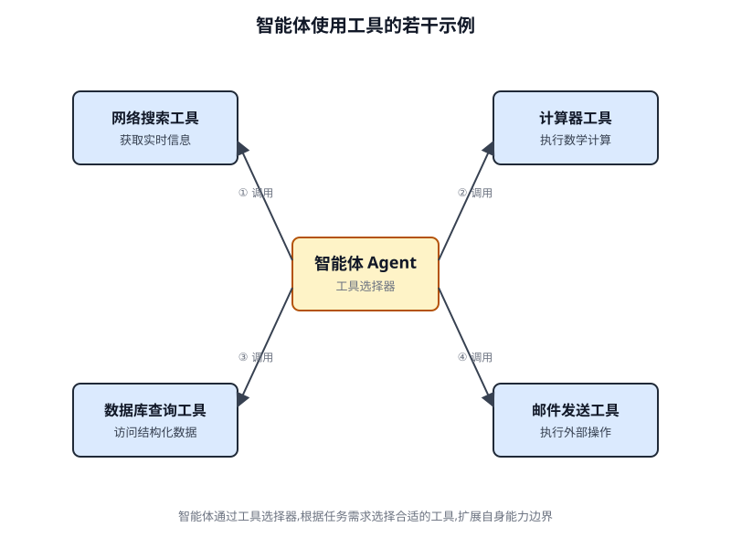
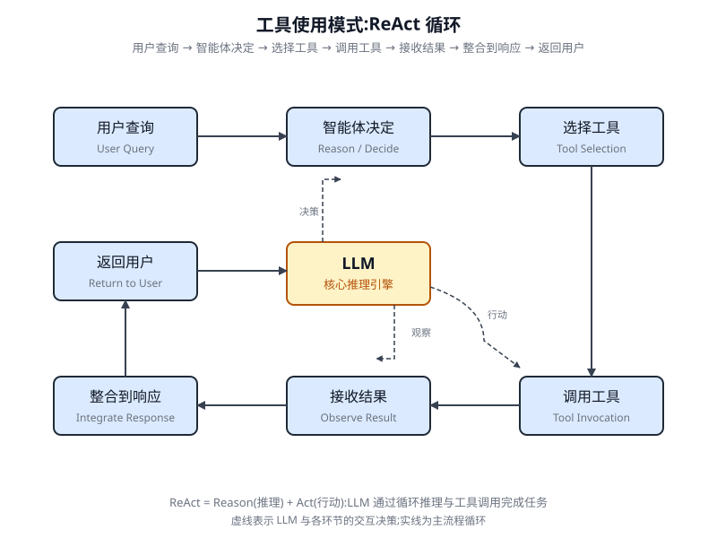

# 第 5 章 工具使用(函数调用)(Tool Use (Function Calling))

<!-- chapter: 5 | part: I | pages: 97-117 | translated_from: pdf/097-117 -->

## 工具使用模式概述


到目前为止，我们讨论的智能体式模式主要涉及大语言模型之间的交互编排，以及管理智能体内部工作流中的信息流动(链式、路由、并行化、反思)。然而，要让智能体真正发挥作用并与真实世界或外部系统交互，它们必须具备使用工具的能力。

工具使用(Tool Use)模式通常通过一种称为函数调用(Function Calling)的机制来实现，它使智能体能够与外部 API、数据库、服务交互，甚至执行代码。它允许智能体核心的 LLM 根据用户请求或任务的当前状态，决定何时以及如何使用特定的外部函数。

该过程通常包括：

1. **工具定义(Tool Definition)**:外部函数或能力被定义并描述给 LLM。该描述包括函数的目的、名称及其接受的参数，以及参数的类型和说明。
2. **LLM 决策(LLM Decision)**:LLM 接收用户请求和可用的工具定义。基于对请求和工具的理解，LLM 决定是否需要调用一个或多个工具来完成请求。
3. **函数调用生成(Function Call Generation)**:如果 LLM 决定使用某个工具，它会生成一个结构化输出(通常是 JSON 对象),指定要调用的工具名称以及传递给该函数的参数(从用户请求中提取)。

```python
Hands-On Code Example (LangChain)
The implementation of tool use within the LangChain framework is a two-
stage process. Initially, one or more tools are defined, typically by encapsulat-
ing existing Python functions or other runnable components. Subsequently,
these tools are bound to a language model, thereby granting the model the
capability to generate a structured tool-use request when it determines that an
external function call is required to fulfill a user’s query.
  import os, getpass
  import asyncio
  import nest_asyncio
  from typing import List
  from dotenv import load_dotenv
  import logging
  from langchain_google_genai import ChatGoogleGenerativeAI
  from langchain_core.prompts import ChatPromptTemplate
  from langchain_core.tools import tool as langchain_tool
  from   langchain.agents    import   create_tool_calling_agent,
  AgentExecutor
  # UNCOMMENT
  # Prompt the user securely and set API keys as an environment
  variables
  os.environ["GOOGLE_API_KEY"] = getpass.getpass("Enter your
  Google API key: ")
     os.environ["OPENAI_API_KEY"] = getpass.getpass("Enter your
     OpenAI API key: ")
     try:
       # A model with function/tool calling capabilities is required.
       llm     =     ChatGoogleGenerativeAI(model="gemini-2.0-flash",
     temperature=0)
       print(f"    Language model initialized: {llm.model}")
     except Exception as e:
       print(f"    Error initializing language model: {e}")
       llm = None
     # --- Define a Tool ---
     @langchain_tool
     def search_information(query: str) -> str:
       """
       Provides factual information on a given topic. Use this tool
     to find answers to phrases
       like 'capital of France' or 'weather in London?'.
       """
       print(f"\n---     Tool Called: search_information with query:
     '{query}' ---")
       # Simulate a search tool with a dictionary of predefined
     results.
       simulated_results = {
           "weather in london": "The weather in London is currently
     cloudy with a temperature of 15°C.",
           "capital of france": "The capital of France is Paris.",
           "population of earth": "The estimated population of Earth
     is around 8 billion people.",
           "tallest mountain": "Mount Everest is the tallest mountain
     above sea level.",
           "default": f"Simulated search result for '{query}': No
     specific information found, but the topic seems interesting."
       }
       result          =         simulated_results.get(query.lower(),
     simulated_results["default"])
       print(f"--- TOOL RESULT: {result} ---")
       return result
     tools = [search_information]
     # --- Create a Tool-Calling Agent ---
     if llm:
       # This prompt template requires an `agent_scratchpad` place-
     holder for the agent's internal steps.
       agent_prompt = ChatPromptTemplate.from_messages([
           ("system", "You are a helpful assistant."),
           ("human", "{input}"),
           ("placeholder", "{agent_scratchpad}"),
       ])
       # Create the agent, binding the LLM, tools, and prompt
     together.
    agent = create_tool_calling_agent(llm, tools, agent_prompt)
    # AgentExecutor is the runtime that invokes the agent and
  executes the chosen tools.
     # The 'tools' argument is not needed here as they are
  already bound to the agent.
     agent_executor = AgentExecutor(agent=agent, verbose=True,
  tools=tools)
  async def run_agent_with_tool(query: str):
    """Invokes the agent executor with a query and prints the
  final response."""
    print(f"\n---     Running Agent with Query: '{query}' ---")
    try:
        response    =    await    agent_executor.ainvoke({"input":
  query})
        print("\n---     Final Agent Response ---")
        print(response["output"])
    except Exception as e:
        print(f"\n    An error occurred during agent execution:
  {e}")
  async def main():
    """Runs all agent queries concurrently."""
    tasks = [
        run_agent_with_tool("What is the capital of France?"),
        run_agent_with_tool("What's    the    weather   like    in
  London?"),
        run_agent_with_tool("Tell me something about dogs.")
  # Should trigger the default tool response
    ]
    await asyncio.gather(*tasks)
  nest_asyncio.apply()
  asyncio.run(main())
```

以下实现将首先定义一个简单函数来模拟信息检索工具，从而演示这一原则。在此基础上，将构建一个智能体，并将其配置为响应用户输入时使用该工具。运行本示例需要安装核心 LangChain 库以及特定模型的提供商包。此外，必须先与所选语言模型服务完成正确的身份验证(通常通过在本地环境中配置 API 密钥来实现)。

该代码使用 LangChain 库和 Google Gemini 模型设置了一个支持工具调用的智能体。它定义了一个 search_information 工具，用于模拟对特定查询提供事实性答案。该工具针对 "weather in london"、"capital of france" 和 "population of earth" 预定义了响应，并为其他查询提供默认响应。代码初始化了一个 ChatGoogleGenerativeAI 模型，并确保其具备工具调用能力。然后创建一个 ChatPromptTemplate 来引导智能体的交互。create_tool_calling_agent 函数用于将语言模型、工具和提示组合成一个智能体。接着通过 AgentExecutor 来管理智能体的执行与工具调用。run_agent_with_tool 异步函数被定义为使用给定查询调用智能体并打印结果。主异步函数准备了多个并发运行的查询。这些查询旨在同时测试 search_information 工具的特定响应和默认响应。最后，asyncio.run(main()) 调用执行所有智能体任务。代码在继续智能体的设置与执行之前，包含了对 LLM 是否成功初始化的检查。

```python
# pip install crewai langchain-openai
     import os
     from crewai import Agent, Task, Crew
     from crewai.tools import tool
     import logging
     # --- Best Practice: Configure Logging ---
     # A basic logging setup helps in debugging and tracking the
     crew's execution.
     logging.basicConfig(level=logging.INFO, format='%(asctime)s -
     %(levelname)s - %(message)s')
     # --- Set up your API Key ---
     # For production, it's recommended to use a more secure method
     for key management
     # like environment variables loaded at runtime or a secret
     manager.
     #
     # Set the environment variable for your chosen LLM provider
     (e.g., OPENAI_API_KEY)
     # os.environ["OPENAI_API_KEY"] = "YOUR_API_KEY"
     # os.environ["OPENAI_MODEL_NAME"] = "gpt-4o"
     # --- 1. Refactored Tool: Returns Clean Data ---
     # The tool now returns raw data (a float) or raises a standard
     Python error.
     # This makes it more reusable and forces the agent to handle
     outcomes properly.
     @tool("Stock Price Lookup Tool")
     def get_stock_price(ticker: str) -> float:
   """
   Fetches the latest simulated stock price for a given stock
ticker symbol.
    Returns the price as a float. Raises a ValueError if the
ticker is not found.
   """
    logging.info(f"Tool    Call:   get_stock_price    for   ticker
'{ticker}'")
   simulated_prices = {
       "AAPL": 178.15,
       "GOOGL": 1750.30,
       "MSFT": 425.50,
   }
   price = simulated_prices.get(ticker.upper())
   if price is not None:
       return price
   else:
        # Raising a specific error is better than returning
a string.
       # The agent is equipped to handle exceptions and can
decide on the next action.
        raise ValueError(f"Simulated price for ticker '{ticker.
upper()}' not found.")
# --- 2. Define the Agent ---
# The agent definition remains the same, but it will now leverage
the improved tool.
financial_analyst_agent = Agent(
  role='Senior Financial Analyst',
  goal='Analyze stock data using provided tools and report key
prices.',
  backstory="You are an experienced financial analyst adept at
using data sources to find stock information. You provide clear,
direct answers.",
  verbose=True,
  tools=[get_stock_price],
  # Allowing delegation can be useful, but is not necessary for
this simple task.
  allow_delegation=False,
)
# --- 3. Refined Task: Clearer Instructions and Error Handling ---
# The task description is more specific and guides the agent on
how to react
# to both successful data retrieval and potential errors.
analyze_aapl_task = Task(
  description=(
      "What is the current simulated stock price for Apple
(ticker: AAPL)? "
      "Use the 'Stock Price Lookup Tool' to find it. "
          "If the ticker is not found, you must report that you were
     unable to retrieve the price."
       ),
       expected_output=(
          "A single, clear sentence stating the simulated stock price
     for AAPL. "
           "For example: 'The simulated stock price for AAPL is
     $178.15.' "
          "If the price cannot be found, state that clearly."
       ),
       agent=financial_analyst_agent,
     )
     # --- 4. Formulate the Crew ---
     # The crew orchestrates how the agent and task work together.
     financial_crew = Crew(
       agents=[financial_analyst_agent],
       tasks=[analyze_aapl_task],
       verbose=True # Set to False for less detailed logs in production
     )
     # --- 5. Run the Crew within a Main Execution Block ---
     # Using a __name__ == "__main__": block is a standard Python
     best practice.
     def main():
        """Main function to run the crew."""
        # Check for API key before starting to avoid runtime errors.
        if not os.environ.get("OPENAI_API_KEY"):
            print("ERROR: The OPENAI_API_KEY environment variable is
     not set.")
            print("Please set it before running the script.")
            return
        print("\n## Starting the Financial Crew...")
        print("---------------------------------")
         # The kickoff method starts the execution.
         result = financial_crew.kickoff()
        print("\n---------------------------------")
         print("## Crew execution finished.")
        print("\nFinal Result:\n", result)
     if __name__ == "__main__":
        main()
```

此代码提供了一个在 CrewAI 框架内实现函数调用(工具使用)的实际示例。它设置了一个简单场景，其中智能体配备了用于查询信息的工具。该示例具体演示了使用此智能体和工具获取模拟股票价格。

此代码演示了一个使用 Crew.ai 库的简单应用，用于模拟金融分析任务。它定义了一个自定义工具 `get_stock_price`,用于模拟查询预定义股票代码的价格。该工具被设计为对有效股票代码返回浮点数，对无效股票代码引发 `ValueError` 异常。创建了一个名为 `financial_analyst_agent` 的 Crew.ai 智能体，其角色为高级金融分析师(高级 Financial Analyst)。该智能体被赋予 `get_stock_price` 工具以进行交互。定义了一个任务 `analyze_aapl_task`,明确指示智能体使用该工具查找 AAPL 的模拟股票价格。任务描述包含在工具使用成功与失败两种情况下如何处理的明确指令。组装了一个 Crew,其中包含 `financial_analyst_agent` 和 `analyze_aapl_task`。智能体和 Crew 都启用了详细输出(verbose)设置，以在执行期间提供详细日志记录。脚本的主要部分在标准的 `if __name__ == "__main__":` 块内使用 `kickoff()` 方法运行该 Crew 的任务。在启动 Crew 之前，它检查 `OPENAI_API_KEY` 环境变量是否已设置，该变量是智能体运行所必需的。然后将 Crew 执行的结果(即任务的输出)打印到控制台。该代码还包括基本的日志记录配置，以便更好地跟踪 Crew 的行为和工具调用。它使用环境变量进行 API 密钥管理，但指出生产环境建议采用更安全的方法。简而言之，核心逻辑展示了如何定义工具、智能体和任务，从而在 Crew.ai 中创建协作工作流。

## 动手代码(Google ADK)

Google 智能体开发工具包(Agent Developer Kit, ADK)包含一组原生集成的工具库，可以直接纳入智能体的能力中。

```javascript
from google.adk.agents import Agent
  from google.adk.runners import Runner
  from google.adk.sessions import InMemorySessionService
  from google.adk.tools import google_search
  from google.genai import types
  import nest_asyncio
  import asyncio
  # Define variables required for Session setup and Agent execution
  APP_NAME="Google Search_agent"
  USER_ID="user1234"
  SESSION_ID="1234"
  # Define Agent with access to search tool
  root_agent = ADKAgent(
    name="basic_search_agent",
    model="gemini-2.0-flash-exp",
       description="Agent to answer questions using Google Search.",
       instruction="I can answer your questions by searching the
     internet. Just ask me anything!",
       tools=[google_search] # Google Search is a pre-built tool to
     perform Google searches.
     )
     # Agent Interaction
     async def call_agent(query):
       """
       Helper function to call the agent with a query.
       """
       # Session and Runner
       session_service = InMemorySessionService()
       session = await session_service.create_session(app_name=APP_
     NAME, user_id=USER_ID, session_id=SESSION_ID)
       runner     =    Runner(agent=root_agent,     app_name=APP_NAME,
     session_service=session_service)
       content      =     types.Content(role='user',     parts=[types.
     Part(text=query)])
       events = runner.run(user_id=USER_ID, session_id=SESSION_ID,
     new_message=content)
       for event in events:
           if event.is_final_response():
              final_response = event.content.parts[0].text
              print("Agent Response: ", final_response)
     nest_asyncio.apply()
     asyncio.run(call_agent("what's the latest ai news?"))
```

## Google 搜索

此类组件的一个主要示例是 Google Search 工具。该工具充当 Google 搜索引擎的直接接口，为智能体提供执行网络搜索和检索外部信息的能力。

此代码演示了如何创建和使用由 Google ADK for Python 驱动的基础智能体。该智能体旨在通过利用 Google Search 作为工具来回答问题。首先，从 IPython、google.adk 和 google.genai 导入必要的库。定义了应用程序名称、用户 ID 和会话 ID 的常量。创建了一个名为 "basic_search_agent" 的智能体实例，并附带描述和说明以指示其用途。它被配置为使用 Google Search 工具，这是 ADK 提供的预构建工具。初始化了一个 InMemorySessionService(参见第 8 章)以管理智能体的会话。为指定的应用程序、用户和会话 ID 创建一个新会话。实例化一个 Runner,将创建的智能体与会话服务关联起来。该 runner 负责在会话中执行智能体的交互。定义了一个辅助函数 call_agent,以简化向智能体发送查询和处理响应的过程。在 call_agent 内部，用户的查询被格式化为具有 'user' 角色的 types.Content 对象。调用 runner.run 方法，并传入用户 ID、会话 ID 和新消息内容。runner.run 方法返回一个事件列表，表示智能体的动作和响应。代码遍历这些事件以查找最终响应。如果某个事件被识别为最终响应，则提取该响应的文本内容。然后将提取的智能体响应打印到控制台。最后，使用查询 "what's the latest ai news?" 调用 call_agent 函数，以演示该智能体的实际运行。

```python
import os, getpass
  import asyncio
  import nest_asyncio
  from typing import List
  from dotenv import load_dotenv
  import logging
  from google.adk.agents import Agent as ADKAgent, LlmAgent
  from google.adk.runners import Runner
  from google.adk.sessions import InMemorySessionService
  from google.adk.tools import google_search
  from google.adk.code_executors import BuiltInCodeExecutor
  from google.genai import types
  # Define variables required for Session setup and Agent execution
  APP_NAME="calculator"
  USER_ID="user1234"
  SESSION_ID="session_code_exec_async"
  # Agent Definition
  code_agent = LlmAgent(
    name="calculator_agent",
    model="gemini-2.0-flash",
    code_executor=BuiltInCodeExecutor(),
    instruction="""You are a calculator agent.
    When given a mathematical expression, write and execute Python
  code to calculate the result.
    Return only the final numerical result as plain text, without
  markdown or code blocks.
    """,
    description="Executes Python code to perform calculations.",
  )
  # Agent Interaction (Async)
  async def call_agent_async(query):
       # Session and Runner
       session_service = InMemorySessionService()
       session = await session_service.create_session(app_name=APP_
     NAME, user_id=USER_ID, session_id=SESSION_ID)
       runner      =     Runner(agent=code_agent,     app_name=APP_NAME,
     session_service=session_service)
       content       =     types.Content(role='user',      parts=[types.
     Part(text=query)])
       print(f"\n--- Running Query: {query} ---")
       final_response_text = "No final text response captured."
       try:
           # Use run_async
           async for event in runner.run_async(user_id=USER_ID, ses-
     sion_id=SESSION_ID, new_message=content):
               print(f"Event ID: {event.id}, Author: {event.author}")
               # --- Check for specific parts FIRST ---
               # has_specific_part = False
               if event.content and event.content.parts and event.
     is_final_response():
                   for part in event.content.parts: # Iterate through
     all parts
                       if part.executable_code:
                           # Access the actual code string via .code
                           print(f"  Debug:   Agent   generated     code:\
     n```python\n{part.executable_code.code}\n```")
                           has_specific_part = True
                       elif part.code_execution_result:
                           # Access outcome and output correctly
                           print(f"  Debug:   Code   Execution     Result:
     {part.code_execution_result.outcome}       -   Output:\n{part.code_
     execution_result.output}")
                           has_specific_part = True
                       # Also print any text parts found in any event
     for debugging
                       elif part.text and not part.text.isspace():
                           print(f"  Text: '{part.text.strip()}'")
                           # Do not set has_specific_part=True here, as
     we want the final response logic below
                   # --- Check for final response AFTER specific parts ---
                   text_parts = [part.text for part in event.content.
     parts if part.text]
                   final_result = "".join(text_parts)
                   print(f"==> Final Agent Response: {final_result}")
       except Exception as e:
           print(f"ERROR during agent run: {e}")
       print("-" * 30)
     # Main async function to run the examples
     async def main():
       await call_agent_async("Calculate the value of (5 + 7) * 3")
    await call_agent_async("What is 10 factorial?")
  # Execute the main async function
  try:
    nest_asyncio.apply()
    asyncio.run(main())
  except RuntimeError as e:
    # Handle specific error when running asyncio.run in an already
  running loop (like Jupyter/Colab)
    if "cannot be called from a running event loop" in str(e):
        print("\nRunning in an existing event loop (like Colab/
  Jupyter).")
        print("Please run `await main()` in a notebook cell
  instead.")
        # If in an interactive environment like a notebook, you
  might need to run:
        # await main()
    else:
        raise e # Re-raise other runtime errors
```

## 代码执行

Google ADK 集成了用于专门任务的组件，包括动态代码执行环境。`built_in_code_execution` 工具为智能体提供了一个沙箱化的 Python 解释器。这使得模型能够编写并运行代码以执行计算任务、操作数据结构以及执行过程化脚本。此类功能对于解决需要确定性逻辑和精确计算的问题至关重要，而这些问题超出了纯概率性语言生成的范围。该脚本使用 Google 的智能体开发工具包(ADK)创建一个智能体，通过编写并执行 Python 代码来解决数学问题。它定义了一个 `LlmAgent`,专门指示其充当计算器，并为其配备 `built_in_code_execution` 工具。主要逻辑位于 `call_agent_async` 函数中，该函数将用户的查询发送到智能体的运行器并处理所产生的事件。在该函数内部，一个异步循环遍历事件，打印所生成的 Python 代码及其执行结果以供调试。代码仔细区分了这些中间步骤与包含最终数值答案的事件。最后，`main` 函数使用两个不同的数学表达式运行智能体，以展示其执行计算的能力。

## 企业搜索

此代码使用 Python 中的 `google.adk` 库定义了一个 Google ADK 应用程序。它具体使用了一个 `VSearchAgent`,该智能体旨在通过搜索指定的 Vertex AI Search 数据存储来回答问题。代码初始化了一个名为 `"q2_strategy_vsearch_agent"` 的 `VSearchAgent`,并提供描述、所用模型(`"gemini-2.0-flash-exp"`)以及 Vertex AI Search 数据存储的 ID。`DATASTORE_ID` 预期被设置为环境变量。然后，它为智能体设置了一个 `Runner`,使用 `InMemorySessionService` 来管理对话历史。

异步函数 `call_vsearch_agent_async` 被定义为用于与智能体交互。该函数接收一个查询(query),构造一个消息内容对象，并调用运行器的 `run_async` 方法将查询发送给智能体。然后该函数将智能体的响应以流式方式输出到控制台。它还会打印关于最终响应的信息，包括来自数据存储区的任何来源归属(attribution)。其中包含了错误处理代码，以捕获智能体执行过程中的异常，并提供关于潜在问题(如数据存储区 ID 错误或权限缺失)的信息性提示。还提供了另一个异步函数 `run_vsearch_example`,用于演示如何使用示例查询调用智能体。主执行代码块会检查 `DATASTORE_ID` 是否已设置，然后使用 `asyncio.run` 运行示例。它包含一项检查，以处理代码在已存在运行中事件循环的环境中执行的情况，例如 Jupyter notebook。

总体而言，此代码为构建利用 Vertex AI Search、基于存储在数据存储区中的信息回答问题的对话式 AI 应用提供了一个基础框架。它演示了如何定义智能体、设置运行器，以及以异步方式与智能体交互并流式获取响应。其重点在于从特定数据存储区中检索并综合信息以回答用户查询。

```python
import asyncio
     from google.genai import types
     from google.adk import agents
     from google.adk.runners import Runner
     from google.adk.sessions import InMemorySessionService
     import os
     # --- Configuration ---
     # Ensure you have set your GOOGLE_API_KEY and DATASTORE_ID
     environment variables
     # For example:
# os.environ["GOOGLE_API_KEY"] = "YOUR_API_KEY"
# os.environ["DATASTORE_ID"] = "YOUR_DATASTORE_ID"
DATASTORE_ID = os.environ.get("DATASTORE_ID")
# --- Application Constants ---
APP_NAME = "vsearch_app"
USER_ID = "user_123"  # Example User ID
SESSION_ID = "session_456" # Example Session ID
# --- Agent Definition (Updated with the newer model from the guide) ---
vsearch_agent = agents.VSearchAgent(
   name="q2_strategy_vsearch_agent",
   description="Answers questions about Q2 strategy documents
using Vertex AI Search.",
    model="gemini-2.0-flash-exp", # Updated model based on the
guide's examples
   datastore_id=DATASTORE_ID,
   model_parameters={"temperature": 0.0}
)
# --- Runner and Session Initialization ---
runner = Runner(
   agent=vsearch_agent,
   app_name=APP_NAME,
   session_service=InMemorySessionService(),
)
# --- Agent Invocation Logic ---
async def call_vsearch_agent_async(query: str):
   """Initializes a session and streams the agent's response."""
   print(f"User: {query}")
    print("Agent: ", end="", flush=True)
   try:
       # Construct the message content correctly
       content     =    types.Content(role='user',       parts=[types.
Part(text=query)])
       # Process events as they arrive from the asynchro-
nous runner
       async for event in runner.run_async(
           user_id=USER_ID,
           session_id=SESSION_ID,
           new_message=content
       ):
           # For token-by-token streaming of the response text
           if hasattr(event, 'content_part_delta') and event.
content_part_delta:
               print(event.content_part_delta.text,             end="",
flush=True)
           # Process the final response and its associated metadata
           if event.is_final_response():
               print() # Newline after the streaming response
               if event.grounding_metadata:
                   print(f"  (Source     Attributions:      {len(event.
grounding_metadata.grounding_attributions)} sources found)")
                    else:
                        print("  (No grounding metadata found)")
                    print("-" * 30)
        except Exception as e:
            print(f"\nAn error occurred: {e}")
            print("Please ensure your datastore ID is correct and
     that the service account has the necessary permissions.")
            print("-" * 30)
     # --- Run Example ---
     async def run_vsearch_example():
        # Replace with a question relevant to YOUR datastore content
        await call_vsearch_agent_async("Summarize the main points
     about the Q2 strategy document.")
        await call_vsearch_agent_async("What safety procedures are
     mentioned for lab X?")
     # --- Execution ---
     if __name__ == "__main__":
        if not DATASTORE_ID:
            print("Error:     DATASTORE_ID  environment   variable   is
     not set.")
        else:
            try:
                asyncio.run(run_vsearch_example())
            except RuntimeError as e:
                # This handles cases where asyncio.run is called in an
     environment
                # that already has a running event loop (like a Jupyter
     notebook).
                if "cannot be called from a running event loop"
     in str(e):
                    print("Skipping execution in a running event loop.
     Please run this script directly.")
                else:
                    raise e
```

## Vertex 扩展

Vertex AI 扩展(Vertex Extension)是一种结构化的 API 封装，用于让模型连接外部 API,以执行实时数据处理与动作调用。扩展提供企业级的安全、数据隐私与性能保障，可用于代码生成与运行、网站查询以及私有数据源信息分析等任务。Google 为常见用例提供了预构建扩展，如代码解释器(Code Interpreter)和 Vertex AI Search,同时支持创建自定义扩展。扩展的主要优势在于强大的企业级控制能力，以及与其他 Google 产品的无缝集成。扩展与函数调用之间的关键区别在于执行方式：Vertex AI 会自动执行扩展，而函数调用则需要由用户或客户端手动执行。

## 一览

**是什么** 大语言模型(LLM)是强大的文本生成器，但它们从根本上与外部世界是脱节的。它们的知识是静态的，仅限于训练时所使用的数据，并且缺乏执行操作或检索实时信息的能力。这种固有的局限性使它们无法完成需要与外部 API、数据库或服务进行交互的任务。如果没有通往这些外部系统的桥梁，它们在解决实际问题方面的效用就会受到严重限制。

**为什么** 工具使用(Tool Use)模式，通常通过函数调用(Function Calling)实现，为这个问题提供了标准化的解决方案。它的工作原理是向 LLM 描述可用的外部函数，即"工具",以

工具使用(Tool Use)模式通常通过函数调用实现，为该问题提供了标准化解决方案。其工作原理是：以大语言模型(LLM)能够理解的方式向其描述可用的外部函数或"工具"。智能体式大语言模型可基于用户请求，自主判断是否需要调用工具，并生成结构化数据对象(如 JSON),明确指定调用的函数及参数。随后，编排层执行该函数调用，获取结果，并将其回传至大语言模型。由此，大语言模型能够将最新的外部信息或动作执行结果纳入最终响应，从而切实获得执行操作的能力。

**经验法则**: 当智能体(Agent)需要突破大语言模型(LLM)的内部知识、与外部世界交互时，应使用工具使用(Tool Use)模式。对于需要实时数据的任务(例如查询天气、股票价格)、访问私有或专有信息(例如查询公司数据库)、执行精确计算、运行代码，或在其他系统中触发动作(例如发送邮件、控制智能设备)的场景，这一模式至关重要。



*Fig. 5.2 Tool use design pattern*

## 关键要点

- 工具使用(函数调用)使智能体能够与外部系统交互并访问动态信息。
- 它涉及定义具有清晰描述和参数的工具，以便大语言模型(LLM)能够理解。
- 大语言模型决定何时使用工具，并生成结构化的函数调用。
- 智能体式框架执行实际的工具调用并将结果返回给大语言模型。
- 工具使用对于构建能够执行真实世界动作并提供最新信息的智能体至关重要。
- LangChain 使用 `@tool` 装饰器简化工具定义，并提供 `create_tool_calling_agent` 和 `AgentExecutor` 用于构建使用工具的智能体。
- Google ADK 提供了许多非常有用的预构建工具，如 Google Search、Code Execution 和 Vertex AI Search Tool。

## 结论

工具使用模式是一项关键架构原则，它将大语言模型的功能范围扩展到其固有的文本生成能力之外。通过赋予模型与外部软件和数据源对接的能力，该范式使智能体能够执行动作、运行计算，并从其他系统检索信息。当模型判定有必要调用外部工具以满足用户查询时，它会生成一个结构化的请求。LangChain、Google ADK 和 Crew AI 等框架提供了结构化的抽象和组件，便于集成这些外部工具。这些框架负责将工具规范暴露给模型，并解析模型随后发出的工具使用请求。这简化了能够在外部数字环境中交互和采取行动的复杂智能体系统(Agentic System)的开发。

## 参考文献

- CrewAI 文档(工具):https://docs.crewai.com/concepts/tools
- Google 智能体开发套件(ADK)文档(工具):https://google.github.io/adk-docs/tools/
- LangChain 文档(工具):https://python.langchain.com/docs/integrations/tools/
- OpenAI 函数调用文档：https://platform.openai.com/docs/guides/function-calling

