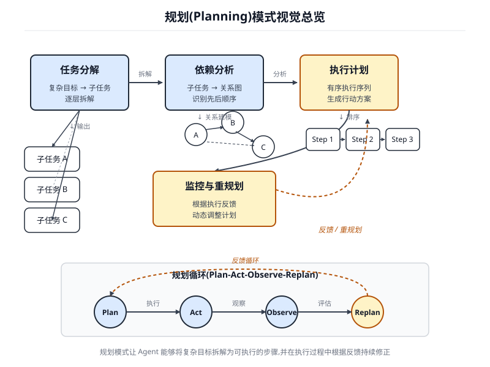

# 第 6 章 规划(Planning)

<!-- chapter: 6 | part: I | pages: 118-130 | translated_from: pdf/118-130 -->

智能行为往往不仅仅是响应即时输入。它需要前瞻性，需要将复杂任务分解为更小、更易管理的步骤，并制定达成期望结果的策略。这正是规划(Planning)模式发挥作用的地方。从本质上讲，规划是指智能体或智能体系统制定一系列行动的能力，使其能够从初始状态逐步迈向目标状态。

## 规划模式概述


在人工智能语境下，将规划智能体(Planning Agent)视为你委派复杂目标的专员会很有帮助。当你请它"组织一次团队外出活动"时，你定义的是 *什么*——目标及其约束——而不是 *如何*。智能体的核心任务是自主规划通往该目标的路径。它必须首先理解初始状态(例如预算、参与人数、期望日期)和目标状态(成功预订的外出活动),然后发现连接二者的最优行动序列。规划并非事先确定，而是针对请求动态生成的。

这一过程的一个标志性特征是适应性。初始规划只是一个起点，而不是僵化的脚本。智能体的真正力量在于它能够纳入新信息并引导项目绕开障碍。例如，如果首选场地变得不可用，或选定的餐饮服务商已被订满，一个有能力的智能体不会直接失败，而是进行适应：它登记新的约束，重新评估可选方案，并制定新规划，例如建议替代场地或日期。

## 实际应用与用例

规划(Planning)模式是自主系统中的核心计算过程，使智能体能够综合出一系列动作以实现特定目标，尤其是在动态或复杂的环境中。该过程将高层目标转化为由离散、可执行步骤构成的结构化规划。

在过程化任务自动化等领域，规划用于编排复杂的工作流(Workflow)。例如，入职新员工这一业务流程可以被分解为一个有向的子任务序列，如创建系统账户、分配培训模块以及与不同部门协调。智能体生成一个规划，按照逻辑顺序执行这些步骤，调用必要的工具或与各种系统交互以管理依赖关系。

在机器人与自主导航领域，规划是状态空间遍历的基础。无论是物理机器人还是虚拟实体，系统都必须生成一条路径或一系列动作，以从初始状态转换到目标状态。这涉及在时间或能耗等指标上进行优化，同时遵守环境约束，例如规避障碍物或遵守交通规则。

该模式对于结构化信息综合也至关重要。当被要求生成复杂输出(如研究报告)时，智能体可以制定一个规划，包含信息收集、数据摘要、内容结构化以及迭代优化的不同阶段。类似地，在涉及多步骤问题解决的客户支持场景中，智能体可以为诊断、方案实施与升级创建并遵循一个系统性的规划。

本质上，规划模式使智能体能够超越简单的反应式动作，实现目标导向的行为。它提供了解决需要相互依赖操作序列一致性的问题所必需的逻辑框架。

## 实战代码(Crew AI)

接下来的部分将演示如何使用 Crew AI 框架实现规划器(Planner)模式。该模式涉及的智能体首先针对一个复杂问题制定多步骤规划，然后按顺序执行该规划。

```python
import os
  from dotenv import load_dotenv
  from crewai import Agent, Task, Crew, Process
  from langchain_openai import ChatOpenAI
  # Load environment variables from .env file for security
  load_dotenv()
  # 1. Explicitly define the language model for clarity
  llm = ChatOpenAI(model="gpt-4-turbo")
  # 2. Define a clear and focused agent
  planner_writer_agent = Agent(
     role='Article Planner and Writer',
     goal='Plan and then write a concise, engaging summary on a
  specified topic.',
     backstory=(
         'You are an expert technical writer and content
  strategist. '
         'Your strength lies in creating a clear, actionable plan
  before writing, '
         'ensuring the final summary is both informative and easy
  to digest.'
     ),
     verbose=True,
     allow_delegation=False,
     llm=llm # Assign the specific LLM to the agent
  )
  # 3. Define a task with a more structured and specific expected output
  topic = "The importance of Reinforcement Learning in AI"
  high_level_task = Task(
     description=(
         f"1. Create a bullet-point plan for a summary on the
  topic: '{topic}'.\n"
         f"2. Write the summary based on your plan, keeping it
  around 200 words."
     ),
        expected_output=(
            "A final report containing two distinct sections:\n\n"
            "### Plan\n"
            "- A bulleted list outlining the main points of the
     summary.\n\n"
            "### Summary\n"
            "- A concise and well-structured summary of the topic."
        ),
        agent=planner_writer_agent,
     )
     # Create the crew with a clear process
     crew = Crew(
        agents=[planner_writer_agent],
        tasks=[high_level_task],
        process=Process.sequential,
     )
     # Execute the task
     print("## Running the planning and writing task ##")
     result = crew.kickoff()
     print("\n\n---\n## Task Result ##\n---")
     print(result)
```

这段代码使用 CrewAI 库创建了一个智能体(Agent),用于规划并撰写给定主题的摘要。它首先导入必要的库，包括 CrewAI 和 langchain_openai,并从 .env 文件加载环境变量。代码中明确定义了一个 ChatOpenAI 语言模型供智能体使用。随后创建了一个名为 planner_writer_agent 的智能体，其角色和目标明确：先进行规划，然后撰写简洁的摘要。该智能体的背景设定强调其在规划和技术写作方面的专业能力。一个任务(Task)被定义，其描述清晰地要求先针对主题"The importance of Reinforcement Learning in AI"制定规划，然后撰写摘要，并规定期望输出的具体格式。由智能体和任务组成的 Crew 按顺序(sequential)处理这两个组件。最后，调用 `crew.kickoff()` 方法执行所定义的任务，并将结果打印输出。

Google Gemini DeepResearch(参见图 6.1)是一个基于智能体的系统，专为自主信息检索与综合而设计。它通过一个多步骤的智能体式流水线运作，能够动态且迭代地查询 Google Search,以系统性地探索复杂主题。该系统经过工程化设计，可处理大量基于网络的来源，评估所收集数据的相关性与知识缺口，并执行后续搜索以弥补这些缺口。最终输出将经过审核的信息整合为结构化的多页摘要，并附上原始来源的引用。

进一步而言，该系统的运作并非单一的查询-响应事件，而是一个受管理的长期运行流程。它首先将用户的提示解构为多点研究规划(参见图 6.1),然后提交给用户审阅与修改。这使得在执行前能够以协作方式塑造研究轨迹。一旦规划获得批准，智能体式流水线即启动其迭代式搜索与分析循环。这不仅涉及执行一系列预定义的搜索；智能体会根据所收集的信息动态构建并优化其查询，主动识别知识缺口、印证数据点，并解决不一致之处。

图 6.1 Google Deep Research 智能体生成使用 Google 搜索作为工具的执行规划

该系统的一个关键架构组件是异步管理此流程的能力。这种设计确保涉及分析数百个来源的调查工作能够抵御单点故障，并允许用户随时脱离，待完成时收到通知。该系统还能够集成用户提供的文档，将来自私有来源的信息与基于网络的调研相结合。最终输出并非简单拼接的发现列表，而是一份结构化的多页报告。在综合阶段，模型会对所收集信息进行关键性评估，识别主要主题，并将内容组织成具有逻辑分章的连贯叙述。该报告被设计为可交互的，通常包含音频概览、图表以及指向原始引用来源的链接等功能，允许用户进行核实与进一步探索。除了综合结果之外，模型还明确返回其所搜索和查阅的全部来源列表(见图 6.2)。这些以引用的形式呈现，提供完整的透明度以及对主要信息的直接访问权限。这一

图 6.2 Deep Research 规划被执行的一个示例，结果使用 Google 搜索作为工具来检索各类网络来源

完整流程将一个简单查询转变为一份全面、可核查的调研成果……

**图 6.2** 一个深度研究规划正在执行的示例，结果显示 Google Search 被用作工具来搜索各种网络来源

整个过程将一个简单的查询转变为一个全面的、综合的知识体系。

通过减轻手动数据获取与综合所需的巨大时间和资源投入，Gemini DeepResearch 提供了一种更加结构化且详尽的信息发现方法。该系统的价值在跨各个领域的复杂、多面性研究任务中尤为明显。

例如，在竞争分析中，可以指示智能体系统地收集和整理有关市场趋势、竞争对手产品规格、不同在线来源的公众情绪以及营销策略的数据。这一自动化过程取代了手动跟踪多个竞争对手的繁琐任务，使分析师能够专注于更高层次的战略解读，而非数据收集(见图 6.3)。

类似地，在学术探索中，该系统作为一个强大工具，用于开展广泛的文献综述。它能够识别并总结

图 6.3 由 Google Deep Research 智能体为我们生成的最终输出，该智能体使用 Google Search 作为工具来分析所获取的来源

础性论文，追踪众多出版物中概念的发展脉络，并描绘出特定领域中新兴的研究前沿，从而加速学术探究中最初且最耗时的阶段。

这种方法的效率源于对迭代式搜索与筛选循环的自动化，而该循环正是人工研究中的核心瓶颈。全面性则得益于系统能够在可比的时间范围内处理比人类研究员通常所能处理的更大量、更多样的信息来源。这种更广阔的分析范围有助于降低选择偏差的潜在风险，并提高发现不那么显而易见但可能至关重要的信息的可能性，从而使对主题的理解更加稳健且证据更充分。

## OpenAI Deep Research API

OpenAI Deep Research API 是一款专为自动化复杂研究任务而设计的专用工具。它采用先进的智能体式(Agentic)模型，能够独立地推理、规划，并从真实世界的来源中综合信息。与简单的问答模型不同，它接收高层级查询，并自主将其分解为子问题，使用其内置工具执行网络搜索，并交付结构化、引用丰富的最终报告。该 API 提供对整个过程的直接编程访问，在撰写本文时，它使用 `o3-deep-research-2025-06-26` 等模型来实现高质量综合，并使用更快的 `o4-mini-deep-research-2025-06-26` 来满足对延迟敏感的应用程序。Deep Research API 非常实用，因为它将原本需要数小时的手动研究工作自动化，交付专业级、数据驱动的报告，适合为商业战略、投资决策或政策建议提供依据。其关键优势包括：

- **结构化、引用丰富的输出**:它生成组织良好的报告，内嵌的引用链接到来源元数据，确保各项主张均可验证且有数据支撑。
- **透明度**:与 ChatGPT 中抽象化的过程不同，该 API 暴露了所有中间步骤，包括智能体的推理、所执行的具体网络搜索查询，以及它运行的任何代码。这便于详细的调试、分析，并能更深入地理解最终答案是如何构建的。
- **可扩展性**:它支持模型上下文协议(MCP),使开发者能够将智能体连接到私有知识库和内部数据源，将公共网络研究与专有信息相融合。

要使用该 API,你需要向 `client.responses.create` 端点发送请求，指定模型、输入提示以及智能体可以使用的工具。输入通常包括一个 `system_message`,用于定义智能体的角色定位和期望的输出格式，以及 `user_query`。

你还必须包含 `web_search_preview` 工具，并可以可选地添加其他工具，例如 `code_interpreter` 或用于内部数据的自定义 MCP 工具(参见第 10 章)。

```yaml
from openai import OpenAI
  # Initialize the client with your API key
  client = OpenAI(api_key="YOUR_OPENAI_API_KEY")
  # Define the agent's role and the user's research question
  system_message = """You are a professional researcher preparing
  a structured, data-driven report.
  Focus on data-rich insights, use reliable sources, and include
  inline citations."""
  user_query = "Research the economic impact of semaglutide on
  global healthcare systems."
  # Create the Deep Research API call
  response = client.responses.create(
    model="o3-deep-research-2025-06-26",
    input=[
     {
       "role": "developer",
       "content":      [{"type":       "input_text",      "text":
  system_message}]
     },
     {
       "role": "user",
       "content": [{"type": "input_text", "text": user_query}]
     }
    ],
    reasoning={"summary": "auto"},
    tools=[{"type": "web_search_preview"}]
  )
  # Access and print the final report from the response
  final_report = response.output[-1].content[0].text
  print(final_report)
  # --- ACCESS INLINE CITATIONS AND METADATA ---
  print("--- CITATIONS ---")
  annotations = response.output[-1].content[0].annotations
  if not annotations:
     print("No annotations found in the report.")
     else:
        for i, citation in enumerate(annotations):
            # The text span the citation refers to
            cited_text = final_report[citation.start_index:citation.
     end_index]
            print(f"Citation {i+1}:")
            print(f"  Cited Text: {cited_text}")
            print(f"  Title: {citation.title}")
            print(f"  URL: {citation.url}")
            print(f"  Location:     chars     {citation.start_index}–
     {citation.end_index}")
     print("\n" + "="*50 + "\n")
     # --- INSPECT INTERMEDIATE STEPS ---
     print("--- INTERMEDIATE STEPS ---")
     # 1. Reasoning Steps: Internal plans and summaries generated by
     the model.
     try:
        reasoning_step = next(item for item in response.output if
     item.type == "reasoning")
        print("\n[Found a Reasoning Step]")
        for summary_part in reasoning_step.summary:
            print(f" - {summary_part.text}")
     except StopIteration:
        print("\nNo reasoning steps found.")
     # 2. Web Search Calls: The exact search queries the agent
     executed.
     try:
        search_step = next(item for item in response.output if
     item.type == "web_search_call")
        print("\n[Found a Web Search Call]")
        print(f"  Query Executed: '{search_step.action['query']}'")
        print(f"  Status: {search_step.status}")
     except StopIteration:
        print("\nNo web search steps found.")
     # 3. Code Execution: Any code run by the agent using the code
     interpreter.
     try:
        code_step = next(item for item in response.output if
     item.type == "code_interpreter_call")
        print("\n[Found a Code Execution Step]")
        print("  Code Input:")
        print(f"  ```python\n{code_step.input}\n  ```")
        print("  Code Output:")
        print(f"  {code_step.output}")
     except StopIteration:
        print("\nNo code execution steps found.")
   This code snippet utilizes the OpenAI API to perform a “Deep Research”
task. It starts by initializing the OpenAI client with your API key, which is
crucial for authentication. Then, it defines the role of the AI agent as a profes-
sional researcher and sets the user’s research question about the economic
impact of semaglutide. The code constructs an API call to the o3-deep-
research-2025-06-26 model, providing the defined system message and user
query as input. It also requests an automatic summary of the reasoning and
enables web search capabilities. After making the API call, it extracts and
prints the final generated report.
   Subsequently, it attempts to access and display inline citations and meta-
data from the report’s annotations, including the cited text, title, URL, and
location within the report. Finally, it inspects and prints details about the
intermediate steps the model took, such as reasoning steps, web search calls
(including the query executed), and any code execution steps if a code inter-
preter was used.
```

### 一览

**是什么** 复杂问题通常无法通过单一行动解决，需要具备前瞻性才能达成预期目标。如果没有结构化的方法，智能体系统难以处理涉及多个步骤和依赖关系的多方面请求。这使得把高层次目标拆解为一系列可管理的、可执行的小任务变得困难。因此，系统在面对复杂目标时无法有效制定策略，导致结果不完整或不正确。

Why 规划(Planning)模式提供了一种标准化的解决方案，它要求智能体系统首先制定一个连贯的规划来达成目标。该模式将高层目标分解为一系列更小、可执行的步骤或子目标。这使得系统能够管理工作流(Workflow)、编排各种工具，并按逻辑顺序处理依赖关系。大语言模型(LLM)特别适合承担这一任务，因为它们能够基于海量训练数据生成合理且有效的规划。这种结构化的方法将一个简单的反应式智能体转变为战略性的执行器，它能够主动推进复杂目标的实现，甚至在必要时调整其规划。

Rule of Thumb 当用户的请求过于复杂、无法由单一动作或工具处理时，应该使用此模式。它非常适合自动化多步骤流程，例如生成详尽的研究报告、引导新员工入职，或执行竞争分析。凡是任务需要一系列相互依赖的操作才能达成最终的综合结果时，都应该应用规划模式。

## 关键要点

- 规划(Planning)使智能体能够将复杂目标分解为可操作的、顺序执行的步骤。
- 它对于处理多步骤任务、工作流自动化以及在复杂环境中导航至关重要。
- 大语言模型(LLM)能够根据任务描述生成逐步方案，从而执行规划。
- 在智能体框架中，显式提示或设计任务以要求规划步骤，能够鼓励这种行为。
- Google Deep Research 是一个代表我们分析信息的智能体，它使用 Google 搜索作为工具。它执行反思、规划与执行。

## 结论

总之，规划模式是智能体系统的基础组件，它将系统从简单的反应式响应者提升为战略性的、目标导向的执行者。现代大语言模型为这一能力提供了核心支撑，能够自主地将高层目标分解为连贯且可操作的步骤。该模式既适用于直接的顺序任务执行(正如 CrewAI 智能体创建并遵循写作规划所展示的),也可扩展到更复杂、更动态的系统。Google DeepResearch 智能体体现了这一高级应用，它创建能够基于持续信息收集进行调整与演化的迭代式研究规划。最终，规划为人类意图与复杂问题的自动化执行之间架起了关键桥梁。通过结构化地组织问题解决方法，该模式使智能体能够管理复杂的工作流，并交付综合性、可合成的结果。

## 参考文献

- Google DeepResearch (Gemini Feature): gemini.google.com
- OpenAI, *Introducing deep research*, https://openai.com/index/introducing-deep-research/
- Perplexity, *Introducing Perplexity Deep Research*, https://www.perplexity.ai/hub/blog/introducing-perplexity-deep-research

