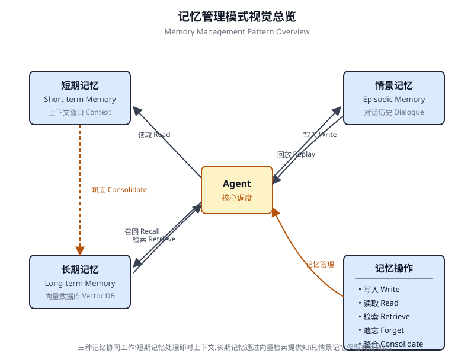

# 第 8 章 记忆管理(Memory Management)

<!-- chapter: 8 | part: I | pages: 148-167 | translated_from: pdf/148-167 -->

有效的记忆管理对智能体(Agent)保留信息至关重要。智能体需要不同类型的记忆，正如人类一样，才能高效运作。本章深入探讨记忆管理，专门解决智能体的即时(短期)和持久(长期)记忆需求。

在智能体系统中，记忆指的是智能体保留并利用来自过去交互、观察和学习经验信息的能力。这种能力使智能体能够做出明智的决策、维持对话上下文，并随时间推移不断改进。智能体记忆通常分为两大类：

- 短期记忆(上下文记忆):类似于工作记忆，用于保存当前正在处理或最近访问的信息。对于使用大语言模型(LLM)的智能体而言，短期记忆主要存在于上下文窗口中。该窗口包含当前交互中的近期消息、智能体回复、工具使用结果以及智能体反思，所有这些都为 LLM 的后续响应和动作提供信息。上下文窗口容量有限，这限制了智能体可直接访问的近期信息量。高效的短期记忆管理涉及在有限空间中保留最相关的信息，可能采用对较早对话段进行摘要或突出关键细节等技术。具有"长上下文"窗口的模型的出现，仅仅扩展了这种短期记忆的大小，允许在单次交互中容纳更多信息。然而，此上下文仍然是短暂的，会话一旦结束便会丢失。

## 实际应用与用例

记忆管理对于智能体跟踪信息并随时间智能地执行任务至关重要。这是智能体超越基本问答能力的关键。应用包括：

- **聊天机器人与对话式人工智能(Conversational AI)**：维持对话流依赖于短期记忆。聊天机器人需要记住用户先前的输入，以提供连贯的回复。长期记忆使聊天机器人能够回忆用户偏好、历史问题或过往讨论，从而提供个性化且持续的交互。

- **面向任务的智能体**：管理多步任务的智能体需要短期记忆来跟踪先前的步骤、当前进度和总体目标。这些信息可能驻留在任务上下文或临时存储中。长期记忆对于访问不在当前上下文中的特定用户相关数据至关重要。

- **个性化体验**：提供定制化交互的智能体利用长期记忆来存储和检索用户偏好、历史行为和个人信息。这使智能体能够调整其回复和建议。

- **学习与改进**：智能体可以通过从过往交互中学习来优化其性能。成功的策略、错误和新信息被存储在长期记忆中，以便未来的适应。强化学习智能体以这种方式存储习得的策略或知识。

- **信息检索(信息检索类应用)**：设计用于回答问题的智能体访问知识库（即其长期记忆），通常通过检索增强生成(RAG)实现。智能体检索相关文档或数据以支撑其回复。

- **自主系统**：机器人或自动驾驶汽车需要记忆来存储地图、路线、物体位置和习得行为。这涉及用于即时环境的短期记忆，以及用于一般环境知识的长期记忆。

记忆使智能体能够维护历史、学习、个性化交互，并处理复杂的、与时间相关的问题。

Google Agent Developer Kit (ADK) 提供了一套结构化的方法来管理上下文和记忆，其中包含用于实际应用的组件。深入理解 ADK 的会话(Session)、状态(State)和记忆(Memory)对于构建需要保留信息的智能体至关重要。正如人与人之间的交互一样，智能体需要具备回忆先前交流的能力，以进行连贯且自然的对话。ADK 通过三个核心概念及其相关服务简化了上下文管理。与智能体的每一次交互都可以被视为一个独特的对话线程。智能体可能需要访问来自先前交互的数据。ADK 将其结构化如下：

- **会话(Session)**:一条独立的聊天线程，记录该特定交互的消息和动作(事件),同时存储与该对话相关的临时数据(状态)。
- **状态(State)(session.state)**:存储在会话中的数据，仅包含与当前活动聊天线程相关的信息。
- **记忆(Memory)**:一个可搜索的信息库，来源于各种过去的聊天或外部资源，作为超出即时对话范围的数据检索资源。

ADK 提供了专门的服务来管理构建复杂的、有状态的且具备上下文感知能力的智能体所必需的关键组件。**会话服务(SessionService)** 通过处理聊天线程(会话对象)的启动、记录和终止来管理它们，而**记忆服务(MemoryService)** 则负责长期知识(记忆)的存储和检索。

会话服务和记忆服务都提供多种配置选项，允许用户根据应用需求选择存储方式。虽然为了测试目的提供了内存(in-memory)选项，但数据不会在重启后保留。

对于持久化存储和可扩展性，Google ADK 也支持数据库和云端服务。

## 会话(可以理解为"会话对象")(Session):追踪每一次对话

ADK 中的会话(Session)对象用于追踪和管理单条对话线程。当与智能体发起对话时，会话服务(SessionService)会生成一个会话对象，表示为 `google.adk.sessions.Session`。该对象封装了与特定对话线程相关的所有数据，包括唯一标识符(id、app_name、user_id)、按时间顺序排列的事件(Event 对象)记录、用于会话级临时数据的存储区(即 state,会话状态)以及表示最近一次更新的时间戳(last_update_time)。开发者通常通过会话服务间接与会话对象交互。会话服务负责管理对话会话的生命周期，这包括启动新会话、恢复历史会话、记录会话活动(包括状态更新)、识别活跃会话以及管理会话数据的删除。ADK 提供了多种会话服务实现，采用不同的存储机制来保存会话历史和临时数据，例如 `InMemorySessionService`,它适用于测试场景，但无法在应用重启后保留数据。

```python
# Example: Using InMemorySessionService
  # This is suitable for local development and testing where data
  # persistence across application restarts are not required.
  from google.adk.sessions import InMemorySessionService
  session_service = InMemorySessionService()
  Then there’s DatabaseSessionService if you want reliable saving to a data-
base you manage.
  # Example: Using DatabaseSessionService
  # This is suitable for production or development requiring per-
  sistent storage.
  # You need to configure a database URL (e.g., for SQLite,
  PostgreSQL, etc.).
  # Requires: pip install google-adk[sqlalchemy] and a database
  driver (e.g., psycopg2 for PostgreSQL)
  from google.adk.sessions import DatabaseSessionService
  # Example using a local SQLite file:
  db_url = "sqlite:///./my_agent_data.db"
  session_service = DatabaseSessionService(db_url=db_url)
```

此外，还有 VertexAiSessionService,它使用 Vertex AI 基础设施，在 Google Cloud 上实现可扩展的生产部署。

```python
# Example: Using VertexAiSessionService
# This is suitable for scalable production on Google Cloud Platform, leveraging
# Vertex AI infrastructure for session management.
# Requires: pip install google-adk[vertexai] and GCP setup/authentication
from google.adk.sessions import VertexAiSessionService

PROJECT_ID = "your-gcp-project-id"  # Replace with your GCP project ID
LOCATION = "us-central1"  # Replace with your desired GCP location

# The app_name used with this service should correspond to the Reasoning Engine ID or name
REASONING_ENGINE_APP_NAME = "projects/your-gcp-project-id/locations/us-central1/reasoningEngines/your-engine-id"  # Replace with your Reasoning Engine resource name

session_service = VertexAiSessionService(project=PROJECT_ID, location=LOCATION)

# When using this service, pass REASONING_ENGINE_APP_NAME to service methods:
# session_service.create_session(app_name=REASONING_ENGINE_APP_NAME, …)
# session_service.get_session(app_name=REASONING_ENGINE_APP_NAME, …)
# session_service.append_event(session, event, app_name=REASONING_ENGINE_APP_NAME)
# session_service.delete_session(app_name=REASONING_ENGINE_APP_NAME, …)
```

选择合适的会话服务至关重要，因为它决定了智能体(Agent)的交互历史和临时数据的存储方式及其持久性。每一次消息交换都涉及一个循环过程：接收到消息后，运行器(Runner)使用会话服务检索或建立会话，智能体使用会话的上下文(状态和历史交互)处理消息，智能体生成响应并可能更新状态，运行器将此封装为一个事件(Event),`session_service.append_event` 方法记录新事件并更新存储中的状态。然后，会话等待下一条消息。理想情况下，当交互结束时，应该使用 `delete_session` 方法来终止会话。

该过程展示了会话服务如何通过管理特定于会话的历史记录和临时数据来保持连续性。

## 状态：会话的暂存区

在 ADK 中，每个会话(Session)代表一个聊天线程，包含一个状态组件，类似于智能体在特定对话期间的临时工作记忆。`session.events` 记录整个聊天历史，而 `session.state` 存储和更新与当前聊天相关的动态数据点。从根本上讲，`session.state` 以字典形式运作，将数据以键值对形式存储。其核心功能是使智能体能够保留和管理对话连贯性所需的关键细节，例如用户偏好、任务进度、增量数据收集或影响后续智能体行为的条件标志。状态结构由字符串键与可序列化的 Python 类型(包括字符串、数字、布尔值、列表以及包含这些基本类型的字典)配对组成。状态是动态的，在整个对话过程中不断演化。这些更改的持久性取决于所配置的会话服务。

状态组织可以通过使用键前缀来定义数据范围和持久性。无前缀的键是特定于会话的。

- `user:` 前缀将数据与用户 ID 关联，跨所有会话生效。
- `app:` 前缀指定在应用程序的所有用户之间共享的数据。
- `temp:` 前缀表示仅在当前处理轮次有效的数据，不会持久化存储。

智能体通过单个 `session.state` 字典访问所有状态数据。会话服务负责数据检索、合并和持久化。在通过 `session_service.append_event()` 向会话历史添加事件后，应该更新状态。这确保了准确的跟踪、在持久化服务中的正确保存，以及对状态更改的安全处理。

1.

简单方法：使用 output_key(用于智能体文本回复):如果你只想将智能体的最终文本回复直接保存到状态中，这是最简单的方法。当你设置 LlmAgent 时，只需告诉它要使用的 output_key。运行器(Runner)会检测到这一点，并在追加事件时自动创建必要的动作来将响应保存到状态中。下面我们来看一个通过 output_key 演示状态更新的代码示例。

```python
# Import necessary classes from the Google Agent Developer Kit (ADK)
from google.adk.agents import LlmAgent
from google.adk.sessions import InMemorySessionService, Session
from google.adk.runners import Runner
from google.genai.types import Content, Part

# Define an LlmAgent with an output_key.
greeting_agent = LlmAgent(
    name="Greeter",
    model="gemini-2.0-flash",
    instruction="Generate a short, friendly greeting.",
    output_key="last_greeting"
)

# --- Setup Runner and Session ---
app_name, user_id, session_id = "state_app", "user1", "session1"
session_service = InMemorySessionService()
runner = Runner(
    agent=greeting_agent,
    app_name=app_name,
    session_service=session_service
)
session = session_service.create_session(
    app_name=app_name,
    user_id=user_id,
    session_id=session_id
)
print(f"Initial state: {session.state}")

# --- Run the Agent ---
user_message = Content(parts=[Part(text="Hello")])
print("\n--- Running the agent ---")
for event in runner.run(
    user_id=user_id,
    session_id=session_id,
    new_message=user_message
):
    if event.is_final_response():
        print("Agent responded.")

# --- Check Updated State ---
# Correctly check the state *after* the runner has finished processing all events.
updated_session = session_service.get_session(app_name, user_id, session_id)
print(f"\nState after agent run: {updated_session.state}")
```

在背后，Runner 会识别你的 `output_key`，并在调用 `append_event` 时自动通过 `state_delta` 创建必要的动作。
2. **标准方式：使用 `EventActions.state_delta`（用于更复杂的更新）**：当你需要执行更复杂的操作时——例如同时更新多个键、保存不仅是文本的内容、定位到特定的作用域（如 `user:` 或 `app:`），或者进行与智能体最终文本回复无关的更新——你需要手动构建一个状态变更字典（即 `state_delta`），并将其包含在你所追加事件的 `EventActions` 中。让我们看一个示例：

```python
import time
  from google.adk.tools.tool_context import ToolContext
  from google.adk.sessions import InMemorySessionService
  # --- Define the Recommended Tool-Based Approach ---
  def log_user_login(tool_context: ToolContext) -> dict:
     """
     Updates the session state upon a user login event.
     This tool encapsulates all state changes related to a
  user login.
     Args:
         tool_context: Automatically provided by ADK, gives access
  to session state.
     Returns:
         A dictionary confirming the action was successful.
     """
     # Access the state directly through the provided context.
     state = tool_context.state
     # Get current values or defaults, then update the state.
     # This is much cleaner and co-locates the logic.
     login_count = state.get("user:login_count", 0) + 1
     state["user:login_count"] = login_count
     state["task_status"] = "active"
     state["user:last_login_ts"] = time.time()
     state["temp:validation_needed"] = True
     print("State updated from within the `log_user_login` tool.")
     return {
         "status": "success",
         "message":   f"User   login   tracked.    Total   logins:
  {login_count}."
     }
  # --- Demonstration of Usage ---
  # In a real application, an LLM Agent would decide to call
  this tool.
  # Here, we simulate a direct call for demonstration purposes.
  # 1. Setup
  session_service = InMemorySessionService()
  app_name, user_id, session_id = "state_app_tool", "user3",
  "session3"
  session = session_service.create_session(
     app_name=app_name,
     user_id=user_id,
     session_id=session_id,
     state={"user:login_count": 0, "task_status": "idle"}
  )
  print(f"Initial state: {session.state}")
  # 2. Simulate a tool call (in a real app, the ADK Runner
  does this)
  # We create a ToolContext manually just for this standalone
  example.
  from google.adk.tools.tool_context import InvocationContext
  mock_context = ToolContext(
     invocation_context=InvocationContext(
         app_name=app_name,       user_id=user_id,        session_
  id=session_id,
         session=session, session_service=session_service
     )
  )
  # 3. Execute the tool
  log_user_login(mock_context)
  # 4. Check the updated state
  updated_session = session_service.get_session(app_name, user_
  id, session_id)
  print(f"State after tool execution: {updated_session.state}")
  # Expected output will show the same state change as the
  # "Before" case,
  # but the code organization is significantly cleaner
  # and more robust.
```

此代码演示了一种基于工具的方法来管理应用程序中的用户会话状态。它定义了一个函数 log_user_login,作为工具使用。该工具负责在用户登录时更新会话状态。函数接收一个由 ADK 提供的 ToolContext 对象，用于访问和修改会话的状态字典。在工具内部，它递增 user:login_count,将 task_status 设置为"active",记录 user:last_login_ts(时间戳),并添加一个临时标志 temp:validation_needed。代码的演示部分模拟了该工具的使用方式。它设置了一个内存会话服务，并创建一个带有一些预定义状态的初始会话。然后手动创建一个 ToolContext 来模拟 ADK Runner 执行工具的环境。使用此模拟上下文调用 log_user_login 函数。最后，代码再次检索会话，以显示状态已通过工具的执行得到更新。目标是展示与在工具外部直接操作状态相比，将状态变更封装在工具中如何使代码更简洁、更有条理。

请注意，在检索会话后直接修改 'session.state' 字典是强烈不建议的，因为这会绕过标准的事件处理机制。此类直接更改将不会记录在会话的事件历史中，可能不会被所选的 'SessionService' 持久化，可能导致并发问题，并且不会更新诸如时间戳之类的必要元数据。更新会话状态的推荐方法是使用 `LlmAgent` 上的 `output_key` 参数(专门用于智能体的最终文本响应),或者在通过 `session_service.append_event()` 追加事件时，在 `EventActions.state_delta` 中包含状态变更。`session.state` 应主要用于读取现有数据。

**Memory: Long-Term Knowledge with MemoryService**

在智能体系统中，会话(Session)组件维护当前聊天历史(事件)以及特定于单次对话的临时数据(状态)。然而，若要使智能体在多次交互中保留信息或访问外部数据，则需要长期知识管理。`MemoryService` 正是为此提供支持。

```python
# Example: Using InMemoryMemoryService
# This is suitable for local development and testing where data
# persistence across application restarts is not required.
# Memory content is lost when the app stops.
from google.adk.memory import InMemoryMemoryService
memory_service = InMemoryMemoryService()
```

会话与状态可以看作是单次聊天会话的短期记忆，而由 `MemoryService` 管理的长期知识则充当一个持久化、可搜索的知识库。该知识库可以包含来自过去多次交互的信息或外部数据源。如 `BaseMemoryService` 接口所定义，`MemoryService` 为管理这种可搜索的长期知识建立了一套标准。其主要功能包括添加信息——通过 `add_session_to_memory` 方法从会话中提取内容并加以存储，以及检索信息——允许智能体查询存储并通过 `search_memory` 方法获取相关数据。

Google ADK 提供了多种实现来构建这种长期知识存储。`InMemoryMemoryService` 提供了一种适用于测试用途的临时存储方案，但数据不会在应用重启后保留。在生产环境中，通常使用 `VertexAiRagMemoryService`。

该服务利用 Google Cloud 的检索增强生成(RAG)服务，从而具备可扩展、持久化与语义化的搜索能力(也可参阅第 14 章关于 RAG 的内容)。

```python
# Example: Using VertexAiRagMemoryService
  # This is suitable for scalable production on GCP, leveraging
  # Vertex AI RAG (Retrieval Augmented Generation) for persistent,
  # searchable memory.
  # Requires: pip install google-adk[vertexai], GCP
  # setup/authentication, and a Vertex AI RAG Corpus.
  from google.adk.memory import VertexAiRagMemoryService
  # The resource name of your Vertex AI RAG Corpus
  RAG_CORPUS_RESOURCE_NAME = "projects/your-gcp-  project-
                                                           id/loca-
  tions/us-central1/ragCorpora/your-corpus-id" # Replace with
  your Corpus resource name
  # Optional configuration for retrieval behavior
  SIMILARITY_TOP_K = 5 # Number of top results to retrieve
  VECTOR_DISTANCE_THRESHOLD = 0.7 # Threshold for vector similarity
  memory_service = VertexAiRagMemoryService(
     rag_corpus=RAG_CORPUS_RESOURCE_NAME,
     similarity_top_k=SIMILARITY_TOP_K,
     vector_distance_threshold=VECTOR_DISTANCE_THRESHOLD
  )
  # When using this service, methods like add_session_to_memory
  # and search_memory will interact with the specified Vertex AI
  # RAG Corpus.
```

## LangChain 和 LangGraph 中的实践代码：记忆管理(Memory Management)


在 LangChain 和 LangGraph 中，记忆是构建智能且自然的对话应用的关键组件。它允许 AI 智能体(Agent)记住过往交互中的信息、从反馈中学习，并适应用户偏好。LangChain 的记忆功能通过引用存储的历史记录来丰富当前提示(Prompt),然后记录最新的对话以供将来使用，从而为这一切奠定基础。随着智能体处理更复杂的任务，这一能力对效率提升和用户满意度都变得至关重要。

### 短期记忆(Short-Term Memory)

这是线程范围内(thread-scoped)的，意味着它跟踪单个会话或线程内正在进行的对话。

它提供即时上下文，但完整的历史记录可能会挑战 LLM 的上下文窗口，可能导致错误或性能下降。LangGraph 将短期记忆作为智能体状态的一部分进行管理，该状态通过检查点(checkpointer)持久化，从而允许随时恢复线程。

**长期记忆(Long-Term Memory)**:跨会话存储用户特定或应用级别的数据，并在多个会话线程之间共享。它保存在自定义的"命名空间"中，可以在任何线程中随时被召回。LangGraph 提供了存储(stores)来保存和召回长期记忆，使智能体能够无限期地保留知识。

LangChain 提供了多种管理对话历史的工具，范围从手动控制到在链(Chain)内的自动化集成。

**ChatMessageHistory:手动记忆管理**。对于在正式链之外对对话历史进行直接而简单的控制，`ChatMessageHistory` 类是理想之选。它允许手动跟踪对话交换。

```python
from langchain.memory import ChatMessageHistory

# Initialize the history object
history = ChatMessageHistory()

# Add user and AI messages
history.add_user_message("I'm heading to New York next week.")
history.add_ai_message("Great! It's a fantastic city.")

# Access the list of messages
print(history.messages)
```

**ConversationBufferMemory:链的自动化记忆**。对于将记忆直接集成到链中，`ConversationBufferMemory` 是一个常见选择。它保存一个对话缓冲区，并将其提供给提示(Prompt)。其行为可以通过两个关键参数进行自定义：

- `memory_key`:一个字符串，指定提示中用于保存聊天历史的变量名。

```python
from langchain.memory import ConversationBufferMemory

# Initialize memory
memory = ConversationBufferMemory()

# Save a conversation turn
memory.save_context({"input": "What's the weather                like?"},
{"output": "It's sunny today."})

# Load the memory as a string
print(memory.load_memory_variables({}))
```

```python
Integrating this memory into an LLMChain allows the model to access the
conversation’s history and provide contextually relevant responses.
```

```python
from langchain_openai import OpenAI
  from langchain.chains import LLMChain
  from langchain.prompts import PromptTemplate
  from langchain.memory import ConversationBufferMemory
  # 1. Define LLM and Prompt
  llm = OpenAI(temperature=0)
  template = """You are a helpful travel agent.
  Previous conversation:
  {history}
  New question: {question}
  Response:"""
  prompt = PromptTemplate.from_template(template)
  # 2. Configure Memory
  # The memory_key "history" matches the variable in the prompt
  memory = ConversationBufferMemory(memory_key="history")
  # 3. Build the Chain
  conversation = LLMChain(llm=llm, prompt=prompt, memory=memory)
  # 4. Run the Conversation
  response = conversation.predict(question="I want to book a
  flight.")
  print(response)
  response = conversation.predict(question="My name is Sam, by
  the way.")
  print(response)
  response = conversation.predict(question="What was my name
  again?")
  print(response)
```

```python
For improved effectiveness with chat models, it is recommended to use a
structured list of message objects by setting ‘return_messages = True’.
```

```python
from langchain_openai import ChatOpenAI
  from langchain.chains import LLMChain
  from langchain.memory import ConversationBufferMemory
  from langchain_core.prompts import (
     ChatPromptTemplate,
     MessagesPlaceholder,
     SystemMessagePromptTemplate,
     HumanMessagePromptTemplate,
  )
  # 1. Define Chat Model and Prompt
  llm = ChatOpenAI()
  prompt = ChatPromptTemplate(
     messages=[
         SystemMessagePromptTemplate.from_template("You    are   a
  friendly assistant."),
         MessagesPlaceholder(variable_name="chat_history"),
         HumanMessagePromptTemplate.from_template("{question}")
     ]
  )
  # 2. Configure Memory
  # return_messages=True is essential for chat models
  memory    =  ConversationBufferMemory(memory_key="chat_history",
  return_messages=True)
  # 3. Build the Chain
  conversation = LLMChain(llm=llm, prompt=prompt, memory=memory)
  # 4. Run the Conversation
  response = conversation.predict(question="Hi, I'm Jane.")
  print(response)
  response = conversation.predict(question="Do you remember
  my name?")
  print(response)
Types of Long-Term Memory Long-term memory allows systems to retain
information across different conversations, providing a deeper level of context
and personalization. It can be broken down into three types analogous to
human memory: Semantic Memory: Remembering Facts: This involves
retaining specific facts and concepts, such as user preferences or domain
knowledge. It is used to ground an agent’s responses, leading to more person-
alized and relevant interactions. This information can be managed as a con-
tinuously updated user “profile” (a JSON document) or as a “collection” of
individual factual documents.
• Episodic Memory: Remembering Experiences: This involves recalling
  past events or actions. For AI agents, episodic memory is often used to
  remember how to accomplish a task. In practice, it’s frequently imple-
  mented through few-shot example prompting, where an agent learns from
  past successful interaction sequences to perform tasks correctly.
• Procedural Memory: Remembering Rules: This is the memory of how to
  perform tasks—the agent’s core instructions and behaviors, often con-
  tained in its system prompt. It’s common for agents to modify their own
  prompts to adapt and improve. An effective technique is “Reflection,”
  where an agent is prompted with its current instructions and recent inter-
  actions, then asked to refine its own instructions.
Below is pseudo-code demonstrating how an agent might use reflection to
update its procedural memory stored in a LangGraph BaseStore.
  # Node that updates the agent's instructions
  def update_instructions(state: State, store: BaseStore):
     namespace = ("instructions",)
     # Get the current instructions from the store
     current_instructions = store.search(namespace)[0]
     # Create a prompt to ask the LLM to reflect on the
  conversation
     # and generate new, improved instructions
     prompt = prompt_template.format(
         instructions=current_instructions.value["instructions"],
         conversation=state["messages"]
     )
     # Get the new instructions from the LLM
     output = llm.invoke(prompt)
     new_instructions = output['new_instructions']
     # Save the updated instructions back to the store
     store.put(("agent_instructions",),   "agent_a",   {"instruc-
  tions": new_instructions})
  # Node that uses the instructions to generate a response
  def call_model(state: State, store: BaseStore):
     namespace = ("agent_instructions", )
     # Retrieve the latest instructions from the store
     instructions = store.get(namespace, key="agent_a")[0]
     # Use the retrieved instructions to format the prompt
     prompt = prompt_template.format(instructions=instructions.
  value["instructions"])
     # … application logic continues
```

```python
LangGraph stores long-term memories as JSON documents in a store.
Each memory is organized under a custom namespace (like a folder) and a
distinct key (like a filename). This hierarchical structure allows for easy orga-
nization and retrieval of information. The following code demonstrates how
to use InMemoryStore to put, get, and search for memories.
  from langgraph.store.memory import InMemoryStore
  # A placeholder for a real embedding function
  def embed(texts: list[str]) -> list[list[float]]:
     # In a real application, use a proper embedding model
     return [[1.0, 2.0] for _ in texts]
  # Initialize an in-memory store. For production, use a database-
  backed store.
  store = InMemoryStore(index={"embed": embed, "dims": 2})
  # Define a namespace for a specific user and application context
  user_id = "my-user"
  application_context = "chitchat"
  namespace = (user_id, application_context)
  # 1. Put a memory into the store
  store.put(
     namespace,
     "a-memory",  # The key for this memory
     {
         "rules": [
             "User likes short, direct language",
             "User only speaks English & python",
         ],
         "my-key": "my-value",
     },
  )
  # 2. Get the memory by its namespace and key
  item = store.get(namespace, "a-memory")
  print("Retrieved Item:", item)
  # 3. Search for memories within the namespace, filtering
  by content
  # and sorting by vector similarity to the query.
  items = store.search(
     namespace,
     filter={"my-key": "my-value"},
     query="language preferences"
  )
  print("Search Results:", items)
```

### Vertex 记忆库

Memory Bank 是 Vertex AI Agent Engine 中的一项托管服务，为智能体提供持久的长期记忆。该服务使用 Gemini 模型异步分析对话历史，以提取关键事实和用户偏好。

这些信息会被持久化存储，按照用户 ID 等已定义的作用域进行组织，并智能地进行更新，以整合新数据并解决冲突。在开启新会话时，智能体通过完整数据召回或基于嵌入的相似性搜索来检索相关记忆。这一过程使智能体能够跨会话保持连续性，并基于被召回的信息提供个性化的响应。

智能体的运行器与 VertexAiMemoryBankService 交互，该服务首先被初始化。此服务负责自动存储智能体对话过程中生成的记忆。每条记忆都标有唯一的 USER_ID 和 APP_NAME,以确保未来能够准确检索。

```python
from google.adk.memory import VertexAiMemoryBankService
agent_engine_id = agent_engine.api_resource.name.split("/")[-1]
memory_service = VertexAiMemoryBankService(
    project="PROJECT_ID",
    location="LOCATION",
    agent_engine_id=agent_engine_id
)
session = await session_service.get_session(
    app_name=app_name,
    user_id="USER_ID",
    session_id=session.id
)
await memory_service.add_session_to_memory(session)
```

Memory Bank 与 Google ADK 无缝集成，提供即时可用的开箱即用体验。对于 LangGraph 和 CrewAI 等其他智能体框架的用户，Memory Bank 也通过直接 API 调用提供支持。展示这些集成的在线代码示例可供感兴趣的读者随时参考。

## 概览

**是什么** 智能体(Agent)系统需要记忆过去交互中的信息，才能执行复杂任务并提供连贯的体验。没有记忆机制，智能体就是无状态的，无法维持对话上下文、从经验中学习，或为用户提供个性化的响应。这从根本上将其限制在简单的、一次性的交互中，无法处理多步骤流程或不断演变的用户需求。核心问题在于如何有效管理单次对话中即时的临时信息，以及随时间积累的海量持久化知识。

为什么 标准化的解决方案是实现一个双组件记忆系统，用以区分短期与长期存储。短期的上下文记忆将最近的交互数据保存在大语言模型(LLM)的上下文窗口内，以维持对话流畅性。对于必须持久化的信息，长期记忆方案使用外部数据库(通常为向量数据库)进行高效的语义检索。像 Google ADK 这类智能体式框架提供了专门的组件来管理这些内容，例如用于对话线程的 Session 以及用于其临时数据的 State。专用的 MemoryService 用于与长期知识库进行接口对接，使智能体能够检索并将相关的过往信息纳入其当前上下文中。

**经验法则** 当智能体(Agent)需要完成的不仅仅是对单个问题的回答时，可以使用此模式。对于必须在整个对话过程中维护上下文、在多步骤任务中跟踪进度，或通过回忆用户偏好和历史记录来个性化交互的智能体，该模式至关重要。每当智能体预期基于过去的成功、失败或新获取的信息进行学习或适应时，都应该实现记忆管理(Memory Management)。

**Visual Summary (Fig. 8.1)**

## 关键要点

To quickly recap the main points about memory management:

- 记忆(Memory)对智能体(Agent)跟踪事物、学习和个性化交互至关重要。
- 对话式 AI 同时依赖短期记忆(Short-Term Memory)——用于单次对话内的即时上下文——以及长期记忆(Long-Term Memory)——用于跨多个会话的持久知识。
- 短期记忆(那些即时性的内容)是临时性的，通常受限于大语言模型(LLM)的上下文窗口或框架传递上下文的方式。
- 长期记忆(那些持续存在的内容)通过向量数据库等外部存储跨不同对话保存信息，并通过搜索进行访问。
- 像 ADK 这样的框架具有特定的部分，例如会话(Session,即对话线程)、状态(State,临时对话数据)和记忆服务(MemoryService,可搜索的长期知识),用于管理记忆。
- ADK 的会话服务(SessionService)处理整个聊天会话的生命周期，包括其历史记录(事件)和临时数据(状态)。
- ADK 的 session.state 是一个用于临时对话数据的字典。
- 前缀(user:、app:、temp:)用于标识数据归属以及其是否持久存在。

- 前缀(`user:`、`app:`、`temp:`)用于标明数据归属及其是否为持久数据。
- 在 ADK 中，添加事件时应该通过 `EventActions.state_delta` 或 `output_key` 来更新状态，而不是直接修改状态字典。
- ADK 的 `MemoryService` 用于将信息存入长期存储，并允许智能体搜索这些信息，通常借助工具实现。
- LangChain 提供了诸如 `ConversationBufferMemory` 这类实用工具，能够自动将单次对话的历史注入提示，从而使智能体能够回顾即时上下文。
- LangGraph 通过使用存储(store)来实现高级的长期记忆，能够跨不同用户会话保存和检索语义事实、情景经历，甚至可更新的程序化规则。
- Memory Bank 是一项托管服务，通过自动提取、存储和调用用户专属信息，为智能体提供持久的长期记忆，从而在 Google ADK、LangGraph 和 CrewAI 等框架之间实现个性化、持续性的对话。

## 结论

本章深入探讨了智能体系统中至关重要的记忆管理工作，展示了短期上下文与长期持久知识之间的区别。我们讨论了这些类型的记忆是如何构建的，以及在构建能够记住信息的更智能的智能体时它们的应用场景。我们详细考察了 Google ADK 如何提供 Session、State 和 MemoryService 等具体组件来处理这一问题。既然我们已经涵盖了智能体如何记忆事物——无论是短期还是长期记忆，我们就可以继续探讨它们如何学习与适应。下一个模式“学习与适应(Learning and Adaptation)”关注的是智能体如何根据新的经验或数据，改变其思维、行动或所掌握的知识。

## 参考文献

ADK Memory, https://google.github.io/adk-docs/sessions/memory/
LangGraph Memory, https://langchain-ai.github.io/langgraph/concepts/memory/
Vertex AI Agent Engine Memory Bank, https://cloud.google.com/blog/products/ai-machine-learning/vertex-ai-memory-bank-in-public-preview

