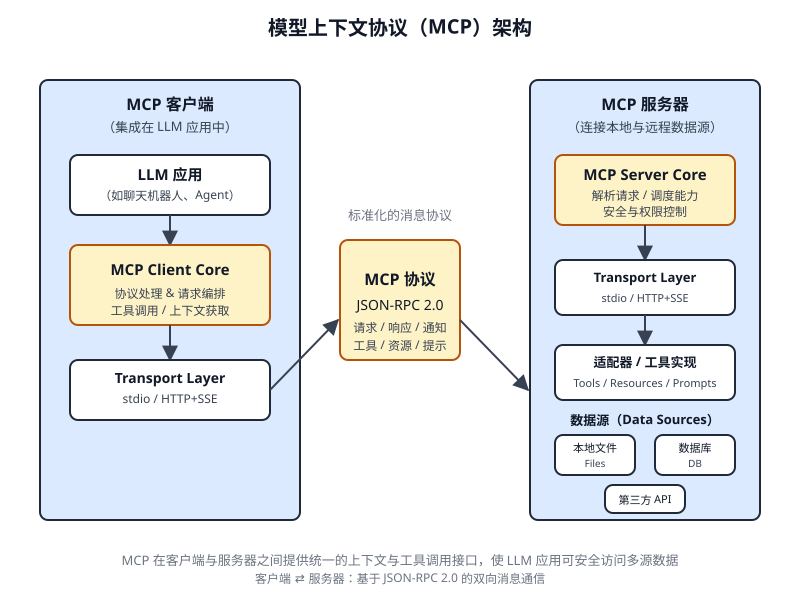

# 第 10 章 模型上下文协议(Model Context Protocol)

<!-- chapter: 10 | part: I | pages: 180-195 | translated_from: pdf/180-195 -->

为了使大语言模型(LLM)能够有效地作为智能体运行，其能力必须超越多模态生成。必须能够与外部环境交互，包括访问当前数据、使用外部软件以及执行特定的操作任务。模型上下文协议(Model Context Protocol)通过为大语言模型提供与外部资源对接的标准化接口来满足这一需求。该协议作为促进一致且可预测集成的关键机制。

## 模型上下文协议(MCP)模式概述


设想一种万能适配器，它能够让任何 LLM 无需为每个外部系统、数据库或工具分别编写定制集成代码，即可直接接入。这本质上就是模型上下文协议(Model Context Protocol, MCP)所扮演的角色。MCP 是一项开放标准，旨在统一规范 Gemini、OpenAI 的 GPT 模型、Mixtral 以及 Claude 等 LLM 与外部应用程序、数据源和工具之间的通信方式。可以将其视为一种通用连接机制，简化了 LLM 获取上下文、执行操作以及与各类系统交互的方式。

MCP 采用客户端-服务器架构。它规定了如何通过 MCP 服务器对外暴露不同的元素——数据(称为资源)、交互式模板(本质上即为提示),以及可调用函数(即工具)。这些元素随后由 MCP 客户端消费，MCP 客户端可以是 LLM 宿主应用程序，也可以是 AI 智能体本身。这种标准化的方法极大地降低了将 LLM 集成到多样化运行环境中的复杂度。

## MCP 与工具函数调用

模型上下文协议(Model Context Protocol, MCP)与工具函数调用是两种不同的机制，它们使大语言模型(LLM)能够与外部能力(包括工具)交互并执行动作。虽然两者都用于将 LLM 的能力从纯文本生成扩展到更广的范围，但它们在实现方式和抽象层级上有所不同。工具函数调用可以理解为 LLM 向某个特定、预定义的工具或函数发出的直接请求。需要注意的是，在此语境下"工具"和"函数"两个词可以互换使用。这种交互的特征是一对一通信模型：LLM 根据对用户意图的理解(该意图需要外部动作)来格式化请求，然后由应用代码执行该请求并将结果返回给 LLM。这一过程通常是各厂商专有的，并因 LLM 提供商的不同而有所差异。

相比之下，模型上下文协议(MCP)作为一种标准化接口，用于 LLM 发现、与外部能力通信并使用这些能力。它作为一个开放协议运行，促进与各种工具和系统的交互，旨在建立一个任何合规工具都能够被任何合规 LLM 访问的生态系统。这促进了不同系统和实现之间的互操作性、可组合性和可复用性。通过采用联邦模型，我们显著提升了互操作性，并释放了既有资产的价值。这一策略使我们能够将分散的、遗留的服务纳入现代生态系统，只需将它们包装在符合 MCP 的接口中即可。这些服务继续独立运行，但现在可以被组合到新的应用和工作流中，并由 LLM 编排其协作。这在不要求对基础系统进行昂贵重写的前提下，提升了敏捷性和可复用性。

以下是 MCP 与工具函数调用之间基本区别的对比：

| 特性 | 工具函数调用 | 模型上下文协议(MCP) |
|---|---|---|
| 标准化 | 各厂商专有且特有。格式与实现因大语言模型(LLM)提供商而异。 | 开放、标准化协议，促进不同 LLM 与工具之间的互操作性。 |
| 范围 | LLM 请求执行特定预定义函数的直接机制。 | 更为广泛的框架，用于 LLM 与外部工具相互发现与通信。 |
| 架构 | LLM 与应用程序工具处理逻辑之间的一对一交互。 | 客户端-服务器架构，由 LLM 驱动的应用程序(客户端)可以连接并使用各种 MCP 服务器(工具)。 |
| 发现 | 在特定对话的上下文中，明确告知 LLM 哪些工具可用。 | 支持动态发现可用工具。MCP 客户端可以查询服务器以查看其提供的能力。 |
| 可复用性 | 工具集成通常与所使用的特定应用程序和 LLM 紧密耦合。 | 促进开发可复用、独立的"MCP 服务器",任何兼容的应用程序都可以访问这些服务器。 |

可以将工具函数调用视为给 AI 提供一套特定的定制工具，例如一把特定的扳手和螺丝刀。这对于拥有固定任务集合的工作坊而言是高效的。而模型上下文协议(MCP)则像是创建一套通用的标准化电源插座系统。它本身不提供工具，但允许任何来自任何厂商的兼容工具插入并工作，从而支持一个动态且不断扩展的工作坊。

它本身不提供工具，但允许任何符合规范的、来自任何厂商的工具即插即用，从而打造一个动态且不断扩展的工作室。简而言之，函数调用提供对少数特定函数的直接访问；而模型上下文协议(MCP)则是一种标准化通信框架，让大语言模型(LLM)能够发现并使用大量外部资源。对于简单应用，特定工具足矣；而对于需要适配的复杂互联 AI 系统，像 MCP 这样的通用标准至关重要。

## MCP 的其他考量

尽管模型上下文协议(MCP)提供了一个强大的框架，但要全面评估其适用性，必须考虑若干关键因素。下列方面值得进一步关注：

- **工具、资源与提示的区别**:理解这三类组件的具体角色至关重要。资源(Resource)是静态数据(例如 PDF 文件、数据库记录)。工具(Tool)是执行某个动作的可调用函数(例如发送邮件、查询 API)。提示(Prompt)是引导大语言模型(LLM)如何与资源或工具交互的模板，确保交互过程结构化且高效。

- **可发现性(Discoverability)**:MCP 的一个关键优势在于，MCP 客户端可以动态查询服务端以了解其所提供的工具与资源。这种"即时"发现机制对于需要适应新能力而又无需重新部署的智能体而言非常强大。

- **安全性(Security)**:通过任何协议暴露工具和数据都需要健全的安全措施。MCP 实现必须包含身份验证与授权机制，以控制哪些客户端能够访问哪些服务端，以及它们被允许执行哪些具体操作。

- **实现复杂度(Implementation)**:虽然 MCP 是一个开放标准，但其实现可能较为复杂。不过，部分供应商已开始简化这一过程。例如，Anthropic 或 FastMCP 等模型供应商提供了软件开发工具包(SDK),抽象掉了大量样板代码，使开发者更容易创建和连接 MCP 客户端与服务端。

- **错误处理(Error Handling)**:完善的错误处理策略至关重要。该协议必须定义如何将错误(例如工具执行失败、服务端不可用、请求无效)反馈给 LLM,以便其理解失败原因并尝试其他方案。

- **本地服务端 vs. 远程服务端**:MCP 服务端可以部署在与智能体相同的机器上(本地),也可以部署在不同的机器上(远程)。

- 本地 vs. 远程服务器：模型上下文协议(MCP)服务器可以部署在与智能体相同的机器上，也可以部署在不同的远程服务器上。选择本地服务器可能是为了在处理敏感数据时获得更快的速度和更高的安全性；而远程服务器架构则允许在整个组织内对通用工具进行共享和可扩展的访问。
- 按需 vs. 批量：模型上下文协议既可以支持按需的交互式会话，也可以支持更大规模的批处理。具体选择取决于应用场景——从需要即时工具访问的实时对话智能体，到以批量方式处理记录的数据分析流水线。
- 传输机制：该协议还定义了底层通信传输层。对于本地交互，它使用基于 STDIO(标准输入/输出)的 JSON-RPC,以实现高效的进程间通信。对于远程连接，它利用流式 HTTP(Streamable HTTP)和服务器发送事件(Server-Sent Events, SSE)等面向 Web 的协议，从而实现持久且高效的客户端-服务器通信。

模型上下文协议采用客户端-服务器模型来标准化信息流。理解各组件之间的交互是掌握 MCP 高级智能体行为的关键：

1. 大语言模型(Large Language Model, LLM):核心智能。它处理用户请求、制定规划，并决定何时需要访问外部信息或执行某个操作。
2. MCP 客户端(MCP Client):这是大语言模型之上的应用或包装层。它充当中介，将大语言模型的意图转化为符合 MCP 标准的正式请求。它负责发现、连接 MCP 服务器并与之通信。
3. MCP 服务器(MCP Server):通往外部世界的网关。它向任何经过授权的 MCP 客户端暴露一组工具、资源和提示。每个服务器通常负责一个特定的领域，例如连接公司的内部数据库、电子邮件服务或公共 API。
4. 可选的第三方(3P)服务：这代表 MCP 服务器所管理并暴露的实际外部工具、应用或数据源。

4. 可选的第三方(3P)服务：这是模型上下文协议(MCP)服务器管理和暴露的实际外部工具、应用程序或数据源。

它就是执行所请求操作的最终端点，例如查询专有数据库、与 SaaS 平台交互，或调用公共天气 API。交互流程如下：

1. 发现(Discovery):模型上下文协议(MCP)客户端代表大语言模型(LLM)查询 MCP 服务器，询问它提供哪些能力。服务器以清单形式响应，列出其可用的工具(例如 send_email)、资源(例如 customer_database)和提示。

2. 请求构建(Request Formulation):大语言模型(LLM)确定需要使用某个已发现的工具。例如，它决定发送一封电子邮件。它构建一个请求，指定要使用的工具(send_email)以及必要的参数(收件人、主题、正文)。

3. 客户端通信(Client Communication):模型上下文协议(MCP)客户端获取大语言模型(LLM)构建的请求，并将其作为标准化调用发送给相应的 MCP 服务器。

4. 服务器执行(Server Execution):MCP 服务器接收请求。它对客户端进行身份验证，验证请求的有效性，然后通过与底层软件接口对接来执行指定的操作(例如，调用电子邮件 API 的 send() 函数)。

5. 响应与上下文更新(Response and Context Update):执行完成后，MCP 服务器将标准化响应发送回 MCP 客户端。该响应指示操作是否成功，并包含任何相关的输出(例如已发送电子邮件的确认 ID)。然后，客户端将此结果传回给大语言模型(LLM),更新其上下文，使它能够继续执行任务的下一阶段。

## 实际应用与使用场景

模型上下文协议(MCP)显著扩展了 AI 与大语言模型(LLM)的能力，使其更加通用且强大。以下是九个关键使用场景：

- **数据库集成**:MCP 允许 LLM 和智能体无缝访问并与数据库中的结构化数据进行交互。例如，使用 MCP Toolbox for Databases,智能体可以查询 Google BigQuery 数据集以检索实时信息、生成报表或更新记录，所有操作均由自然语言指令驱动。

- **生成式媒体编排**:MCP 使智能体能够与先进的生成式媒体服务集成。通过 MCP Tools for Genmedia Services,智能体可以编排涉及 Google Imagen 的图像生成、Google Veo 的视频创作、Google Chirp 3 HD 的逼真语音，或 Google Lyria 的音乐创作等工作流，从而在 AI 应用中实现动态内容创作。

- **外部 API 交互**:MCP 为 LLM 提供了一种标准化的方式来调用任意外部 API 并接收响应。这意味着智能体可以获取实时天气数据、抓取股票价格、发送电子邮件，或与 CRM 系统进行交互，将其能力远远扩展到核心语言模型之外。

- **基于推理的信息抽取**:借助 LLM 强大的推理能力，MCP 实现了高效的、依赖查询的信息抽取，效果优于传统的搜索与检索系统。不同于传统搜索工具返回整篇文档，智能体可以分析文本并精准抽取直接回答用户复杂问题的特定条款、数字或陈述。

- **自定义工具开发**:开发者可以构建自定义工具，并通过 MCP 服务器将其暴露出来(例如，使用 FastMCP)。

- 提供内部专有功能：模型上下文协议(MCP)使得专门的内部函数或专有系统能够以标准化、易于使用的格式提供给大语言模型(LLM)和其他智能体，而无需直接修改 LLM。
- 标准化的 LLM 到应用通信：MCP 确保 LLM 与其交互的应用之间保持一致的通信层。这降低了集成开销，促进了不同 LLM 提供商与宿主应用之间的互操作性，并简化了复杂智能体系统的开发。
- 复杂工作流编排：通过组合各种 MCP 暴露的工具和数据源，智能体可以编排高度复杂的多步骤工作流。例如，智能体可以从数据库检索客户数据，生成个性化的营销图片，起草定制邮件，然后发送出去，所有这些都是通过与不同的 MCP 服务交互完成的。
- 物联网设备控制：MCP 可以促进 LLM 与物联网(IoT)设备的交互。智能体可以使用 MCP 向智能家电、工业传感器或机器人发送命令，从而实现物理系统的自然语言控制与自动化。
- 金融服务自动化：在金融服务领域，MCP 可以使 LLM 与各种金融数据源、交易平台或合规系统进行交互。智能体可以分析市场数据、执行交易、生成个性化财务建议或自动化合规报告，同时保持安全且标准化的通信。

简而言之，模型上下文协议(MCP)使智能体能够访问来自数据库、API 和网络资源的实时信息。它还允许智能体通过集成和处理来自各种来源的数据来执行发送邮件、更新记录、控制设备等操作，并完成复杂任务。此外，MCP 还支持面向 AI 应用的媒体生成工具。

本节概述如何连接到一个提供文件系统操作的本地 MCP 服务器，从而使 ADK 智能体能够与本地文件系统进行交互。

## 使用 MCPToolset 配置智能体

要为智能体配置文件系统交互，必须创建一个 `agent.py` 文件(例如，位于 `./adk_agent_samples/mcp_agent/agent.py`)。`MCPToolset` 在 `LlmAgent` 对象的 `tools` 列表中实例化。关键是要将 `args` 列表中的 `"/path/to/your/folder"` 替换为本地系统上 MCP 服务器能够访问的目录的绝对路径。该目录将成为智能体执行文件系统操作的根目录。

```python
import os
  from google.adk.agents import LlmAgent
  from google.adk.tools.mcp_tool.mcp_toolset import MCPToolset,
  StdioServerParameters
  # Create a reliable absolute path to a folder named
  'mcp_managed_files'
  # within the same directory as this agent script.
  #    This    ensures    the   agent  works    out-of-the-box   for
  demonstration.
  # For production, you would point this to a more persistent and
  secure location.
  TARGET_FOLDER_PATH      =   os.path.join(os.path.dirname(os.path.
  abspath(__file__)), "mcp_managed_files")
  # Ensure the target directory exists before the agent needs it.
  os.makedirs(TARGET_FOLDER_PATH, exist_ok=True)
  root_agent = LlmAgent(
     model='gemini-2.0-flash',
     name='filesystem_assistant_agent',
     instruction=(
         'Help the user manage their files. You can list files, read
  files, and write files. '
         f'You    are   operating   in   the  following   directory:
  {TARGET_FOLDER_PATH}'
     ),
     tools=[
         MCPToolset(
             connection_params=StdioServerParameters(
                 command='npx',
                 args=[
                     "-y",  # Argument for npx to auto-confirm
  install
                     "@modelcontextprotocol/server-filesystem",
                     # This MUST be an absolute path to a folder.
                     TARGET_FOLDER_PATH,
                 ],
             ),
             # Optional: You can filter which tools from the MCP
  server are exposed.
             # For example, to only allow reading:
             # tool_filter=['list_directory', 'read_file']
         )
     ],
  )
```

'npx'(Node Package Execute)是 npm(Node Package Manager)5.2.0 及以上版本附带的实用工具，能够直接从 npm 注册表执行 Node.js 包。这消除了全局安装的需求。本质上，'npx'充当 npm 包的运行器，通常用于运行许多作为 Node.js 包分发的社区 MCP 服务器。

创建 `__init__.py` 文件是必要的，以确保 `agent.py` 文件被识别为智能体开发套件(ADK)中可发现的 Python 包的一部分。该文件应与 `agent.py` 位于同一目录中。

```python
# ./adk_agent_samples/mcp_agent/__init__.py
from . import agent
```

当然，还有其他支持的命令可供使用。例如，连接到 python3 可以按如下方式实现：

```python
connection_params = StdioConnectionParams(
    server_params={
        "command": "python3",
        "args": ["./agent/mcp_server.py"],
        "env": {
            "SERVICE_ACCOUNT_PATH": SERVICE_ACCOUNT_PATH,
            "DRIVE_FOLDER_ID": DRIVE_FOLDER_ID
        }
    }
)
```

在 Python 的语境下，UVX 是一个命令行工具，它利用 uv 在临时且隔离的 Python 环境中执行命令。实质上，它允许你运行 Python 工具和包，无需在全局或项目环境中安装它们。可以通过模型上下文协议(MCP)服务器来运行它。

```python
connection_params = StdioConnectionParams(
  server_params={
    "command": "uvx",
    "args": ["mcp-google-sheets@latest"],
    "env": {
      "SERVICE_ACCOUNT_PATH":SERVICE_ACCOUNT_PATH,
      "DRIVE_FOLDER_ID": DRIVE_FOLDER_ID
    }
  }
)
```

一旦创建了 MCP Server,下一步就是连接到它。

### 使用 ADK Web 连接 MCP Server

首先，执行 `adk web`。在终端中切换到 `mcp_agent` 的父目录(例如 `adk_agent_samples`),然后运行：

```bash
cd ./adk_agent_samples # Or your equivalent parent directory
  adk web
```

一旦 ADK Web UI 在浏览器中加载完成，请从智能体菜单中选择 `filesystem_assistant_agent`。接下来，可以尝试以下提示：

- "Show me the contents of this folder."
- "Read the 'sample.txt' file."(前提是 `sample.txt` 位于 `TARGET_FOLDER_PATH`。)
- "What's in 'another_file.md'?"

## 使用 FastMCP 创建 MCP 服务器

FastMCP 是一个高级 Python 框架，旨在简化 MCP 服务器的开发过程。它提供了一个抽象层，降低了协议本身的复杂性，使开发者能够专注于核心逻辑实现。该库支持使用简洁的 Python 装饰器快速定义工具、资源和提示。一个显著的优势是其自动模式生成功能，它能够智能地解析 Python 函数签名、类型提示和文档字符串，从而构建所需的 AI 模型接口规范。这种自动化最大限度地减少了手动配置工作，并降低了人为错误的发生概率。

除基本工具创建之外，FastMCP 还支持服务器组合与代理等高级架构模式。这使得复杂的多组件系统能够以模块化方式开发，并能将现有服务无缝集成到 AI 可访问的框架中。此外，FastMCP 还包含针对高效、分布式和可扩展 AI 驱动应用的优化特性。

### 使用 FastMCP 进行服务器设置

为了说明这一点，考虑服务器提供的一个基础 "greet" 工具。ADK 智能体以及其他 MCP 客户端可以在该工具激活后，通过 HTTP 与之交互。

```python
# fastmcp_server.py
# This script demonstrates how to create a simple MCP server using FastMCP.
# It exposes a single tool that generates a greeting.
# 1.
```

```python
# pip install fastmcp
from fastmcp import FastMCP, Client

# Initialize the FastMCP server.
mcp_server = FastMCP()

# Define a simple tool function.
# The `@mcp_server.tool` decorator registers this Python function as an MCP tool.
# The docstring becomes the tool's description for the LLM.
@mcp_server.tool
def greet(name: str) -> str:
    """
    Generates a personalized greeting. Args:
        name: The name of the person to greet. Returns:
        A greeting string.
    """
    return f"Hello, {name}! Nice to meet you."

# Or if you want to run it from the script:
if __name__ == "__main__":
    mcp_server.run(
        transport="http",
        host="127.0.0.1",
        port=8000
    )
```

这个 Python 脚本定义了一个名为 greet 的函数，它接受一个人的名字并返回一条个性化问候语。该函数上方的 @tool() 装饰器会自动将其注册为 AI 或其他程序可以使用的工具。FastMCP 使用该函数的文档字符串和类型提示来告诉智能体该工具的工作方式、需要哪些输入以及会返回什么输出。当脚本被执行时，它会启动 FastMCP 服务器，该服务器监听 localhost:8000 上的请求。这使得 greet 函数可以作为网络服务使用。之后可以配置一个智能体来连接该服务器，并使用 greet 工具来生成问候语，作为更大任务的一部分。服务器会持续运行，直到被手动停止。

### 使用 ADK 智能体消费 FastMCP 服务器

可以将 ADK 智能体设置为模型上下文协议(MCP)客户端，以使用正在运行的 FastMCP 服务器。这需要使用 FastMCP 服务器的网络地址(通常是 http://localhost:8000)配置 HttpServerParameters。可以包含 tool_filter 参数，以将智能体的工具使用限制为服务器所提供的特定工具，例如 greet。

当智能体接收到类似"问候 John Doe"的请求时，其内嵌的大语言模型(LLM)会识别出通过模型上下文协议(MCP)可用的 'greet' 工具，并使用参数 "John Doe" 调用该工具，然后返回服务器的响应。此过程演示了通过 MCP 暴露的用户自定义工具与 Google ADK 智能体的集成。要建立此配置，需要一个智能体文件(例如位于 `./adk_agent_samples/fastmcp_client_agent/` 中的 agent.py)。该文件将实例化一个 Google ADK 智能体，并使用 `HttpServerParameters` 与运行中的 FastMCP 服务器建立连接。

```python
# ./adk_agent_samples/fastmcp_client_agent/agent.py
import os
from google.adk.agents import LlmAgent
from google.adk.tools.mcp_tool.mcp_toolset import MCPToolset, HttpServerParameters

# Define the FastMCP server's address.
# Make sure your fastmcp_server.py (defined previously) is running on this port.
FASTMCP_SERVER_URL = "http://localhost:8000"

root_agent = LlmAgent(
    model='gemini-2.0-flash', # Or your preferred model
    name='fastmcp_greeter_agent',
    instruction='You are a friendly assistant that can greet people by their name. Use the "greet" tool.',
    tools=[
        MCPToolset(
            connection_params=HttpServerParameters(
                url=FASTMCP_SERVER_URL,
            ),
            # Optional: Filter which tools from the MCP server are exposed
            # For this example, we're expecting only 'greet'
            tool_filter=['greet']
        )
    ],
)
```

该脚本定义了一个名为 `fastmcp_greeter_agent` 的智能体(Agent),使用 Gemini 语言模型。它被赋予一条特定指令，要求充当一个友好的助手，其目的是向人们问候。关键的在于，代码为该智能体配备了用于执行任务的工具。它配置了一个 `MCPToolset` 以连接运行在 `localhost:8000` 上的独立服务器，预计该服务器来自前面的 FastMCP 示例。智能体被明确授予对该服务器上托管的 `greet` 工具的访问权限。本质上，这段代码设置了系统的客户端部分，创建了一个智能体，该智能体理解其目标是问候他人，并确切地知道应使用哪个外部工具来完成此任务。

在 `fastmcp_client_agent` 目录内创建一个 `__init__.py` 文件是必要的。这可确保智能体被识别为 Google ADK 可发现的 Python 包。

开始时，打开一个新终端并运行 `python fastmcp_server.py` 以启动 FastMCP 服务器。接下来，在终端中切换到 `fastmcp_client_agent` 的父目录(例如 `adk_agent_samples`),然后执行 `adk web`。当 ADK Web UI 在浏览器中加载后，从智能体菜单中选择 `fastmcp_greeter_agent`。然后，你可以通过输入类似 "Greet John Doe." 的提示来测试它。智能体将使用你 FastMCP 服务器上的 `greet` 工具来生成响应。

## 速览

**是什么**: 要充当有效的智能体，大语言模型(LLM)必须超越简单的文本生成。它们需要能够与外部环境交互，以访问当前数据并使用外部软件。如果没有标准化的通信方法，大语言模型与外部工具或数据源之间的每次集成都将变成一项定制的、复杂的且不可重用的工作。这种临时性方法阻碍了可扩展性，并使构建复杂的、互联的 AI 系统变得困难且低效。

模型上下文协议(MCP)通过充当大语言模型(LLM)与外部系统之间的通用接口，提供了一种标准化解决方案。它建立了一种开放的标准化协议，定义了如何发现和使用外部能力。MCP 采用客户端-服务器模型运行，允许服务器向任何兼容客户端暴露工具、数据资源和交互式提示。由大语言模型驱动的应用程序充当这些客户端，以可预测的方式动态发现可用资源并与之交互。这种标准化方法培育了一个可互操作、可重用组件的生态系统，极大地简化了复杂智能体工作流的开发。

**经验法则** 在构建需要与多样化、不断演进的外部工具、数据源和 API 交互的复杂、可扩展或企业级智能体系统时，应该使用模型上下文协议(MCP)。当不同大语言模型与工具之间的互操作性是优先考量，且智能体需要具备动态发现新能力而无需重新部署的能力时，MCP 是理想选择。对于具有固定且数量有限的预定义函数的较简单应用，直接进行工具函数调用可能已经足够。

**Visual Summary (Fig. 10.1)**

## 关键要点

以下是关键要点：

- 模型上下文协议(Model Context Protocol, MCP)是一个开放标准，用于促进大语言模型(LLM)与外部应用程序、数据源和工具之间的标准化通信。
- 它采用客户端-服务器架构，定义了暴露和消费资源、提示和工具的方法。
- 智能体开发工具包(Agent Development Kit, ADK)既支持使用现有的 MCP 服务器，也支持通过 MCP 服务器暴露 ADK 工具。
- FastMCP 简化了 MCP 服务器的开发和管理，特别适用于暴露以 Python 实现的工具。
- 用于生成媒体服务(Genmedia Services)的 MCP 工具允许智能体与 Google Cloud 的生成式媒体能力(Imagen、Veo、Chirp 3 HD、Lyria)集成。
- MCP 使大语言模型和智能体能够与真实世界系统交互、访问动态信息，并执行超出文本生成范围的动作。

## 结论

模型上下文协议(Model Context Protocol, MCP)是一项开放标准，用于促进大语言模型(LLM)与外部系统之间的通信。它采用客户端-服务器架构，使 LLM 能够通过标准化工具访问资源、使用提示并执行操作。MCP 允许 LLM 与数据库交互、管理生成式媒体工作流、控制物联网设备以及自动化金融服务。实际示例演示了如何设置智能体与 MCP 服务器进行通信，包括文件系统服务器和使用 FastMCP 构建的服务器，展示了其与智能体开发工具包(Agent Development Kit, ADK)的集成。MCP 是开发超越基础语言能力的交互式 AI 智能体的关键组件。

- FastMCP Documentation. FastMCP. https://github.com/jlowin/fastmcp
- MCP Toolbox for Databases Documentation. (Latest). MCP Toolbox for Databases. https://google.github.io/adk-docs/mcp/databases/
- MCP Tools for Genmedia Services. MCP Tools for Genmedia Services. https://google.github.io/adk-docs/mcp/#mcp-servers-for-google-cloud-genmedia
- Model Context Protocol (MCP) Documentation. (Latest). Model Context Protocol (MCP). https://google.github.io/adk-docs/mcp/

