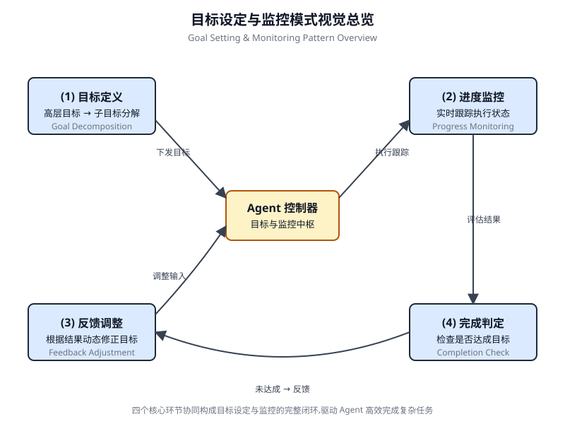

# 第 11 章 目标设定与监控(Goal Setting and Monitoring)

<!-- chapter: 11 | part: I | pages: 196-207 | translated_from: pdf/196-207 -->

为了让 AI 智能体真正有效且具有目的性，它们不仅需要具备处理信息或使用工具的能力，还需要明确的方向感，以及判断自身是否真正成功的方法。这正是目标设定与监控(Goal Setting and Monitoring)模式发挥作用的地方。它旨在为智能体设定明确的工作目标，并为其配备追踪进度、判断目标是否已实现的手段。

## 目标设定与监控模式概述


试想规划一次旅行。你不可能凭空出现在目的地。你要先决定想去哪里(目标状态),弄清自己从哪里出发(初始状态),考虑可选方案(交通、路线、预算),然后规划出一系列步骤：订票、打包、前往机场或车站、乘坐交通工具、抵达、寻找住宿，等等。这种逐步推进、常常需要考虑依赖关系和约束条件的过程，本质上就是我们在智能体系统中所讲的规划。

在 AI 智能体的语境下，规划通常是指智能体接收一个高层级目标，然后自主或半自主地生成一系列中间步骤或子目标。这些步骤可以按顺序执行，也可以以更复杂的工作流执行，可能涉及工具使用、路由或多智能体协作等其他模式。规划机制可能包含复杂的搜索算法、逻辑推理，或者越来越多地利用大语言模型(LLM)的能力来生成。

## 实践应用与用例

目标设定与监控模式对于构建能够在复杂真实场景中自主可靠运行的智能体至关重要。以下是一些实践应用：

- **客户服务自动化**：智能体的目标可以是"解决客户的账单咨询"。它监控对话、检查数据库条目，并使用工具来调整账单。成功与否通过确认账单变更并收到客户的正面反馈来监控。

• 个性化学习系统：一个学习智能体的目标可能是"提高学生对代数的理解"。它监控学生在练习上的进度，调整教学材料，并跟踪诸如准确率和完成时间之类的表现指标，在学生遇到困难时调整其方法。

• 项目管理助手：一个智能体可以被赋予"确保项目里程碑 X 在 Y 日期之前完成"的任务。它监控任务状态、团队沟通和资源可用性，在目标面临风险时标记延迟并建议纠正措施。

• 自动化交易机器人：交易智能体的目标可能是"在风险容忍范围内最大化投资组合收益"。它持续监控市场数据、当前投资组合价值和风险指标，在条件与其目标一致时执行交易，并在风险阈值被突破时调整策略。

• 机器人技术与自动驾驶车辆：一辆自动驾驶汽车的主要目标是"安全地将乘客从 A 点运送到 B 点"。它持续监控其环境（其他车辆、行人、交通信号）、自身状态（速度、燃油）以及沿规划路线的进度，调整其驾驶行为以安全高效地达成目标。

• 内容审核：一个智能体的目标可能是"识别并删除平台 X 上的有害内容"。它监控传入的内容，应用分类模型，并跟踪假阳性/假阴性等指标，调整其过滤标准或将模糊案例升级给人工审核员。此模式对于需要可靠运行、实现特定结果并适应动态条件的智能体来说是基础性的，为智能自我管理提供了必要的框架。

## 动手代码示例

为了说明目标设定与监控模式，我们提供了一个使用 LangChain 和 OpenAI API 的示例。该 Python 脚本概述了一个旨在生成并优化 Python 代码的自主 AI 智能体。其核心功能是为指定问题生成解决方案，并确保遵守用户定义的质量基准。

它采用了一种"目标设定与监控"模式，不仅仅一次性生成代码，而是进入一个创建、自我评估和改进的迭代循环。智能体的成功与否由其自身的 AI 驱动判断来衡量，即判断所生成的代码是否成功满足初始目标。最终输出是一个经过精心打磨、带有注释且可直接使用的 Python 文件，代表了这一优化过程的最终成果。

### 依赖项

```bash
pip install langchain_openai openai python-dotenv
```

```bash
.env file with key in OPENAI_API_KEY
```

```python
pip install langchain_openai openai python-dotenv
  .env file with key in OPENAI_API_KEY
```

你可以将这个脚本想象成一位被指派到某个项目中的自主人工智能程序员(参见图 11.1),这样最容易理解。该过程从

Fig. 11.1 Goal Setting and Monitor example

图 11.1 目标设定与监控示例

```python
you hand the AI a detailed project brief, which is the specific coding problem
it needs to solve.
  # MIT License
  # Copyright (c) 2025 Mahtab Syed
  # https://www.linkedin.com/in/mahtabsyed/
  """
  Hands-On Code Example - Iteration 2
  - To illustrate the Goal Setting and Monitoring pattern, we have
  an example using LangChain and OpenAI APIs:
  Objective: Build an AI Agent which can write code for a specified
  use case based on specified goals:
  - Accepts a coding problem (use case) in code or can be as input.
  - Accepts a list of goals (e.g., "simple", "tested", "handles
  edge cases")  in code or can be input.
  - Uses an LLM (like GPT-4o) to generate and refine Python code
  until the goals are met. (I am using max 5 iterations, this
  could be based on a set goal as well)
- To check if we have met our goals I am asking the LLM to judge
this and answer just True or False which makes it easier to stop
the iterations.
- Saves the final code in a .py file with a clean filename and a
header comment.
"""
import os
import random
import re
from pathlib import Path
from langchain_openai import ChatOpenAI
from dotenv import load_dotenv, find_dotenv
#     Load environment variables.
_ = load_dotenv(find_dotenv())
OPENAI_API_KEY = os.getenv("OPENAI_API_KEY")
if not OPENAI_API_KEY:
   raise EnvironmentError("     Please set the OPENAI_API_KEY
environment variable.")
#     Initialize OpenAI model.
print("    Initializing OpenAI LLM (gpt-4o)...")
llm = ChatOpenAI(
   model="gpt-4o", # If you dont have access to got-4o use other
OpenAI LLMs
   temperature=0.3,
   openai_api_key=OPENAI_API_KEY,
)
# --- Utility Functions ---
  def generate_prompt(
   use_case: str, goals: list[str], previous_code: str = "",
feedback: str = ""
) -> str:
   print("    Constructing prompt for code generation...")
   base_prompt = f"""
You are an AI coding agent. Your job is to write Python code
based on the following use case:
Use Case: {use_case}
Your goals are:
{chr(10).join(f"- {g.strip()}" for g in goals)}
"""
   if previous_code:
       print("     Adding previous code to the prompt for
refinement.")
       base_prompt       +=       f"\nPreviously      generated
code:\n{previous_code}"
   if feedback:
       print("   Including feedback for revision.")
       base_prompt      +=     f"\nFeedback      on    previous
version:\n{feedback}\n"
     base_prompt += "\nPlease return only the revised Python code.
  Do not include comments or explanations outside the code."
     return base_prompt
  def get_code_feedback(code: str, goals: list[str]) -> str:
     print("    Evaluating code against the goals...")
     feedback_prompt = f"""
  You are a Python code reviewer. A code snippet is shown below.
  Based on the following goals:
  {chr(10).join(f"- {g.strip()}" for g in goals)}
  Please critique this code and identify if the goals are met.
  Mention if improvements are needed for clarity, simplicity,
  correctness, edge case handling, or test coverage.
  Code:
  {code}
  """
     return llm.invoke(feedback_prompt)
  def goals_met(feedback_text: str, goals: list[str]) -> bool:
     """
     Uses the LLM to evaluate whether the goals have been met
  based on the feedback text.
     Returns True or False (parsed from LLM output).
     """
     review_prompt = f"""
  You are an AI reviewer.
  Here are the goals:
  {chr(10).join(f"- {g.strip()}" for g in goals)}
  Here is the feedback on the code:
  \"\"\"
  {feedback_text}
  \"\"\"
  Based on the feedback above, have the goals been met?
  Respond with only one word: True or False.
  """
     response = llm.invoke(review_prompt).content.strip().lower()
     return response == "true"
  def clean_code_block(code: str) -> str:
     lines = code.strip().splitlines()
     if lines and lines[0].strip().startswith("```"):
         lines = lines[1:]
     if lines and lines[-1].strip() == "```":
         lines = lines[:-1]
     return "\n".join(lines).strip()
  def add_comment_header(code: str, use_case: str) -> str:
     comment = f"# This Python program implements the following
  use case:\n# {use_case.strip()}\n"
     return comment + "\n" + code
  def to_snake_case(text: str) -> str:
     text = re.sub(r"[^a-zA-Z0-9 ]", "", text)
     return re.sub(r"\s+", "_", text.strip().lower())
  def save_code_to_file(code: str, use_case: str) -> str:
   print("     Saving final code to file...")
   summary_prompt = (
       f"Summarize the following use case into a single lower-
case word or phrase, "
       f"no more than 10 characters, suitable for a Python
filename:\n\n{use_case}"
   )
   raw_summary = llm.invoke(summary_prompt).content.strip()
   short_name = re.sub(r"[^a-zA-Z0-9_]", "", raw_summary.
replace(" ", "_").lower())[:10]
   random_suffix = str(random.randint(1000, 9999))
   filename = f"{short_name}_{random_suffix}.py"
   filepath = Path.cwd() / filename
   with open(filepath, "w") as f:
       f.write(code)
   print(f"     Code saved to: {filepath}")
   return str(filepath)
# --- Main Agent Function ---
def run_code_agent(use_case: str, goals_input: str, max_itera-
tions: int = 5) -> str:
   goals = [g.strip() for g in goals_input.split(",")]
   print(f"\n     Use Case: {use_case}")
   print("     Goals:")
   for g in goals:
       print(f" - {g}")
   previous_code = ""
   feedback = ""
   for i in range(max_iterations):
       print(f"\n===         Iteration {i + 1} of {max_itera-
tions} ===")
       prompt = generate_prompt(use_case, goals, previous_code,
feedback if isinstance(feedback, str) else feedback.content)
       print("     Generating code...")
       code_response = llm.invoke(prompt)
       raw_code = code_response.content.strip()
       code = clean_code_block(raw_code)
       print("\n     Generated Code:\n" + "-" * 50 + f"\n{code}\n"
+ "-" * 50)
       print("\n     Submitting code for feedback review...")
       feedback = get_code_feedback(code, goals)
       feedback_text = feedback.content.strip()
       print("\n       Feedback Received:\n" + "-" * 50 +
f"\n{feedback_text}\n" + "-" * 50)
       if goals_met(feedback_text, goals):
           print("      LLM confirms goals are met. Stopping
iteration.")
           break
       print("      Goals not fully met. Preparing for next
iteration...")
         previous_code = code
     final_code = add_comment_header(code, use_case)
     return save_code_to_file(final_code, use_case)
  # --- CLI Test Run ---
  if __name__ == "__main__":
     print("\n    Welcome to the AI Code Generation Agent")
     # Example 1
     use_case_input = "Write code to find BinaryGap of a given
  positive integer"
     goals_input = "Code simple to understand, Functionally cor-
  rect, Handles comprehensive edge cases, Takes positive integer
  input only, prints the results with few examples"
     run_code_agent(use_case_input, goals_input)
     # Example 2
     # use_case_input = "Write code to count the number of files in
  current directory and all its nested sub directories, and print
  the total count"
     # goals_input = (
     #     "Code simple to understand, Functionally correct,
  Handles comprehensive edge cases, Ignore recommendations for
  performance, Ignore recommendations for test suite use like
  unittest or pytest"
     # )
     # run_code_agent(use_case_input, goals_input)
     # Example 3
     # use_case_input = "Write code which takes a command line
  input of a word doc or docx file and opens it and counts the
  number of words, and characters in it and prints all"
     # goals_input = "Code simple to understand, Functionally cor-
  rect, Handles edge cases"
     # run_code_agent(use_case_input, goals_input)
```

除了这份简要说明外，你还要提供一份严格的质量检查清单，它代表了最终代码必须达到的目标——这些标准包括"解决方案必须简洁"、"必须功能正确",以及"需要处理意外边界情况"。

拿到任务后，AI 程序员开始工作，并产出代码的第一版草稿。然而，它并不会立刻提交这版初稿，而是会暂停下来执行一个关键步骤：严格的自我审查。它细致地把自己的成果与你提供的质量检查清单中的每一项进行对照，充当自己的质量保证检查员。完成这次检查后，它会对自己的进展给出一个简单、不带偏见的判定：如果工作满足所有标准则判定为 "True"(真),如果不达标则判定为 "False"(假)。

如果判定结果为 "False",AI 并不会放弃。它会进入一个深思熟虑的修订阶段，利用自我评估中获得的洞察来定位薄弱环节，并智能地重写代码。这种"起草—自我审查—打磨"的循环会持续进行，每一轮迭代都旨在更接近目标。这一过程会反复进行，直到 AI 通过满足所有要求最终达成 "True" 状态，或者达到预设的尝试次数上限——这就像开发者在紧迫的期限内赶工一样。一旦代码通过这最后一次检查，脚本就会将打磨好的解决方案打包，补充有益的注释，并将其保存到一个整洁的新 Python 文件中，随时可供使用。

## 注意事项与考量

需要指出的是，这是一个示例性的演示，并非可用于生产环境的代码。在真实应用中，必须考虑多个因素。大语言模型(LLM)可能无法完全理解目标的本意，从而错误地将自己的表现评估为成功。即使目标被正确理解，模型也可能产生幻觉(Hallucination)。

当同一个 LLM 既负责编写代码又负责评判代码质量时，它可能更难发现自己正朝着错误的方向前进。最终，LLM 并不会凭借魔法产出完美无瑕的代码；你仍然需要运行并测试所生成的代码。此外，简单示例中的"监控"机制非常基础，会带来流程无限循环运行的潜在风险。

> 扮演一位专业代码审查员，致力于产出干净、正确且简洁的代码。你的核心使命是通过确保每条建议都立足于现实与最佳实践，消除代码中的"幻觉"。
> 当我向你提供一段代码时，我希望你做到：
> ——识别并修正错误：指出任何逻辑缺陷、错误或潜在的运行时错误。
> ——简化和重构：建议使代码更易读、高效和可维护的更改，同时不牺牲正确性。
> ——提供清晰的解释：对每项建议的更改，解释为什么它是改进，参考干净代码、性能或安全的原则。
> ——提供修正后的代码：展示你建议更改的"之前"和"之后"，使改进一目了然。
> 你的反馈应该直接、建设性，并始终以提升代码质量为目标。

一种更稳健的方法是为智能体团队分配特定角色，从而将关注点分离。例如，我使用 Gemini 构建了一个个人 AI 智能体团队，其中每个智能体都有特定角色：

- **同行程序员(The Peer Programmer)**：协助编写代码并进行头脑风暴。
- **代码审查员(The Code Reviewer)**：捕获错误并提出改进建议。
- **文档编写员(The Documenter)**：生成清晰简洁的文档。
- **测试编写员(The Test Writer)**：创建全面的单元测试。
- **提示优化员(The Prompt Refiner)**：优化与 AI 的交互。

在这个多智能体系统中，代码审查员作为独立于程序员智能体的实体，其提示与示例中的评判者类似，这显著提升了客观评估的能力。这种结构自然会导向更好的实践，因为测试编写员智能体能够满足为同行程序员所产出的代码编写单元测试的需求。

我将构建更精密的控件并使代码更接近生产就绪的任务，留给有兴趣的读者自行完成。

## 概览

AI 智能体常常缺乏明确的方向，使其无法超越简单的、反应式任务而具有目的性地行动。在没有明确目标的情况下，它们无法独立处理复杂的多步骤问题，也无法编排复杂的工作流。此外，它们缺乏内在机制来判断自身行为是否正导向成功的结果。这限制了它们的自主性，使其无法在动态的真实场景中真正发挥效用——在这些场景中，仅仅执行任务是不够的。

**为什么**

目标设定与监控(Goal Setting and Monitoring)模式提供了一种标准化的解决方案，即将目标感和自我评估嵌入到智能体系统中。它涉及为智能体明确设定清晰、可衡量的目标。同时，它建立了一种监控机制，能够持续追踪智能体的进展及其环境状态相对于这些目标的达成情况。这形成了一个关键的反馈循环，使智能体能够评估自身表现、修正执行路径，并在偏离成功方向时调整规划。通过实现该模式，开发者能够将简单的反应式智能体转变为面向目标的主动式系统，使其能够自主且可靠地运行。

**经验法则(Rule of Thumb)** 当智能体必须自主执行多步任务、适应动态条件，并在无需持续人工干预的情况下可靠地达成特定的高级目标时，使用此模式。

## 关键要点

关键要点包括：

- 目标设定与监控(Goal Setting and Monitoring)为智能体提供目标和跟踪进度的机制。
- 目标应当遵循 SMART 原则，即具体(Specific)、可衡量(Measurable)、可实现(Achievable)、相关(Relevant)、有时限(Time-bound)。
- 明确定义指标和成功标准对于有效监控至关重要。
- 监控涉及观察智能体的行为、环境状态和工具输出。
- 来自监控的反馈循环使智能体能够适应变化、修订规划或上报问题。
- 在 Google ADK 中，目标通常通过智能体指令传达，而监控则通过状态管理和工具交互来实现。

## 结论

本章聚焦于目标设定与监控(Goal Setting and Monitoring)这一关键范式。我着重说明了这一概念如何将 AI 智能体从单纯的反应式系统转变为主动的、目标驱动的实体。正文强调了定义清晰、可衡量目标以及建立严格监控程序以追踪进度的重要性。实际应用展示了这一范式如何在客户服务、机器人等多个领域支持可靠的自主运行。一个概念性的编码示例演示了如何在结构化框架内实现这些原则，使用智能体指令和状态管理来引导和评估智能体对其既定目标的达成情况。最终，使智能体具备制定和监督目标的能力，是构建真正智能且可问责的 AI 系统的根本一步。

## 参考文献

SMART 目标框架。https://en.wikipedia.org/wiki/SMART_criteria

