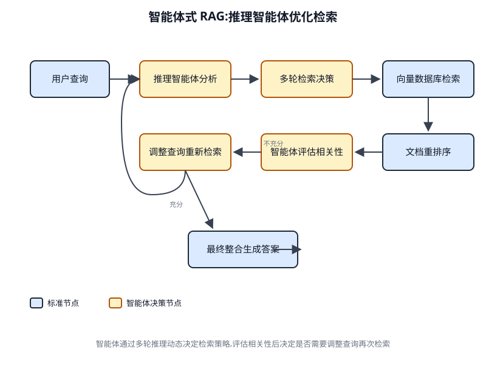

# 第 14 章 知识检索(RAG)(Knowledge Retrieval (RAG))

<!-- chapter: 14 | part: I | pages: 225-240 | translated_from: pdf/225-240 -->

LLM 在生成类人文本方面表现出强大的能力。然而，它们的知识库通常局限于训练时所使用的数据，这限制了对实时信息、特定公司数据或高度专业化细节的访问。知识检索(RAG,即检索增强生成)解决了这一局限。RAG 使 LLM 能够访问并整合外部的、当前的以及上下文相关的信息，从而提升其输出的准确性、相关性和事实依据。

对于人工智能智能体(AI Agent)而言，这一点至关重要，因为它允许智能体将其行为和响应建立在静态训练之外的、可实时验证的数据之上。这一能力使智能体能够准确执行复杂任务，例如访问最新的公司政策以回答特定问题，或在下单前查询当前库存。通过整合外部知识，RAG 将智能体从简单的对话者转变为有效的数据驱动工具，能够执行有意义的工作。

## 知识检索(RAG)模式概述


知识检索(RAG)模式通过允许大语言模型(LLM)在生成响应之前访问外部知识库，显著增强了它们的能力。RAG 不再仅仅依赖模型内部预训练的知识，而是让 LLM 能够"查阅"信息，就像人类查阅书籍或搜索互联网一样。这一过程使 LLM 能够提供更准确、最新的且可验证的回答。

图 14.1 RAG 核心概念：分块、嵌入与向量数据库

## 嵌入

在大语言模型(LLM)的语境下，嵌入是文本(如词语、短语或整个文档)的数值表示。这些表示采用向量的形式，即一个数字列表。其核心思想是在数学空间中捕捉不同文本片段之间的语义含义与关系。语义相近的词语或短语在该向量空间中的嵌入会彼此更接近。例如，想象一个简单的二维图。"cat"一词可能由坐标 (2, 3) 表示，而 "kitten" 则会非常接近 (2.1, 3.1)。相比之下，"car" 一词则会出现在较远的坐标位置，如 (8, 1),以反映其不同的含义。实际上，这些嵌入存在于维数高得多的空间中，可达数百甚至数千维，从而能够对语言进行非常细致的理解。

## 文本相似度

文本相似度指的是衡量两段文本彼此相似程度的指标。这种相似度可以停留在表面层面，考察词语的重叠程度(词汇相似度),也可以深入到基于含义的层面。在 RAG 的语境下，文本相似度对于在知识库中找到与用户查询对应的最相关信息至关重要。例如，考虑以下两个句子："What is the capital of France?" 与 "Which city is the capital of France?"。尽管措辞不同，它们问的是同一个问题。一个优秀的文本相似度模型能够识别这一点，并为这两个句子赋予较高的相似度分数，即便它们共享的词语很少。这种相似度通常借助文本的嵌入来计算。

## 语义相似度与语义距离

语义相似度是文本相似度的一种更高级形式，它纯粹聚焦于文本的含义与上下文，而非仅仅关注所使用的词语。其目标是理解两段文本是否传达了相同的概念或思想。

语义距离则是语义相似度的反向度量；语义相似度高意味着语义距离低，反之亦然。在 RAG 中，语义搜索依赖于找到与用户查询语义距离最小的文档。例如，"a furry feline companion"与"a domestic cat"这两个短语除了冠词"a"之外没有任何共同的词汇。然而，一个理解语义相似度的模型会认识到它们指的是同一事物，并认为它们高度相似。这是因为它们的嵌入在向量空间中会非常接近，表明语义距离很小。这正是所谓的"智能搜索",它使 RAG 能够在用户措辞与知识库中的文本不完全匹配时，也能找到相关信息。

## 文档分块(Chunking of Documents)

分块是将大型文档拆分为更小、更易管理的片段(即"块")的过程。为了使 RAG 系统高效运作，不能将整个大型文档直接送入大语言模型(LLM),而是需要处理这些较小的块。文档的分块方式对于保留信息的上下文和语义至关重要。例如，对于一本 50 页的用户手册，分块策略可能不是将其视为单一文本块，而是将其拆分为章节、段落，甚至句子。具体而言，"故障排除"部分会作为一个独立的块，与"安装指南"分开。当用户提出关于特定问题的疑问时，RAG 系统能够检索到最相关的故障排除块，而不是整本手册。这使得检索过程更快，并且提供给大语言模型的信息更加聚焦，更契合用户的即时需求。一旦文档被分块，RAG 系统必须采用一种检索技术来为给定查询找到最相关的片段。主要方法是向量搜索，它利用嵌入和语义距离来找到与用户问题在概念上相似的块。

一种较旧但仍有价值的技术是 BM25，这是一种基于关键词的算法，根据词频对文本块进行排序，而不理解语义含义。为了兼得两者之长，混合检索方法经常被使用，将 BM25 的关键词精度与语义检索的上下文理解相结合。这种融合使得检索更加稳健准确，能够同时捕获字面匹配和概念相关性。

## 向量数据库

向量数据库是一种专门设计的数据库类型，用于高效地存储和查询嵌入(Embedding)。文档经过分块并转换为嵌入后，这些高维向量会被存储在向量数据库中。传统检索技术（如基于关键词的检索）擅长查找包含查询中确切词语的文档，但缺乏对语言的深层理解。它们无法识别"furry feline companion"的意思是"cat"。这正是向量数据库的擅长之处。它们专为语义检索而构建。通过将文本存储为数值向量，它们能够基于概念含义而非仅仅关键词重叠来查找结果。当用户的查询也被转换为向量时，数据库使用高度优化的算法（如 HNSW——分层导航小世界算法，Hierarchical Navigable Small World）来快速搜索数百万个向量，并找到在含义上"最接近"的向量。这种方法对检索增强生成(RAG)而言远为优越，因为它能够发现相关上下文，即便用户的措辞与源文档完全不同。本质上，其他技术在搜索词语，而向量数据库在搜索含义。这项技术以多种形式实现，从 Pinecone 和 Weaviate 等托管数据库，到 Chroma DB、Milvus 和 Qdrant 等开源解决方案。甚至现有数据库也可以通过增加向量检索能力来增强，如 Redis、Elasticsearch 和 Postgres（使用 pgvector 扩展）。

核心检索机制通常由 Meta AI 的 FAISS 或 Google Research 的 ScaNN 等库提供支持，这些库对这些系统的效率至关重要。

## RAG 的挑战

尽管功能强大，RAG 模式并非没有挑战。当回答查询所需的信息并不局限于单个文本块(Chunk),而是分散在文档的多个部分甚至多个文档中时，一个主要问题便随之出现。在这种情况下，检索器可能无法收集到所有必要的上下文，从而导致回答不完整或不准确。系统的有效性还在很大程度上依赖于分块(Chunking)和检索过程的质量；如果检索到的文本块不相关，就可能引入噪声并干扰大语言模型。此外，有效地综合来自潜在相互矛盾来源的信息，仍然是这些系统面临的重要障碍。除此之外，另一个挑战在于 RAG 要求对整个知识库进行预处理，并将其存储在专门的数据库(如向量数据库或图数据库)中，这是一项相当庞大的工程。因此，这些知识需要定期协调以保持最新状态，在处理像公司 Wiki 这样不断演变的来源时，这是一项至关重要的任务。整个过程可能会对性能产生显著影响，增加延迟、运营成本以及最终提示中所使用的 Token 数量。

总之，检索增强生成(Retrieval-Augmented Generation, RAG)模式代表着让 AI 变得更加博学可靠的一次重大飞跃。通过将外部知识检索步骤无缝集成到生成过程中，RAG 解决了独立 LLM 的一些核心局限性。嵌入(Embedding)和语义相似性的基础概念，结合关键词和混合搜索等检索技术，使系统能够智能地找到相关信息，而这通过策略性的分块得以实现。

这一完整的检索过程由专门的向量数据库支撑，这些数据库被设计用于存储并高效查询规模达数百万级别的嵌入。尽管在检索片段化或相互矛盾信息方面仍然存在挑战，但检索增强生成(RAG)能够赋能大语言模型，使其产出的答案不仅在语境上恰当，而且根植于可验证的事实，从而在 AI 系统中建立更高的信任度与实用性。

## Graph RAG

GraphRAG 是检索增强生成的一种高级形式，它利用知识图谱而非简单的向量数据库来进行信息检索。它通过在结构化知识库中导航数据实体(节点)之间的显式关系(边)来回答复杂查询。其一项关键优势在于能够从分散于多份文档中的信息综合出答案——而这正是传统 RAG 的常见缺陷。通过理解这些关联，GraphRAG 能够提供在语境上更准确、更具细微差别的响应。

应用场景包括：将公司与市场事件相关联的复杂财务分析，以及用于发现基因与疾病之间关系的科学研究。然而，其主要缺点在于构建和维护高质量知识图谱所需的大量复杂性、成本与专业知识。这种方案灵活性也较差，并且相比更简单的向量检索系统可能引入更高的延迟。系统的有效性完全依赖于底层图谱结构的质量与完备性。因此，GraphRAG 在处理错综复杂的问题时能够提供卓越的语境推理能力，但代价是远高于普通方案的实施与维护成本。综上，GraphRAG 适用于深度互联洞察比标准 RAG 的速度与简易性更为关键的场景。

## 智能体式 RAG

该模式的一种演进形式，即所谓的智能体式 RAG(Agentic RAG,见图 14.2),引入了一个推理与决策层，以显著提升信息提取的可靠性。

**图 14.2 智能体式 RAG 引入了智能体推理机制，而不仅仅是检索与增强：它能够主动评估、调和并精炼检索到的信息，从而确保最终响应更加准确且值得信赖。**

Fig. 14.2 智能体式 RAG 引入一个推理智能体(Reasoning Agent),主动评估、协调并精炼检索到的信息，从而确保最终响应更加准确且值得信赖

一个"智能体"(Agent)——一种专门的 AI 组件——充当知识的关键把关者与精炼者。该智能体不是被动地接受初始检索到的数据，而是主动审视其质量、相关性与完整性，如下图所示场景所示。首先，智能体擅长反思(Reflection)与来源验证。如果用户问："我们公司关于远程办公的政策是什么？"标准 RAG 可能会同时检索到一篇 2020 年的博客文章和官方的 2025 年政策文件。然而，智能体会分析这些文档的元数据，识别出 2025 年的政策为最新且最具权威性的来源，并在将正确上下文发送给 LLM 以获得精确答案之前，丢弃过时的博客文章。其次，智能体善于协调知识冲突。设想一位财务分析师询问："Project Alpha 第一季度的预算是多少？"系统检索到两份文档：一份初步提案声明预算为 €50,000,一份最终财务报告将其列为 €65,000。智能体式 RAG 会识别这种矛盾，优先将财务报告视为更可靠的来源，并向 LLM 提供经验证的数字，确保最终答案基于最准确的数据。第三，智能体能够执行多步推理(Multi-step Reasoning),以综合得出复杂答案。如果用户问："我们产品的功能和定价与竞争对手 X 的相比如何？"智能体会将其分解为多个独立的子查询。它会针对自家产品的功能、自家产品的定价、竞争对手 X 的功能以及竞争对手 X 的定价分别发起检索。在收集到这些独立的信息片段后，智能体会将它们综合成结构化的、可比较的上下文，然后再交给 LLM,从而实现简单的检索无法生成的全面响应。第四，智能体能够识别知识空白并使用外部工具。

假设用户提问："昨天我们的新产品发布后，市场的即时反应是什么？"智能体在内部知识库(每周更新一次)中进行检索，未发现相关信息。识别到这一缺口后，它能够激活某个工具——例如实时网络搜索 API——来获取最新新闻报道和社交媒体舆情。随后，智能体利用这些刚刚收集到的外部信息，提供即时的回答，从而克服了静态内部数据库的局限性。

## 智能体式 RAG 的挑战

虽然功能强大，但智能体层本身也带来了一系列挑战。其主要缺点是复杂性和成本的显著增加。设计、实现和维护智能体的决策逻辑与工具集成需要大量的工程投入，并增加了计算开销。这种复杂性还会导致延迟增加，因为智能体的反思、工具使用和多步推理循环所需的时间要长于标准的直接检索流程。此外，智能体本身可能成为新的错误来源；有缺陷的推理过程可能导致其陷入无用的循环、误解任务，或不当地丢弃相关信息，最终降低最终回答的质量。

## 小结

智能体式 RAG(Agentic RAG)代表了标准检索模式的成熟演进，将其从一个被动的数据管道转变为主动的、解决问题的框架。通过嵌入一个能够评估来源、协调冲突、分解复杂问题并使用外部工具的推理层，智能体显著提高了生成答案的可靠性和深度。这一进步使 AI 更加值得信赖且能力更强，但它也带来了系统复杂性、延迟和成本方面的重要权衡，这些必须谨慎管理。

## 实际应用与使用场景

知识检索(Retrieval-Augmented Generation,RAG)正在改变大语言模型(Large Language Models,LLMs)在各个行业中的应用方式，增强了它们提供更准确且具有上下文相关性响应的能力。

应用场景包括：

- **企业搜索与问答**:组织可以开发内部聊天机器人，使用内部文档(如人力资源政策、技术手册和产品规格)来回答员工的咨询。检索增强生成(RAG)系统从这些文档中提取相关段落，以告知大语言模型的响应。
- **客户支持与帮助台**:基于检索增强生成(RAG)的系统能够通过访问产品手册、常见问题解答(FAQs)和支持工单中的信息，为客户查询提供准确且一致的响应。这可以减少日常问题对人工直接干预的需求。
- **个性化内容推荐**:与基本的关键词匹配不同，检索增强生成(RAG)能够识别并检索与用户偏好或过往交互在语义上相关的内容(文章、产品),从而实现更相关的推荐。
- **新闻与时事摘要**:大语言模型可以与实时新闻源集成。当用户就某一时事进行提问时，检索增强生成(RAG)系统会检索最近的新闻文章，使大语言模型能够生成最新的摘要。

通过整合外部知识，检索增强生成(RAG)将大语言模型的能力从简单的交流拓展为可作为知识处理系统运行的工具。

## 实践代码示例(Google ADK)

为了说明知识检索(RAG)模式，我们来看三个示例。首先，是如何使用 Google Search 来执行 RAG 并将大语言模型(LLM)的回答基于搜索结果。由于 RAG 涉及访问外部信息，Google Search 工具就是一个内置检索机制的直接示例，它能够增强 LLM 的知识。

```python
from google.adk.tools import google_search
from google.adk.agents import Agent

search_agent = Agent(
    name="research_assistant",
    model="gemini-2.0-flash-exp",
    instruction="You help users research topics. When asked, use the Google Search tool",
    tools=[google_search]
)
```

```python
Second, this section explains how to utilize Vertex AI RAG capabilities
within the Google ADK. The code provided demonstrates the initialization of
VertexAiRagMemoryService from the ADK. This allows for establishing a
connection to a Google Cloud Vertex AI RAG Corpus. The service is config-
ured by specifying the corpus resource name and optional parameters such as
SIMILARITY_TOP_K and VECTOR_DISTANCE_THRESHOLD. These
parameters influence the retrieval process. SIMILARITY_TOP_K defines the
number of top similar results to be retrieved. VECTOR_DISTANCE_
THRESHOLD sets a limit on the semantic distance for the retrieved results.
This setup enables agents to perform scalable and persistent semantic knowl-
edge retrieval from the designated RAG Corpus. The process effectively inte-
grates Google Cloud’s RAG functionalities into an ADK agent, thereby
supporting the development of responses grounded in factual data.
  # Import the necessary VertexAiRagMemoryService class from the
  google.adk.memory module.
  from google.adk.memory import VertexAiRagMemoryService
  RAG_CORPUS_RESOURCE_NAME = "projects/your-gcp-  project-
                                                           id/loca-
  tions/us-central1/ragCorpora/your-corpus-id"
  # Define an optional parameter for the number of top similar
  results to retrieve.
  # This controls how many relevant document chunks the RAG ser-
  vice will return.
  SIMILARITY_TOP_K = 5
  # Define an optional parameter for the vector distance threshold.
  # This threshold determines the maximum semantic distance
  allowed for retrieved results;
  # results with a distance greater than this value might be fil-
  tered out.
  VECTOR_DISTANCE_THRESHOLD = 0.7
  # Initialize an instance of VertexAiRagMemoryService.
  # This sets up the connection to your Vertex AI RAG Corpus.
  # - rag_corpus: Specifies the unique identifier for your RAG Corpus.
  # - similarity_top_k: Sets the maximum number of similar results
  to fetch.
  # - vector_distance_threshold: Defines the similarity threshold
  for filtering results.
  memory_service = VertexAiRagMemoryService(
     rag_corpus=RAG_CORPUS_RESOURCE_NAME,
     similarity_top_k=SIMILARITY_TOP_K,
     vector_distance_threshold=VECTOR_DISTANCE_THRESHOLD
  )
```

## 动手实践代码示例(LangChain)

第三，让我们通过 LangChain 走完一个完整的示例。

```python
import os
  import requests
  from typing import List, Dict, Any, TypedDict
  from langchain_community.document_loaders import TextLoader
  from langchain_core.documents import Document
  from langchain_core.prompts import ChatPromptTemplate
  from langchain_core.output_parsers import StrOutputParser
  from langchain_community.embeddings import OpenAIEmbeddings
  from langchain_community.vectorstores import Weaviate
  from langchain_openai import ChatOpenAI
  from langchain.text_splitter import CharacterTextSplitter
  from langchain.schema.runnable import RunnablePassthrough
  from langgraph.graph import StateGraph, END
  import weaviate
  from weaviate.embedded import EmbeddedOptions
  import dotenv
  # Load environment variables (e.g., OPENAI_API_KEY)
  dotenv.load_dotenv()
  # Set your OpenAI API key (ensure it's loaded from .env or
  set here)
  # os.environ["OPENAI_API_KEY"] = "YOUR_OPENAI_API_KEY"
  # --- 1. Data Preparation (Preprocessing) ---
  # Load data
  url = "https://github.com/langchain-ai/langchain/blob/master/
  docs/docs/how_to/state_of_the_union.txt"
  res = requests.get(url)
  with open("state_of_the_union.txt", "w") as f:
     f.write(res.text)
  loader = TextLoader('./state_of_the_union.txt')
  documents = loader.load()
  # Chunk documents
  text_splitter       =     CharacterTextSplitter(chunk_size=500,
  chunk_overlap=50)
  chunks = text_splitter.split_documents(documents)
  # Embed and store chunks in Weaviate
  client = weaviate.Client(
     embedded_options = EmbeddedOptions()
  )
  vectorstore = Weaviate.from_documents(
     client = client,
     documents = chunks,
     embedding = OpenAIEmbeddings(),
     by_text = False
  )
  # Define the retriever
  retriever = vectorstore.as_retriever()
  # Initialize LLM
  llm = ChatOpenAI(model_name="gpt-3.5-turbo", temperature=0)
  # --- 2. Define the State for LangGraph ---
  class RAGGraphState(TypedDict):
     question: str
     documents: List[Document]
     generation: str
  # --- 3. Define the Nodes (Functions) ---
  def     retrieve_documents_node(state:     RAGGraphState)    ->
  RAGGraphState:
     """Retrieves documents based on the user's question."""
     question = state["question"]
     documents = retriever.invoke(question)
     return   {"documents":   documents,  "question":   question,
  "generation": ""}
  def      generate_response_node(state:    RAGGraphState)     ->
  RAGGraphState:
     """Generates a response using the LLM based on retrieved
  documents."""
     question = state["question"]
     documents = state["documents"]
     # Prompt template from the PDF
     template = """You are an assistant for question-answering
  tasks.
  Use the following pieces of retrieved context to answer the
  question.
  If you don't know the answer, just say that you don't know.
  Use three sentences maximum and keep the answer concise.
  Question: {question}
  Context: {context}
  Answer:
  """
     prompt = ChatPromptTemplate.from_template(template)
     # Format the context from the documents
     context    =  "\n\n".join([doc.page_content    for   doc   in
  documents])
     # Create the RAG chain
     rag_chain = prompt | llm | StrOutputParser()
     # Invoke the chain
     generation     =    rag_chain.invoke({"context":     context,
  "question": question})
     return   {"question":   question,   "documents":   documents,
  "generation": generation}
  # --- 4. Build the LangGraph Graph ---
  workflow = StateGraph(RAGGraphState)
  # Add nodes
  workflow.add_node("retrieve", retrieve_documents_node)
  workflow.add_node("generate", generate_response_node)
  # Set the entry point
  workflow.set_entry_point("retrieve")
  # Add edges (transitions)
  workflow.add_edge("retrieve", "generate")
  workflow.add_edge("generate", END)
  # Compile the graph
  app = workflow.compile()
  # --- 5. Run the RAG Application ---
  if __name__ == "__main__":
     print("\n--- Running RAG Query ---")
     query = "What did the president say about Justice Breyer"
     inputs = {"question": query}
     for s in app.stream(inputs):
         print(s)
     print("\n--- Running another RAG Query ---")
     query_2 = "What did the president say about the economy?"
     inputs_2 = {"question": query_2}
     for s in app.stream(inputs_2):
         print(s)
```

这段 Python 代码演示了使用 LangChain 和 LangGraph 实现的检索增强生成(RAG)流水线。该过程首先从一个文本文档构建知识库，将文档分割成块并转换为嵌入。这些嵌入随后被存储到 Weaviate 向量数据库中，以实现高效的信息检索。LangGraph 中的 StateGraph 用于管理工作流中两个关键函数之间的流转：`retrieve_documents_node` 和 `generate_response_node`。`retrieve_documents_node` 函数根据用户输入查询向量数据库，以识别相关的文档块。随后，`generate_response_node` 函数利用检索到的信息和预定义的提示模板，通过 OpenAI 大语言模型(LLM)生成响应。`app.stream` 方法支持通过该 RAG 流水线执行查询，展示了系统生成上下文相关输出的能力。

## 速览

What: 大语言模型(LLM)拥有出色的文本生成能力，但从根本上受限于其训练数据。这种知识是静态的，意味着它不包含实时信息或私有的、特定领域的数据。因此，它们的回答可能过时、不准确，或缺乏专业任务所需的特定上下文。这一差距限制了它们在对当前且基于事实的回答有要求的应用中的可靠性。

检索增强生成(RAG)模式提供了一种标准化的解决方案，将大语言模型(LLM)与外部知识源连接起来。当接收到查询时，系统首先从指定的知识库中检索相关的信息片段。然后，这些片段被追加到原始提示中，为其补充及时且具体的上下文。这个经过增强的提示随后被发送给大语言模型，使其能够生成准确、可验证且基于外部数据的回应。该过程有效地将大语言模型从一个闭卷推理者转变为一个开卷推理者，显著提升了其实用性与可信度。

> **经验法则** 在需要让大语言模型(LLM)基于其原始训练数据之外的、特定的、最新的或专有信息来回答问题或生成内容时，可以使用此模式。它非常适合用于在内部文档之上构建问答系统、客服机器人，以及需要提供可验证、基于事实且附带引用的回答的应用。

**可视化总结(图 14.3)**

图 14.3 知识检索模式：智能体根据用户查询从公共互联网中查找并整合信息

## 关键要点

- 知识检索(Knowledge Retrieval,RAG)通过允许大语言模型(LLM)访问外部的、最新的、特定的信息，从而增强其能力。
- 该过程包括检索(在知识库中搜索相关片段)和增强(将这些片段添加到 LLM 的提示中)。
- RAG 帮助 LLM 克服训练数据过时等局限，减少"幻觉",并支持特定领域知识的集成。
- RAG 能够提供可溯源的答案，因为 LLM 的响应是基于检索到的来源生成的。
- GraphRAG 利用知识图谱来理解不同信息之间的关系，从而能够回答需要从多个来源综合数据的复杂问题。
- 智能体式 RAG(Agentic RAG)超越了简单的信息检索，它使用智能智能体主动地对外部知识进行推理、验证和优化，从而确保更准确、更可靠的答案。
- 实际应用涵盖企业搜索、客户支持、法律研究和个性化推荐等场景。

## 结论

总之，检索增强生成(Retrieval-Augmented Generation,RAG)通过将大语言模型与大语言模型与外部、最新的数据源相连接，解决了其静态知识的核心局限。该过程的工作原理是首先检索相关的信息片段，然后增强用户的提示，从而使 LLM 能够生成更准确且具有上下文感知能力的响应。这一切得益于嵌入(Embedding)、语义搜索和向量数据库(Vector Database)等基础技术，它们能够基于语义而非仅仅是关键词来查找信息。通过将输出建立在可验证的数据之上，RAG 显著减少了事实性错误，并允许使用专有信息，通过引用增强了可信度。作为一种高级演进形式，智能体式 RAG 引入了一个推理层，主动地验证、协调和综合检索到的知识，以实现更高的可靠性。

类似地，像 GraphRAG 这样的专门方法利用知识图谱来导航显式的数据关系，使系统能够综合回答高度复杂且相互关联的查询。该智能体能够解决相互冲突的信息、执行多步查询，并使用外部工具查找缺失数据。虽然这些高级方法增加了复杂度和延迟，但它们显著提升了最终响应的深度和可信度。这些模式的实际应用已经在改变各行各业，从企业搜索和客户支持到个性化内容推荐。尽管面临挑战，检索增强生成(RAG)依然是使 AI 更加知识渊博、可靠和实用的关键模式。最终，它将大语言模型从封闭式的对话者转变为强大的开放式推理工具。

## 参考文献

Google AI for Developers Documentation. Retrieval Augmented Generation - https://cloud.google.com/vertex-ai/generative-ai/docs/rag-engine/rag-overview

Google Cloud Vertex AI RAG Corpus https://cloud.google.com/vertex-ai/generative-ai/docs/rag-engine/manage-your-rag-corpus#corpus-management

LangChain and LangGraph: Leonie Monigatti, "Retrieval-Augmented Generation (RAG): From Theory to LangChain Implementation," https://medium.com/data-science/retrieval-augmented-generation-rag-from-theory-to-langchain-implementation-4e9bd5f6a4f2

Lewis, P., et al. (2020). Retrieval-Augmented Generation for Knowledge-Intensive NLP Tasks. https://arxiv.org/abs/2005.11401

Retrieval-Augmented Generation with Graphs (GraphRAG), https://arxiv.org/abs/2501.00309

