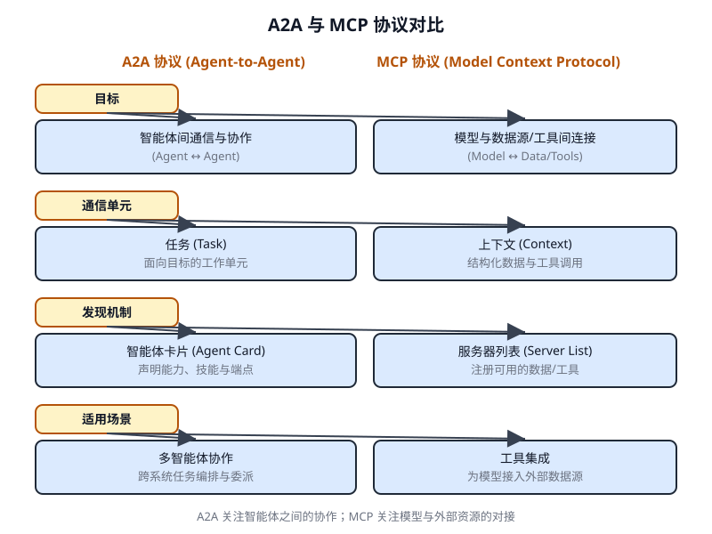

# 第 15 章 智能体间通信(A2A)(Inter-Agent Communication (A2A))

<!-- chapter: 15 | part: I | pages: 241-255 | translated_from: pdf/241-255 -->

单个智能体在处理复杂的多面性问题时常常面临局限，即便具备先进能力也是如此。为了克服这一点，智能体间通信(Inter-Agent Communication, A2A)使不同的智能体能够有效协作，这些智能体可能基于不同框架构建。这种协作涉及无缝的协调、任务委派与信息交换。

Google 的 A2A 协议是一个开放标准，旨在促进这种通用通信。本章将探讨 A2A、其实践应用，以及在 Google ADK 中的实现方式。

## 智能体间通信模式概述

智能体到智能体(Agent2Agent, A2A)协议是一项开放标准，旨在实现不同 AI 智能体框架之间的通信与协作。它确保了互操作性，使得使用 LangGraph、CrewAI 或 Google ADK 等技术开发的 AI 智能体能够协同工作，无论其来源或框架差异如何。

A2A 得到了众多技术公司与服务提供商的支持，包括 Atlassian、Box、LangChain、MongoDB、Salesforce、SAP 和 ServiceNow。Microsoft 规划将 A2A 集成到 Azure AI Foundry 和 Copilot Studio 中，以体现其对开放协议的承诺。此外，Auth0 和 SAP 正在将其平台与智能体集成 A2A 支持。

作为开源协议，A2A 欢迎社区贡献，以推动其演进与广泛采用。

```json
"defaultInputModes": [
  "text"
],
"defaultOutputModes": [
  "text"
],
"skills": [
  {
    "id": "get_current_weather",
    "name": "Get Current Weather",
    "description": "Retrieve real-time weather for any location.",
    "inputModes": [
      "text"
    ],
    "outputModes": [
      "text"
    ],
    "examples": [
      "What's the weather in Paris?",
      "Current conditions in Tokyo"
    ],
    "tags": [
      "weather",
      "current",
      "real-time"
    ]
  },
  {
    "id": "get_forecast",
    "name": "Get Forecast",
    "description": "Get 5-day weather predictions.",
    "inputModes": [
      "text"
    ],
    "outputModes": [
      "text"
    ],
    "examples": [
      "5-day forecast for New York",
      "Will it rain in London this weekend?"
    ],
    "tags": [
      "weather",
      "forecast",
      "prediction"
    ]
  }
]
}
```

**智能体发现** 它允许客户端查找智能体卡片(Agent Cards),智能体卡片描述了可用 A2A 服务器的能力。该过程存在多种策略：

- **已知 URI(Well-Known URI)**:智能体在其标准化路径(例如 `/.well-known/agent.json`)上托管其智能体卡片。此方法为公共或特定领域的用途提供了广泛的、往往是自动化的可访问性。
- **精选注册表(Curated Registries)**:这些注册表提供了一个集中化目录，智能体卡片可在其中发布并根据特定标准进行查询。这非常适合需要集中管理和访问控制的企业环境。
- **直接配置(Direct Configuration)**:智能体卡片信息被嵌入或私下共享。此方法适用于紧密耦合或私有系统，在这些系统中动态发现并非关键。

无论选择哪种方法，保护智能体卡片端点的安全都很重要。这可以通过访问控制、相互 TLS(mTLS)或网络限制来实现，尤其是在卡片包含敏感(尽管非机密)信息的情况下。

## 通信与任务

在 A2A 框架中，通信围绕异步任务(Asynchronous Tasks)进行组织，这些任务代表了长时间运行进程的基本工作单元。每个任务都会被分配一个唯一标识符，并经历一系列状态——例如已提交(submitted)、处理中(working)或已完成(completed)——从而支持复杂操作中的并行化处理。智能体之间的通信通过消息(Message)进行。消息包含属性(attributes),即描述消息的键值元数据(例如其优先级或创建时间),以及一个或多个部分(parts),这些部分承载实际传递的内容，如纯文本、文件或结构化的 JSON 数据。智能体在任务过程中生成的有形输出被称为制品(artifacts)。与消息类似，制品也由一个或多个部分组成，并且可以随着结果的产生以增量流式方式传输。A2A 框架内的所有通信均通过 HTTP(S) 进行，使用 JSON-RPC 2.0 协议传输载荷。为了在多次交互中保持连续性，系统会使用服务器生成的 `contextId` 来对相关任务进行分组并保留上下文。

## 交互机制

A2A 提供了多种交互方法以适应不同的人工智能应用需求，每种方法都具有独特的机制：

- **同步请求/响应(Synchronous Request/Response):** 用于快速、即时的操作。在此模式下，客户端发送请求并主动等待服务器处理，然后在一次同步交换中返回完整的响应。

- **异步轮询(Asynchronous Polling):** 适用于处理时间较长的任务。客户端发送请求，服务器立即以"处理中"状态和任务 ID 进行确认。

客户端随后可以自由地执行其他操作，并可通过发送新请求定期轮询服务器以检查任务状态，直到任务被标记为"已完成"或"失败"。

- **流式(...)(Strea

- **异步轮询(Asynchronous Polling)**:适用于处理时间较长的任务。客户端发送请求后，服务器立即以"处理中"状态和一个任务 ID 进行确认。然后客户端可以自由地执行其他操作，并能够通过发送新的请求周期性地轮询服务器以检查任务状态，直到任务被标记为"已完成"或"失败"。
- **流式更新(Streaming Updates,服务器发送事件—Server-Sent Events,SSE)**:非常适合接收实时的、增量的结果。该方法建立一条从服务器到客户端的持久单向连接。它允许远程智能体持续推送更新，例如状态变化或部分结果，而无需客户端发起多次请求。
- **推送通知(Push Notifications,Webhook)**:为非常耗时或资源密集型的任务而设计，在这些场景下维持持续连接或频繁轮询效率低下。客户端可以注册一个 Webhook URL,当任务状态发生显著变化时(例如，任务完成时),服务器将向该 URL 发送异步通知(即"推送")。

```json
{
   "jsonrpc": "2.0",
   "id": "1",
   "method": "sendTask",
   "params": {
     "id": "task-001",
     "sessionId": "session-001",
     "message": {
       "role": "user",
       "parts": [
         {
           "type": "text",
           "text": "What is the exchange rate from USD to EUR?"
         }
       ]
     },
     "acceptedOutputModes": ["text/plain"],
     "historyLength": 5
   }
 }
```

智能体卡片(Agent Card)会指明智能体是否支持流式或推送通知能力。此外，A2A 与模态无关，意味着它不仅可以为文本，还可以为音频和视频等其他数据类型促进这些交互模式，从而支持丰富的多模态 AI 应用。流式和推送通知能力都在智能体卡片中予以规定。

```json
{
   "jsonrpc": "2.0",
   "id": "2",
   "method": "sendTaskSubscribe",
   "params": {
    "id": "task-002",
    "sessionId": "session-001",
    "message": {
      "role": "user",
      "parts": [
        {
          "type": "text",
          "text": "What's the exchange rate for JPY to GBP today?"
        }
      ]
    },
    "acceptedOutputModes": ["text/plain"],
    "historyLength": 5
  }
}
```

同步请求使用 `sendTask` 方法，客户端在其中询问并期望获得对查询的单一完整答案。相比之下，流式请求使用 `sendTaskSubscribe` 方法建立持久连接，从而允许智能体在一段时间内持续回传多次增量更新或部分结果。

**安全 智能体间通信(A2A):** 智能体间通信(A2A)是系统架构的关键组成部分，能够实现智能体之间安全且无缝的数据交换。它通过若干内建机制确保健壮性与完整性。

- **双向传输层安全(Transport Layer Security, TLS):** 通过加密与认证的连接来防止未授权访问与数据拦截，从而确保通信安全。

  15 智能体间通信(A2A) 215

- **全面的审计日志：** 仔细记录所有智能体间的通信，详细说明信息流向、参与智能体及所执行的操作。该审计追踪对责任认定、故障排查与安全分析至关重要。
- **智能体卡声明：** 认证需求在智能体卡中显式声明；智能体卡是一份配置工件，描述了智能体的身份、能力与安全策略。这集中并简化了认证管理工作。
- **凭证处理：** 智能体通常使用安全凭证(如 OAuth 2.0 令牌或 API 密钥)进行认证，并通过 HTTP 头传递。该方式避免了凭证出现在 URL 或消息体中，从而提升了整体安全性。

## A2A 与 MCP 的比较

A2A 是一套协议，用以补充 Anthropic 的模型上下文协议(Model Context Protocol)(MCP)(参见图 15.1)。MCP 侧重于为智能体以及它们与外部数据、工具的交互组织上下文结构，而 A2A 则促进



**图 15.1 A2A 与 MCP 协议的比较**

A2A 旨在增强智能体之间的协调与通信，实现任务委派与协作。

A2A 的目标是提升效率、降低集成成本，并在复杂的多智能体(Multi-Agent) AI 系统的开发中促进创新与互操作性。因此，深入理解 A2A 的核心组件与运行机制，对于在构建可协作、可互操作的 AI 智能体系统中进行有效设计、实现与应用而言至关重要。

### 实际应用与用例

智能体间通信(Inter-Agent Communication)在跨多个领域构建复杂的 AI 解决方案中不可或缺，它能够实现模块化、可扩展性并提升系统智能。

- 多框架协作(Multi-Framework Collaboration):A2A 的主要用例是使相互独立的 AI 智能体能够相互通信与协作，无论其底层框架如何(例如 ADK、LangChain、CrewAI)。对于构建复杂的多智能体系统而言，这一点至关重要，因为在该系统中，不同的智能体专门处理问题的不同方面。
- 自动化工作流编排(Automated Workflow Orchestration):在企业环境中，A2A 能够通过使智能体能够委派和协调任务来促进复杂工作流的执行。例如，一个智能体可能负责初始数据收集，然后将任务委派给另一个智能体进行分析，最后再委派给第三个智能体生成报告，所有这些都通过 A2A 协议进行通信。
- 动态信息检索(Dynamic Information Retrieval):智能体可以通过通信来检索和交换实时信息。一个主智能体可能会向一个专门的"数据抓取智能体"请求实时市场数据，该智能体随后使用外部 API 收集信息并将其返回。

## 动手代码示例

让我们考察智能体到智能体(A2A)协议的实际应用。仓库 https://github.com/google-a2a/a2a-samples/tree/main/samples 提供了 Java、Go 和 Python 示例，展示 LangGraph、CrewAI、Azure AI Foundry 和 AG2 等各种智能体框架如何通过 A2A 进行通信。该仓库中所有代码均遵循 Apache 2.0 许可证发布。为进一步说明 A2A 的核心概念，我们将审视代码片段，重点是使用基于 ADK 的智能体并结合 Google 认证工具来搭建 A2A 服务器。请查看 https://github.com/google-a2a/a2a-samples/blob/main/samples/python/agents/birthday_planner_adk/calendar_agent/adk_agent.py

15 智能体间通信(A2A) 217

```python
import datetime
from google.adk.agents import LlmAgent  # type: ignore[import-untyped]
from google.adk.tools.google_api_tool import CalendarToolset  # type: ignore[import-untyped]

async def create_agent(client_id, client_secret) -> LlmAgent:
    """Constructs the ADK agent."""
    toolset = CalendarToolset(client_id=client_id, client_secret=client_secret)
    return LlmAgent(
        model='gemini-2.0-flash-001',
        name='calendar_agent',
        description="An agent that can help manage a user's calendar",
        instruction=f"""
  You are an agent that can help manage a user's calendar.

  Users will request information about the state of their calendar
  or to make changes to their calendar. Use the provided tools for
  interacting with the calendar API.
  If not specified, assume the calendar the user wants is the 'primary' calendar.
  When using the Calendar API tools, use well-formed RFC3339 timestamps.
  Today is {datetime.datetime.now()}.
  """,
        tools=await toolset.get_tools(),
    )
```

这段 Python 代码定义了一个异步函数 `create_agent`，用于构造一个 ADK LlmAgent。它首先使用提供的客户端凭据初始化一个 `CalendarToolset`，以访问 Google Calendar API。随后，创建一个 `LlmAgent` 实例，配置指定的 Gemini 模型、描述性名称以及用于管理用户日历的指令。该智能体配备了来自 `CalendarToolset` 的日历工具，使其能够与 Calendar API 交互，并响应用户关于日历状态或修改的查询。智能体的指令动态地融入了当前日期以提供时间上下文。为了说明智能体的构建方式，让我们考察 GitHub 上 A2A 示例中 `calendar_agent` 的一个关键部分。

下面的代码展示了智能体如何通过其特定的指令和工具进行定义。请注意，这里仅展示了解释此功能所需的代码；你可以通过以下链接访问完整文件：https://github.com/a2aproject/a2a-samples/blob/main/samples/python/agents/birthday_planner_adk/calendar_agent/__main__.py

```python
def main(host: str, port: int):
     # Verify an API key is set.
     # Not required if using Vertex AI APIs.
     if os.getenv('GOOGLE_GENAI_USE_VERTEXAI') != 'TRUE' and not
  os.getenv(
         'GOOGLE_API_KEY'
     ):
         raise ValueError(
             'GOOGLE_API_KEY environment variable not set and '
             'GOOGLE_GENAI_USE_VERTEXAI is not TRUE.'
         )
     skill = AgentSkill(
         id='check_availability',
         name='Check Availability',
         description="Checks a user's availability for a time
  using their Google Calendar",
         tags=['calendar'],
         examples=['Am I free from 10am to 11am tomorrow?'],
     )
     agent_card = AgentCard(
         name='Calendar Agent',
         description="An agent that can manage a user's calendar",
         url=f'http://{host}:{port}/',
         version='1.0.0',
         defaultInputModes=['text'],
         defaultOutputModes=['text'],
         capabilities=AgentCapabilities(streaming=True),
         skills=[skill],
     )
     adk_agent = asyncio.run(create_agent(
         client_id=os.getenv('GOOGLE_CLIENT_ID'),
         client_secret=os.getenv('GOOGLE_CLIENT_SECRET'),
     ))
     runner = Runner(
         app_name=agent_card.name,
         agent=adk_agent,
         artifact_service=InMemoryArtifactService(),
         session_service=InMemorySessionService(),
         memory_service=InMemoryMemoryService(),
     )
     agent_executor = ADKAgentExecutor(runner, agent_card)
                                     15 Inter-Agent Communication (A2A)                  219
```

```python
async def handle_auth(request: Request) -> PlainTextResponse:
         await agent_executor.on_auth_callback(
              s t r ( r e q u e s t . q u e r y _ p a r a m s . g e t ( ' s t a t e ' ) ) ,
  str(request.url)
         )
         return PlainTextResponse('Authentication successful.')
     request_handler = DefaultRequestHandler(
         agent_executor=agent_executor,                task_store=InMemoryTask
  Store()
     )
     a2a_app = A2AStarletteApplication(
         agent_card=agent_card, http_handler=request_handler
     )
     routes = a2a_app.routes()
     routes.append(
         Route(
             path='/authenticate',
             methods=['GET'],
             endpoint=handle_auth,
         )
     )
     app = Starlette(routes=routes)
     uvicorn.run(app, host=host, port=port)
  if __name__ == '__main__':
     main()
```

这段 Python 代码演示了如何设置一个符合 A2A 协议的"日历智能体(Calendar Agent)",以便使用 Google Calendar 检查用户可用时间。它涉及验证 API 密钥或 Vertex AI 配置以用于身份验证。智能体的能力(包括 "check_availability" 技能)在 AgentCard 中定义，AgentCard 还指定了智能体的网络地址。随后，创建一个 ADK 智能体，并配置内存(in-memory)服务以管理构件(artifacts)、会话(sessions)和记忆。然后，代码初始化一个 Starlette Web 应用程序，整合身份验证回调和 A2A 协议处理器，并使用 Uvicorn 运行该应用，以通过 HTTP 暴露该智能体。

这些示例说明了构建符合 A2A 协议的智能体的完整过程，从定义其能力到将其作为 Web 服务运行。通过使用 AgentCard 和 ADK,开发者能够创建可互操作的人工智能智能体，使其能够与 Google Calendar 等工具集成。这种实践方式展示了 A2A 在构建多智能体生态系统中的应用。

建议进一步通过 https://www.trickle.so/blog/how-to-build-google-a2a-project 上的代码演示探索 A2A。该链接提供的资源包括 Python 和 JavaScript 的 A2A 客户端与服务器示例、多智能体 Web 应用程序、命令行界面，以及针对各种智能体框架的示例实现。

单个智能体(尤其是基于不同框架构建的)在面对复杂、多维度问题时往往力不从心。其核心挑战在于缺乏一种通用的语言或协议，使得它们能够有效地通信与协作。这种孤立状态阻碍了构建复杂系统——即多个专精智能体能够汇聚各自独特技能以攻克更大任务的系统。若无标准化方法，整合这些异构智能体的成本高昂、耗时漫长，并制约着更强大、更具凝聚力的智能体解决方案的开发。

智能体间通信(A2A)协议为何能解决这一问题？它提供了一个开放的、标准化方案。该协议基于 HTTP,能够实现互操作性，使得不同的 AI 智能体能够无缝地协调任务、委派工作并共享信息，无论它们底层采用何种技术。其核心组件之一是智能体卡片(Agent Card),这是一种数字身份文件，用于描述智能体的能力、技能和通信端点，从而便于发现与交互。A2A 定义了多种交互机制，包括同步和异步通信，以支持多样化的使用场景。通过为智能体协作建立统一标准，A2A 培育了一个模块化且可扩展的生态系统，用于构建复杂的多智能体智能体式(Agentic)系统。

**经验法则** 当你需要编排两个或多个 AI 智能体之间的协作时，可以使用此模式，特别是当这些智能体使用不同框架(例如 Google ADK、LangGraph、CrewAI)构建时。它非常适合构建复杂的模块化应用，其中专门的智能体处理工作流中的特定部分，例如将数据分析委托给一个智能体，将报告生成委托给另一个智能体。当智能体需要动态发现并使用其他智能体的能力以完成任务时，此模式也至关重要。

**可视化总结(图 15.2)**

### 关键要点

- Google A2A 协议是一项基于 HTTP 的开放标准，便于由不同框架构建的 AI 智能体之间进行通信与协作。
- 智能体卡片(AgentCard)充当智能体的数字标识，使其他智能体能够自动发现并理解其能力。
- A2A 同时支持同步请求-响应交互(使用 `tasks/send`)和流式更新(使用 `tasks/sendSubscribe`),以适应不同的通信需求。
- 该协议支持多轮对话，其中包括 `input-required` 状态，允许智能体在交互过程中请求补充信息并维持上下文。
- A2A 倡导模块化架构，使各专用智能体能够在不同端口上独立运行，从而实现系统的可扩展性与分布性。
- Trickle AI 等工具有助于可视化与追踪 A2A 通信，帮助开发者监控、调试和优化多智能体系统。
- A2A 是用于管理不同智能体之间任务和工作流的高层协议，而模型上下文协议(MCP)则为大语言模型与外部资源的对接提供了标准化接口。

## 结论

智能体到智能体(A2A)协议建立了一项重要的开放标准，用以打破单个智能体固有的孤立性。通过提供一个通用的基于 HTTP 的框架，它确保了构建于不同平台(如 Google ADK、LangGraph 或 CrewAI)上的智能体之间能够无缝协作与互操作。其核心组件之一是智能体卡片(Agent Card),它充当数字身份，清晰定义智能体的能力，并支持被其他智能体动态发现。该协议的灵活性支持多种交互模式，包括同步请求、异步轮询和实时流式传输，以满足广泛的应用需求。

这使得构建模块化、可扩展的架构成为可能，其中专精化智能体可以组合起来，编排复杂的自动化工作流。安全是一项基础性要素，通过 mTLS 等内建机制以及明确的身份认证要求来保护通信。在与其他标准(如模型上下文协议(MCP))互补的同时，A2A 的独特聚焦在于智能体之间的高层协调与任务委派。主要科技公司的强力支持以及实际实现的可用性，凸显出其日益提升的重要性。该协议为开发者构建更复杂、分布式、智能化的多智能体系统铺平了道路。

归根结底，A2A 是培育创新型、可互操作的协作式智能体生态系统的基石。

Chen, B. (2025, April 22). How to Build Your First Google A2A Project: A Step-by-Step Tutorial. Trickle.so Blog. https://www.trickle.so/blog/how-to-build-google-a2a-project

Communication between different AI frameworks such as LangGraph, CrewAI, and Google ADK https://www.trickle.so/blog/how-to-build-google-a2a-project

Designing Collaborative Multi-Agent Systems with the A2A Protocol https://www.oreilly.com/radar/designing-collaborative-multi-agent-systems-with-the-a2a-protocol/

Getting Started with Agent-to-Agent (A2A) Protocol: https://codelabs.developers.google.com/intro-a2a-purchasing-concierge#0

Google A2A GitHub Repository. https://github.com/google-a2a/A2A

Google Agent Development Kit (ADK) https://google.github.io/adk-docs/

Google AgentDiscovery—https://a2a-protocol.org/latest/

