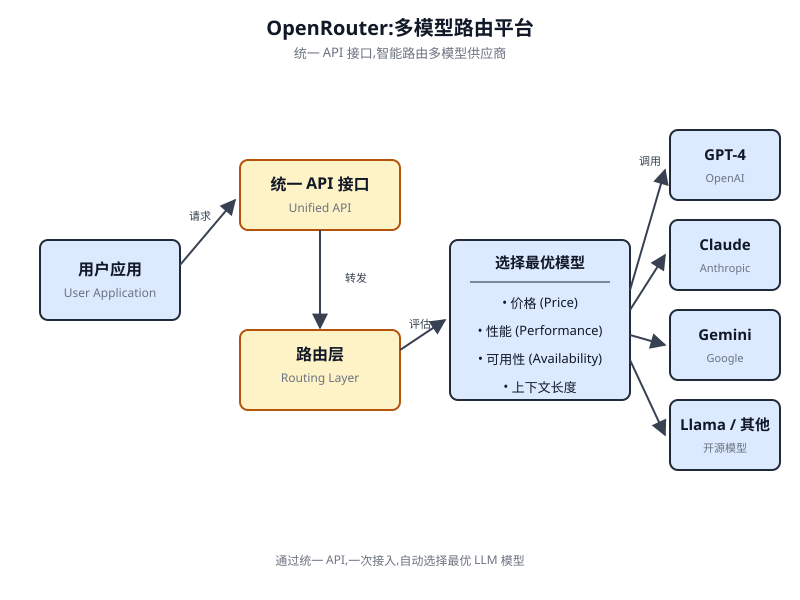

# 第 16 章 资源感知优化(Resource-Aware Optimization)

<!-- chapter: 16 | part: I | pages: 256-270 | translated_from: pdf/256-270 -->

资源感知优化(Resource-Aware Optimization)使智能体能够在运行期间动态地监控和管理计算、时间与财务资源。这不同于主要关注动作序列编排的简单规划。资源感知优化要求智能体在执行动作时做出决策，以便在指定的资源预算内达成目标或优化效率。这涉及在更准确但成本更高的模型与更快、成本更低的模型之间进行选择，或决定是分配额外算力以获得更精细的回答，还是返回更快但不够详尽的答案。

例如，考虑一个负责为金融分析师分析大型数据集的智能体。如果分析师需要立即获得一份初步报告，智能体可能会使用更快、更经济的模型来迅速总结关键趋势。然而，如果分析师需要一份高度准确的预测以支持关键的投资决策，并且拥有更充足的预算和时间，智能体就会分配更多资源，使用功能强大、速度较慢但更为精准的预测模型。该类别中的一项关键策略是回退机制(Fallback Mechanism)，它在首选模型因过载或限流而不可用时充当保护措施。为实现优雅降级，系统会自动切换到默认或更具成本效益的模型，从而保持服务连续性而非完全失败。

## 实践代码示例

一个用于回答用户问题的智能系统可以评估每个问题的难度。对于简单查询，它使用经济高效的语言模型(如 Gemini Flash)。对于复杂问题，则考虑使用更强大但成本更高的语言模型(如 Gemini Pro)。是否使用更强大的模型还取决于资源可用性，具体来说就是预算和时间约束。该系统能够动态选择合适的模型。例如，考虑一个使用分层智能体构建的旅行规划器。涉及理解用户复杂请求、将其拆分为多步行程并做出逻辑决策的高层规划，将由 Gemini Pro 这样复杂且更强大的 LLM 来管理。这就是需要深度理解上下文和推理能力的"规划器"智能体。然而，一旦规划确定，规划中的各个任务——例如查询航班价格、检查酒店可用性或查找餐厅评论——本质上都是简单的、重复性的网络查询。这些"工具函数调用"可以由 Gemini Flash 这样更快、更经济实惠的模型来执行。不难理解为什么这些简单的网络搜索可以使用经济实惠的模型，而复杂的规划阶段则需要更高级模型的更强智能来确保旅行规划连贯合理。Google ADK 通过其多智能体架构支持这种做法，该架构允许构建模块化且可扩展的应用。不同的智能体可以处理专门的任务。模型灵活性使得可以直接使用各种 Gemini 模型，包括 Gemini Pro 和 Gemini Flash,也可以通过 LiteLLM 集成其他模型。ADK 的编排能力支持由 LLM 驱动的动态路由，从而实现自适应行为。

内置评估功能能够对智能体性能进行系统化评估，可用于系统优化(参见第 19 章)。接下来，将定义两个配置相同但使用不同模型与成本的智能体。

```python
# Conceptual Python-like structure, not runnable code
from google.adk.agents import Agent
# from google.adk.models.lite_llm import LiteLlm # If using
models not directly supported by ADK's default Agent

# Agent using the more expensive Gemini Pro 2.5
gemini_pro_agent = Agent(
    name="GeminiProAgent",
    model="gemini-2.5-pro", # Placeholder for actual model name,
if different
    description="A highly capable agent for complex queries.",
    instruction="You are an expert assistant for complex
problem-solving."
)

# Agent using the less expensive Gemini Flash 2.5
gemini_flash_agent = Agent(
    name="GeminiFlashAgent",
    model="gemini-2.5-flash", # Placeholder for actual model name,
if different
    description="A fast and efficient agent for simple queries.",
    instruction="You are a quick assistant for straightforward
questions."
)
```

路由器智能体(Router Agent)可以根据简单的指标(如查询长度)来引导查询——较短的查询分配给成本较低的模型，较长的查询则分配给能力更强的模型。然而，更复杂的路由器智能体可以利用大语言模型(LLM)或机器学习(ML)模型来分析查询的细微差别和复杂度。这种 LLM 路由器能够确定哪个下游语言模型最为合适。例如，请求事实回忆的查询被路由到 flash 模型，而需要深入分析的复杂查询则被路由到 pro 模型。优化技术可以进一步增强 LLM 路由器的效能。提示工程(Prompt Tuning)涉及精心设计提示，以引导路由器 LLM 做出更好的路由决策。在由查询及其最优模型选择构成的数据集上对 LLM 路由器进行微调(Fine-tuning),能够提升其准确性和效率。

这种动态路由能力在响应质量与成本效益之间取得平衡。

```python
# Conceptual Python-like structure, not runnable code
from google.adk.agents import Agent, BaseAgent
from google.adk.events import Event
from google.adk.agents.invocation_context import InvocationContext
import asyncio
class QueryRouterAgent(BaseAgent):
    name: str = "QueryRouter"
    description: str = "Routes user queries to the appropriate LLM agent based on complexity."
    async def _run_async_impl(self, context: InvocationContext) -> AsyncGenerator[Event, None]:
        user_query = context.current_message.text  # Assuming text input
        query_length = len(user_query.split())  # Simple metric: number of words
        if query_length < 20:  # Example threshold for simplicity vs. complexity
            print(f"Routing to Gemini Flash Agent for short query (length: {query_length})")
            # In a real ADK setup, you would 'transfer_to_agent' or directly invoke
            # For demonstration, we'll simulate a call and yield its response
            response = await gemini_flash_agent.run_async(context.current_message)
            yield Event(author=self.name, content=f"Flash Agent processed: {response}")
        else:
            print(f"Routing to Gemini Pro Agent for long query (length: {query_length})")
            response = await gemini_pro_agent.run_async(context.current_message)
            yield Event(author=self.name, content=f"Pro Agent processed: {response}")
```

评审器(Critic Agent)对来自语言模型的响应进行评估，所提供的反馈具有多项功能。在自我纠错方面，它能够识别错误或不一致之处，从而促使回答智能体(Answering Agent)优化其输出以提升质量。它还会系统性地评估响应，用于性能监控，追踪准确率与相关性等指标，这些指标被用于优化。此外，其反馈可以触发强化学习或微调；例如，持续识别出 Flash 模型的响应不充分，就能够优化路由器智能体(Router Agent)的逻辑。虽然评审器并不直接管理预算，但它通过识别欠佳的路由选择来间接参与预算管理，例如将简单查询路由至 Pro 模型、或将复杂查询路由至 Flash 模型，从而导致结果不佳。这为改进资源分配与节约成本的调整提供了依据。评审器可以配置为仅审查回答智能体所生成的文本，或同时审查原始查询与生成的文本，从而对响应与初始问题的对齐情况进行全面评估。

```python
CRITIC_SYSTEM_PROMPT = """
  You are the **Critic Agent**, serving as the quality assurance
  arm of our collaborative research assistant system. Your pri-
  mary function is to **meticulously review and challenge** infor-
  mation from the Researcher Agent, guaranteeing **accuracy,
  completeness, and unbiased presentation**. Your duties encompass:
  * **Assessing research findings** for factual correctness, thor-
  oughness, and potential leanings.
  * **Identifying any missing data** or inconsistencies in
  reasoning.
  * **Raising critical questions** that could refine or expand the
  current understanding.
  * **Offering constructive suggestions** for enhancement or
  exploring different angles.
  * **Validating that the final output is comprehensive** and
  balanced. All criticism must be constructive.
```

* **提供建设性建议**以增强或探索不同角度。
  * **验证最终输出是否全面且平衡**。所有批评必须具有建设性。

你的目标是强化研究，而非否定它。请清晰组织你的反馈，引导关注需要修订的具体要点。你的总体目标是确保最终的研究成果达到尽可能高的质量标准。
  """

评审器(Agent)基于预定义的系统提示运行，该提示阐明了其角色、职责和反馈方式。为该智能体精心设计的提示必须清晰地确立其作为评估者的职能。它应当明确需要重点关注的方面，并强调提供建设性反馈而非简单否定。提示还应当鼓励同时识别优点与不足，并且必须指导智能体如何组织并呈现其反馈。

## 使用 OpenAI 的动手代码

本系统采用资源感知优化策略，以高效处理用户查询。它首先将每条查询分类为三种类别之一，以确定最合适且成本效益最高的处理路径。该方法避免了对简单请求的算力资源浪费，同时确保复杂查询获得必要的关注。三种类别如下：

- **simple(简单)**:适用于无需复杂推理或外部数据即可直接回答的直接问题。
- **reasoning(推理)**:适用于需要逻辑演绎或多步思维过程的查询，这些查询会被路由到更强大的模型。
- **internet_search(联网搜索)**:适用于需要最新信息的问题，会自动执行 Google 搜索以提供最新的回答。

代码采用 MIT 许可证，可在 GitHub 上获取：(https://github.com/mahtabsyed/21-Agentic-Patterns/blob/main/16_Resource_Aware_Opt_LLM_Reflection_v2.ipynb)。

```python
# MIT License
  # Copyright (c) 2025 Mahtab Syed
  # https://www.linkedin.com/in/mahtabsyed/
  import os
  import requests
  import json
  from dotenv import load_dotenv
  from openai import OpenAI
  # Load environment variables
  load_dotenv()
  OPENAI_API_KEY = os.getenv("OPENAI_API_KEY")
  GOOGLE_CUSTOM_SEARCH_API_KEY     =   os.getenv("GOOGLE_CUSTOM_
  SEARCH_API_KEY")
  GOOGLE_CSE_ID = os.getenv("GOOGLE_CSE_ID")
  if not OPENAI_API_KEY or not GOOGLE_CUSTOM_SEARCH_API_KEY or
  not GOOGLE_CSE_ID:
     raise ValueError(
       "Please set OPENAI_API_KEY, GOOGLE_CUSTOM_SEARCH_API_
KEY, and GOOGLE_CSE_ID in your .env file."
   )
client = OpenAI(api_key=OPENAI_API_KEY)
# --- Step 1: Classify the Prompt ---
def classify_prompt(prompt: str) -> dict:
   system_message = {
       "role": "system",
       "content": (
           "You are a classifier that analyzes user prompts and
returns one of three categories ONLY:\n\n"
           "- simple\n"
           "- reasoning\n"
           "- internet_search\n\n"
           "Rules:\n"
           "- Use 'simple' for direct factual questions that need
no reasoning or current events.\n"
           "- Use 'reasoning' for logic, math, or multi-step
inference questions.\n"
           "- Use 'internet_search' if the prompt refers to cur-
rent events, recent data, or things not in your training
data.\n\n"
           "Respond ONLY with JSON like:\n"
           '{ "classification": "simple" }'
       ),
   }
   user_message = {"role": "user", "content": prompt}
   response = client.chat.completions.create(
       model="gpt-4o", messages=[system_message, user_message],
temperature=1
   )
   reply = response.choices[0].message.content
   return json.loads(reply)
# --- Step 2: Google Search ---
def google_search(query: str, num_results=1) -> list:
   url = "https://www.googleapis.com/customsearch/v1"
   params = {
       "key": GOOGLE_CUSTOM_SEARCH_API_KEY,
       "cx": GOOGLE_CSE_ID,
       "q": query,
       "num": num_results,
   }
   try:
       response = requests.get(url, params=params)
       response.raise_for_status()
       results = response.json()
       if "items" in results and results["items"]:
             return [
                 {
                     "title": item.get("title"),
                     "snippet": item.get("snippet"),
                     "link": item.get("link"),
                 }
                 for item in results["items"]
             ]
         else:
             return []
     except requests.exceptions.RequestException as e:
         return {"error": str(e)}
  # --- Step 3: Generate Response ---
  def generate_response(prompt: str, classification: str, search_
  results=None) -> str:
     if classification == "simple":
         model = "gpt-4o-mini"
         full_prompt = prompt
     elif classification == "reasoning":
         model = "o4-mini"
         full_prompt = prompt
     elif classification == "internet_search":
         model = "gpt-4o"
         # Convert each search result dict to a readable string
         if search_results:
             search_context = "\n".join(
                 [
                     f"Title: {item.get('title')}\nSnippet: {item.
  get('snippet')}\nLink: {item.get('link')}"
                     for item in search_results
                 ]
             )
         else:
             search_context = "No search results found."
         full_prompt = f"""Use the following web results to answer
  the user query:
  {search_context}
  Query: {prompt}"""
     response = client.chat.completions.create(
         model=model,
         messages=[{"role": "user", "content": full_prompt}],
         temperature=1,
     )
     return response.choices[0].message.content, model
  # --- Step 4: Combined Router ---
  def handle_prompt(prompt: str) -> dict:
     classification_result = classify_prompt(prompt)
     # Remove or comment out the next line to avoid duplicate
  printing
     # print("\n🔍 Classification Result:", classification_result)
     classification = classification_result["classification"]
     search_results = None
     if classification == "internet_search":
         search_results = google_search(prompt)
         # print("\n🔍 Search Results:", search_results)
     answer, model = generate_response(prompt, classification,
  search_results)
     return {"classification": classification, "response": answer,
  "model": model}
  test_prompt = "What is the capital of Australia?"
  # test_prompt = "Explain the impact of quantum computing on
  cryptography."
  # test_prompt = "When does the Australian Open 2026 start, give
  me full date?"
  result = handle_prompt(test_prompt)
  print("🔍 Classification:", result["classification"])
  print("     Model Used:", result["model"])
  print("     Response:\n", result["response"])
```

这段 Python 代码实现了一个用于回答用户问题的提示路由(Prompt Routing)系统。它首先从 `.env` 文件中加载 OpenAI 和 Google Custom Search 所需的 API 密钥。核心功能在于将用户的提示分类为三类：简单、推理或互联网搜索。一个专用函数利用 OpenAI 模型执行此分类步骤。如果提示需要当前信息，则使用 Google Custom Search API 执行 Google 搜索。然后，另一个函数根据分类选择合适的 OpenAI 模型生成最终响应。对于互联网搜索查询，搜索结果作为上下文提供给模型。主函数 `handle_prompt` 编排此工作流，在生成响应之前调用分类和搜索(如果需要)函数。它返回分类、使用的模型以及生成的答案。该系统能够高效地将不同类型的查询定向到经过优化的方法，从而获得更好的响应。

## 实践代码示例(OpenRouter)

OpenRouter 通过单一 API 端点为数百个 AI 模型提供统一接口。它提供自动故障转移和成本优化，可以通过你偏好的 SDK 或框架轻松集成。

```python
import requests
import json

response = requests.post(
    url="https://openrouter.ai/api/v1/chat/completions",
    headers={
        "Authorization": "Bearer <OPENROUTER_API_KEY>",
        "HTTP-Referer": "<YOUR_SITE_URL>",  # Optional. Site URL for rankings on openrouter.ai.
        "X-Title": "<YOUR_SITE_NAME>",  # Optional. Site title for rankings on openrouter.ai.
    },
    data=json.dumps({
        "model": "openai/gpt-4o",  # Optional
        "messages": [
            {
                "role": "user",
                "content": "What is the meaning of life?"
            }
        ]
    })
)
```

该代码片段使用 requests 库与 OpenRouter API 进行交互。它通过用户消息向聊天补全端点发送 POST 请求。该请求包含带有 API 密钥的授权头以及可选的站点信息。目标是获取由指定语言模型生成的响应，在本例中为 "openai/gpt-4o"。

OpenRouter 提供两种不同的方法来路由和确定用于处理给定请求的计算模型。

- 自动模型选择(Automated Model Selection):此功能将请求路由到从一组精心策划的可用模型中挑选出的优化模型。挑选的依据是用户提示的具体内容。最终处理请求的模型标识符会在响应的元数据中返回。

  ```json
  {
   "model": "openrouter/auto",
   ... // Other params
  }
  ```

- 顺序模型回退(Sequential Model Fallback):此机制通过允许用户指定一个层次化的模型列表来提供操作冗余。系统将首先尝试使用序列中指定的主要模型来处理请求。如果该主要模型因任何错误情况而无法响应——例如服务不可用、速率限制或内容过滤——系统将自动将请求重新路由到序列中的下一个指定模型。此过程持续进行，直到列表中的某个模型成功执行请求或列表耗尽为止。最终的操作成本和响应中返回的模型标识符将与成功完成计算的那个模型相对应。

  ```json
  {
     "models": ["anthropic/claude-3.5-sonnet", "gryphe/mythomax-l2-13b"],
    ... // Other params
  }
  ```

OpenRouter 提供了一个详细的排行榜(https://openrouter.ai/rankings),该排行榜根据各模型的累计令牌(token)生成量对可用的 AI 模型进行排名。它还汇集了不同提供商的最新模型(ChatGPT、Gemini、Claude)(见图 16.1)。

图 16.1 OpenRouter 网站(https://openrouter.ai/)

## 超越动态模型切换：智能体资源优化的多元图谱

资源感知优化(Resource-Aware Optimization)对于开发能够在现实世界约束下高效且有效运行的智能体(Agent)系统至关重要。下面介绍若干补充技术：

**动态模型切换**是一项关键技术，它根据当前任务的复杂程度和可用计算资源，策略性地选择大语言模型(LLM)。面对简单查询时，可以部署轻量级、低成本的大语言模型；而面对复杂、多层面的问题时，则必须使用更精密且资源密集型的模型。

**自适应工具使用与选择**确保智能体能够从一系列工具中智能地做出选择，为每个特定子任务挑选最合适、最高效的工具，并仔细考量 API 使用成本、延迟和执行时间等因素。这种动态工具选择通过优化外部 API 和服务的使用来提升整体系统效率。

**上下文剪枝与摘要**在管理智能体处理的信息量方面发挥着重要作用，通过智能地对交互历史进行摘要并选择性保留最相关的信息，策略性地最小化提示(Prompt)的标记(Token)数量并降低推理(推理)成本，从而避免不必要的计算开销。

**主动资源预测**通过预测未来的工作负载和系统需求来预判资源需求，从而实现资源的主动分配与管理，确保系统响应能力并防止瓶颈出现。

成本敏感探索(Cost-Sensitive Exploration)在多智能体系统中将优化考量扩展到涵盖通信成本与传统计算成本，影响智能体协作与共享信息的策略，旨在最小化整体资源消耗。节能部署(Energy-Efficient Deployment)专为具有严格资源约束的环境量身定制，旨在最小化智能体系统的能源足迹，延长运行时间并降低整体运行成本。并行化与分布式计算感知(Parallelization and Distributed Computing Awareness)利用分布式资源来增强智能体的处理能力与吞吐量，将计算工作负载分布到多台机器或处理器上，以实现更高的效率与更快的任务完成速度。学习型资源分配策略(Learned Resource Allocation Policies)引入学习机制，使智能体能够随着时间的推移根据反馈与性能指标动态调整并优化其资源分配策略，通过持续改进提升效率。优雅降级与回退机制(Graceful Degradation and Fallback Mechanisms)确保智能体系统在资源严重受限的情况下仍能继续运行，即便可能以较低的性能运行，能够优雅地降级性能并回退到替代策略，以维持运行并提供基本功能。

## 速览

**是什么** 资源感知优化(Resource-Aware Optimization)解决了智能体系统中计算、时间与财务资源消耗的管理难题。基于 LLM 的应用往往开销高昂且响应迟缓，而为每项任务都选择最佳模型或工具通常效率低下。这造成了系统输出质量与生成该输出所需资源之间的根本性权衡。若缺乏动态管理策略，系统便无法适应变化的任务复杂度，也无法在预算与性能约束下运行。

**为什么** 标准化解决方案是构建一个智能体系统(Agentic System),根据当前任务智能地监控和分配资源。该模式通常采用"路由器智能体(Router Agent)"首先对传入请求的复杂度进行分类。然后将请求转发给最合适的 LLM 或工具——简单查询使用快速且廉价的模型，复杂推理则使用更强大的模型。"评审器智能体(Critique Agent)"可以进一步评估响应质量并提供反馈，从而随着时间推移优化路由逻辑，以此完善整个过程。这种动态的多智能体(Multi-Agent)方法确保系统高效运行，在响应质量与成本效益之间取得平衡。

**经验法则** 在以下场景中使用此模式：在 API 调用或算力方面面临严格财务预算限制时；在延迟敏感型应用中，要求快速响应时间至关重要时；在资源受限的硬件(如电池续航有限的边缘设备)上部署智能体时；需要在响应质量与运营成本之间以编程方式进行权衡时；以及管理复杂的多步骤工作流，且不同任务具有不同资源需求时。

**图 16.2 资源感知优化(Resource-Aware Optimization)设计模式**

### 关键要点

- 资源感知优化至关重要：智能体能够动态管理计算资源、时间资源和财务资源。关于模型使用和执行路径的决策基于实时约束和目标来制定。
- 用于可扩展性的多智能体架构：Google ADK 提供了一个多智能体框架，支持模块化设计。不同的智能体(回答、路由、评审)各司其职。
- 由 LLM 驱动的动态路由：路由器智能体根据查询复杂度和预算，将查询路由到不同的语言模型(简单任务用 Gemini Flash,复杂任务用 Gemini Pro)。这优化了成本和性能。
- 评审智能体功能：专门的评审智能体为自我纠正、性能监控和路由逻辑优化提供反馈，提升了系统效能。
- 通过反馈与灵活性实现优化：评审评估能力与模型集成灵活性共同促进系统行为的自适应与自我改进。
- 其他资源感知优化方法：还包括自适应工具使用与选择、上下文剪枝与摘要、前瞻性资源预测、多智能体系统中的成本敏感探索、能效部署、并行化与分布式计算感知、学习型资源分配策略、优雅降级与回退机制，以及关键任务的优先级排序。

## 结论

资源感知优化对智能体的开发至关重要，能够使其在真实世界的约束条件下高效运行。通过管理计算资源、时间资源和财务资源，智能体能够实现最佳性能与成本效益。动态模型切换、自适应工具使用以及上下文剪枝等技术对于实现这些效率至关重要。学习型资源分配策略与优雅降级等高级策略，能够增强智能体在不同条件下的适应性与韧性。将这些优化原则融入智能体设计中，是构建可扩展、稳健且可持续的智能体系统(AI Systems)的基础。

Gemini Flash 2.5 & Gemini 2.5 Pro: https://aistudio.google.com/
Google 的智能体开发工具包(ADK):https://google.github.io/adk-docs/
OpenRouter: https://openrouter.ai/docs/quickstart


