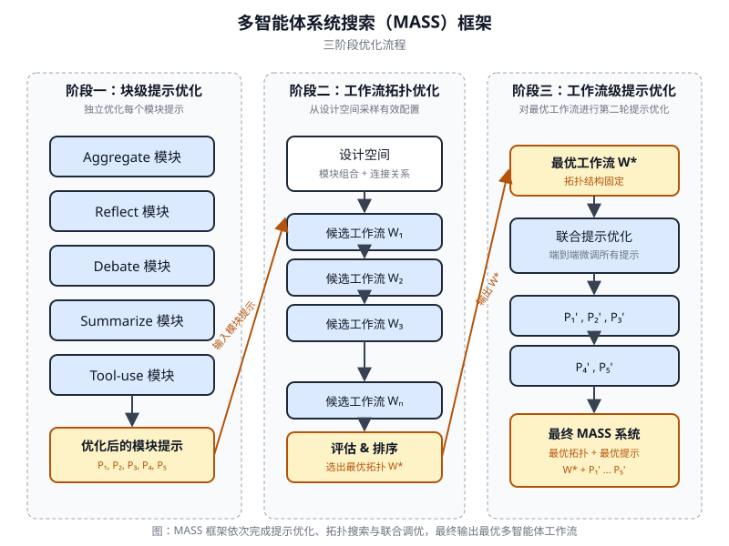
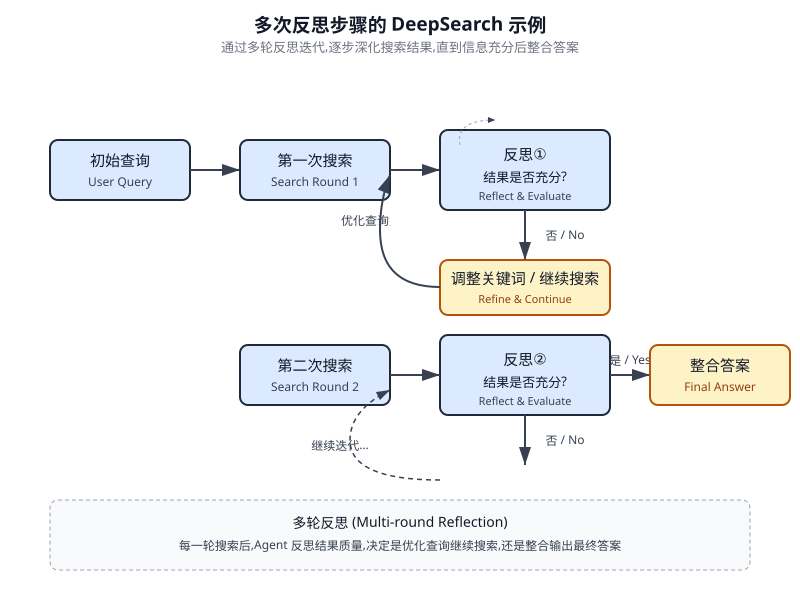
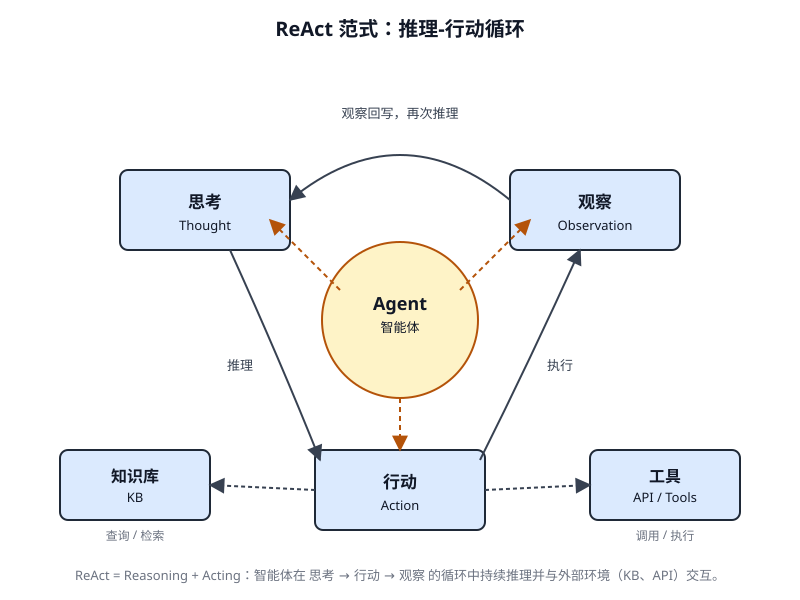
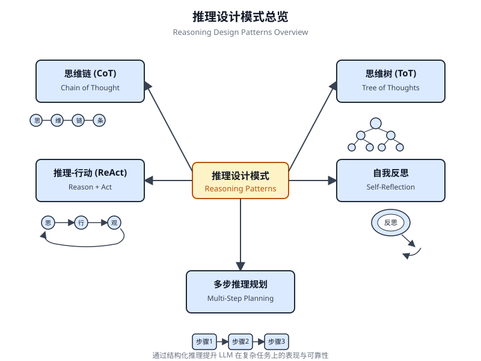

# 第 17 章 推理技术(Reasoning Techniques)

<!-- chapter: 17 | part: I | pages: 271-293 | translated_from: pdf/271-293 -->

本章深入探讨智能体的先进推理方法，聚焦于多步逻辑推断与问题求解。这些技术超越了简单的顺序操作，使智能体的内部推理变得显式化。这使得智能体能够拆解问题、审视中间步骤，并得出更稳健、更准确的结论。在这些先进方法中，一项核心原则是在推理阶段分配更多的计算资源。这意味着授予智能体或其底层大语言模型(LLM)更多的时间或步骤来处理查询并生成响应。智能体不再是一次性快速通过，而是可以进行迭代式细化、探索多条求解路径，或利用外部工具。这种推理阶段的扩展处理时间通常能够显著提升准确性、一致性与稳健性，尤其对于需要深度分析与深思熟虑的复杂问题而言。

## 实际应用与使用场景

实际应用包括：

- 复杂问答(Complex Question Answering):有助于解析多跳查询，此类查询需要整合来自不同来源的数据并执行逻辑推理，可能涉及对多条推理路径的考察，并受益于延长的推理时间以综合信息。

## 推理技术

首先，让我们深入探讨用于增强 AI 模型问题解决能力的核心推理技术。

思维链(Chain-of-Thought, CoT)提示通过模拟逐步思考过程，显著增强 LLM 的复杂推理能力(见图 17.1)。CoT 提示不是直接给出答案，而是引导模型生成一系列中间推理步骤。这种显式的分解使 LLM 能够将复杂问题拆解为更小、更易处理的子问题，从而加以解决。该技术显著提升了模型在需要多步推理的任务上的表现，例如算术、常识推理和符号操作。CoT 的一个主要优势在于，它能够将困难的单步问题转化为一系列更简单的步骤，从而提高 LLM 推理过程的透明度。这种方法不仅提升了准确率，还

图 17.1 CoT 提示及智能体生成的详细逐步响应

## 引言

...

Chain-of-Thought(CoT,思维链)提示工程是一种显著增强大语言模型(LLM)推理能力的技术。它通过提示模型在给出最终答案之前，生成一系列中间推理步骤，从而模拟逐步思考的过程。这种方法不仅提升了模型在复杂任务上的表现，还提供了关于模型决策过程的宝贵洞察，有助于调试与理解。CoT 可以通过多种策略实现，包括提供展示逐步推理的少样本(Few-shot)示例，或者简单地指示模型"逐步思考"。其有效性源于能够引导模型的内部处理过程走向更审慎、更具逻辑性的推进。正因如此，Chain-of-Thought 已成为当代大语言模型实现高级推理能力的基石技术。这种增强的透明度，以及将复杂问题拆分为可管理的子问题的方式，对自主智能体(Agent)尤为重要，因为它使智能体能够在复杂环境中执行更可靠、更可审计的动作。下面我们来看一个示例。它以一组指令开头，告诉 AI 如何思考，定义其角色并给出明确的五步流程。这段提示(Prompt)用于启动结构化思考。随后，示例展示了 CoT 过程的实际运行。标记为"智能体的思考过程(Agent's Thought Process)"的部分是模型执行指令步骤的内部独白。这就是字面意义上的"思维链"。最后，"智能体的最终答案(Agent's Final Answer)"是经过仔细逐步推理后生成的精炼且全面的输出。

```text
You are an Information Retrieval Agent. Your goal is to answer
  the user's question comprehensively and accurately by thinking
  step-by -step. Here's the process you must follow:
  1. **Analyze the Query:** Understand the core subject and spe-
  cific requirements of the user's question.
```

识别关键实体、关键词以及所寻找的信息类型。
2. **制定搜索查询(针对知识库):** 基于你的分析，生成一份精确的搜索查询列表，用于从知识库或外部工具中检索相关信息。
3. **模拟信息检索(自我纠错/推理):** 针对每个搜索查询，在脑中思考你期望找到何种信息。如果真的检索到内容，最相关的片段会是什么？思考潜在的歧义或缺失之处。
4. **综合信息：** 基于模拟检索结果以及对用户原始查询的理解，将收集到的信息综合为连贯且完整的答案。确保查询的所有方面都得到解答。
5. **复审与优化：** 在定稿之前，严格评估你的答案。它是否准确？是否全面？是否易于理解？是否简洁？如果不是，请识别需要改进之处以及如何改进。
**用户查询：** "解释经典计算机与量子计算机之间的主要差异，并简要描述量子计算的一种潜在应用。"
**智能体的思考过程(内部 CoT 输出 —— 由提示鼓励):**
**思考 1(分析查询):**
用户希望得到两件事：
1. 经典计算机与量子计算机之间的主要差异。
2. 量子计算的一种潜在应用。

关键词：经典计算机、量子计算机、差异、潜在应用。

**Thought 2(构建搜索查询):**
- "differences classical vs quantum computers"
- "how quantum computers work"
- "how classical computers work"
- "applications of quantum computing"

**Thought 3(模拟信息检索并识别关键概念):**
- 来自 "differences":预期会出现位与量子比特、叠加态、纠缠、概率性质、针对特定问题的计算能力等概念。
- 来自 "how they work":经典计算机使用晶体管和二进制。量子计算机使用量子力学。
- 来自 "applications":预期会出现药物发现、材料科学、密码学、优化等。

**Thought 4(综合信息):**
计算机使用位(0 或 1)顺序处理信息。量子计算机使用量子比特，可同时处于 0、1 或两者叠加态(叠加态),并可相互纠缠，从而实现截然不同的计算方法。这使它们能够比经典计算机更高效地解决某些特定问题(如大整数分解或复杂分子模拟)。一个潜在应用是药物发现，量子计算机能够以前所未有的精度模拟分子相互作用，从而加速新药研发。

**Thought 5(审查与优化):**
- 位与量子比特、叠加态、纠缠、处理方式等差异已涵盖。
- 应用已给出(药物发现)。
- 是否简洁？是的。
- 是否清晰？是的。
- 看起来不错。

**智能体的最终答案(输出给用户):**
计算机使用位(0 或 1)处理信息，任何时刻只能处于 0 或 1 状态，顺序执行操作。相比之下，量子计算机利用量子比特，凭借叠加态可同时存在于多种状态，并能通过纠缠相互关联，从而实现指数级复杂度的计算。

这种根本差异使量子计算机能够处理某些问题，例如模拟分子结构或破解复杂加密，这些问题即使对功能最强大的经典超级计算机而言也是难以解决的。量子计算的一项重要潜在应用在于药物发现，其精确建模分子行为的能力可能彻底革新新型药物的研发。

Tree-of-Thought(ToT)是一种推理技术，建立在思维链(Chain-of-Thought, CoT)之上。它允许大语言模型(LLM)通过分支到不同的中间步骤来探索多条推理路径，从而形成树形结构(参见图 17.2)。这种方法通过支持回溯、自我纠正和探索替代方案，实现了复杂问题求解。维护一棵可能性树使模型能够在最终确定答案之前评估各种推理轨迹。这一迭代过程

图 17.2 思维树示例

增强了模型处理需要战略规划与决策的复杂任务的能力。

自我纠错(self-refinement)是智能体推理过程中的关键环节，尤其是在思维链(Chain-of-Thought)提示工程中。它要求智能体对自身生成的内容以及中间思考过程进行内部评估。这种批判性审视使智能体能够识别其理解或方案中的模糊之处、信息缺口或不准确之处。这种"审查-优化"的迭代循环使智能体能够在输出最终结果前调整思路、提升响应质量，并确保准确性与完备性。正如第 4 章中的示例所示，这种内部评审显著增强了智能体生成可靠且高质量结果的能力。

本示例展示了一个系统化的自我纠错过程，对于优化 AI 生成内容至关重要。它通过"起草-对照原始需求评审-实施具体改进"的迭代循环实现。说明首先将 AI 的功能定位为"自我纠错智能体(Self-Correction Agent)",并明确划分了一个五步分析与修订工作流。随后，给出了一段质量欠佳的"初稿(Initial Draft)"社交媒体帖子。自我纠错智能体的"思考过程(Thought Process)"是演示的核心。在此环节中，智能体严格按照其指令对初稿进行批判性评估，精准识别诸如互动性不足、行动号召模糊等薄弱之处，并提出具体改进建议，包括使用更有冲击力的动词与表情符号。最终输出"修订终稿(Final Revised Content)"——一份经过润色且明显改善的版本，整合了智能体自主识别出的各项调整。

```text
You are a highly critical and detail-oriented Self-Correction
   Agent. Your task is to review a previously generated piece of
   content against its original requirements and identify areas
   for improvement. Your goal is to refine the content to be more
   accurate, comprehensive, engaging, and aligned with the prompt. Here's the process you must follow for self-correction:
   1.   **Understand Original Requirements:** Review the initial
   prompt/requirements that led to the content's creation. What
   was the *original intent*? What were the key constraints
   or goals?
   2.    **Analyze Current Content:** Read the provided content
   carefully.
   3. **Identify Discrepancies/Weaknesses:** Compare the current
   content against the original requirements. Look for:
      * **Accuracy Issues:** Are there any factual errors or mis-
   leading statements?
      * **Completeness Gaps:** Does it fully address all aspects of
   the original prompt? Is anything missing?
      * **Clarity & Coherence:** Is the language clear, concise,
   and easy to understand? Does it flow logically?
      * **Tone & Style:** Does it match the desired tone and style
   (e.g., professional, engaging, concise)?
      * **Engagement:** Is it captivating? Does it hold the read-
   er's attention?
    &nbsp;& * **Redundancy/Verbosity:** Can any parts be condensed or
   removed without losing meaning?
   4. **Propose Specific Improvements:** For each identified weak-
   ness, suggest concrete and actionable changes. Do not just
   state the problem; propose a solution.
   5.    **Generate Revised Content:** Based on your proposed
   improvements, rewrite the original content to incorporate all
   the necessary changes.
```

确保修订后的内容经过润色，可以投入使用。

**原始提示/需求：**"撰写一条简短的、引人入胜的社交媒体帖子(最多 150 个字符),宣传新的环保产品线：'GreenTech Gadgets'(绿色科技产品)。"

**初始草稿(待修正内容):**

"我们推出了新产品。它们既环保又科技感十足。立即购买 GreenTech Gadgets!"

**自我修正智能体的思维过程(内部思维链输出——由提示鼓励):**

**思维 1(理解原始需求):**

- 简短、引人入胜的社交媒体帖子。
- 最多 150 个字符。
- 宣传 "GreenTech Gadgets"——一条新的环保产品线。

**思维 2(分析当前内容):**

"我们推出了新产品。它们既环保又科技感十足。立即购买 GreenTech Gadgets!"(64 个字符)

**思维 3(识别差异/弱点):**

- **吸引力：** 吸引力不足。听起来很泛泛。
- **环保性：** 由"绿色"隐含，但未明确强调其作为卖点。
- **行动号召：** "立即购买！"还可以，但可以更具吸引力。
- **简洁性：** 简短，但可以使用更有力的动词/措辞。
- **影响力：** 缺乏新产品发布应有的兴奋感。

**思维 4(提出具体改进建议):**

- 使其更具活力和令人兴奋。
- 强调"环保"与"创新"。
- 使用更有力的动词和更主动的语态。
- 添加一个清晰、引人入胜的行动号召。
- 确保字数保持在 150 个字符以内。

**思维 5(生成修订内容):**

原始："我们推出了新产品。它们既环保又科技感十足。立即购买 GreenTech Gadgets!"

修订思路 1:"🌱 探索 GreenTech Gadgets!我们的全新环保产品线将创新与可持续性融为一体。拥抱绿色，拥抱智慧！

```markdown
立即购买！#EcoFriendly #GreenTech"（148 个字符）
  此修订直接回应了环保主题,使用表情符号提升互动性,
  加入了更强的行动号召,并在字符限制内包含了相关的
  主题标签。
  **自我修正智能体的最终修订内容（输出给用户）：**
     发现 GreenTech 小工具！我们的全新环保产品系列将
  创新与可持续性融为一体。选择绿色,选择智能！立即
  购买！#EcoFriendly #GreenTech
```

从根本上看，这项技术将质量控制措施直接集成到智能体(Agent)的内容生成过程中，从而产出更精炼、更精确、更优质的结果，更有效地满足复杂的用户需求。

程序辅助语言模型(Program-Aided Language Models, PALMs)将大语言模型(LLM)与符号推理能力相结合。这种集成使大语言模型能够在其问题求解过程中生成并执行代码(例如 Python)。PALMs 将复杂的计算、逻辑运算和数据操作交由确定性的编程环境完成。这种方法利用了传统编程在任务中的优势，弥补了大语言模型在准确性和一致性方面可能存在的局限。当面对符号化的挑战时，模型能够生成代码、执行代码，并将结果转换为自然语言。这种混合方法将大语言模型的理解与生成能力与精确计算相融合，使模型能够以更高的可靠性与准确性应对更广泛的复杂问题。这对智能体(Agent)而言至关重要，因为它使智能体能够通过结合精确计算以及自身的理解与生成能力，执行更准确、更可靠的动作。

An example is the use of external tools within
Google's ADK for generating code.

```python
from google.adk.tools import agent_tool
from google.adk.agents import Agent
from google.adk.tools import google_search
from google.adk.code_executors import BuiltInCodeExecutor
search_agent = Agent(
    model='gemini-2.0-flash',
    name='SearchAgent',
    instruction="""
    You're a specialist in Google Search
    """,
    tools=[google_search],
)
coding_agent = Agent(
    model='gemini-2.0-flash',
    name='CodeAgent',
    instruction="""
    You're a specialist in Code Execution
    """,
    code_executor=[BuiltInCodeExecutor],
)
root_agent = Agent(
    name="RootAgent",
    model="gemini-2.0-flash",
    description="Root Agent",
    tools=[agent_tool.AgentTool(agent=search_agent), agent_tool.AgentTool(agent=coding_agent)],
)
```

**带可验证奖励的强化学习(Reinforcement Learning with Verifiable Rewards, RLVR)**:虽然效果显著，但许多 LLM 所使用的标准思维链(Chain-of-Thought, CoT)提示工程仍是一种相对基础的推理方法。它生成单一的、预先确定的思路，无法根据问题的复杂性进行调整。为克服这些限制，一类新的专用"推理模型"应运而生。这些模型的工作方式有所不同，它们在给出答案之前，会投入可变时长的"思考"时间。这种"思考"过程会产生更长且更具动态性的思维链，长度可达数千个词元。这种扩展的推理能力使得更复杂的行为成为可能，例如自我纠正和回溯，模型会针对更困难的问题投入更多精力。促成这些模型的关键创新是一种名为**带可验证奖励的强化学习(Reinforcement Learning from Verifiable Rewards, RLVR)**的训练策略。通过在已知正确答案的问题(如数学或代码)上训练模型，它能够通过试错学习生成有效的、长形式的推理。

这使得模型能够在没有直接人类监督的情况下发展其问题解决能力。最终，这些推理模型不仅仅生成一个答案；它们还会生成一个"推理轨迹",展示出规划、监控和评估等高级技能。这种增强的推理和策略能力对于开发自主 AI 智能体至关重要，这些智能体能够以最少的人工干预来分解和解决复杂任务。ReAct(Reasoning and Acting,见 Fig. 17.3,其中 KB 代表 Knowledge Base)是一种将 Chain-of-Thought (CoT) 提示与智能体通过工具与外部环境交互的能力相结合的范式。与生成最终答案的生成模型不同，ReAct 智能体会推理应该采取哪些行动。这个推理阶段涉及一个内部规划过程，类似于 CoT,智能体在其中确定其后续步骤、考虑可用工具并预测结果。随后，智能体通过执行工具或函数调用来采取行动，例如查询数据库、执行计算或与 API 交互。ReAct 以交错的方式运行：智能体执行一个动作，观察结果，并将此观察纳入后续推理中。"Thought、Action、Observation、Thought……"这种迭代循环使智能体能够动态调整其规划、纠正错误，并实现需要与环境进行多次交互的目标。与线性 CoT 相比，这提供了一种更加强大和灵活的问题解决方法，因为智能体能够响应实时反馈。通过结合语言模型的理解和生成能力以及使用工具的能力，ReAct 使智能体能够执行既需要推理又需要实际执行的复杂任务。这种方法对智能体至关重要，因为它使它们不仅能够推理

图 17.3 推理与行动(Reasoning and Act)

但也能实际执行步骤并与动态环境交互。CoD(Chain of Debates,辩论链)是由微软提出的一种正式的人工智能框架，其中多个不同的模型通过协作与辩论来解决问题，超越了单一人工智能的"思维链"。该系统运作方式类似于人工智能议会会议，不同模型各自提出初步想法，相互批评彼此的推理，并交换反驳论点。其主要目标是借助集体智慧来提升准确性、降低偏见，并改善最终答案的整体质量。该方法相当于人工智能版本的同行评审，可为推理过程创建透明且可信赖的记录。从根本上，它代表了一种转变：从单个智能体(Agent)独自提供答案，转向由一组智能体协同工作，从而得出更稳健且经过验证的解答。

GoD(Graph of Debates,辩论图)是一种先进的智能体式(Agentic)框架，它将辩论重新构想为一个动态的非线性网络，而非简单的链式结构。在该模型中，论点作为独立的节点，通过表示"支持"或"反驳"等关系的边相互连接，反映出真实辩论的多线程特性。这种结构允许新的探究线索动态地分叉、独立演化，甚至随着时间推移而相互合并。最终结论并非在序列末端得出，而是通过在整个图中识别最稳健且获得充分支持的论点聚类来达成。在此语境中，"获得充分支持"指的是那些确凿且可验证的知识。这可以包括被视为基本事实(ground truth)的信息，即那些本身正确并被广泛接受为事实的内容。此外，它还涵盖通过搜索接地(search grounding)获得的事实证据，即信息通过外部来源和真实世界数据进行验证。

最后，它还涉及多个模型在辩论过程中达成的共识，表明所呈现信息具有高度的认同度和可信度。这种综合方法为所讨论的信息提供了更为稳健可靠的基础。该方法为复杂、协作的 AI 推理提供了更为整体且真实的模型。

MASS(可选高级主题):对多智能体系统设计的深入分析表明，其有效性关键取决于两个方面：用于编程各个智能体的提示质量，以及决定智能体间交互的拓扑结构。设计这些系统的复杂性非常高，因为它涉及一个庞大且错综复杂的搜索空间。为应对这一挑战，研究者提出了一个称为多智能体系统搜索(MASS)的新框架，用于自动化并优化多智能体系统(MAS)的设计。MASS 采用多阶段优化策略，通过交错进行提示与拓扑优化，系统性地导航复杂的搜索空间(见图 17.4)。

1. **块级提示优化**:该过程首先对单个智能体类型(即"块")的提示进行局部优化，以确保每个组件在被集成到更大系统中之前能够有效执行其角色。这一初始步骤至关重要，因为它确保后续的拓扑优化建立在表现良好的智能体之上，而不是受累于配置不佳的智能体的复合影响。例如，在针对 HotpotQA 数据集进行优化时，"辩论者"智能体的提示被创造性地构造为指示其扮演"某主要出版物的专业事实核查员"。其优化后的任务是仔细审查其他智能体提出的答案，将其与提供的上下文段落进行交叉核对，并识别任何不一致或缺乏依据的陈述。

这种在块级优化阶段发现的专业化角色扮演提示，旨在使辩论智能体(agent)在被放入更大工作流之前就能高效地合成信息。

2. **工作流拓扑优化(Workflow Topology Optimization):** 在局部优化之后，MASS 通过从一个可定制设计空间中选择并排列不同的智能体交互来优化工作流拓扑。为使这一搜索高效，



cient 时，MASS 采用一种影响加权方法。该方法通过衡量每种拓扑相对于基线智能体的性能增益来计算其"增量影响",并利用这些分数引导搜索方向，趋向更具潜力的组合。例如，在针对 MBPP 编码任务进行优化时，拓扑搜索发现一种特定的混合工作流最为有效。所发现的最优拓扑并非单一结构，而是将迭代优化过程与外部工具使用相结合的产物。具体而言，它由一个预测智能体组成，该智能体参与多轮反思，其代码由一个执行器智能体运行测试用例进行验证。这一发现的工作流表明：在编程任务中，将迭代式自我修正与外部验证相结合的结构优于更简单的多智能体系统设计。

3. **工作流级提示优化**:最后阶段对整个系统的提示进行全局优化。在确定性能最佳的拓扑之后，提示被作为一个统一的整体进行微调，以确保它们针对编排进行定制，并使智能体之间的相互依赖得到优化。例如，在找到 DROP 数据集的最佳拓扑之后，最终的优化阶段会细化"预测器"智能体的提示。最终优化后的提示非常详细，首先为智能体提供数据集本身的摘要，指出其聚焦于"抽取式问答"和"数值信息"。随后包含正确问答行为的少样本示例，并将核心指令构建为一个高风险情境："你是一款高度专业化的 AI,负责为紧急新闻报道提取关键的数值信息。实时直播正在依赖你的准确性和速度"。

这个多面向的提示融合了元知识、示例与角色扮演，专为最终工作流调优，以最大化准确性。

4. 关键发现与原则：实验表明，经 MASS 优化的多智能体系统在多种任务上显著优于现有的人工设计系统及其他自动化设计方法。该研究得出的有效多智能体系统的核心设计原则有三条：

   - 在组合多个智能体之前，先使用高质量提示优化各个智能体。
   - 通过组合有影响力的拓扑结构来构建多智能体系统，而非在无约束的搜索空间中探索。
   - 通过最终在工作流层面的联合优化，建模并优化智能体之间的相互依赖关系。

在我们讨论了关键的推理技术之后，让我们首先考察一条核心性能原则：大语言模型的推理扩展律(Scaling Inference Law)。该定律指出，随着分配给模型的计算资源增加，其性能可预期地提升。我们能够在诸如 Deep Research 这样的复杂系统中看到这一原理的实际应用：在该系统中，一个智能体利用这些资源，通过将主题拆解为子问题、以网络搜索作为工具、综合其发现，自主地对某个主题展开调查。

**Deep Research** 术语"Deep Research"描述了一类充当不知疲倦、严谨的研究助手的智能体式(Agentic) AI 工具。该领域的主要平台包括 Perplexity AI、Google 的 Gemini 研究能力，以及 OpenAI 在 ChatGPT 中的高级功能(见图 17.5)。这些工具带来的根本性转变在于搜索过程本身的变化。标准搜索会即时返回链接，而把综合的工作留给你。Deep Research 则采用不同的模式。在这里，你向 AI 布置一个复杂查询，并授予它一份"时间预算"——通常是几分钟。作为这份耐心的回报，你将得到一份详尽的报告。

**图 17.5 用于信息收集的 Google Deep Research**

在此期间，AI 以智能体式(Agentic)方式代表你工作。它能够自主执行一系列复杂步骤，如果由人工完成则会非常耗时：

1. 初始探索：基于你的初始提示运行多个有针对性的搜索。
2. 推理与精化：读取并分析第一轮结果，综合研究发现，并批判性地识别其中的空白、矛盾或需要补充细节的领域。
3. 后续追问：基于其内部推理，执行新的、更具针对性的搜索以填补这些空白并深化理解。
4. 最终综合：经过多轮迭代搜索与推理后，将所有经过验证的信息整合为一份统一、连贯且结构化的总结。

这种系统化方法确保了全面且有充分依据的响应，显著提升了信息收集的效率与深度，从而促进更具智能体式(Agentic)特征的决策制定。

## 推理扩展定律

这一关键原则阐释了大语言模型(LLM)的性能与其在运行阶段(即推理(Inference))所分配计算资源之间的关系。推理扩展定律不同于更为人熟知的训练扩展定律，后者关注的是模型质量如何随着数据量和计算能力的增加而在模型创建阶段得到提升。而推理扩展定律专门考察的是当 LLM 主动生成输出或答案时所产生的动态权衡。该定律的一个基石性洞见是：通过对推理(时区)施加更多的计算投入，通常可以从一个相对较小的 LLM 中获得更优的结果。这并不意味着必须使用更强大的 GPU,而是指采用更复杂或资源密集的推理策略。这类策略的一个典型示例是指示模型生成多个潜在的答案——例如通过多样化束搜索或自一致性等方法——然后运用选择机制来识别最优输出。这种迭代式精炼或多候选生成过程需要更多的计算周期，但能够显著提升最终响应的质量。该原则为智能体系统的部署提供了关键框架，用于进行明智且经济合理的决策。它挑战了"更大的模型总能产生更好性能"这一直觉性认知。该定律主张，当一个较小的模型在推理阶段被赋予更充裕的"思考预算"时，其性能有时能够超越那些依赖更简单、计算强度更低的生成过程的更大模型。

这里的"思考预算"指的是在推理过程中应用的额外计算步骤或复杂算法，使得较小的模型能够在确定答案之前探索更广泛的可能性或执行更严格的内部检查。因此，推理扩展定律(Scaling Inference Law)成为构建高效且经济实用的智能体系统(Agentic System)的基础。它提供了一种方法论，用于细致地平衡若干相互关联的因素：

- 模型规模(Model Size):较小的模型在内存和存储方面需求更低。
- 响应延迟(Response Latency):虽然推理时增加的计算量会提高延迟，但该定律有助于识别性能增益何时超过延迟增加，或者如何策略性地施加计算以避免过度延迟。
- 运营成本(Operational Cost):部署和运行较大的模型通常会因更高的功耗和基础设施需求而带来更高的持续运营成本。该定律展示了如何在不必要地推高这些成本的情况下优化性能。

通过理解并应用推理扩展定律，开发者和组织能够做出战略性选择，从而为特定的智能体应用实现最佳性能，确保计算资源被分配到对 LLM 输出质量和效用影响最大的地方。这有助于采取更细致且经济可行的 AI 部署方式，超越简单的"越大越好"范式。

## 动手代码示例

Google 开源的 DeepSearch 代码可通过 `gemini-fullstack-langgraph-quickstart` 仓库获取(图 17.6)。该仓库为开发者提供了使用 Gemini 2.5 和 LangGraph 编排框架构建全栈 AI 智能体的模板。这一开源技术栈便于对基于智能体的架构进行实验，并能够与 Gemma 等本地大语言模型(LLMs)集成。它利用 Docker 和模块化项目脚手架实现快速原型开发。需要指出的是，本次发布作为一个结构良好的演示，并非面向生产环境的就绪后端。

该项目提供了一款全栈应用，前端采用 React,后端采用 LangGraph,面向高级研究与对话式 AI 场景。LangGraph 智能体利用 Google Gemini 模型动态生成搜索查询，并通过 Google Search API 集成网络研究。该系统采用反思式推理来识别知识缺口、迭代地优化搜索并综合带有引用的答案。前端和后端均支持热重载。项目结构包含独立的 `frontend/` 和 `backend/` 目录。环境配置要求如下



**图 17.6 多次反思步骤的 DeepSearch 示例。(Courtesy of authors)**

迭代式地完善查询，并合成带有引用的答案。前端和后端均支持热重载。项目结构包含独立的 `frontend/` 和 `backend/` 目录。环境搭建需要 Node.js、npm、Python 3.8+ 以及一个 Google Gemini API 密钥。在后端的 `.env` 文件中配置好 API 密钥后，可以分别安装后端(使用 `pip install .` )和前端(`npm install`)的依赖。开发服务器可以通过 `make dev` 同时启动，也可以单独运行。后端智能体在 `backend/src/agent/graph.py` 中定义，负责生成初始搜索查询、执行网络研究、进行知识缺口分析、迭代式地完善查询，并使用 Gemini 模型合成带有引用的答案。生产部署时，后端服务器负责提供前端的静态构建产物，需要 Redis 来支持实时流式输出，以及 Postgres 数据库来管理数据。可以使用 `docker-compose up` 构建并运行 Docker 镜像，该示例中的 `docker-compose.yml` 还需要配置 LangSmith API 密钥。

```python
  # Create our Agent Graph
  builder = StateGraph(OverallState, config_schema=Configuration)
  # Define the nodes we will cycle between
  builder.add_node("generate_query", generate_query)
  builder.add_node("web_research", web_research)
  builder.add_node("reflection", reflection)
  builder.add_node("finalize_answer", finalize_answer)
  # Set the entrypoint as `generate_query`
  # This means that this node is the first one called
  builder.add_edge(START, "generate_query")
  # Add conditional edge to continue with search queries in a parallel
  branch
  builder.add_conditional_edges(
     "generate_query", continue_to_web_research, ["web_research"]
  )
  # Reflect on the web research
  builder.add_edge("web_research", "reflection")
  # Evaluate the research
  builder.add_conditional_edges(
     "reflection", evaluate_research, ["web_research",
  "finalize_answer"]
  )
  # Finalize the answer
  builder.add_edge("finalize_answer", END)
  graph = builder.compile(name="pro-search-agent")
```

**图 17.7** 使用 LangGraph 的 DeepSearch 示例(代码来自 `backend/src/agent/graph.py`)

应用采用 React 结合 Vite、Tailwind CSS、Shadcn UI、LangGraph 以及 Google Gemini 构建。项目遵循 Apache 2.0 许可证(图 17.7)。

那么，智能体究竟在"思考"什么？总而言之，智能体的思考过程是一种将推理与行动相结合来解决问题的结构化方法。该方法使智能体能够明确规划其步骤、监控进展，并与外部工具交互以获取信息。从本质上讲，智能体的"思考"由一个强大的大语言模型(LLM)驱动。该 LLM 生成一系列思维，以指导智能体随后的行动。该过程通常遵循思维-行动-观察循环：

1. 思维(Thought):智能体首先生成一段文本思维，用于拆解问题、制定规划或分析当前情境。这种内部独白使智能体的推理过程变得透明且可引导。
2. 行动(Action):基于该思维，智能体从预定义的离散选项集合中选取一个行动。例如，在问答场景中，行动空间可以包括在线搜索、从特定网页检索信息，或给出最终答案。
3. 观察(Observation):智能体随后根据所采取的行动从其环境接收反馈。这可以是网页搜索的结果或网页内容。该循环不断重复，每一次观察都为下一次思维提供信息，直到智能体判定已达成最终解决方案并执行"结束"行动。

该方法的有效性依赖于底层 LLM 先进的推理与规划能力。为了引导智能体，推理-行动(ReAct)框架通常采用少样本学习，即向 LLM 提供类人解题轨迹的示例。这些示例展示了如何有效地将思维与行动相结合，以解决类似任务。智能体思维的频率可根据任务进行调整。对于事实核查等知识密集型推理任务，思维通常与每一次行动交错进行，以确保信息获取与推理的逻辑流畅。

相比之下，对于需要在模拟环境中导航等需要执行大量行动的决策任务，思维的使用可以更为节制，允许智能体自行决定何时需要思考

相反，对于需要多种行动的决策型任务，例如在模拟环境中导航，思维的使用则可以更精简，从而使智能体能够自行判断何时需要思考。

## 速览

**是什么** 复杂问题求解通常需要超出单一、直接答案的推理能力，这对 AI 构成了重大挑战。核心问题在于使 AI 智能体能够处理需要逻辑推理、分解和战略规划的多步任务。如果没有结构化的方法，智能体可能无法处理错综复杂的细节，从而导致结论不准确或不完整。这些高级推理方法旨在使智能体的内部"思考"过程显式化，从而使其能够系统性地应对各种挑战。

**为什么** 标准化的解决方案是一套推理技术(Reasoning Techniques),它为智能体的问题求解过程提供结构化框架。诸如思维链(Chain-of-Thought, CoT)和思维树(Tree-of-Thought, ToT)等方法指导大语言模型(LLM)分解问题并探索多种求解路径。自我修正(Self-Correction)支持对答案进行迭代优化，从而确保更高的准确性。诸如推理-行动(ReAct)等智能体式框架将推理与行动相结合，使智能体能够与外部工具和环境进行交互以收集信息并调整其规划。这种将显式推理、探索、优化和工具使用相结合的方式，构建出更健壮、更透明且能力更强的 AI 系统。

**经验法则**(Rule of Thumb)当问题过于复杂、无法一次性回答，需要进行分解、多步推理、与外部数据源或工具交互，或进行战略规划与适应时，可使用这些推理技术。它们非常适合那些"过程"或思考过程与最终答案同等重要的任务。

**关键要点**

- 通过将推理过程显式化，智能体能够制定透明的、多步骤的规划，这是实现自主行动和建立用户信任的基础能力。
- 推理-行动(ReAct)框架为智能体提供了核心操作循环，使它们能够超越单纯的推理，与外部工具交互，从而在环境中动态地行动和适应。
- 推理缩放定律(Scaling Inference Law)表明，智能体的性能不仅取决于其底层模型的规模，还取决于其分配的"思考时间",这使得智能体能够进行更审慎、更高质量的自主行动。
- 思维链(Chain of Thought, CoT)是智能体的内部独白，通过将复杂目标分解为一系列可管理的动作，为制定规划提供了一种结构化的方式。
- 思维树(Tree of Thoughts)和自我修正(Self-Correction)赋予智能体至关重要的深思熟虑能力，使其能够在执行前评估多种策略、从错误中回溯，并改进自身的规划。
- 辩论链(Chain of Debates, CoD)等协作框架标志着从单一智能体向多智能体系统的转变，在这种系统中，智能体团队能够共同推理，以应对更复杂的问题并减少个体偏差。
- Deep Research 等应用展示了这些技术如何达到顶峰，使智能体能够自主代表用户执行复杂且长期运行的任务，例如深入的调查研究。
- 要构建有效的智能体团队，像 MASS 这样的框架可以自动优化单个智能体的指令方式及其交互方式，确保整个多智能体系统以最佳状态运行。
- 通过整合这些推理技术，我们构建出的智能体不仅仅是自动化的，而是真正自主的，能够在没有直接监督的情况下被信任去规划、行动和解决复杂问题。

## 结论

现代 AI 正从被动工具演变为自主智能体，能够通过结构化推理应对复杂目标。这种智能体式行为始于内部独白，由思维链(Chain-of-Thought, CoT)等技术驱动，使智能体能够在行动之前制定出连贯的规划。真正的自主性需要深思熟虑，而智能体通过自我纠正(Self-Correction)和思维树(Tree-of-Thought, ToT)实现这一点，从而能够评估多种策略并独立改进自身工作。向完全智能体式系统迈出的关键性飞跃来自推理-行动(ReAct)框架，它使智能体能够超越思考，开始通过使用外部工具采取行动。这建立了思考、行动与观察的核心智能体式循环，使智能体能够根据环境反馈动态调整其策略。

智能体的深度深思能力由推理缩放定律(Scaling Inference Law)驱动，即更多的计算"思考时间"直接转化为更稳健的自主行动。下一个前沿是多智能体系统，其中辩论链(Chain of Debates, CoD)等框架构建了协同推理的智能体社会，以共同实现一个目标。这并非纯粹的理论；诸如 Deep Research 之类的智能体式应用已经展示了自主智能体如何代表用户执行复杂的多步骤调查。总体目标是工程化可靠且透明的自主智能体，使其能够被信任以独立管理和解决复杂问题。最终，通过将显式推理与行动能力相结合，这些方法正在完成 AI 向真正智能体式问题解决者的转变。

Bibliography

"Chain-of-Thought Prompting Elicits Reasoning in Large Language Models",Wei 等人(2022)

Multi-Agent Design: Optimizing Agents with Better Prompts and Topologies,https://arxiv.org/abs/2502.02533

"Program-Aided Language Models",Gao 等人(2023)

"ReAct: Synergizing Reasoning and Acting in Language Models",Yao 等人(2023)

"Tree of Thoughts: Deliberate Problem Solving with Large Language Models",Yao 等人(2023)


