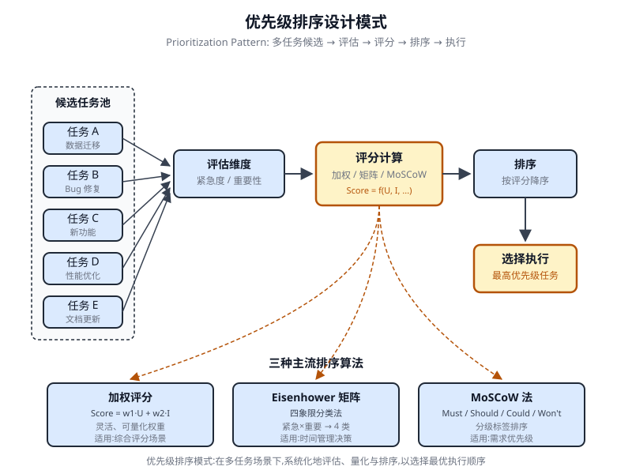

# 第 20 章 优先级排序(Prioritization)

<!-- chapter: 20 | part: I | pages: 332-341 | translated_from: pdf/332-341 -->

在复杂、动态的环境中，智能体(Agent)经常会面临大量潜在行动、冲突的目标以及有限的资源。如果没有定义明确的过程来确定后续行动，智能体可能会出现效率降低、运行延迟或未能达成关键目标的情况。优先级排序(Prioritization)模式通过使智能体能够根据重要性、紧迫性、依赖关系以及既定标准来评估和排列任务、目标或行动，从而解决了这一问题。这确保了智能体能够将精力集中在最关键的任务上，从而提高效率并更好地对齐目标。

## 优先级排序模式概述

智能体运用优先级排序来有效管理任务、目标和子目标，从而指导后续行动。当面临多种需求时，该过程有助于做出明智的决策，将关键或紧急的活动置于不那么重要的活动之上。在资源受限、时间有限且目标可能相互冲突的现实场景中，该模式尤为相关。

智能体优先级排序的基本要素通常涉及以下几个方面。首先，标准定义确立了任务评估的规则或度量标准。这些标准可以包括紧急程度(任务的时间敏感性)、重要性(对主要目标的影响)、依赖关系(该任务是否为其他任务的前置条件)、资源可用性(必要工具或信息的就绪状态)、成本/收益分析(投入与预期产出之比),以及个性化智能体的用户偏好。其次，任务评估涉及根据这些已定义的标准对每个潜在任务进行评估，所采用的方法涵盖

## 实际应用与用例

在各种实际应用中，智能体展示了运用优先级排序进行及时有效决策的成熟能力。

- **自动化客户支持**:智能体将紧急请求(如系统故障报告)置于常规事务(如密码重置)之上。它们也可以给予高价值客户优先处理。
- **云计算**:AI 通过优先级排序管理并调度资源，在高峰时段优先将资源分配给关键应用，同时将不太紧急的批处理作业推迟到非高峰时段以优化成本。
- **自动驾驶系统**:持续对动作进行优先级排序以确保安全与效率。例如，为避免碰撞而采取的制动优先于保持车道纪律或优化燃油效率。
- **金融交易**:交易机器人通过分析市场状况、风险承受能力、利润空间以及实时新闻等因素对交易进行优先级排序，从而实现高优先级交易的快速执行。
- **项目管理**:智能体根据截止日期、依赖关系、团队可用性以及战略重要性对项目看板上的任务进行优先级排序。
- **网络安全**:监控网络流量的智能体通过评估威胁严重程度、潜在影响以及资产关键性来对告警进行优先级排序，确保对最危险威胁的即时响应。
- **个人助理 AI**:利用优先级排序管理日常事务，根据用户定义的重要性、即将到来的截止日期以及当前上下文来组织日历事件、提醒和通知。

这些示例共同说明了优先级排序能力对于提升智能体在广泛场景下的性能与决策能力是多么根本。

```python
Hands-On Code Example
The following demonstrates the development of a Project Manager AI agent
using LangChain. This agent facilitates the creation, prioritization, and assign-
ment of tasks to team members, illustrating the application of large language
models with bespoke tools for automated project management.
   import os
   import asyncio
   from typing import List, Optional, Dict, Type
   from dotenv import load_dotenv
   from pydantic import BaseModel, Field
   from langchain_core.prompts import ChatPromptTemplate
   from langchain_core.tools import Tool
   from langchain_openai import ChatOpenAI
   from langchain.agents import AgentExecutor, create_react_agent
   from langchain.memory import ConversationBufferMemory
   # --- 0. Configuration and Setup ---
   # Loads the OPENAI_API_KEY from the .env file.
   load_dotenv()
   # The ChatOpenAI client automatically picks up the API key from
   the environment.
   llm = ChatOpenAI(temperature=0.5, model="gpt-4o-mini")
   # --- 1. Task Management System ---
   class Task(BaseModel):
      """Represents a single task in the system."""
      id: str
      description: str
      priority: Optional[str] = None # P0, P1, P2
      assigned_to: Optional[str] = None # Name of the worker
   class SuperSimpleTaskManager:
      """An efficient and robust in-memory task manager."""
      def __init__(self):
         # Use a dictionary for O(1) lookups, updates, and
  deletions.
         self.tasks: Dict[str, Task] = {}
         self.next_task_id = 1
     def create_task(self, description: str) -> Task:
         """Creates and stores a new task."""
         task_id = f"TASK-{self.next_task_id:03d}"
         new_task = Task(id=task_id, description=description)
         self.tasks[task_id] = new_task
         self.next_task_id += 1
         print(f"DEBUG: Task created - {task_id}: {description}")
         return new_task
     def update_task(self, task_id: str, **kwargs) -> Optional[Task]:
                                                            """Safely
  updates a task using Pydantic's model_copy."""
         task = self.tasks.get(task_id)
         if task:
             # Use model_copy for type-safe updates.
             update_data = {k: v for k, v in kwargs.items() if v
  is not None}
             updated_task = task.model_copy(update=update_data)
             self.tasks[task_id] = updated_task
             print(f"DEBUG: Task {task_id} updated with
  {update_data}")
             return updated_task
         print(f"DEBUG: Task {task_id} not found for update.")
         return None
     def list_all_tasks(self) -> str:
         """Lists all tasks currently in the system."""
         if not self.tasks:
             return "No tasks in the system."
         task_strings = []
         for task in self.tasks.values():
             task_strings.append(
                 f"ID: {task.id}, Desc: '{task.description}', "
                 f"Priority: {task.priority or 'N/A'}, "
                 f"Assigned To: {task.assigned_to or 'N/A'}"
             )
         return "Current Tasks:\n" + "\n".join(task_strings)
  task_manager = SuperSimpleTaskManager()
  # --- 2. Tools for the Project Manager Agent ---
  # Use Pydantic models for tool arguments for better validation
  and clarity.
  class CreateTaskArgs(BaseModel):
     description: str = Field(description="A detailed description
  of the task.")
  class PriorityArgs(BaseModel):
     task_id: str = Field(description="The ID of the task to
  update, e.g., 'TASK-001'.")
   priority: str = Field(description="The priority to set. Must
be one of: 'P0', 'P1', 'P2'.")
class AssignWorkerArgs(BaseModel):
   task_id: str = Field(description="The ID of the task to
update, e.g., 'TASK-001'.")
   worker_name: str = Field(description="The name of the worker
to assign the task to.")
def create_new_task_tool(description: str) -> str:
   """Creates a new project task with the given description."""
   task = task_manager.create_task(description)
   return f"Created task {task.id}: '{task.description}'."
def    assign_priority_to_task_tool(task_id:     str,    priority:
str) -> str:
   """Assigns a priority (P0, P1, P2) to a given task ID."""
   if priority not in ["P0", "P1", "P2"]:
       return "Invalid priority. Must be P0, P1, or P2."
   task = task_manager.update_task(task_id, priority=priority)
   return f"Assigned priority {priority} to task {task.id}." if
task else f"Task {task_id} not found."
def    assign_task_to_worker_tool(task_id:    str,    worker_name:
str) -> str:
   """Assigns a task to a specific worker."""
   task
= task_manager.update_task(task_id, assigned_to=worker_name)
   return f"Assigned task {task.id} to {worker_name}." if task
else f"Task {task_id} not found."
# All tools the PM agent can use
pm_tools = [
   Tool(
       name="create_new_task",
       func=create_new_task_tool,
       description="Use this first to create a new task and get
its ID.",
       args_schema=CreateTaskArgs
   ),
   Tool(
       name="assign_priority_to_task",
       func=assign_priority_to_task_tool,
       description="Use this to assign a priority to a task after
it has been created.",
       args_schema=PriorityArgs
   ),
   Tool(
       name="assign_task_to_worker",
       func=assign_task_to_worker_tool,
       description="Use this to assign a task to a specific worker
after it has been created.",
       args_schema=AssignWorkerArgs
   ),
     Tool(
         name="list_all_tasks",
         func=task_manager.list_all_tasks,
         description="Use this to list all current tasks and their
  status."
     ),
  ]
  # --- 3. Project Manager Agent Definition ---
  pm_prompt_template = ChatPromptTemplate.from_messages([
     ("system", """You are a focused Project Manager LLM agent.
  Your goal is to manage project tasks efficiently.
     When you receive a new task request, follow these steps:
     1. First, create the task with the given description using
  the `create_new_task` tool. You must do this first to get a
  `task_id`.
     2. Next, analyze the user's request to see if a priority or
  an assignee is mentioned.
         - If a priority is mentioned (e.g., "urgent", "ASAP",
  "critical"), map it to P0. Use `assign_priority_to_task`.
         - If a worker is mentioned, use `assign_task_to_worker`.
     3. If any information (priority, assignee) is missing, you
  must make a reasonable default assignment (e.g., assign P1 pri-
  ority and assign to 'Worker A').
     4. Once the task is fully processed, use `list_all_tasks`
  to show the final state.
     Available workers: 'Worker A', 'Worker B', 'Review Team'
     Priority levels: P0 (highest), P1 (medium), P2 (lowest)
     """),
     ("placeholder", "{chat_history}"),
     ("human", "{input}"),
     ("placeholder", "{agent_scratchpad}")
  ])
  # Create the agent executor
  pm_agent    =   create_react_agent(llm,   pm_tools,   pm_prompt_
  template)
  pm_agent_executor = AgentExecutor(
     agent=pm_agent,
     tools=pm_tools,
     verbose=True,
     handle_parsing_errors=True,
      memory=ConversationBufferMemory(memory_key="chat_history",
  return_messages=True)
  )
  # --- 4. Simple Interaction Flow ---
  async def run_simulation():
     print("--- Project Manager Simulation ---")
     # Scenario 1: Handle a new, urgent feature request
     print("\n[User Request] I need a new login system implemented
  ASAP. It should be assigned to Worker B.")
     await pm_agent_executor.ainvoke({"input": "Create a task to
  implement a new login system. It's urgent and should be assigned
  to Worker B."})
     print("\n" + "-"*60 + "\n")
      # Scenario 2: Handle a less urgent content update with
  fewer details
     print("[User Request] We need to review the marketing website
  content.")
     await pm_agent_executor.ainvoke({"input": "Manage a new
  task: Review marketing website content."})
     print("\n--- Simulation Complete ---")
  # Run the simulation
  if __name__ == "__main__":
     asyncio.run(run_simulation())
```

这段代码实现了一个基于 Python 和 LangChain 的简单任务管理系统，旨在模拟由大语言模型驱动的项目经理智能体(Agent)。该系统使用 `SuperSimpleTaskManager` 类在内存中高效管理任务，利用字典结构实现快速数据检索。每个任务由一个 `Task` Pydantic 模型表示，该模型包含唯一标识符、描述文本、可选的优先级级别(P0、P1、P2)以及可选的负责人分配等属性。内存使用量根据任务类型、工作者数量以及其他相关因素而有所不同。任务管理器提供了任务创建、任务修改以及获取所有任务的方法。智能体通过一组预定义的工具与任务管理器交互。这些工具支持创建新任务、为任务分配优先级、将任务分配给指定人员以及列出所有任务。每个工具都被封装为能够与 `SuperSimpleTaskManager` 实例进行交互。代码使用 Pydantic 模型来明确工具所需的参数，从而确保数据验证。`AgentExecutor` 与语言模型、工具集以及用于维护上下文连续性的对话记忆组件进行了配置。代码定义了一个特定的 `ChatPromptTemplate`,用于引导智能体在项目管理角色中的行为。该提示指示智能体首先创建一个任务，然后按规定分配优先级和负责人，并以一份完整的任务列表作为结束。对于信息缺失的情况，提示中规定了默认分配，例如 P1 优先级和"Worker A"。代码包含一个异步性质的模拟函数(`run_simulation`),用于演示智能体的运行能力。

模拟运行两个不同的场景：一项指定了负责人的紧急任务的管理，以及一项输入极少的低优先级任务的管理。由于在 AgentExecutor 中设置了 verbose=True,智能体的行为与逻辑流程会输出到控制台。

## 概览

**问题**：在复杂环境中运行的智能体(Agent)面临着大量潜在动作、互相冲突的目标以及有限的资源。如果没有明确的方法来决定下一步行动，这些智能体就有可能变得低效甚至失效。这可能导致严重的运行延迟，或完全无法完成主要目标。核心挑战在于管理这些数量庞大的选项，以确保智能体的行动既有目的性又合乎逻辑。

为什么

优先级排序(Prioritization)模式为这一问题提供了标准化解决方案，它使智能体能够对任务和目标进行排序。这是通过建立明确的评估标准来实现的，例如紧迫性、重要性、依赖关系和资源成本。智能体随后根据这些标准评估每个潜在行动，以确定最关键且最及时的行动方案。这种智能体式(Agentic)能力使系统能够动态地适应不断变化的环境，并有效管理受限资源。通过专注于优先级最高的项目，智能体的行为变得更加智能、稳健，并与其战略目标保持一致。

> **经验法则** 当智能体式系统必须在资源受限条件下自主管理多个(常常相互冲突的)任务或目标，以在动态环境中有效运行时，应使用优先级排序(Prioritization)模式。

## 视觉摘要(图 20.1)



**图 20.1 优先级排序设计模式**

- 优先级排序(Prioritization)使 AI 智能体能够在复杂、多面化的环境中有效运作。
- 智能体利用紧迫性、重要性、依赖关系等既定标准来评估和排序任务。
- 动态重新排序使智能体能够根据实时变化调整其运营重点。
- 优先级排序发生在多个层级，涵盖总体战略目标和即时战术决策。
- 有效的优先级排序能够提升 AI 智能体的效率与运行稳健性。

## 结论

综上所述，优先级排序(Prioritization)模式是高效智能体式 AI 的基石，它使系统能够有目的、有智慧地驾驭动态环境的复杂性。它允许智能体自主评估大量相互冲突的任务和目标，并就如何分配其有限资源做出有理有据的决策。这种智能体式能力超越了简单的任务执行，使系统能够充当主动的、战略性的决策者。通过权衡紧迫性、重要性和依赖关系等标准，智能体展现出复杂的、类人(类人类)的推理过程。

这种智能体式行为的一个关键特征是动态重新优先级排序，它赋予智能体自主权，使其能够在条件变化时实时调整关注焦点。正如代码示例所示，智能体能够解读含义模糊的请求，自主选择并使用适当的工具，并逻辑地安排其行动顺序以实现其目标。这种管理工作流的能力是将真正的智能体系统与简单的自动化脚本区分开来的关键。最终，掌握优先级排序对于创建能够在任何复杂的现实场景中有效且可靠地运行的健壮智能体至关重要。

AI 驱动的决策支持系统在敏捷软件项目管理中的应用：增强风险缓解与资源分配；https://www.mdpi.com/2079-8954/13/3/208

人工智能在项目管理中的安全性研究：信息系统项目中 AI 驱动的项目调度与资源分配案例研究；https://www.irejournals.com/paper-details/1706160

