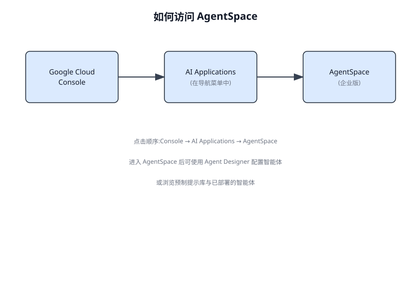
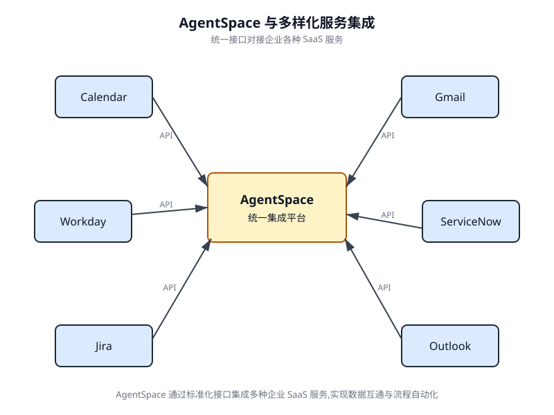
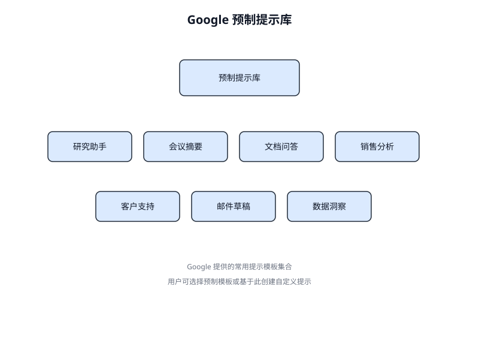
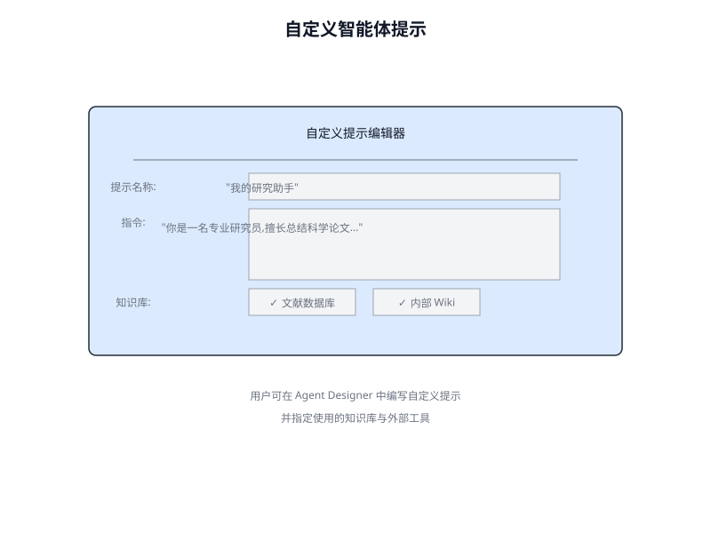
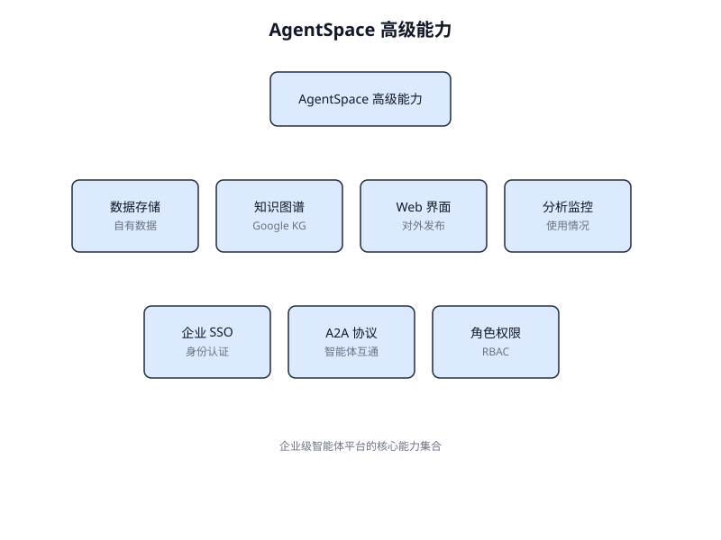
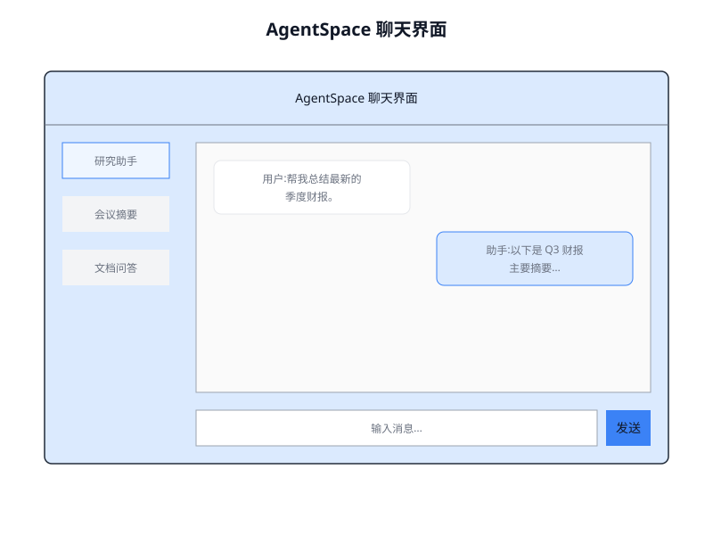

# 第 25 章 使用 AgentSpace 构建智能体(Building an Agent with AgentSpace)

<!-- chapter: 25 | en_title: Building an Agent with AgentSpace | part: II | pages: 402-407 -->

## 概览

AgentSpace 是一个旨在通过将人工智能融入日常工作流来促进"智能体驱动型企业"的平台。其核心是提供对企业整个数字足迹(包括文档、电子邮件和数据库)的统一搜索能力。该系统利用 Google Gemini 等先进 AI 模型来理解并综合来自这些不同来源的信息。

该平台支持创建与部署专业化的 AI "智能体",这些智能体能够执行复杂任务并自动化流程。这些智能体不仅是聊天机器人；它们能够进行推理、规划并自主执行多步操作。例如，一个智能体可以研究某个主题，整理带有引用的报告，甚至生成音频摘要。

为实现这一目标，AgentSpace 构建了一个企业知识图谱，映射人员、文档与数据之间的关系。这使 AI 能够理解上下文并提供更相关、更具个性化的结果。该平台还包括一个名为 Agent Designer 的无代码界面，用于在无需深厚技术专长的情况下创建自定义智能体。

此外，AgentSpace 支持多智能体系统，不同的 AI 智能体可以通过一种称为 Agent2Agent(A2A)协议的开放协议进行通信与协作。这种互操作性使更复杂、更具编排性的工作流成为可能。安全是基础性组件，提供基于角色的访问控制与数据加密等功能，以保护敏感的企业信息。最终，AgentSpace 旨在通过将智能、自主运行的系统直接嵌入组织的运营结构，来提升生产力与决策水平。

## 如何使用 AgentSpace 用户界面构建智能体

图 25.1 展示了如何通过从 Google Cloud Console 中选择 AI Applications 来访问 AgentSpace。

你的智能体能够连接各类服务，包括 Google 日历、Google 邮箱、Workday、Jira、Outlook 以及 Service Now(参见图 25.2)。

智能体随后可以使用自己的提示(Prompt),从 Google 提供的预制提示库中选择，如图 25.3 所示。

或者，你也可以按图 25.4 所示自行创建提示，该提示随后将被你的智能体使用。

AgentSpace 还提供了诸多高级特性，例如与用于存储自有数据的数据存储集成、与 Google Knowledge Graph 或你自己的私有 Knowledge Graph 集成、用于将你的智能体暴露到 Web 的 Web 界面，以及用于监控使用情况的分析功能等(见图 25.5)。

完成后，即可访问 AgentSpace 的聊天界面(图 25.6)。

## 结论

综上所述，AgentSpace 提供了一个实用的框架，用于在组织现有的数字基础设施内开发和部署人工智能智能体(Agent)。该系统的架构将复杂的后端流程(如自主推理和企业知识图谱映射)与用于构建智能体的图形用户界面相连接。通过该界面，用户可以通过集成各种数据服务并通过提示(Prompt)定义其操作参数来配置智能体，从而构建定制的、具备上下文感知能力的自动化系统。

这种方法抽象了底层的技术复杂性，使得构建专业化的多智能体系统无需深厚的编程专业知识。其主要目标是将自动化分析和运营能力直接嵌入到工作流(Workflow)中，从而提升流程效率并增强数据驱动的分析能力。为了获得实践指导，可以使用动手学习模块，例如 Google Cloud Skills Boost 上的 "Build a Gen AI Agent with Agentspace" 实验，该模块为技能学习提供了结构化的环境。

## 参考文献

- Agentspace 企业版官方文档：https://cloud.google.com/agentspace/agentspace-enterprise/docs/agent-designer
- Google Cloud Skills Boost:https://www.cloudskillsboost.google/
