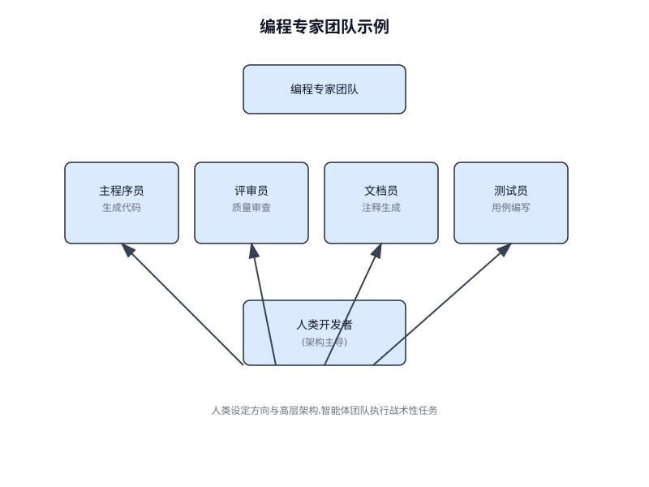

# 第 28 章 编程智能体(Coding Agents)

<!-- chapter: 28 | en_title: Coding Agents | part: II | pages: 431-438 -->

## 氛围编码：起点

"Vibe coding"(氛围编程)已成为一种用于快速创新与创造性探索的强大技术。这种实践涉及使用 LLM 生成初稿、勾勒复杂逻辑的轮廓，或构建快速原型，从而显著降低初始摩擦。它对于克服"白纸"问题尤为珍贵，能够使开发者快速从模糊的概念过渡到切实可运行的代码。Vibe coding 在探索不熟悉的 API 或测试新颖架构模式时尤其有效，因为它绕开了对完美实现的即时需求。生成的代码往往充当一种创造性催化剂，为开发者提供批评、重构与扩展的基础。其主要优势在于能够加速软件生命周期中初始的探索与构思阶段。然而，虽然 vibe coding 在头脑风暴方面表现出色，但要开发健壮、可扩展且可维护的软件，则需要一种更为结构化的方法，从纯粹的生成转向与专门的编程智能体进行协作式合作。

## 智能体作为团队成员

虽然最初的浪潮聚焦于原始代码生成——即最适合构思阶段的"vibe code"——但业界现在正转向一种更为集成、更强大的生产工作范式。最有效的开发团队不仅将任务委托给智能体；他们正以一套成熟的编程智能体来增强自身能力。这些智能体充当不知疲倦的、知识渊博的队友，擅长特定任务(如代码评审、重构、文档撰写和测试生成),而人类开发者则专注于高层架构、复杂问题解决与产品愿景。

## 实践实施

### 设置清单

为有效实施人机协作团队框架，推荐以下设置，重点在于保持控制力的同时提升效率(图 28.1)。

1. **配置前沿模型的访问权限**:为至少两个领先的大语言模型(Large Language Model)获取 API 密钥，例如 Gemini 2.5 Pro 和 Claude 4 Opus。这种双供应商方案便于进行对比分析，并可应对单一平台的局限或宕机风险。这些凭据应当像其他生产环境密钥一样安全管理。

2. **实施本地上下文编排器**:不要使用临时脚本，而应采用轻量级 CLI 工具或本地智能体运行器来管理上下文。这些工具应当允许你在项目根目录定义一个简单的配置文件(例如 `context.toml`),指定哪些文件、目录甚至 URL 需要被编译进 LLM 提示的单一负载中。这确保你对模型在每次请求时所看到的内容保持完全、透明的掌控。

3. **建立版本化的提示库**:在你的项目 Git 仓库中创建一个专用的 `/prompts` 目录。其中，以 Markdown 文件形式存储每个专业智能体的调用提示(例如 `reviewer.md`、`documenter.md`、`tester.md`)。将提示视为代码，使整个团队能够长期协作改进并版本化对 AI 智能体的指令。

4. **将智能体工作流与 Git 钩子集成**:通过使用本地 Git 钩子来自动化你的评审节奏。例如，可以配置 `pre-commit` 钩子，自动对已暂存文件触发评审器(Reviewer Agent)。该智能体的批评与反思摘要可以直接在终端呈现，在提交最终化之前提供即时反馈，并将质量保证步骤直接嵌入到你的开发流程中。

## 领导增强型团队的原则

成功领导这一框架，需要从独立贡献者转变为人类与 AI 团队的领导者，遵循以下原则：

- **保持架构主导权**:你的角色是设定战略方向并掌控高层架构。你定义"做什么"和"为什么",利用智能体团队来加速"如何做"。你是设计的最终仲裁者，确保每个组件都符合项目的长期愿景和质量标准。
- **掌握简报的艺术**:智能体输出的质量直接反映了其输入的质量。通过为每个任务提供清晰、无歧义且全面的上下文，掌握简报的艺术。将你的提示视为给一位新加入的、高能力的团队成员的完整简报包，而不仅仅是一条简单的指令。
- **充当最终质量关口**:智能体的输出始终是提案，而非命令。将评审器智能体的反馈视为强有力的信号，但你才是最终的质量关口。运用你的领域专业知识和项目特定知识来验证、质疑并批准所有变更，充当代码库完整性的最终守护者。
- **进行迭代对话**:最佳结果源于对话，而非独白。如果智能体的初始输出不完美，不要丢弃它——而是改进它。提供修正性反馈，补充澄清性上下文，并提示其再次尝试。这种迭代对话至关重要，尤其是与评审器智能体交互时，其"反思(Reflection)"输出旨在成为协作讨论的起点，而不仅仅是一份最终报告。

## 结论

代码开发的未来已然到来，而它是增强型的。孤独编码者的时代已经让位于一种新范式——开发者领导着由专门化 AI 智能体组成的团队。这种模式并未削弱人类的角色；它通过自动化日常任务、放大个人影响力、并实现以往难以想象的开发速度，从而提升了人类的角色。

通过将战术性执行工作卸载给智能体，开发者如今能够将认知精力投入到真正重要的事情上：战略创新、富有韧性的架构设计，以及构建令用户愉悦的产品所必需的创造性问题解决。根本性的关系已被重新定义；它不再是人类与机器的对决，而是人类智慧与 AI 之间的伙伴关系，作为一个无缝集成的团队协同工作。

## 参考文献

- AI 负责生成 Google 超过 30% 的代码 <https://www.reddit.com/r/singularity/comments/1k7rxo0/ai_is_now_writing_well_over_30_of_the_code_at/>
- AI 负责生成 Microsoft 超过 30% 的代码 <https://www.businesstoday.in/tech-today/news/story/30-of-microsofts-code-is-now-ai-generated-says-ceo-satya-nadella-474167-2025-04-30>
