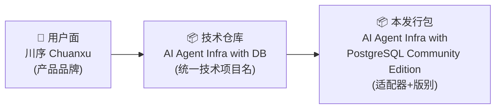
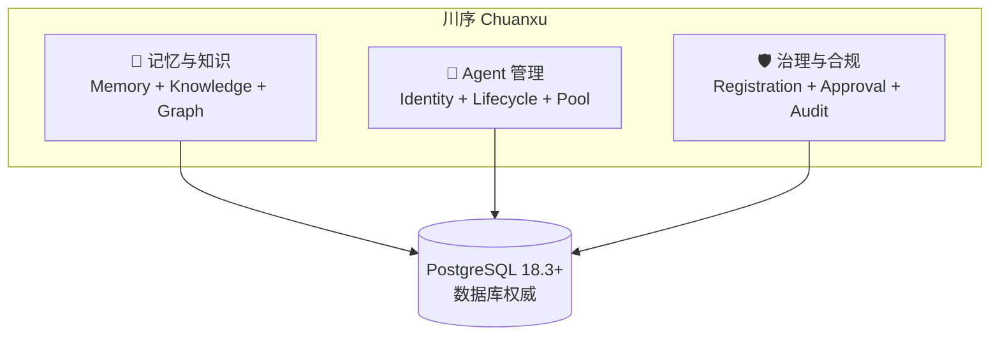

# §01 产品定位与技术命名

> 🏛️ 架构师 · 👤 用户 · 🧑‍💻 开发者
>
> **一句话定位**:川序 (Chuanxu) 是把 AI Agent 基础设施收敛到 PostgreSQL 单内核的管理平台,本仓库是它在 PostgreSQL 上的 **Apache 2.0 社区版 v4.3.5** 技术发行包。

---

## 1. 三层命名体系

项目里有三种"名字",它们指向同一件事,但用在不同场合:

| 层级 | 名称 | 用途 | 出处 |
|---|---|---|---|
| **产品品牌** | 川序 / Chuanxu | 用户面、官网、市场 | `README.md:13` "Chuanxu / 川序 is the AI Agent Management Platform" |
| **统一技术项目名** | AI Agent Infra with DB | 源码仓库、CI、版本号 | `build-manifest.json:8` `"technical_project": "AI Agent Infra with DB"` |
| **本发行包名** | AI Agent Infra with PostgreSQL (Community Edition) | 包分发、安装包命名 | `README.md:1` "v4.3.5 · Community Edition · PostgreSQL" |

> 💡 三层不是三个独立产品,而是同一产品在不同抽象层的名字。这避免了"川序 vs Infra with DB"是"两个产品"或"两个代码库"的误解。

---

## 2. 产品定位与价值主张

### 2.1 一句话定位

> "把 AI Agent 运行所需的一切基础设施——记忆、知识、身份、技能、安全、分支——统一收敛于一个数据库内核之中"

来源:[docs/introduction_zh.md:34-36](introduction_zh.md)

### 2.2 与"传统方案"的对比

| 传统方案 | 川序方案 | 受益 |
|---|---|---|
| Redis (缓存) + Vector DB (向量) + Graph DB (图) + Object Store (对象存储) | 单 PostgreSQL 内核 + `pgvector` + `pg_trgm` + RLS + `pgcrypto` + `pg_cron` + Apache AGE | 减少 4 个外部依赖,事务一致性强,运维成本低 |
| 多 Agent 框架各搞一套记忆/知识 | Skill-first + 框架中立 | OpenClaw / Hermes Agent 等已确认可集成,见 [`SKILL.md:22-28`](../SKILL.md) |
| 治理与 Agent 运行时耦合 | 治理平面是数据库事实 | 注册、审批、审计、紧急停用都是行级数据,可独立审计 |

### 2.3 三大核心能力

---

## 3. v4.3.5 价值主张

v4.3.5 (2026-08-05) 的核心交付物是**数据库权威的平台功能配置** ([`RELEASE_NOTES_v4.3.5.md:5-25`](../RELEASE_NOTES_v4.3.5.md)):

> "一个能力可用,当且仅当:① 包内物理存在该功能;② 数据库注册表启用;③ 当前 Principal 拥有对应动作权限。"

具体内容:

| 特性 | 出处 | 关键表 |
|---|---|---|
| 受保护的能力注册表 + 依赖图 + 不可变历史 | `RELEASE_NOTES_v4.3.5.md:7-25` | `cx_platform_capabilities`, `cx_platform_capability_dependencies`, `cx_platform_capability_history` |
| 后端强制启用检查(前端隐藏 ≠ 绕过) | `docs/security.md:5-19` | `web_app.py:enforce_platform_capability` |
| 强制受保护能力不能禁用(身份、授权、安全、审计、Agent、用户、平台配置) | `RELEASE_NOTES_v4.3.5.md:13-15` | mandatory 标志 |
| 乐观锁 + 原因必填 + 审计同事务 | `RELEASE_NOTES_v4.3.5.md:20-23` | `cx_platform_capability_history` + `CX_SECURITY_EVENTS` |
| Admin Skill token 从 URL 切到 `X-Admin-Token` 头 | `RELEASE_NOTES_v4.3.5.md:38` | 不入 URL,避免泄露 |
| Oracle End User 名在动态 DDL 前强校验 | `RELEASE_NOTES_v4.3.5.md:39` | 防止 SQL 注入 |

---

## 4. 社区版 (Community) vs 企业版 (Enterprise)

来源:[`SKILL.md:33-41`](../SKILL.md)

| 维度 | Community (本仓库) | Enterprise |
|---|---|---|
| **许可证** | Apache 2.0 | BSL 1.1 |
| **默认端口** | 18080 | 18090 |
| **包含** | 完整记忆/知识/Graph APIs、Loop Engineering、MCP/Skill 集成、Portal、Registered-Agent 纳管、离线部署 | + Resource Catalog、Resource Policies、N-of-M 审批、紧急控制、风险审计、证据导出、每 Agent 独立加密密钥、LDAP、合规日志、Skill 令牌、Orchestrator 审批 |
| **物理边界** | 不包含 Enterprise 模块代码 | 通过 `edition_features.has_feature(name)` 在运行时判断 |

社区版的运行时**无法**通过数据库配置"开启"企业能力 — 二者是**构建期**(build-time)的物理边界,而非运行时开关。

---

## 5. 受众速览

| 受众 | 关心的 | 重点章节 |
|---|---|---|
| 🏛️ **架构师** | 边界契约、为什么这么设计、扩展点 | [§10 数据库权威哲学](10-数据库权威设计哲学.md)、[§11 整体架构](11-整体技术架构.md) |
| 🧑‍💻 **开发者** | 怎么部署、怎么改代码、怎么加新功能 | [§20 本地开发环境](20-本地开发环境搭建.md)、[§22 SQL 迁移](22-SQL迁移脚本导览.md) |
| 👤 **用户/运维** | 怎么用 Dashboard、怎么管 Agent、怎么配置 | [§30 首次部署](30-首次部署与初始化.md)、[§32 Agent 注册](32-Agent注册与管理.md) |

---

## 6. 交叉引用

- 项目根目录的 [`README.md:13-22`](../README.md) 给出了完整的产品/技术命名说明
- [`docs/introduction_zh.md:23-37`](introduction_zh.md) 给出了中文版的产品定位与能力矩阵
- [`SKILL.md:24-50`](../SKILL.md) 给出了"操作员视角"的项目概览
- [`CHANGELOG.md:3-15`](../CHANGELOG.md) 给出了 v4.3.5 的具体变更

> 📌 **下一章**:[§02 五分钟架构总览](02-五分钟架构总览.md) — 用一张 Mermaid 总图带你"看"整个系统的拓扑与请求流。