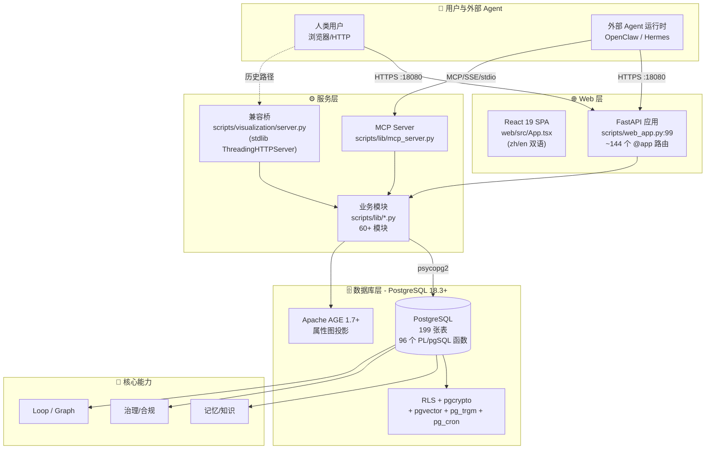
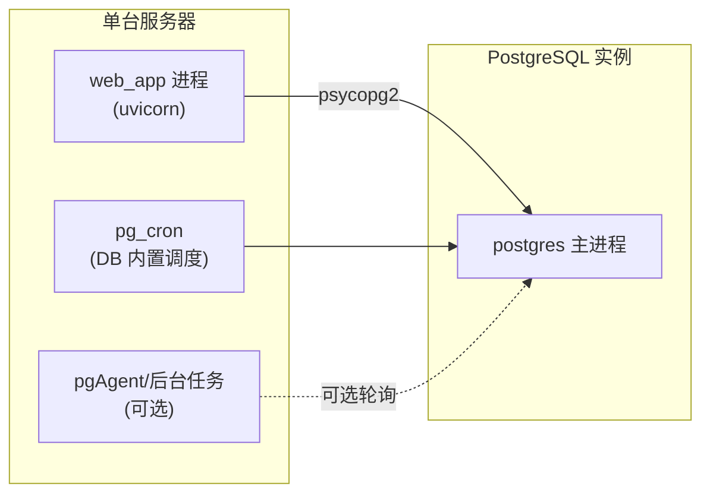

# §02 五分钟架构总览

> 🏛️ 架构师 · 🧑‍💻 开发者
>
> **一句话定位**:5 分钟内看懂川序的"控制面 + 数据面 + 执行面"分层,以及请求从浏览器/Agent 到数据库的完整路径。

---

## 1. 一张总架构图



> 📌 **关键观察**:数据库是**唯一**的事务/恢复/审计权威;Web/Worker/External Agent 都是数据库事实的"投影"和"触发器"。

---

## 2. 分层职责矩阵

| 层 | 职责 | 不应做 | 出处 |
|---|---|---|---|
| **Web 层** (React 19) | UI 渲染、表单提交、轮询 | 直接连数据库 | `web/src/App.tsx` 仅调 `fetch` |
| **API 层** (FastAPI `web_app.py`) | 路由分发、Principal 校验、CSRF、能力检查 | 业务计算、SQL 直写 | `web_app.py:_path_capability()` 强制后端能力检查 |
| **服务层** (`scripts/lib/*.py`) | 业务逻辑、事务编排、SQL 调用 | 直接接受 HTTP body 的 agent_id | `governed_contracts.py` 用纯函数做可移植决策 |
| **数据库层** (PostgreSQL) | 事务、约束、触发器、PL/pgSQL、向量/图/全文索引、RLS | 信任业务层传来的"身份" | `entity_access_log` + RLS 谓词 |

---

## 3. 请求生命周期(典型场景:用户在 Dashboard 创建一个 Memory)

```mermaid
sequenceDiagram
    autonumber
    participant U as 用户浏览器
    participant R as React SPA
    participant F as FastAPI web_app.py
    participant L as memory_api.py
    participant DB as PostgreSQL

    U->>R: 点击 "创建记忆"
    R->>F: POST /api/memory {body}
    F->>F: enforce_platform_capability('memory')
    F->>F: 校验 Session CSRF + Principal
    F->>L: create_memory(principal_id, body)
    L->>DB: BEGIN; INSERT INTO entities...
    DB->>DB: 触发器 + RLS 谓词检查 OWNED_BY_AGENT
    DB->>DB: 同步写入 entity_embeddings (pgvector)
    DB-->>L: 返回 entity_id
    L->>DB: COMMIT
    L-->>F: 200 OK {entity_id}
    F-->>R: JSON 响应
    R->>U: 列表刷新 + Toast 提示
```

> ⏱ **关键时延点**:步骤 7-9 的 INSERT + RLS 检查 + 向量嵌入写入在单事务内完成,无跨服务最终一致性窗口。

---

## 4. 关键不变量 (Invariants)

川序的设计围绕几条核心不变量,违反任一条都意味着安全/正确性破损:

| 不变量 | 含义 | 强制机制 |
|---|---|---|
| **数据库权威** | 所有持久事实只能由数据库写入,业务层只能"触发" | PL/pgSQL + 触发器 + RLS,业务层无直写路径 |
| **Principal 解算** | 每个请求必须解算到数据库 `cx_principals` 行的有效身份 | `web_app.py:Principal-aware middleware`,失败 fail-closed |
| **RLS 隔离** | Business Agent 不能读到他人的私有数据 | `app.current_agent_id` GUC + RLS 谓词 |
| **Schema Owner 不可回退** | Business Agent 永远不会拿到 Schema Owner 凭据 | `connection.py:get_connection_for_agent` 强制独立连接 |
| **Lease Token + Fencing** | Worker 完成后凭 token 校验,过期/失效不能覆盖 | `graph_runtime.py:_verify_lease()` |
| **Capability 三交集** | 一个能力可用 ⇔ 包内 + 数据库启用 + Principal 授权 | `platform_capabilities.is_enabled()` |

---

## 5. 端口与入口

| 入口 | 默认端口 | 协议 | 鉴权 | 出处 |
|---|---|---|---|---|
| Dashboard HTTP | **18080** | HTTPS | Session Cookie + CSRF | `SKILL.md:35`、`start_web_server.sh` |
| MCP Server (stdio) | - | stdin/stdout | Bearer Token | `scripts/lib/mcp_server.py` |
| MCP Server (SSE) | 同 18080 | Server-Sent Events | Bearer Token | `scripts/lib/mcp_server.py` |
| PostgreSQL | 5432 | TCP | RLS 谓词 + 业务 LOGIN | `config.json:database` |

> ⚠️ `start_web_server.sh` 默认绑定 `0.0.0.0:18080`,生产环境**必须**反向代理 + TLS,详见 [`docs/deployment.md`](deployment.md)。

---

## 6. 进程拓扑(单节点部署)



> 💡 v4.3.3 起,Runs/Checkpoints/Leases/Fencing 都由数据库权威,Worker 进程可由替代实例恢复 — 这是"应用层"的可恢复性,**不**等于"数据库 HA"。详见 [§45 高可用与恢复](45-高可用与恢复.md)。

---

## 7. 哪些代码在哪里

| 你想看的 | 路径 |
|---|---|
| **Web 入口(浏览器请求)** | `scripts/web_app.py` (FastAPI) |
| **Web 入口(传统 Dashboard)** | `scripts/visualization/server.py` (ThreadingHTTPServer) |
| **Web 前端 SPA** | `web/src/App.tsx` (单文件,约 7000 行) |
| **业务 Python 模块** | `scripts/lib/*.py` (60+ 文件) |
| **数据库表与 PL/pgSQL** | `scripts/deploy/*.sql` (28+ 文件,199 张表) |
| **运维 CLI** | `scripts/{agent_bootstrap,migration_runner,verify_deps,...}.py` |
| **配置/部署脚本** | `start_web_server.sh`、`config_wizard.sh`、`install_offline.sh` |

---

## 8. 交叉引用

- 架构师深度:[§10 数据库权威哲学](10-数据库权威设计哲学.md)、[§11 整体技术架构](11-整体技术架构.md)
- 开发者上手:[§20 本地开发环境](20-本地开发环境搭建.md)
- 用户上手:[§30 首次部署](30-首次部署与初始化.md)
- 现有参考:[`docs/architecture.md:1-50`](architecture.md) (v4.3.0 控制面章节)

> 📌 **下一章**:[§03 v4.3.5 新特性矩阵](03-v4.3.5新特性矩阵.md) — 看五个版本的演进时间线和每个版本的边界契约。