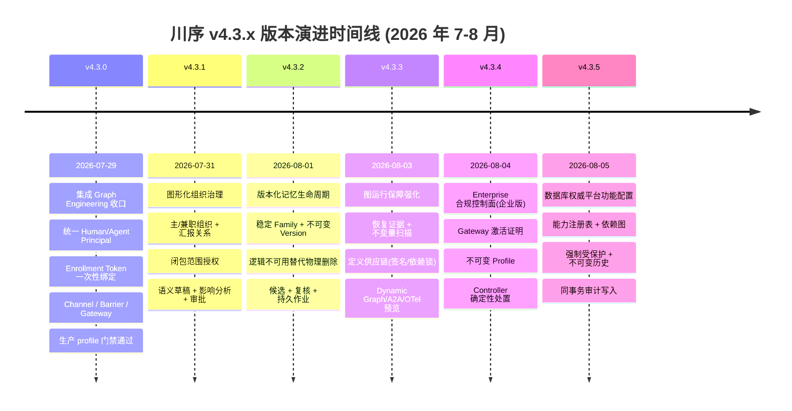
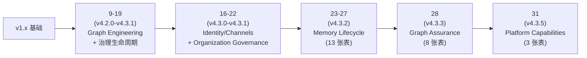
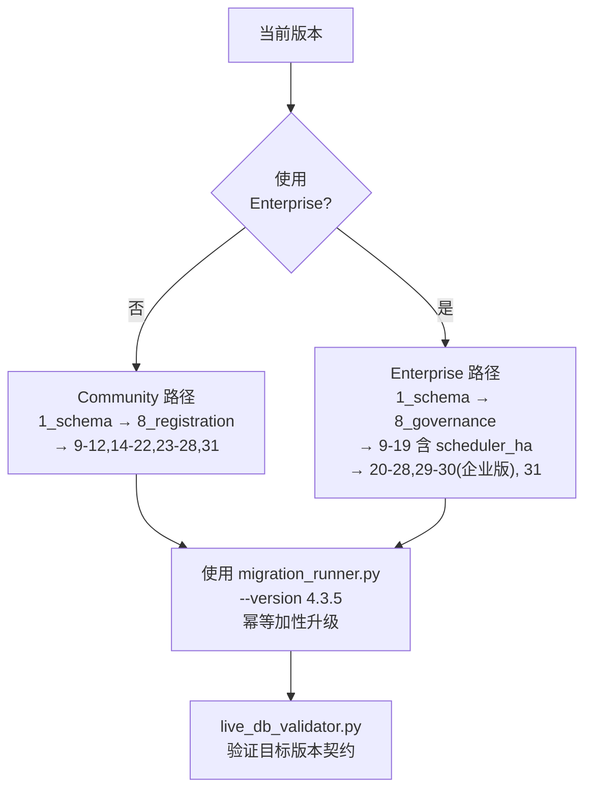

# §03 v4.3.5 新特性矩阵

> 🏛️ 架构师 · 👤 用户 · 🧑‍💻 开发者
>
> **一句话定位**:从 v4.3.0 到 v4.3.5 的五个版本不是"功能堆叠",而是**围绕"数据库权威治理"主线层层加固**。本章用时间线和契约矩阵讲清每个版本解决了什么、约束了什么。

---

## 1. 五版本演进时间线

> 📌 数据来源:[`CHANGELOG.md:3-65`](../CHANGELOG.md) 与 [`docs/CHANGELOG.md`](../CHANGELOG.md)。

---

## 2. 版本 → 边界契约矩阵

每个版本不是"加了多少 feature",而是"明确了什么边界"。下表把这种"边界"显式化:

| 版本 | 解决的核心问题 | 新增的边界契约 | 受影响的不变量 |
|---|---|---|---|
| **v4.3.0** | 多个旧分支(Identity/Channel/Governance/Graph)需要统一收敛 | Principal 必为数据库事实;Agent 一次性 Enrollment;Graph Definition 是 JSON 不可变 Draft | "数据库权威"被强化;新增"Agent 生命周期"维度 |
| **v4.3.1** | 组织信息此前散落在多个表,无图形化工作面 | 一个账号 = 一个 Human Principal = 一个组织人员;主组织唯一;`admin` 是系统恢复账号 | "主体身份"维度闭合;语义变更需经过 changeset |
| **v4.3.2** | Memory 的物理删除破坏了审计证据 | 物理删除 = 单独的合规工作流;日常"删除" = 标记 `UNAVAILABLE` / `ARCHIVED` | "Memory 不可物理删除"成为不变量 |
| **v4.3.3** | Graph Runtime 的恢复证据不足;Definition 供应链不可信 | Dynamic Graph/A2A/OTel 默认关闭;UNTRUSTED_DRAFT 必走治理评审 | "预览能力 ≠ 授权通道";无第二执行引擎 |
| **v4.3.4** (Enterprise) | 注册 Agent 缺乏 Gateway 激活证明;Profile 无版本控制 | 凭据激活证明 + 不可变 Profile + Controller 确定性处置 | "Prompt 文本不是授权边界"显式化 |
| **v4.3.5** | 能力可见性 ≠ 可用性,需要数据库权威开关 | 能力 = 包内 + 数据库启用 + Principal 授权 三交集;同事务审计 | "前端隐藏 ≠ 绕过"成为不变量 |

---

## 3. 版本 → 新增 SQL 文件索引

每个版本对应一组**加性**SQL 迁移(从不修改已部署的旧表结构):

| 版本 | SQL 迁移脚本 | 新增表数 | 出处 |
|---|---|---|---|
| v4.3.0 | `16_v4_3_0_identity_channels.sql`、`17_v4_3_0_governance_lifecycle.sql`、`18_v4_3_0_security_lifecycle.sql` | 31+3+12 = 46 | `CHANGELOG.md:79-95` |
| v4.3.1 | `19_v4_3_1_organization_governance.sql`、`20-22` (辅助) | 13 | `CHANGELOG.md:57-60` |
| v4.3.2 | `23_v4_3_2_memory_lifecycle.sql`、`24-27` | 16 | `CHANGELOG.md:46-54` |
| v4.3.3 | `28_v4_3_3_graph_assurance.sql` | 8 | `CHANGELOG.md:31-43` |
| v4.3.4 | Enterprise-only,Python 实现(`lib/compliance_api.py`) | 0 SQL | `CHANGELOG.md:16-29` |
| v4.3.5 | `31_v4_3_5_platform_capabilities.sql` | 3 | `CHANGELOG.md:3-14` |

> ⚠️ v4.3.4 合规控制面**不**通过 SQL,而是通过 Python 模块;这是因为合规逻辑需要分布式租约/围栏/Controller 协作,不是纯数据表能解决的。详见 [§41 合规控制面](41-合规控制面v4.3.4.md)。

---

## 4. 版本 → 文档/源码影响矩阵

| 版本 | 主要影响的模块 | 主要影响的文档 |
|---|---|---|
| v4.3.0 | `lib/identity_api.py`、`lib/agent_gateway_api.py`、`lib/graph_*` | `architecture.md` 全部重写 |
| v4.3.1 | `lib/organization_api.py`、`web/src/App.tsx` 的 Organization 页 | 新增 [`docs/organization-governance.md`](organization-governance.md) |
| v4.3.2 | `lib/memory_lifecycle.py`、`web/src/App.tsx` 的 Memory 5 大视图 | 新增 [`docs/memory-lifecycle.md`](memory-lifecycle.md) |
| v4.3.3 | `lib/graph_assurance.py`、`lib/graph_supply_chain.py` | `architecture.md` 增加 Trustworthy Runtime 节 |
| v4.3.4 | `lib/compliance_api.py`、Compliance Controller 线程 | `security.md` 大幅扩展 |
| v4.3.5 | `lib/platform_capabilities.py`、`web/src/App.tsx` 的 Platform 页 | `RELEASE_NOTES_v4.3.5.md` |

---

## 5. 升级路径速查

详细步骤见 [§47 数据库迁移运维](47-数据库迁移运维.md) 和 [`docs/migration.md`](migration.md)。

---

## 6. "这版本该不该升级"决策卡

| 你的场景 | 推荐升级到 | 原因 |
|---|---|---|
| 仅本地开发 / 学习 | v4.3.5 | 总是最新版 |
| 生产环境,未启用 Graph Runtime | v4.3.5 | 增量升级安全,失败可回滚 |
| 已在使用 Graph Definition | v4.3.3 → v4.3.5 | v4.3.3 增加签名验证(UNTRUSTED_DRAFT 门) |
| 已在使用 Memory Dashboard | v4.3.2 → v4.3.5 | v4.3.2 起 Memory 受版本控制 |
| Enterprise 用户,需要合规审计 | v4.3.4 → v4.3.5 | v4.3.4 提供 Controller 处置 |
| 多节点部署 | v4.3.3+ | 需要恢复证据 + 节点回收 |

---

## 7. 交叉引用

- v4.3.5 详细说明:[`RELEASE_NOTES_v4.3.5.md`](../RELEASE_NOTES_v4.3.5.md)、[§19 Profile 与 Capability 配置平面](19-Profile与Capability配置平面.md)
- 各版本架构文档:[`docs/architecture.md`](architecture.md)
- 完整变更日志:[`CHANGELOG.md`](../CHANGELOG.md)
- 历史里程碑(更早版本):[§50 版本演进历史](50-版本演进历史.md)

> 📌 **下一章**:[§04 三种读者阅读路径](04-三种读者阅读路径.md) — 三种身份各自的推荐阅读顺序与速查卡片。