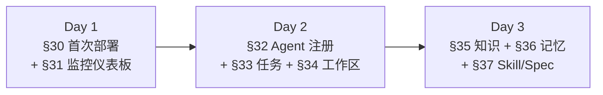

# §04 三种读者阅读路径

> 🏛️ 架构师 · 👤 用户 · 🧑‍💻 开发者
>
> **一句话定位**:不同身份关心的问题不同,本章给出三种身份各自的**最少必要阅读路径**与**速查卡片**,避免新手从第一章啃到最后一章。

---

## 1. 三种身份的"5 问 5 答"

| 问题 | 🏛️ 架构师 | 🧑‍💻 开发者 | 👤 用户/运维 |
|---|---|---|---|
| **为什么这么设计?** | [§10](10-数据库权威设计哲学.md)、[§11](11-整体技术架构.md) | [§22 SQL 迁移](22-SQL迁移脚本导览.md)、[§23 Python 模块](23-Python业务模块导览.md) | [§01 产品定位](01-产品定位与技术命名.md) |
| **边界在哪?** | [§11-§19](11-整体技术架构.md) 各专题 | [§24 FastAPI](24-FastAPI-Web服务剖析.md) | [§30 首次部署](30-首次部署与初始化.md) |
| **怎么开始?** | [§22 迁移导览](22-SQL迁移脚本导览.md) | [§20 本地环境](20-本地开发环境搭建.md) | [§30 首次部署](30-首次部署与初始化.md) |
| **遇到问题?** | [§11 控制面](11-整体技术架构.md) | [§49 故障排查](49-常见故障排查.md)、[§27 测试](27-测试体系与pytest实践.md) | [§49 故障排查](49-常见故障排查.md) |
| **怎么扩展?** | [§17 治理面](17-Enterprise治理与合规控制面.md)、[§19 Capability](19-Profile与Capability配置平面.md) | [§29 扩展开发指南](29-扩展开发指南.md) | [§32 Agent 注册](32-Agent注册与管理.md)、[§37 Skill](37-技能与规格管理.md) |

---

## 2. 🏛️ 架构师 — 7 天阅读路径

**架构师速查卡片**:

| 我需要 | 跳到 |
|---|---|
| 系统总图 | [§02 5 分钟架构总览](02-五分钟架构总览.md) |
| 数据库表 ER 图 | [§22 SQL 迁移脚本导览](22-SQL迁移脚本导览.md) |
| Agent 状态机 | [§13 注册 Agent 治理平面](13-注册Agent治理平面.md) |
| Memory 状态机 | [§15 Memory Lifecycle 架构](15-Memory-Lifecycle架构.md) |
| Graph Runtime 状态机 | [§14 Graph Runtime 架构](14-Graph-Runtime架构.md) |
| 与 Oracle / YashanDB 的差异 | [§18 三数据库适配器边界](18-三数据库适配器边界.md) |

---

## 3. 🧑‍💻 开发者 — 5 天上手路径

**开发者速查卡片**:

| 我需要 | 跳到 |
|---|---|
| 跑起来 | [§20 本地开发环境搭建](20-本地开发环境搭建.md) |
| 添加一张表 | [§29 扩展开发指南](29-扩展开发指南.md) + [§22 SQL 迁移](22-SQL迁移脚本导览.md) |
| 加一个 HTTP 端点 | [§24 FastAPI 剖析](24-FastAPI-Web服务剖析.md) |
| 加一个 MCP 工具 | [§25 MCP Server 与 SKILL 契约](25-MCP-Server与SKILL契约.md) |
| 改 UI 页面 | [§26 Web 前端架构](26-Web前端架构.md) |
| 跑测试 | [§27 测试体系](27-测试体系与pytest实践.md) |
| 离线安装 | [§28 离线部署与 wheel 验证](28-离线部署与wheel验证.md) |

---

## 4. 👤 用户/运维 — 3 天上手路径

**用户/运维速查卡片**:

| 我需要 | 跳到 |
|---|---|
| 安装并启动 | [§30 首次部署](30-首次部署与初始化.md) |
| 看监控 | [§31 监控仪表板](31-监控仪表板Monitor.md) |
| 注册外部 Agent | [§32 Agent 注册与管理](32-Agent注册与管理.md) |
| 跑一个任务 | [§33 任务计划与执行](33-任务计划与执行.md) |
| 知识库搜索 | [§35 知识库管理](35-知识库管理.md) |
| 记忆库整理 | [§36 记忆库与生命周期](36-记忆库与生命周期.md) |
| 加载 Skill | [§37 技能与规格](37-技能与规格管理.md) |
| 多人协作 | [§40 频道关卡审批](40-频道-关卡-审批.md) |
| 应急处置 | [§44 应急控制](44-应急控制与紧急停用.md) |
| 出问题 | [§49 故障排查](49-常见故障排查.md) |

---

## 5. 进阶/跨视角 — 哪些章节"三视角通用"

以下章节**所有身份**都建议读,因为它们定义平台的基础行为契约:

- [§01 产品定位与技术命名](01-产品定位与技术命名.md) — 必读,避免沟通歧义
- [§02 五分钟架构总览](02-五分钟架构总览.md) — 5 分钟建立全局视野
- [§03 v4.3.5 新特性矩阵](03-v4.3.5新特性矩阵.md) — 知道"为什么有 v4.3.5"
- [§04 本章](04-三种读者阅读路径.md) — 找到自己下一步该读什么
- [§49 故障排查](49-常见故障排查.md) — 出问题时第一站
- [§54 术语表](54-术语表Glossary.md) — 遇到术语查一下

---

## 6. 阅读节奏建议

```mermaid
gantt
    title Handbook 阅读节奏建议 (假设每日 2 小时)
    dateFormat  X
    axisFormat %s
    section 架构师
    导读 (§01-04)        :a1, 0, 1
    §10 数据库哲学        :a2, 1, 3
    §11-13 控制面        :a3, 3, 6
    §14-16 数据面        :a4, 6, 9
    §17-19 治理面        :a5, 9, 12
    section 开发者
    §20-21 环境          :b1, 0, 2
    §22-23 模块          :b2, 2, 5
    §24-26 框架          :b3, 5, 8
    §27-29 扩展          :b4, 8, 12
    section 用户
    §30 首次部署          :c1, 0, 2
    §31-34 Dashboard     :c2, 2, 5
    §35-39 功能使用      :c3, 5, 8
```

---

## 7. 交叉引用

- 完整目录:[§00 总目录](00-总目录.md)
- 所有 Part:[§00 §00 总目录](00-总目录.md) 已按视角分组
- 速查索引:[§51 SQL 迁移索引](51-SQL迁移索引.md)、[§52 Python 模块索引](52-Python模块索引.md)、[§53 REST API 索引](53-REST-API索引.md)

> 📌 **下一步**:打开 [§00 总目录](00-总目录.md),根据自己的身份跳到对应 Part 第一章,开始阅读。