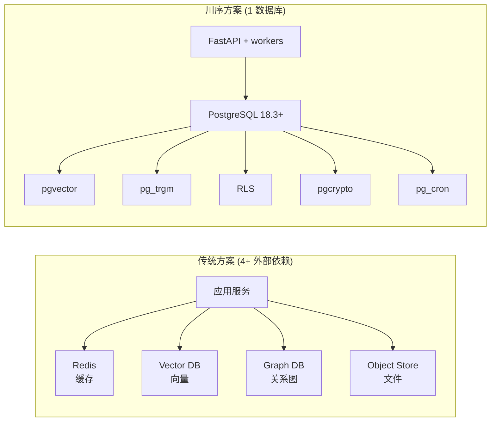
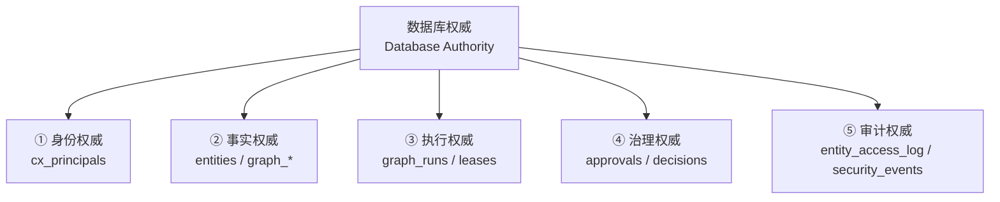

# §10 数据库权威设计哲学

> 🏛️ 架构师
>
> **一句话定位**:把"Agent 基础设施 = 多微服务栈"的传统方案,合并为"PostgreSQL 单内核"的依据、收益与代价。

---

## 1. 核心命题

> **数据库是 Agent 身份、记忆、知识、技能、执行、治理事实的唯一起点和终点;业务层只是数据库事实的"触发器"和"投影"。**

来源:[`docs/architecture.md:25-35`](architecture.md)、[`SKILL.md:24-36`](../SKILL.md)

这条命题直接拒绝了"业务层独立持久化 + DB 做镜像"的反模式。

---

## 2. 传统方案 vs 单库方案

| 维度 | 传统方案 | 川序方案 |
|---|---|---|
| 部署单元 | 4+ 服务 | 1 数据库 |
| 事务一致性 | 最终一致 | 单事务 ACID |
| 故障域 | 4 个 | 1 个 |
| 备份/恢复 | 4 个工具 | `pg_dump` / PITR |
| 索引类型 | 每库独立 | pgvector + pg_trgm + GIN + B-tree 协同 |
| 安全模型 | 各库各做 | RLS + pgcrypto 统一 |

---

## 3. 收益与代价

### 3.1 收益

1. **事务一致性**:Memory 创建 + 向量嵌入写入 + 访问日志 = 单事务。无需"补偿事务"或"saga"。
2. **审计可证**:所有事实都在数据库行里,可用 SQL 查询任意时间点的状态。
3. **恢复粒度**:基于 PostgreSQL 的 PITR,粒度可到秒。
4. **集成简单**:新功能即新表 + PL/pgSQL 函数 + Python 模块,无需引入新服务。

### 3.2 代价与缓解

| 代价 | 缓解策略 |
|---|---|
| 单库成为性能瓶颈 | 水平分片(扩展到 Enterprise);读副本 |
| 数据库承担太多职责,易成"大泥球" | 用 `cx_*` 与 `entities_*` 命名空间隔离;PL/pgSQL 与 Python 分层 |
| PostgreSQL 升级需要适配 | `live_db_validator.py` 三件套;`migration_runner.py` 幂等迁移 |
| 极端事务量场景不合适 | Enterprise 提供 HA scheduler;Graph 异步化 |

---

## 4. "数据库权威"的五个子边界

### 4.1 身份权威

来源:[`SKILL.md:43-51`](../SKILL.md)、[`docs/architecture.md:91-103`](architecture.md)

> 每个 Dashboard / Portal / Skill / MCP / Gateway 请求,必须解算到一个数据库事实的 Human 或 Agent Principal。失败 fail-closed。

机制:`web_app.py` 的 Principal-aware 中间件 → `cx_principals` 表 → Session CSRF → Permission Version 检查。

### 4.2 事实权威

来源:[`docs/architecture.md:25-35`](architecture.md)

> 实体、知识、记忆、任务、Skill 包、Agent 身份映射、执行策略、审批、Attempt、Lease、结果 — 全部是数据库事实。

机制:`entities` 多态表(8 类 ENTITY_TYPE 分区) + 子表 + 边表 + 嵌入表 + 标签表;所有写入走 PL/pgSQL 函数或带 RLS 的 Python 模块。

### 4.3 执行权威

来源:[`docs/graph-engineering.md`](graph-engineering.md)

> Graph Definition / Version / Compiler Plan / Run / Node Run / Attempt / Worker Lease / Checkpoint / Transition / Trace / Artifact — 全部数据库事实。

机制:`graph_*` 表族;Lease Token + Fencing Token 防止 Worker 过期覆盖;Checkpoint 用 delta event 增量提交。

### 4.4 治理权威

来源:[`docs/architecture.md:60-88`](architecture.md)、[`docs/security.md:5-58`](../security.md)

> Resource Catalog / Policy / Approval / Grant / Emergency / Audit — 全部数据库事实。

机制:`cx_governance_*` 表族;Resource Catalog 是权威;请求侧分类不可降权;sensitive/restricted 资源必须有 explicit policy。

### 4.5 审计权威

来源:[`docs/security.md:60-110`](../security.md)

> Entity 访问、Capability 变更、Skill Token、Agent 操作 — 全部不可变审计行。

机制:`entity_access_log`(分区表) + `CX_SECURITY_EVENTS` + hush/redact/retention/legal-hold 字段。

---

## 5. "权威 ≠ 投影"的边界

某些组件**不是**数据库权威,但提供有用的视图/性能优化:

| 组件 | 角色 | 是否权威 | 出处 |
|---|---|---|---|
| PostgreSQL 关系表 | 执行/审计权威 | ✅ | `scripts/deploy/*.sql` |
| Apache AGE 属性图 | **只读投影**,用于图查询 | ❌ | [`docs/architecture.md:579-593`](architecture.md) |
| Oracle Property Graph / SQL PGQ (Enterprise) | 同上 | ❌ | `architecture.md:586` |
| YashanDB Native Property Graph (Enterprise) | 同上 | ❌ | `architecture.md:589` |
| 内存中的 Node Executor Registry | 缓存,数据库表为权威 | ❌(缓存) | `graph_executor_registry` 表 + Python 内存副本 |

> 💡 **判断口诀**:如果你能改它,数据库行就是权威;如果你只能查询,那是投影。

---

## 6. 与"微服务+事件总线"的对比

| 维度 | 微服务 + 事件总线 | 川序数据库权威 |
|---|---|---|
| 一致性模型 | 最终一致 | 单事务 ACID |
| 调试方式 | 看多个服务日志 | `SELECT * FROM entity_access_log` |
| 故障排查 | 链路追踪 | SQL 时间序列 |
| 演进成本 | 服务拆分 + 消息 schema | 加表 + 加函数 |
| 适用规模 | 海量写、读多写极少 | 中等规模、读写都需要事务 |

---

## 7. 何时**不**适合用川序

- 海量简单 KV 写入(如 IoT 实时流)
- 图遍历深度 > 6 hop 且需要在线响应(<10ms)
- 极端写入吞吐(>100K TPS 持续)
- 已有大量 Oracle/PG/YashanDB 投资且不愿重写

> 📌 即便不适合,川序的"治理平面"也可以独立采用 — 把 Agent 注册/审计/合规的元数据放川序,业务数据放其他系统。

---

## 8. 交叉引用

- 完整架构:[§11 整体技术架构](11-整体技术架构.md)
- 身份子边界:[§12 身份与 Principal 控制面](12-身份与Principal控制面.md)
- 执行子边界:[§14 Graph Runtime 架构](14-Graph-Runtime架构.md)
- 治理子边界:[§17 Enterprise 治理与合规控制面](17-Enterprise治理与合规控制面.md)
- 审计子边界:[§42 审计与证据导出](42-审计与证据导出.md)
- 现有文档:[`docs/architecture.md:1-50`](architecture.md) (v4.3.0 控制面章节)

> 📌 **下一章**:[§11 整体技术架构](11-整体技术架构.md) — 用分层和时序图把"控制面/数据面/执行面"显式化。