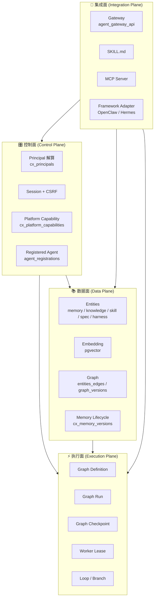
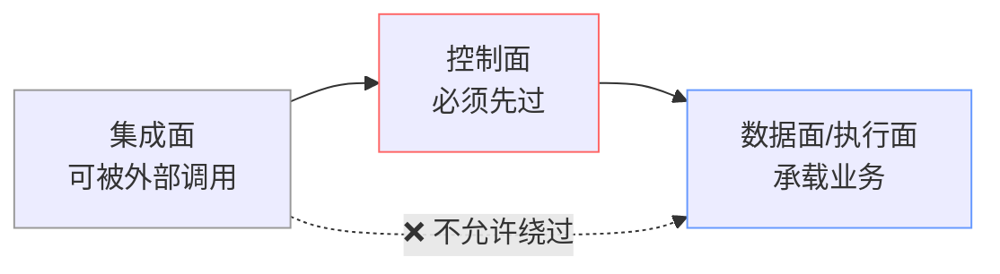
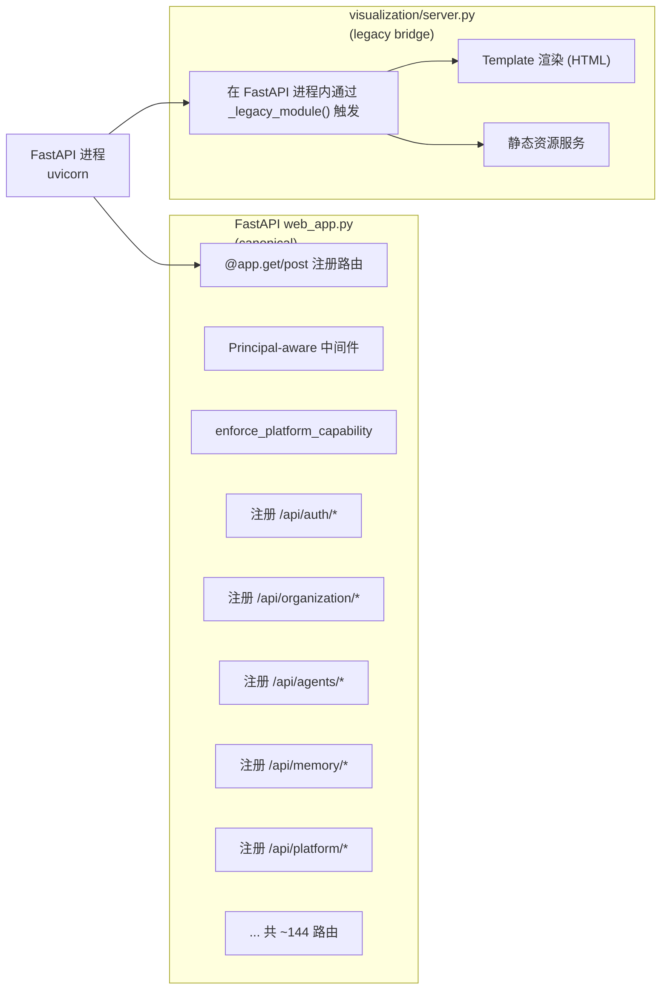

# §11 整体技术架构

> 🏛️ 架构师 · 🧑‍💻 开发者
>
> **一句话定位**:把"数据库权威"分解为**控制面 / 数据面 / 执行面**三个清晰的层次,以及一个**集成面**用于对接外部 Agent 框架。

---

## 1. 四面架构图



> 📌 控制面是"准入与权限",数据面是"业务事实",执行面是"任务流转",集成面是"对外开放"。

---

## 2. 各面的核心表

| 面 | 核心表族 | 持久的事实 | 出处 |
|---|---|---|---|
| **控制面** | `cx_principals`、`cx_user_roles`、`cx_security_events`、`agent_registrations`、`cx_platform_capabilities` | 谁、什么权限、什么准入状态 | `16_v4_3_0_identity_channels.sql`、`31_v4_3_5_platform_capabilities.sql` |
| **数据面** | `entities`、`entity_edges`、`entity_embeddings`、`entity_tags`、`cx_memory_*` | 内容、关系、嵌入、版本 | `1_schema.sql`、`23_v4_3_2_memory_lifecycle.sql` |
| **执行面** | `graph_definitions`、`graph_versions`、`graph_runs`、`graph_attempts`、`graph_checkpoints`、`graph_state_events` | Definition、Run、Attempt、Checkpoint、Transition | `9-12_v4_2_0_graph_*.sql` |
| **集成面** | `cx_agent_access_tokens`、`cx_enrollment_grants`、`cx_bridges`、`cx_channels`、`cx_barriers`、`cx_action_cards` | 凭据、桥接、消息、关卡、动作卡片 | `16-18_v4_3_0_*.sql` |

---

## 3. 请求路径(典型场景)

### 3.1 人类用户在 Dashboard 创建 Memory

```mermaid
sequenceDiagram
    autonumber
    participant U as 用户浏览器
    participant R as React SPA
    participant F as FastAPI
    participant P as 控制面
    participant D as 数据面
    participant DB as PostgreSQL

    U->>R: 输入记忆内容
    R->>F: POST /api/memory {body}
    F->>P: 检查 Principal 状态
    P->>DB: SELECT * FROM cx_principals WHERE ...
    DB-->>P: 返回 Principal 行
    P-->>F: ACTIVE + 权限 OK
    F->>P: 检查 platform_capability('memory')
    P-->>F: enabled=true
    F->>D: memory_api.create_memory(principal_id, body)
    D->>DB: BEGIN; INSERT INTO entities...
    D->>DB: INSERT INTO entity_embeddings
    D->>DB: INSERT INTO entity_access_log
    D->>DB: COMMIT
    DB-->>D: entity_id
    D-->>F: 200 OK
    F-->>R: JSON
    R->>U: 列表更新
```

> 💡 整个流程**只跨一个事务**,没有跨服务的最终一致窗口。

### 3.2 外部 Agent 通过 MCP 发起 Graph Run

```mermaid
sequenceDiagram
    autonumber
    participant EA as 外部 Agent<br/>(OpenClaw)
    participant MC as MCP Server
    participant ID as 控制面
    participant EX as 执行面
    participant GW as Worker
    participant DB as PostgreSQL

    EA->>MC: tools/call graph.create_run
    MC->>ID: 验证 Agent Bearer Token
    ID->>DB: SELECT cx_agent_credentials
    DB-->>ID: 凭据有效
    ID-->>MC: 已认证
    MC->>EX: graph_runtime.create_run()
    EX->>DB: BEGIN; INSERT graph_runs, graph_attempts
    DB-->>EX: run_id + lease_token
    DB-->>EX: COMMIT
    EX-->>MC: run_id + lease_token
    MC-->>EA: 返回 run_id
    Note over EA,DB: 异步阶段
    GW->>EX: claim_ready_nodes(lease_token)
    EX->>DB: 验证 lease + fencing
    DB-->>EX: 节点已分配
    EX-->>GW: node_payload
    GW->>GW: 执行节点逻辑
    GW->>EX: complete_attempt(lease, result)
    EX->>DB: UPDATE graph_attempts + INSERT graph_state_events
    EX-->>GW: 200 OK
```

> 🔐 注意 `lease_token + fencing_token` 的双重校验 — 防止 Worker 过期或被抢占后覆盖。

---

## 4. 跨面依赖规则



> ⚠️ **集成面不能直接触达数据面/执行面**。所有外部请求必须经过控制面的 Principal + Capability 校验。这是 v4.3.0 起就明确写进 [`docs/security.md:5-19`](../security.md) 的不变量。

---

## 5. Web 入口:两套服务器并存

v4.3.0 后,平台存在两套 HTTP 入口,但**只有 FastAPI 是规范入口**:



| 入口 | 用途 | 新代码应使用 |
|---|---|---|
| `web_app.py` (FastAPI) | 所有新功能、API、Principal-aware 路径 | ✅ |
| `visualization/server.py` (ThreadingHTTPServer) | 历史 Portal/Agent/Dashboard 路径,经 FastAPI 内嵌桥调用 | ⚠️ 仅维护,不新增 |

来源:[`docs/architecture.md:134-148`](architecture.md)、[`web_app.py:1-100`](../scripts/web_app.py)

---

## 6. 关键不变量(本视角的"红线")

| 不变量 | 检查点 |
|---|---|
| 控制面失败 fail-closed | `web_app.py:Principal-aware middleware` |
| 能力映射在路由前执行 | `web_app.py:_path_capability()` 在每个 handler 前 |
| Schema Owner 不可被 Business Agent 拿到 | `connection.py:get_connection_for_agent()` 强制独立 LOGIN |
| Worker Lease 过期不能提交 | `graph_runtime.py:_verify_lease()` |
| 审计与状态变更同事务 | `CX_SECURITY_EVENTS` 与 capability 行同一 `BEGIN/COMMIT` |
| External Adapter 不创建第二执行引擎 | `agent_framework_adapters.py:仅做格式转换,无持久化副作用` |

---

## 7. 与企业版的差异

| 维度 | Community | Enterprise |
|---|---|---|
| Resource Catalog | ❌ | ✅ |
| N-of-M Approval | ❌ | ✅ |
| Emergency Control | ❌ | ✅ |
| Compliance Controller | ❌ | ✅ |
| Per-Agent Encryption Key | ❌ | ✅ |
| LDAP | ❌ | ✅ |
| Skill Token | ❌ | ✅ |
| Oracle Adapter | ❌ | ✅ |
| YashanDB Adapter | ❌ | ✅ |

来源:[`SKILL.md:38-41`](../SKILL.md)、[`docs/architecture.md:60-88`](architecture.md)

---

## 8. 交叉引用

- 控制面深度:[§12 身份与 Principal 控制面](12-身份与Principal控制面.md)、[§19 Capability 配置](19-Profile与Capability配置平面.md)
- 数据面深度:[§15 Memory Lifecycle](15-Memory-Lifecycle架构.md)、[§35 知识库](35-知识库管理.md)
- 执行面深度:[§14 Graph Runtime](14-Graph-Runtime架构.md)、[§38 协作分支与循环](38-协作分支与循环工程.md)
- 集成面深度:[§48 外部框架 Gateway 接入](48-外部框架Gateway接入.md)、[§25 MCP Server](25-MCP-Server与SKILL契约.md)
- 现有文档:[`docs/architecture.md`](architecture.md) 全文

> 📌 **下一章**:[§12 身份与 Principal 控制面](12-身份与Principal控制面.md) — 详解 Human/Agent Principal、Session、CSRF、Argon2id、Permission Version。