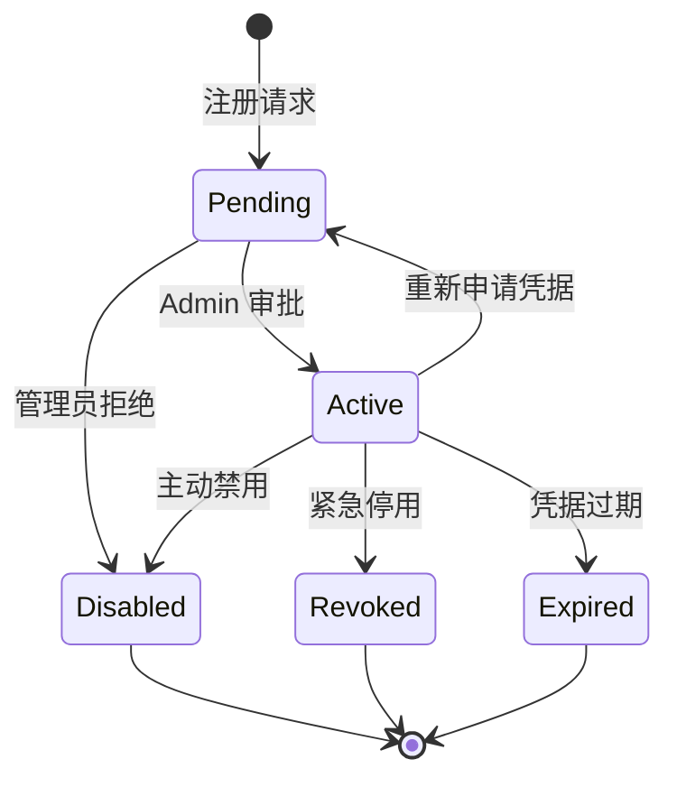
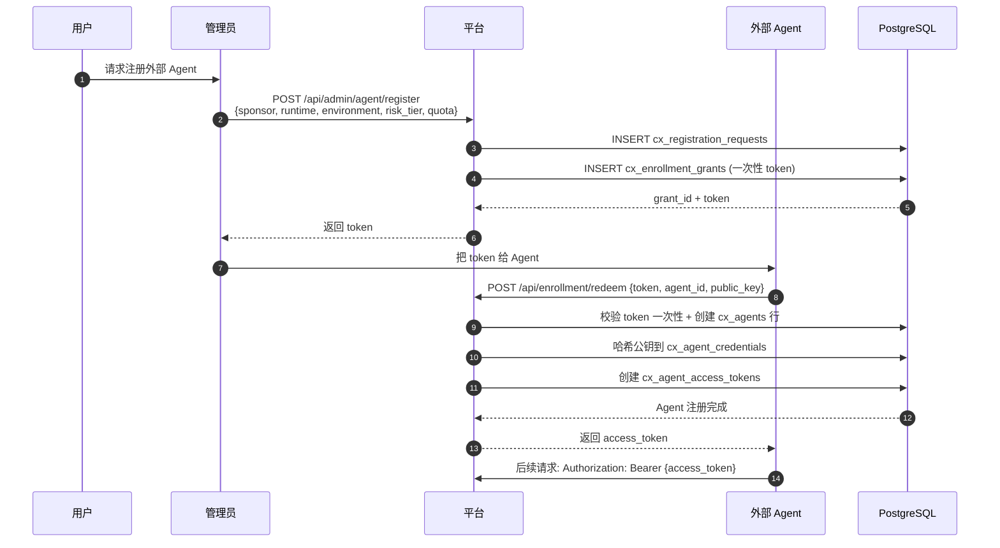
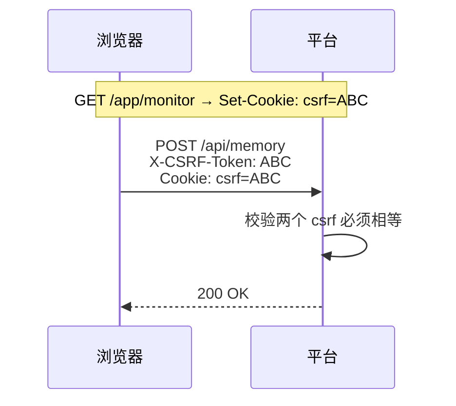
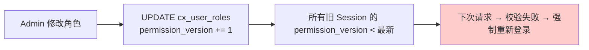
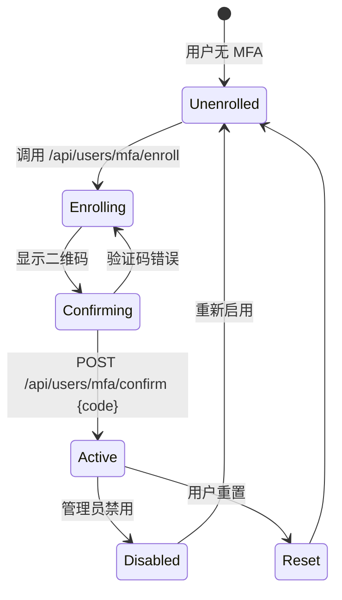
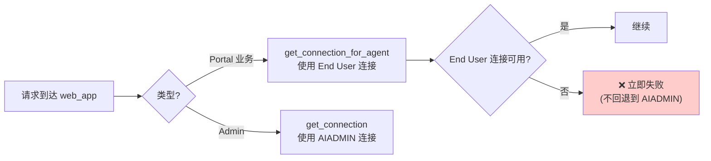

# §12 身份与 Principal 控制面

> 🏛️ 架构师 · 🧑‍💻 开发者
>
> **一句话定位**:每一个请求必须解算到数据库事实的 Principal(Human 或 Agent),且 Principal 失效/过期/吊销/凭据不匹配都必须 fail-closed。

---

## 1. Principal 类型与生命周期



### 1.1 Principal 类型

| 类型 | 说明 | 表 |
|---|---|---|
| **HUMAN** | 人类用户 | `cx_principals` (type='HUMAN') + `cx_human_identities` |
| **AGENT** | 业务/外部 Agent | `cx_principals` (type='AGENT') + `agent_registrations` |
| **SERVICE** | 平台内部服务 | `cx_principals` (type='SERVICE') |

来源:[`scripts/deploy/16_v4_3_0_identity_channels.sql`](../../scripts/deploy/16_v4_3_0_identity_channels.sql)

### 1.2 三种 HUMAN 身份来源

| 来源 | 字段 | 鉴权方式 | 配置位置 |
|---|---|---|---|
| **LOCAL** | `cx_human_identities.source='LOCAL'` | Argon2id 哈希校验 | `config.json:security.password_hash_*` |
| **LDAP** (Enterprise) | `source='LDAP'` | LDAP bind | `config.json:ldap.*` |
| **OIDC** (预留) | `source='OIDC'` | OIDC token exchange | `scripts/lib/security_lifecycle.py:link_external_identity` |

---

## 2. Agent Principal 的"一次性 Enrollment Token"

外部 Agent 注册**不走**普通账号注册流程,而是**用户赞助 + 一次性 Token**:



来源:[`SKILL.md:93-100`](../SKILL.md)、[`docs/architecture.md:97-103`](architecture.md)、[`lib/agent_registration.py`](../../scripts/lib/agent_registration.py)

> ⚠️ Enrollment Token 是**一次性**且**绑定场景**的:它绑定了 sponsor、owner、runtime、environment、Security Domain、risk tier、quota、policy snapshot。Agent 注册后,Token 即作废。

---

## 3. Session、CSRF、Permission Version

### 3.1 Session 模型

| 字段 | 说明 |
|---|---|
| `session_id` | UUID,Cookie 携带 |
| `principal_id` | 关联到 `cx_principals` |
| `permission_version` | 角色/权限快照版本,变更时失效 Session |
| `csrf_token` | CSRF 双提交保护 |
| `expires_at` | 默认 300 秒(`build-manifest.json:22`) |
| `last_activity_at` | 用于滑动过期 |

来源:[`web_app.py` Session 中间件](../../scripts/web_app.py)、[`build-manifest.json`](../build-manifest.json)

### 3.2 CSRF 双提交



> 🔐 不是"读 Cookie",而是**客户端 JS 读取 Cookie 值后塞进 Header**。这避免了纯 Cookie 自动携带的 CSRF 风险。

### 3.3 Permission Version 失效机制



这是 [`docs/architecture.md:91-103`](architecture.md) 强调的"角色变更立即失效"机制。

---

## 4. Argon2id 密码哈希

来源:[`lib/identity_api.py:hash_password_argon2id`](../../scripts/lib/identity_api.py)

```python
# 配置示例 (config.json)
{
  "security": {
    "password_hash_algorithm": "argon2id",
    "argon2_time_cost": 3,
    "argon2_memory_cost": 65536,  # 64 MiB
    "argon2_parallelism": 1
  }
}
```

| 维度 | 选择 |
|---|---|
| 算法 | Argon2id(抗 GPU/侧信道) |
| 内存成本 | 默认 64 MiB |
| 时间成本 | 默认 3 轮 |
| 输出长度 | 32 字节 |
| 编码 | PHC 字符串格式 |

> 💡 早期版本使用 PBKDF2-HMAC-SHA256,已在新部署默认切换到 Argon2id。

---

## 5. MFA(多因素认证)

来源:[`lib/security_lifecycle.py`](../../scripts/lib/security_lifecycle.py)、[`docs/security.md`](../security.md)

支持的因子:

| 因子 | 说明 | 表 |
|---|---|---|
| **TOTP** | Time-based One-Time Password(RFC 6238) | `cx_mfa_factors` |
| **Recovery Codes** | 一次性恢复码 | `cx_mfa_recovery_codes` |
| **WebAuthn** (规划中) | 硬件密钥 | - |

启用流程:



---

## 6. Business Agent 与 Schema Owner 的隔离

来源:[`SKILL.md:100-103`](../SKILL.md)、[`docs/architecture.md:35-41`](architecture.md)

> **Business Agent 永远拿不到 Schema Owner 凭据**;它使用独立的 PostgreSQL LOGIN 角色 + RLS 身份。

| 路径 | 连接身份 | 权限 |
|---|---|---|
| Portal 业务请求 | End User (Business Agent) | 受 RLS 谓词过滤 |
| Admin 后台管理 | `AIADMIN` / Schema Owner | 几乎全权限 |
| 跨域访问 | 显式 Bridge 策略 + 分类检查 | 受 catalog 控制 |

实现:`lib/connection.py:get_connection_for_agent()` 强制 Business Agent 请求走独立连接,即使 Schema Owner 连接池不可用也**不**回退。



---

## 7. 紧急停用与凭据轮换

| 操作 | 触发 | 后果 |
|---|---|---|
| 紧急禁用 Registration | `POST /api/governance/emergency` | 撤销 grants、终止 session、释放 pool ownership、轮换凭据 |
| 凭据轮换 | `rotate_agent_crypto_key(agent_id)` | 旧凭据失效,新凭据写入 |
| Recovery Code 重置 | `recover_agent_via_admin(admin_token, recovery_code)` | 通过 Recovery Code 重新生成凭据 |

来源:[`docs/security.md:43-58`](../security.md)、[`lib/agent_api.py`](../../scripts/lib/agent_api.py)

---

## 8. 交叉引用

- 注册治理平面:[§13 注册 Agent 治理平面](13-注册Agent治理平面.md)
- 凭据与 Gateway:[§48 外部框架 Gateway 接入](48-外部框架Gateway接入.md)
- 应急控制:[§44 应急控制与紧急停用](44-应急控制与紧急停用.md)
- 现有文档:[`docs/security.md:60-145`](../security.md)

> 📌 **下一章**:[§13 注册 Agent 治理平面](13-注册Agent治理平面.md) — 详解 Registered Agent 的状态机与生命周期。