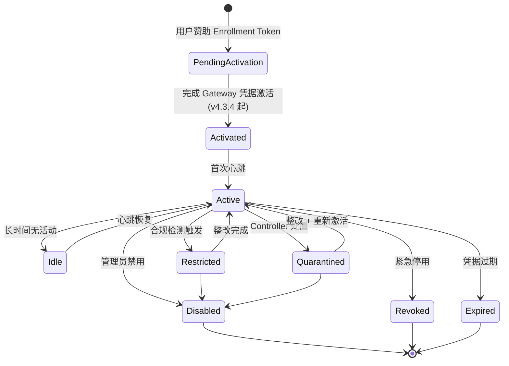
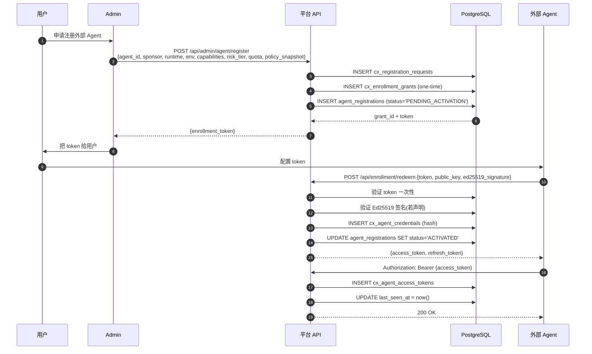
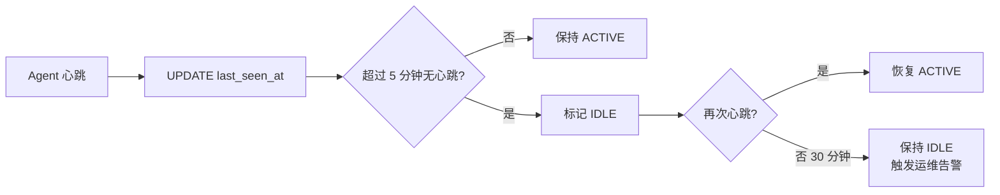
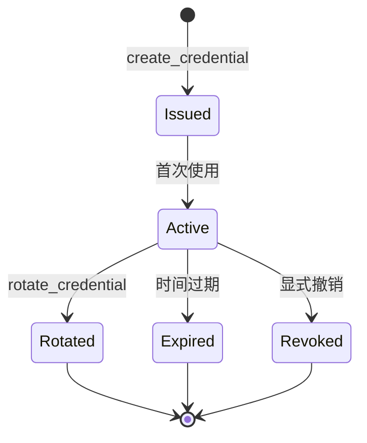
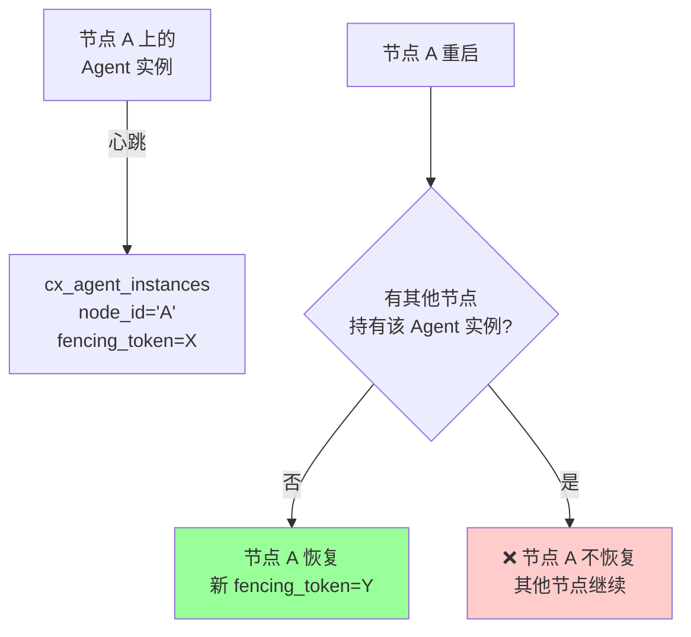

# §13 注册 Agent 治理平面

> 🏛️ 架构师 · 👤 用户 · 🧑‍💻 开发者
>
> **一句话定位**:注册 Agent 是平台"准入边界",所有 Agent 必须在数据库中有一个**永久、可审计、可失效**的身份行,否则无法进入治理范围。

---

## 1. 为什么需要"注册"

来源:[`SKILL.md:43-51`](../SKILL.md)、[`docs/architecture.md:97-103`](architecture.md)

川序的"已注册 Agent 边界"是 v4.1.0 起社区版与企业版共有的**强制门槛**:

- 平台托管的 Agent ✅ 必须注册
- 外部 Agent(OpenClaw/Hermes 等) ✅ 必须注册
- 任何未注册的 Agent ❌ 无法进入数据库治理范围
- 注册记录**永远不返回**凭据摘要(只哈希)

> 这是 v4.3.0 起的"全平台准入"模型:不注册 = 无身份 = 无权限。

---

## 2. 状态机

> 🔐 `PENDING_ACTIVATION → ACTIVATED` 是 v4.3.4 新增的凭据激活证明门,详见 [§41 合规控制面](41-合规控制面v4.3.4.md)。

---

## 3. 关键表与字段

来源:[`scripts/deploy/8_v4_1_0_registration.sql`](../../scripts/deploy/8_v4_1_0_registration.sql)

### 3.1 `agent_registrations` (Community 注册核心)

| 字段 | 类型 | 说明 |
|---|---|---|
| `agent_id` | VARCHAR | 主键,Agent 唯一标识 |
| `owner_ref` | VARCHAR | 所属用户/团队 |
| `runtime` | VARCHAR | 'platform' / 'openclaw' / 'hermes' / ... |
| `environment` | VARCHAR | 'dev' / 'staging' / 'prod' |
| `node_id` | VARCHAR | 当前所在节点(用于节点回收) |
| `capabilities_json` | JSONB | 声明的能力清单 |
| `credential_version` | INT | 凭据版本号 |
| `credential_hash` | VARCHAR | 凭据的 PBKDF2/Argon2 哈希(明文不存) |
| `status` | VARCHAR | PENDING / ACTIVATED / ACTIVE / IDLE / RESTRICTED / QUARANTINED / DISABLED / REVOKED / EXPIRED |
| `idempotency_key` | VARCHAR | 注册幂等键 |
| `last_seen_at` | TIMESTAMP | 心跳时间 |
| `expires_at` | TIMESTAMP | 凭据过期时间 |

### 3.2 配套表

| 表 | 用途 |
|---|---|
| `cx_agent_credentials` (v4.3.0) | 凭据多版本管理 |
| `cx_agent_access_tokens` (v4.3.0) | 短期 access_token |
| `cx_agent_instances` (v4.3.0) | 节点级实例(instance fencing) |
| `cx_agent_ownership_reviews` (v4.3.0) | 所有权审计 |
| `cx_enrollment_grants` (v4.3.0) | 一次性 Token 配额 |

---

## 4. 注册流程

来源:[`SKILL.md:93-100`](../SKILL.md)、[`lib/agent_registration.py`](../../scripts/lib/agent_registration.py)、[`lib/agent_gateway_api.py`](../../scripts/lib/agent_gateway_api.py)

---

## 5. 心跳与 Last-Seen

| 维度 | 值 |
|---|---|
| 心跳端点 | `POST /api/admin/agent/heartbeat` |
| 心跳间隔 | 推荐 60 秒(可配置) |
| 失效阈值 | 默认 5 分钟无心跳 → 标记 IDLE |
| 列表端点 | `GET /api/agents/registry`(返回安全元数据) |

---

## 6. 凭据生命周期

| 操作 | 入口 | 用途 |
|---|---|---|
| 创建凭据 | `agent_api.issue_credential` | 初次注册 |
| 轮换凭据 | `agent_api.rotate_agent_crypto_key` | 周期性安全 |
| 验证凭据 | `agent_api.verify_credential` | 鉴权 |
| 撤销凭据 | `agent_api.hibernate_agent` | 暂停 |
| 唤醒 | `agent_api.wake_agent` | 重新启用 |
| 恢复 | `agent_api.recover_agent_via_admin` | 用 Recovery Code 重置 |

---

## 7. 节点隔离与 Recovery

来源:[`docs/security.md:50-58`](../security.md)

> 💡 这避免了"节点 A 重启导致其他节点的 Agent 实例被错误回收"。

---

## 8. 合规与门控(v4.3.4+)

注册后的 Agent 必须通过以下门控才能正常工作:

| 门控 | 何时触发 | 通过条件 |
|---|---|---|
| **凭据激活证明** | `PENDING_ACTIVATION → ACTIVATED` | Gateway 签名 + 安全域绑定 |
| **Profile 分配** | 启用受限能力 | 已有 published Profile |
| **MFA 强制** | 启用 Portal 访问 | 至少 1 个 MFA 因子 |
| **Compliance 定期评估** | 每 N 小时 | 无 high-confidence finding |
| **Controller 处置** | 检测到凭证复用/身份绑定冲突/Profile digest 不匹配/fencing bypass | 自动 RESTRICTED/QUARANTINED |

来源:[`docs/security.md:21-58`](../security.md)

---

## 9. 关键 API 速查

| 端点 | 方法 | 说明 |
|---|---|---|
| `/api/admin/agent/register` | POST | 注册或幂等刷新 |
| `/api/admin/agent/heartbeat` | POST | 心跳,刷新 last_seen |
| `/api/agents/registry` | GET | 列出安全元数据 |
| `/api/agents/{id}/posture` | GET | 独立查看 Agent 状态(Enterprise) |
| `/api/gateway/activate` | POST | 完成凭据激活(v4.3.4+) |
| `/api/agents/{id}/compliance-control` | POST | 管理员处置(v4.3.4+) |

完整列表见 [§53 REST API 索引](53-REST-API索引.md)。

---

## 10. 交叉引用

- 身份基础:[§12 身份与 Principal 控制面](12-身份与Principal控制面.md)
- 合规门控:[§41 合规控制面 v4.3.4](41-合规控制面v4.3.4.md)
- 实操:[§32 Agent 注册与管理](32-Agent注册与管理.md)
- 现有文档:[`docs/architecture.md:60-88`](architecture.md)

> 📌 **下一章**:[§14 Graph Runtime 架构](14-Graph-Runtime架构.md) — Definition → Version → Run → Checkpoint → Trace 的状态机与 Worker Lease/Fencing。