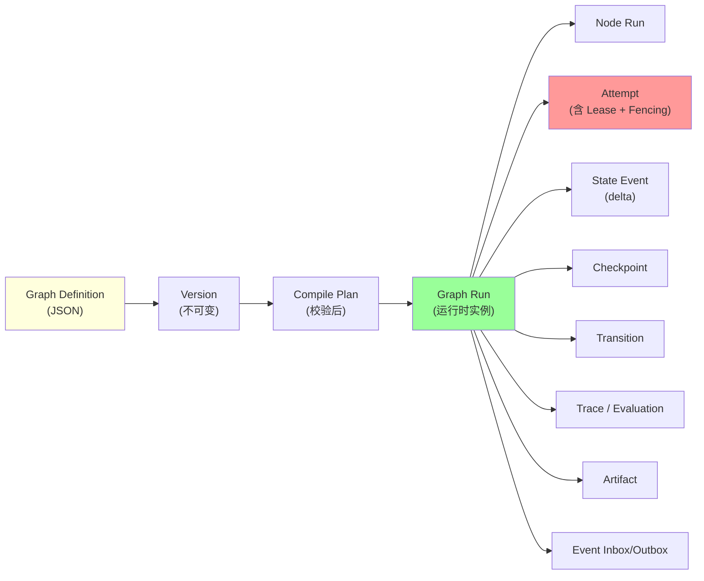
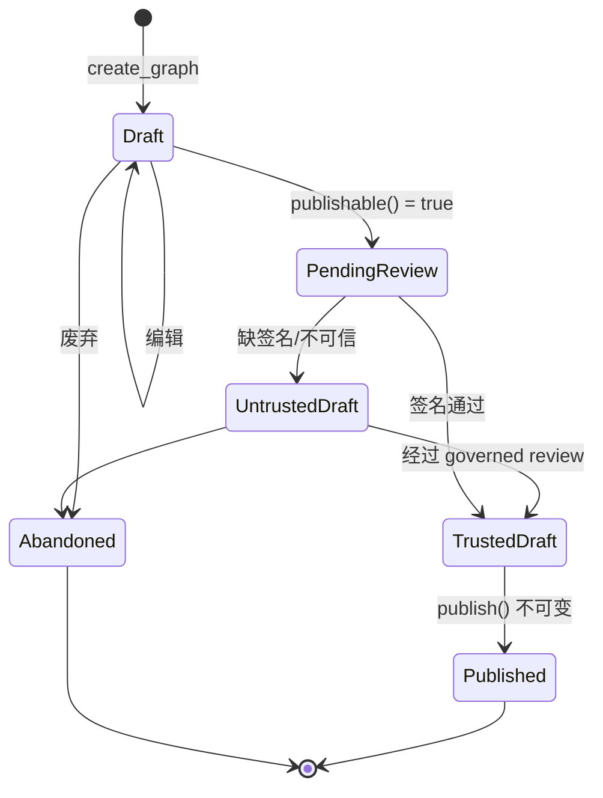
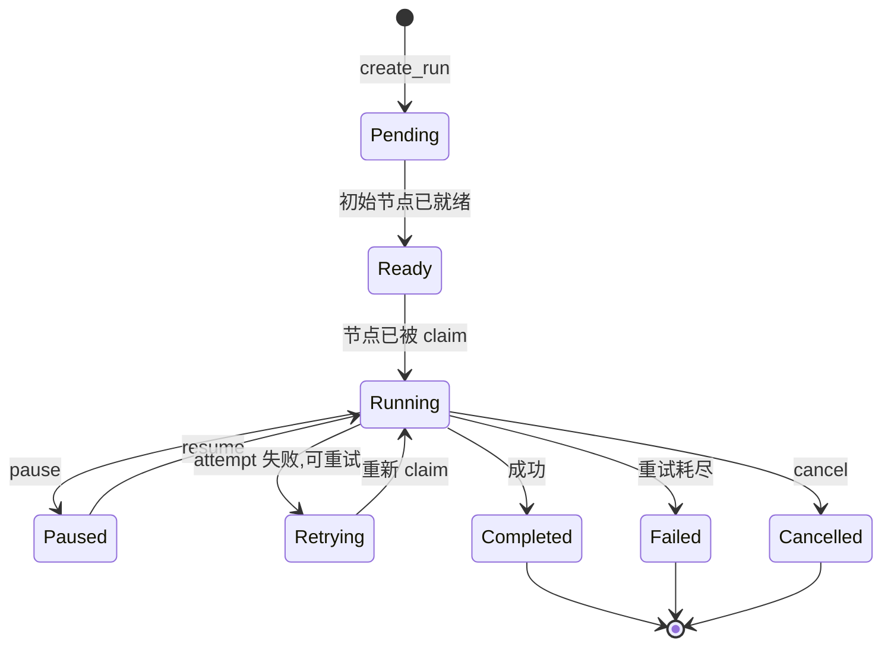
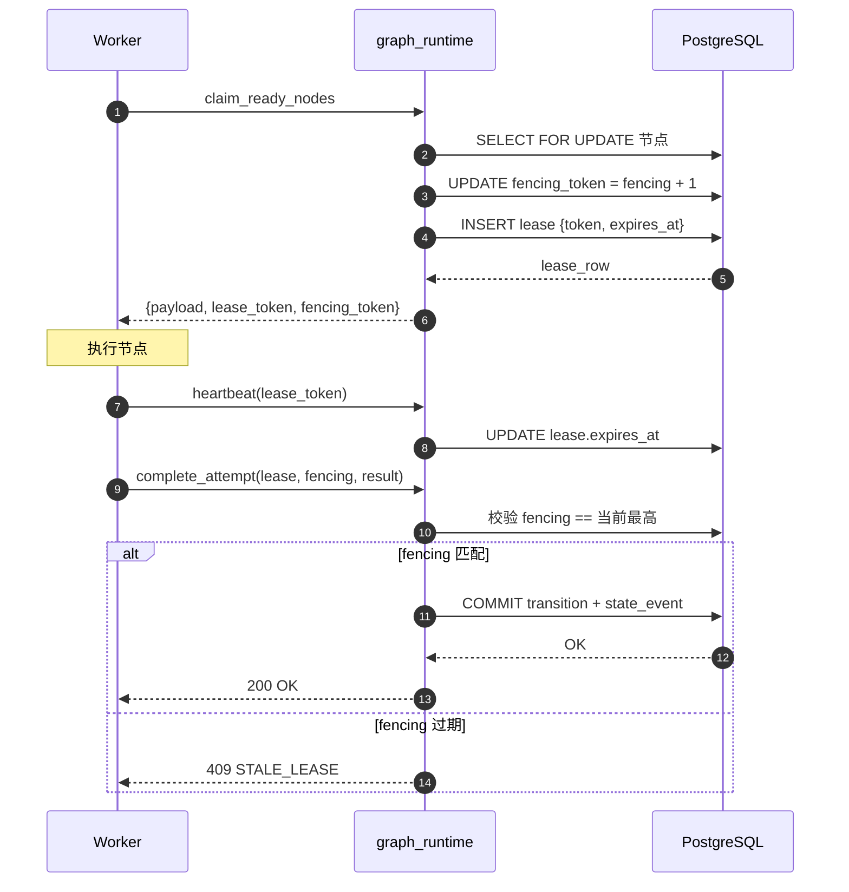
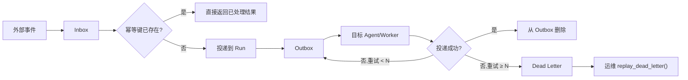
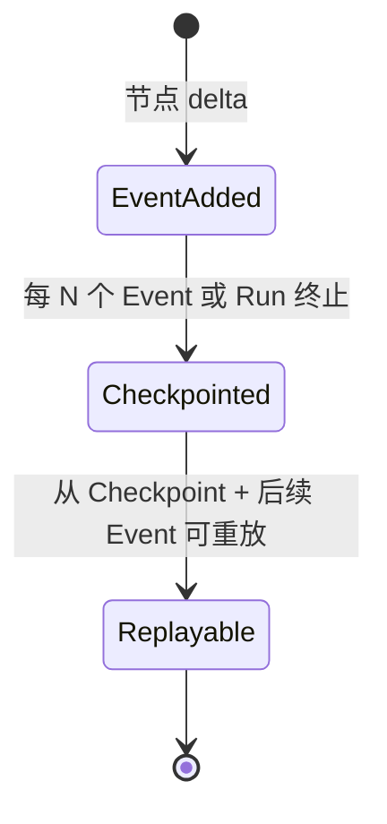
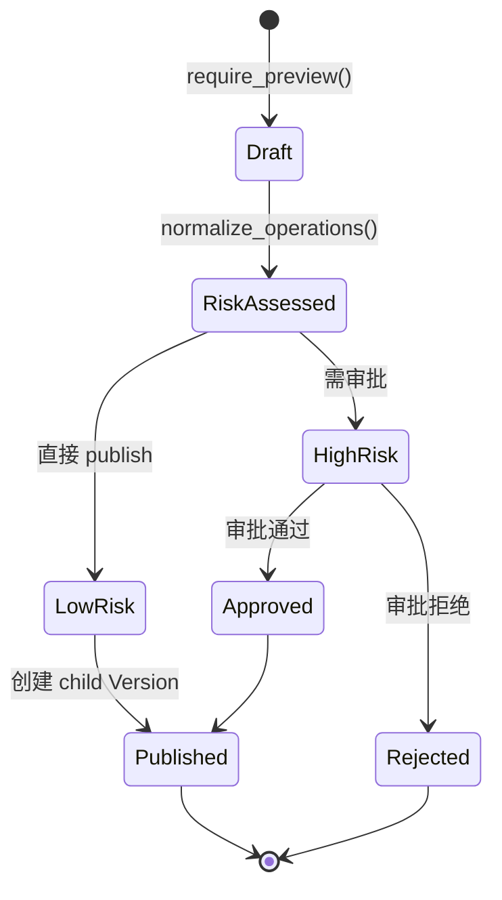

# §14 Graph Runtime 架构

> 🏛️ 架构师 · 🧑‍💻 开发者
>
> **一句话定位**:Graph Runtime 是数据库权威的"长任务执行平面",用 Lease/Fencing/Checkpoint/Transition 四件套保证可恢复、可审计、可中断。

---

## 1. 核心命题

来源:[`docs/graph-engineering.md`](graph-engineering.md)、[`SKILL.md:65-73`](../SKILL.md)

> **Graph Runtime 是 v4.3.0 起整合的执行内核,数据库是唯一权威**;Worker 进程可被替代实例恢复,但**不**等于数据库 HA。

| 保证 | 实现 | 出处 |
|---|---|---|
| **持久状态转换** | Transition + State Event + Checkpoint 在同一事务 | `graph_state_events`、`graph_checkpoints` |
| **幂等 Claim/Completion** | `idempotency_key` + `effect_idempotency_key` | `graph_attempts` |
| **过期 Lease 拒绝** | `lease_token_hash` + `lease_expires_at` + `fencing_token` | `graph_attempts` |
| **有界循环/预算** | `graph_budgets` 表 + Compiler 校验 | `graph_budgets`、`graph_compiler.py` |
| **可恢复** | 数据库 lease/fencing + Checkpoint 即可恢复,**不**依赖进程状态 | `graph_assurance.py` |

> ⚠️ 不保证:**exactly-once** 对任意远程系统(只能保证重放下安全)。

---

## 2. 数据流全景



---

## 3. 状态机:从 Draft 到 Published



来源:[`docs/graph-engineering.md`](graph-engineering.md)、[`lib/graph_supply_chain.py`](../../scripts/lib/graph_supply_chain.py)

---

## 4. Run 生命周期



来源:[`lib/graph_runtime.py`](../../scripts/lib/graph_runtime.py)

---

## 5. Worker Lease + Fencing

这是 Graph Runtime 最核心的并发安全机制。

### 5.1 Lease Token

- 每次 `claim_ready_nodes()` 分配一个短期 Token(默认 ≤ 60 秒)
- Token 与节点绑定,Worker 必须**每 30 秒**心跳
- 心跳携带同一 Token,过期则 Token 失效

### 5.2 Fencing Token

- **单调递增** 的整数,在 Worker 提交完成时验证
- 如果 Worker 的 fencing < 当前值,提交被拒绝(防止过期 Worker 覆盖)
- 数据库的 lease 行存储当前最高 fencing



来源:[`docs/graph-engineering.md`](../graph-engineering.md)、[`lib/graph_contracts.py:is_valid_status_transition`](../../scripts/lib/graph_contracts.py)、[`lib/graph_runtime.py:_verify_lease`](../../scripts/lib/graph_runtime.py)

### 5.3 重放幂等

完成请求带 `request_digest`(SHA-256 of canonical request body)。若数据库发现同一 digest 已有 SUCCESS Transition,则**直接返回**原 Checkpoint,不重复下游激活。

---

## 6. Event Inbox/Outbox

`graph_event_api` 提供的"有保证的事件投递":

| 概念 | 说明 |
|---|---|
| **Event** | 业务事件(节点完成、消息到达、Time Tick) |
| **Inbox** | 接收外部事件,带幂等键 |
| **Outbox** | 准备发出但未投递的事件 |
| **Dead Letter** | 重试 N 次仍失败的事件,可 replay |
| **Replay Guard** | 防重放:`payload_hash` + `sign_event` |



来源:[`lib/graph_event_api.py`](../../scripts/lib/graph_event_api.py)、[`lib/graph_event_contract.py`](../../scripts/lib/graph_event_contract.py)

---

## 7. Node Executor Registry

节点执行器是"可插拔"的纯函数族,通过**清单(manifest)**注册:

```python
# 伪代码示例
manifest = {
  "executor_id": "http_call_v1",
  "kind": "WORKER",  # CONTROL/WORKER/WAIT
  "node_types": ["http_request"],
  "side_effect_classes": ["NETWORK"],
  "input_schema": {...},
  "output_schema": {...},
  "validation": {
    "url_allowlist": ["https://internal.api/*"],
    "rate_limit_per_min": 60
  }
}
```

内置执行器(参考):

| 类型 | 说明 |
|---|---|
| `http_request` | HTTP 调用(带 URL 白名单) |
| `db_query` | 数据库查询(只读) |
| `shell` | shell 命令(被严格白名单) |
| `graph_call` | 调用子图 |
| `wait` | 等待 Barrier/Channel |
| `human_input` | 等待人类输入 |

来源:[`lib/graph_executor.py:builtin_executor_manifests`](../../scripts/lib/graph_executor.py)

---

## 8. Checkpoint 与 State Event

| 概念 | 说明 |
|---|---|
| **State Event** | 增量 delta,append-only |
| **Checkpoint** | State Event 的聚合快照 |
| **Transition** | 状态变更事件(原子事务提交) |



---

## 9. Dynamic Graph(预览,v4.3.3 起)

⚠️ 默认关闭,需要 `production` 之外的能力 profile。



> ⚠️ Dynamic Graph **不能修改** 源 Version,只能**创建子 Version**。高风险变更需重新审批。

来源:[`lib/graph_dynamic.py`](../../scripts/lib/graph_dynamic.py)

---

## 10. A2A 与 OpenTelemetry(预览)

| 能力 | 状态 | 说明 |
|---|---|---|
| **A2A 1.0.1** | 预览 | Agent-to-Agent 协议,`lib/a2a_gateway.py`,默认关闭 |
| **OpenTelemetry GenAI** | 预览 | 遥测投影,`lib/graph_telemetry.py`,metadata-only |

> 🔒 两者**不**扩张授权,不创建第二执行引擎,不被 Runtime 视为 authority。详见 [`docs/architecture.md:579-593`](architecture.md)。

---

## 11. 三数据库投影

| 数据库 | 投影方式 | 出处 |
|---|---|---|
| Oracle AI Database 26ai | Native Property Graph + SQL PGQ | `architecture.md:586` |
| **PostgreSQL 18** | **Apache AGE 1.7+**(Cypher) | `architecture.md:588` |
| YashanDB 23.5.4 | Native Property Graph | `architecture.md:589` |

> 💡 PostgreSQL 19 native Property Graph 暂时**不**作为目标,不影响 v4.3.0 契约。

---

## 12. 交叉引用

- Loop Engineering 视角:[§38 协作分支与循环工程](38-协作分支与循环工程.md)
- 实操:[§39 图探索与可视化](39-图探索与可视化.md)
- 恢复:[§45 高可用与恢复](45-高可用与恢复.md)
- 现有文档:[`docs/graph-engineering.md`](graph-engineering.md) 全文

> 📌 **下一章**:[§15 Memory Lifecycle 架构](15-Memory-Lifecycle架构.md) — Family/Version/Chain/Candidate/Job 的关系与逻辑不可用边界。