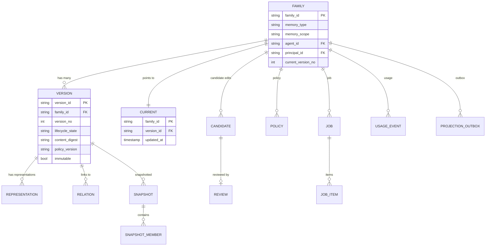
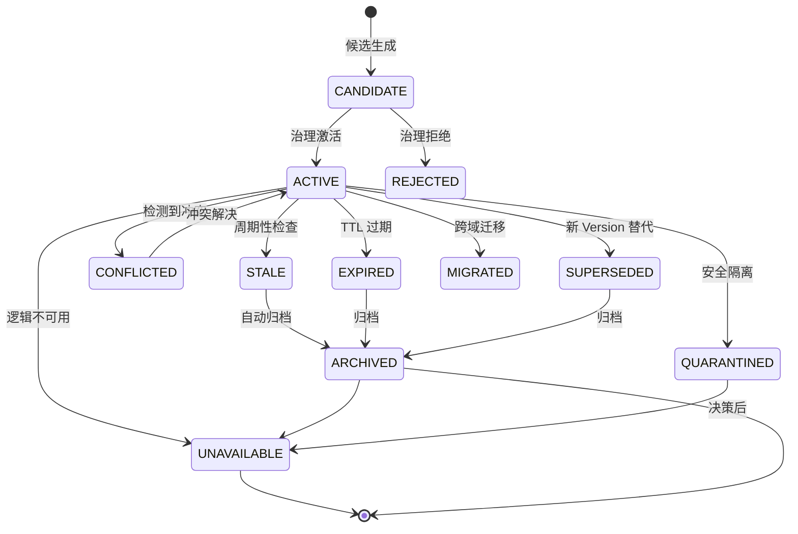
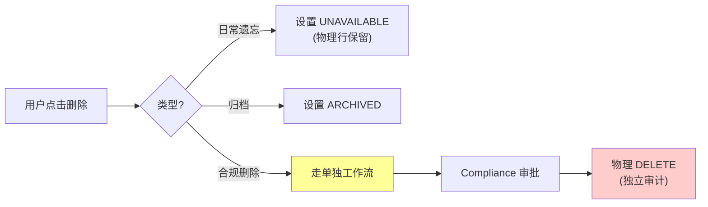
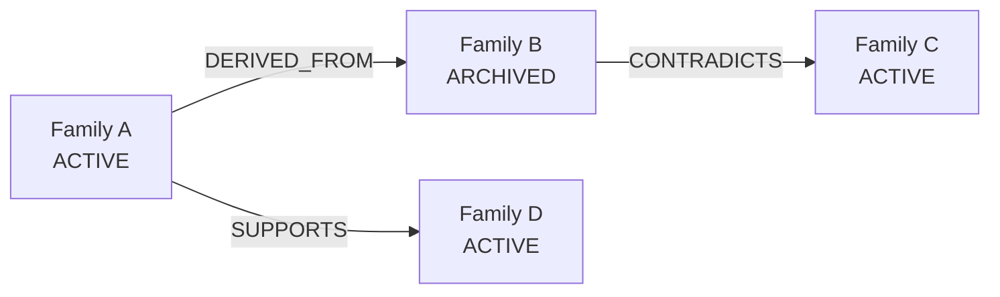
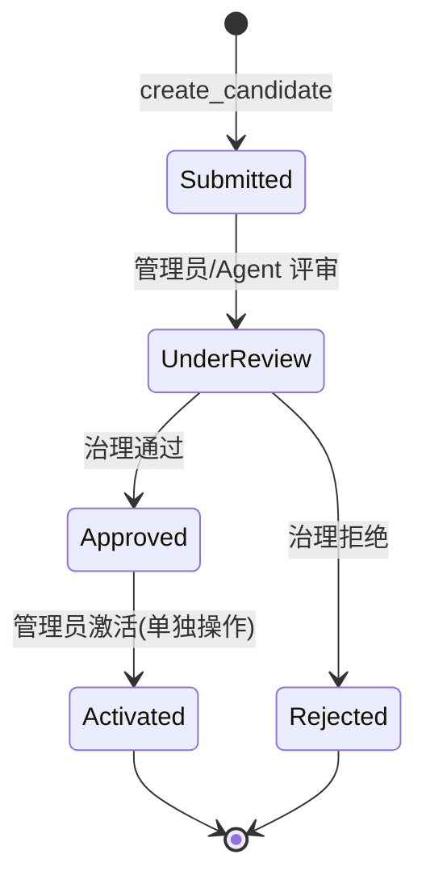
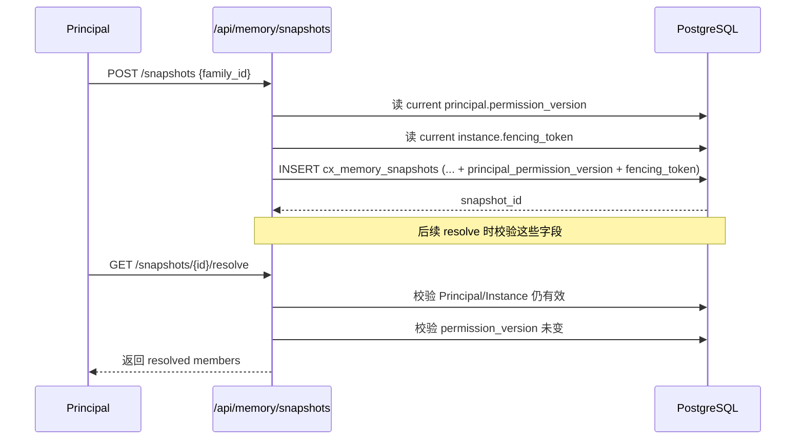
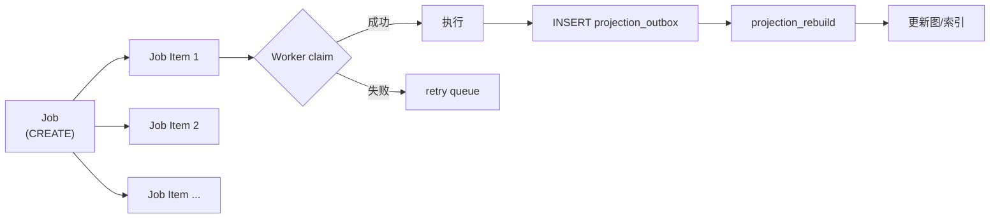

# §15 Memory Lifecycle 架构

> 🏛️ 架构师 · 👤 用户 · 🧑‍💻 开发者
>
> **一句话定位**:v4.3.2 起,Memory 由"实体"变"家族":稳定 Family + 不可变 Version + 当前指针,日常整理是**逻辑状态迁移**而非物理删除。

---

## 1. 核心命题

来源:[`docs/memory-lifecycle.md`](../memory-lifecycle.md)、[`SKILL.md:53-63`](../SKILL.md)、[`CHANGELOG.md:46-54`](../CHANGELOG.md)

> **Memory 内容是数据库事实的版本化家族;日常"删除""整理""归档"是状态迁移,不是物理行删除**。物理擦除是单独的合规工作流。

| 不变量 | 含义 |
|---|---|
| Memory Body 是 Untrusted Data | 不能作为授权边界 |
| 不可变 Version | 每次更新创建新 Version,旧 Version 永远在历史 |
| 当前指针 | Family 指向 current Version,迁移只是改指针 |
| Logical Unavailable ≠ Physical Delete | `UNAVAILABLE` 状态保留,只是停止日常检索 |
| 物理擦除 | 单独触发,有独立审计,受 Compliance 审批 |

---

## 2. 数据模型



> 📌 总表:13 张(详见 [§51 SQL 迁移索引](51-SQL迁移索引.md) `23_v4_3_2_memory_lifecycle.sql`)。

---

## 3. Memory Type 与 Scope

### 3.1 6 种 Memory Type

| Type | 用途 | 例子 |
|---|---|---|
| `EPISODIC` | 单次事件记忆 | "用户在 2026-08-05 询问..." |
| `FACT` | 事实陈述 | "巴黎是法国首都" |
| `PREFERENCE` | 用户偏好 | "用户喜欢简洁回答" |
| `DECISION` | 决策记录 | "决定使用 PostgreSQL 18" |
| `PROCEDURAL` | 流程记忆 | "部署步骤..." |
| `EXPERIENCE` | 经验总结 | "上次类似任务的最佳做法..." |

来源:[`scripts/deploy/23_v4_3_2_memory_lifecycle.sql`](../../scripts/deploy/23_v4_3_2_memory_lifecycle.sql)

### 3.2 5 种 Scope

| Scope | 含义 |
|---|---|
| `RUNTIME_CONTEXT` | 单次 Run 的临时上下文 |
| `CHANNEL_MEMORY` | Channel 内的共享记忆 |
| `AGENT_MEMORY` | Agent 私有记忆 |
| `WORKSPACE_MEMORY` | Workspace 内可见记忆 |
| `ENTERPRISE_KNOWLEDGE` | Enterprise 级共享(企业版) |

---

## 4. 10 种 Lifecycle State



| 状态 | 可检索? | 可恢复? |
|---|---|---|
| CANDIDATE | ❌(待激活) | ✅ |
| ACTIVE | ✅ | ✅ |
| STALE | ❌(默认隐藏) | ✅ |
| CONFLICTED | ❌ | ✅(需解决冲突) |
| SUPERSEDED | ❌ | ✅(历史) |
| EXPIRED | ❌ | ✅(需管理员) |
| MIGRATED | ❌(已迁走) | ❌(指向新位置) |
| ARCHIVED | ❌ | ✅(单独恢复路径) |
| QUARANTINED | ❌ | ❌(需 Compliance) |
| UNAVAILABLE | ❌ | ✅(单独恢复路径) |

来源:[`docs/memory-lifecycle.md`](../memory-lifecycle.md)

---

## 5. 物理删除 vs 逻辑不可用



> ⚠️ **物理删除不是用户操作**。它需要 Compliance 触发 + 审计 + 独立审计行写入。这是 [`docs/security.md:85-92`](../security.md) 的核心不变量。

---

## 6. Chain(关系链)

`cx_memory_relations` 表达 Memory 之间的语义关系:

| 关系类型 | 含义 |
|---|---|
| `DERIVED_FROM` | 派生自 |
| `SUPPORTS` | 支持 |
| `CONTRADICTS` | 矛盾 |
| `EXTENDS` | 扩展 |
| `REFERENCES` | 引用 |



Chain 检索受 `family_id/chain` API 限制,带 `max_depth` 防护。

---

## 7. Candidate(语义候选)与 Review



> ⚠️ `Approved → Activated` 是**单独操作**,不会自动发生。它创建新 Version,旧 Version 进入 `SUPERSEDED`。

来源:[`docs/memory-lifecycle.md`](../memory-lifecycle.md)

---

## 8. Snapshot(快照)与 Subject Fencing

v4.3.2 起,Snapshot 绑定到**激活时的 Principal 和 Agent Instance**:

| 字段 | 说明 |
|---|---|
| `principal_id` | 创建快照的 Principal |
| `principal_permission_version` | 创建时的权限版本 |
| `agent_instance_id` | 创建时的 Agent Instance |
| `agent_fencing_token` | 创建时的 fencing token |



> 🔐 Snapshot Subject Fencing 是 v4.3.2 引入的,见 [`26_v4_3_2_snapshot_subject_fencing.sql`](../../scripts/deploy/26_v4_3_2_snapshot_subject_fencing.sql)。

---

## 9. Job 与 Projection

| 概念 | 说明 |
|---|---|
| **Job** | 长期任务,如"整理 1000 条 Memory" |
| **Job Item** | 单条任务的执行单元 |
| **Lease** | Worker 抢占,带 fencing |
| **Outbox** | 投影延迟事件 |



---

## 10. API 速查

| 端点 | 方法 | 用途 |
|---|---|---|
| `/api/memory` | GET/POST | 列出当前 Memory / 创建 Family |
| `/api/memory/{family_id}` | GET | 读当前 Family;`?history=true` |
| `/api/memory/{family_id}/chain` | GET | 返回关系链 |
| `/api/memory/{family_id}/versions` | POST | 发布不可变 successor |
| `/api/memory/{family_id}/unavailable` | POST | 逻辑不可用(带原因) |
| `/api/memory/{family_id}/quarantine` | POST | 管理员隔离(带原因) |
| `/api/memory/{family_id}/candidates` | POST | 提交语义候选 |
| `/api/memory/snapshots/{id}/refresh` | POST | 创建后续 snapshot |
| `/api/memory/snapshots/{id}/resolve` | GET | 解析 pinned members |
| `/api/memory/candidates/{id}/activate` | POST | 管理员激活 |
| `/api/memory/jobs/run-once` | POST | 触发一次作业 |
| `/api/memory/jobs/{id}/cancel` | POST | 取消 |

完整列表:[§53 REST API 索引](53-REST-API索引.md)。

---

## 11. MCP 表面

`mcp_server.py` 暴露给外部 Agent 的 Memory 工具:

```text
memory_lifecycle_create       — 创建 Family
memory_lifecycle_chain        — 读 chain
memory_lifecycle_feedback     — 提交反馈
memory_lifecycle_candidate    — 提交候选
```

> 🔒 **MCP 调用仍受 Principal 认证 + Capability 检查保护**,不绕过授权。

来源:[`SKILL.md:60-63`](../SKILL.md)、[`lib/mcp_server.py`](../../scripts/lib/mcp_server.py)

---

## 12. 交叉引用

- 实操:[§36 记忆库与生命周期](36-记忆库与生命周期.md)
- 安全边界:[§42 审计与证据导出](42-审计与证据导出.md)
- 现有文档:[`docs/memory-lifecycle.md`](../memory-lifecycle.md) 全文

> 📌 **下一章**:[§16 Organization Governance 架构](16-Organization-Governance架构.md) — 闭包授权、目录同步、语义变更草稿。