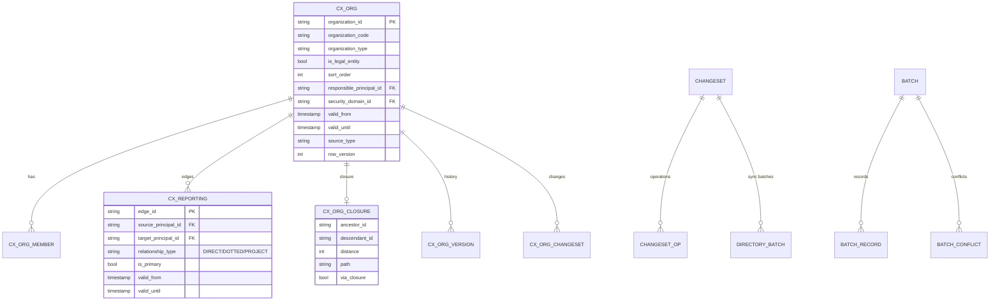
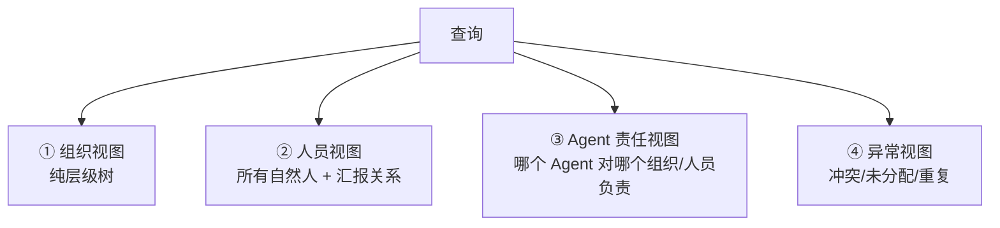
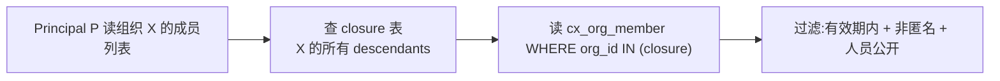
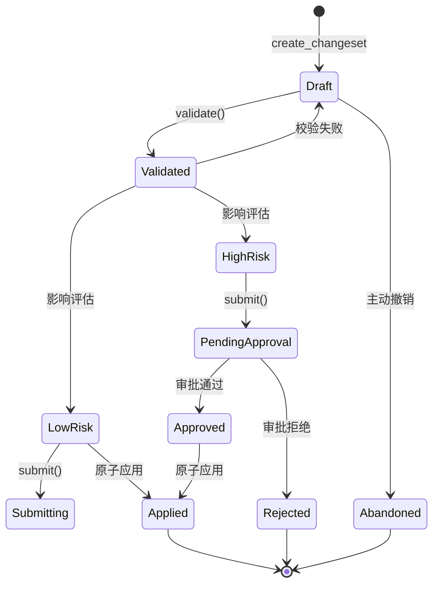
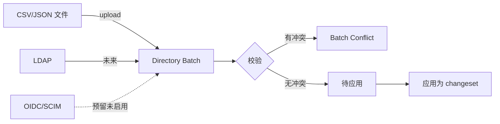

# §16 Organization Governance 架构

> 🏛️ 架构师 · 👤 用户 · 🧑‍💻 开发者
>
> **一句话定位**:v4.3.1 起,组织信息是数据库权威的"闭包(closure)事实",支持图形化查询与语义变更;但变更必须经过 changeset + 影响分析 + 风险评估。

---

## 1. 核心命题

来源:[`docs/organization-governance.md`](../organization-governance.md)、[`SKING.md:84-89`](../SKILL.md)、[`CHANGELOG.md:57-60`](../CHANGELOG.md)

> **一个平台账号 = 一个 Human Principal = 一个组织人员**(除受保护的 `admin` 系统账号外)。组织架构变更不是"UI 拖拽",而是带影响的语义 changeset。

| 不变量 | 含义 |
|---|---|
| 1 账号 = 1 Principal = 1 组织人员 | 主组织唯一 |
| 主组织强制 | 没有有效登录身份的人不能加入架构 |
| `admin` 系统账号例外 | 仅用于系统恢复,不在自然人层级 |
| 关系权威 | 直接汇报、虚线汇报、项目汇报都是关系事实 |
| 图形化是投影 | 可视化只是查询界面,不是边界 |

---

## 2. 数据模型



---

## 3. 4 种视图

来源:[`docs/visualization.md`](../visualization.md)



每种视图都有:
- 根节点(顶层组织)
- 子节点展开
- 边(汇报关系)
- 详情面板

---

## 4. 关系类型

| 类型 | 含义 | 颜色(图例) |
|---|---|---|
| **DIRECT** | 直接汇报 | 实线 |
| **DOTTED** | 虚线汇报(矩阵) | 虚线 |
| **PROJECT** | 项目汇报 | 点划线 |

每条关系都有 `valid_from` / `valid_until`,支持**时间维度**查询历史。

---

## 5. 闭包授权(Closure-Backed Authorization)

> 不是"递归子查询"判断权限,而是**预先计算**闭包表。



| 优势 | 说明 |
|---|---|
| O(1) 查询 | 不递归 |
| 跨多节点一致 | 闭包是数据库事实 |
| 风险分类 | 可标注闭包距离 |

来源:[`19_v4_3_1_organization_governance.sql`](../../scripts/deploy/19_v4_3_1_organization_governance.sql) 中 `cx_organization_closure`

---

## 6. 变更生命周期



### 6.1 Changeset 字段

| 字段 | 说明 |
|---|---|
| `changeset_id` | PK |
| `reason` | 必填原因 |
| `idempotency_key` | 重复提交幂等 |
| `base_version_id` | 依赖的组织版本 |
| `operations` | JSON 操作清单 |
| `risk_classification` | `LOW` / `HIGH` |
| `approver_count` | 已审批人数(High 时) |
| `status` | Draft / PendingApproval / Approved / Rejected / Applied / Abandoned |
| `created_by` | Principal |
| `created_at` | 时间戳 |
| `applied_at` | 应用时间 |

### 6.2 Operations

```json
[
  {"op": "move", "target_id": "P_001", "new_parent_id": "O_042"},
  {"op": "create", "organization": {"code": "R&D", "type": "DIVISION"}},
  {"op": "assign_primary", "principal_id": "P_007", "organization_id": "O_017"}
]
```

每条 op 都被校验:
- 引用存在
- 不破坏闭包(如不能形成环)
- 主组织唯一性

---

## 7. 目录同步(Directory Sync)

来源:[`docs/organization-governance.md`](../organization-governance.md)



支持的源:

| 源 | 状态 |
|---|---|
| **CSV/JSON** | ✅ |
| **LDAP** | ✅(企业版) |
| **OIDC** | 🔒 预留 |
| **SCIM** | 🔒 预留 |

---

## 8. 安全边界

来源:[`docs/security.md:99-110`](../security.md)

| 维度 | 处理 |
|---|---|
| 谁可读 | 仅 authenticated + 拥有 `organizations.*` scope |
| 谁可改 | 需 `organizations.manage` + Human Session + CSRF |
| Server-side scope validation | 不接受 body 中的 organization_id 直接写 |
| History 保留 | 每次变更写 `cx_organization_versions` |
| 风险评估 | `assess_risk()` 自动评估 |

---

## 9. 关键 API

| 端点 | 方法 | 用途 |
|---|---|---|
| `/api/organization/roots` | GET | 顶层组织 |
| `/api/organization/graph` | GET | 完整图(分页) |
| `/api/organization/search` | GET | 按代码/名称搜索 |
| `/api/organization/nodes/{id}` | GET | 单个详情 |
| `/api/organization/changes` | GET/POST | 列出/创建 changeset |
| `/api/organization/changes/{id}/operations` | POST | 加操作 |
| `/api/organization/changes/{id}/validate` | POST | 校验 |
| `/api/organization/changes/{id}/submit` | POST | 提交 |
| `/api/organization/changes/{id}/undo\|redo` | POST | 撤销/重做 |
| `/api/organization/history` | GET | 历史 |
| `/api/organization/sync/conflicts` | GET | 同步冲突 |

---

## 10. 交叉引用

- 实操:[§36 记忆库与生命周期](36-记忆库与生命周期.md) — 关联人员主组织
- 现有文档:[`docs/organization-governance.md`](../organization-governance.md) 全文

> 📌 **下一章**:[§17 Enterprise 治理与合规控制面](17-Enterprise治理与合规控制面.md) — Resource Catalog、Policy、N-of-M Approval、Emergency Control(企业版特性)。