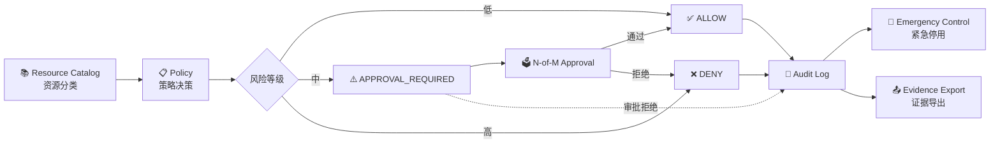
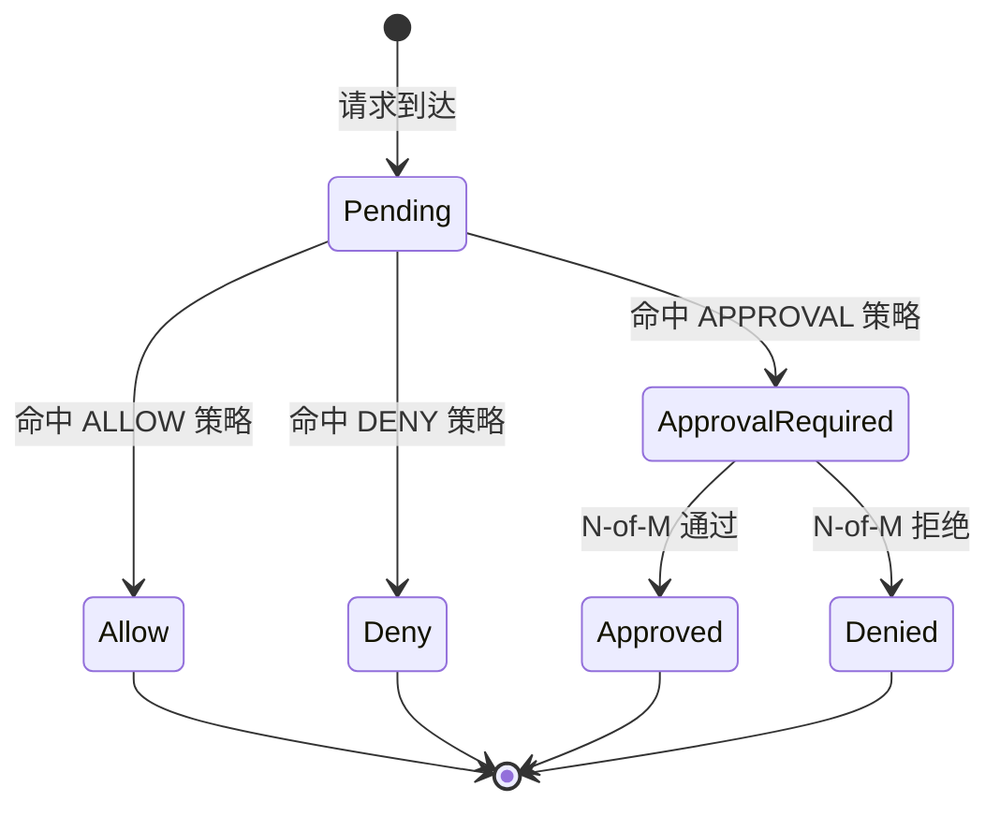
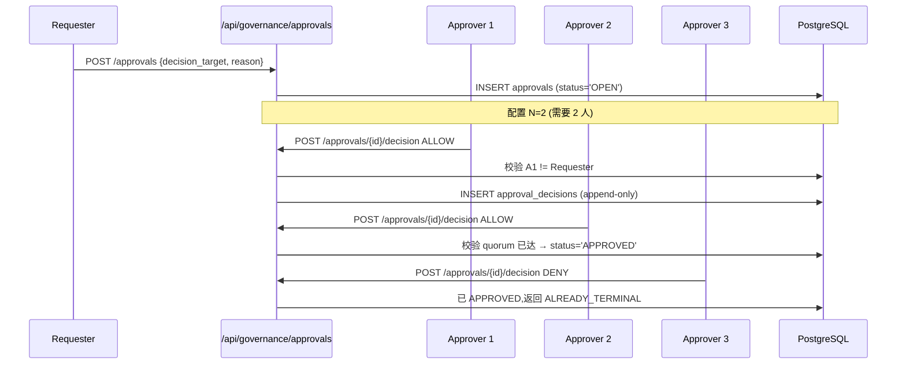
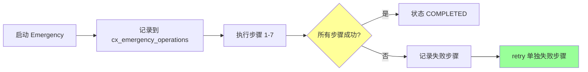
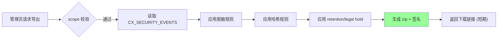
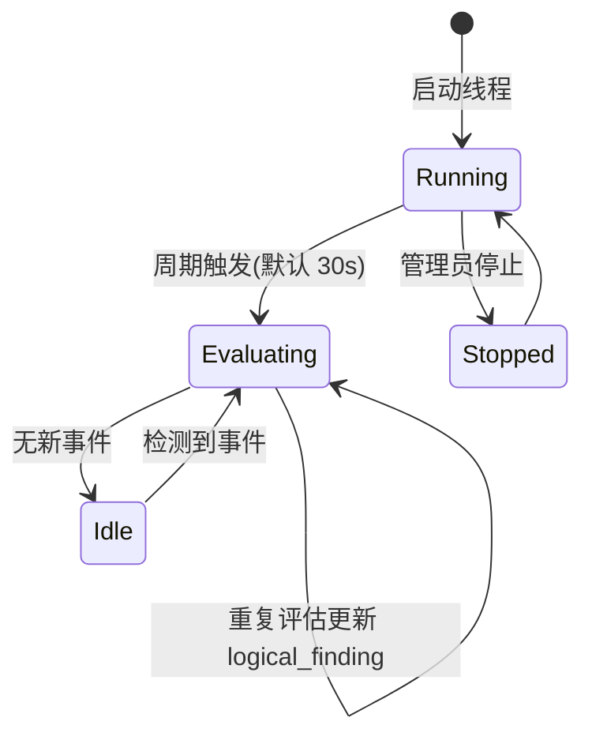

# §17 Enterprise 治理与合规控制面

> 🏛️ 架构师 · 👤 用户 · 🧑‍💻 开发者
>
> **一句话定位**:Enterprise 版提供完整的资源分类 → 策略决策 → 审批 → 紧急控制 → 风险审计 → 证据导出闭环。本章以企业版为主线,Community 版对应位置用 ⚠️ 标注。

---

## 1. 治理闭环

来源:[`docs/architecture.md:60-88`](architecture.md)、[`docs/security.md`](../security.md)

---

## 2. Resource Catalog ⚠️ 企业版

把资源分 7 类:

| 资源类型 | 例子 | 默认策略 |
|---|---|---|
| `DATABASE_DATA` | 业务表、Memory | ALLOW |
| `API` | `/api/agents/*` | ALLOW |
| `SKILL` | Skill ZIP | ALLOW |
| `TOOL` | Tool Registry | APPROVAL_REQUIRED |
| `KNOWLEDGE` | 知识库条目 | ALLOW |
| `WORKSPACE` | Workspace 数据 | ALLOW |
| `DATA_EXTRACT` | 导出/下载 | APPROVAL_REQUIRED |

**关键不变量**:请求侧不可降权。`sensitive`/`restricted`/未知资源必须有 explicit policy,否则 `DENY`。

---

## 3. Policy 决策 ⚠️ 企业版

决策结果是持久化的,**不可变**:

| 字段 | 说明 |
|---|---|
| `decision_id` | PK |
| `decision` | `ALLOW` / `DENY` / `APPROVAL_REQUIRED` |
| `policy_version` | 关联策略版本 |
| `reason` | 决策原因 |
| `validity` | 决策有效期(可空) |
| `correlation_id` | 关联 ID,用于跨系统追踪 |
| `created_at` | 决策时间(不可变) |

---

## 4. N-of-M Approval ⚠️ 企业版

高风险决策触发多人审批:

| 字段 | 说明 |
|---|---|
| `approval_id` | PK |
| `required_count` | 至少 N 人通过 |
| `approvers` | 候选人列表(角色/组) |
| `decisions` | 已收到决策 |
| `status` | `OPEN` / `APPROVED` / `DENIED` / `EXPIRED` |

### 4.1 关键不变量

- 决策归属于**认证 Principal**,不接受 body 中的 `approver_id`
- 默认排除**请求者**
- 强制**职责分离**(角色/组分离规则)
- **不可变**(append-only)
- **幂等**:重复决策返回 `duplicate: true, idempotent: true, terminal: true, result: "ALREADY_TERMINAL"`

---

## 5. Emergency Control ⚠️ 企业版

紧急停用是一个**多步操作**,每步都记录:

| 步骤 | 后果 |
|---|---|
| 1. 禁用 Registration | `agent_registrations.status='DISABLED'` |
| 2. 撤销 Grants | 所有 active grants 标记 `REVOKED` |
| 3. 终止 Session | `cx_web_sessions.terminate_at=now()` |
| 4. 释放 Pool 所有权 | 所有池化连接回收 |
| 5. 取消 Job | `graph_runs` 标记 `CANCELLED` |
| 6. 轮换凭据 | 生成新凭据,旧凭据失效 |
| 7. 记录审计 | `CX_SECURITY_EVENTS` 写入 |

> 🔐 每步都是**可重试**的。失败步骤可单独 retry,**不会**重复成功步骤。

---

## 6. Risk-Based Audit ⚠️ 企业版

普通审计 vs 风险审计:

| 维度 | 普通审计 (`entity_access_log`) | 风险审计 (`CX_SECURITY_EVENTS`) |
|---|---|---|
| 写入频率 | 高 | 关键事件 |
| 详情粒度 | 默认最小化 | 可配置 |
| 留存 | 默认 | 可配置 retention/legal hold |
| 脱敏 | 默认 | masked/hashed/redacted |
| 导出 | 无 | scoped evidence export |

### 6.1 Evidence Export

---

## 7. Compliance Controller ⚠️ 企业版(v4.3.4+)

来源:[`docs/security.md:21-58`](../security.md)

> **Compliance Controller 是数据库租约 + 围栏的确定性后台线程**,不做模型调用,不读 Prompt,不做 LLM 判断。

### 7.1 Controller 状态

### 7.2 高置信规则

只有以下"高置信"规则才触发自动处置:

| 规则 | 后果 |
|---|---|
| 凭据复用 | RESTRICTED |
| 身份绑定冲突 | QUARANTINED |
| Profile digest 不匹配 | RESTRICTED |
| Fencing bypass | QUARANTINED |

> 🔐 **Controller 不是普通 dashboard 用户或 LLM**;它是**唯一的自动 quarantine authority**。LLM/Agent 输出**不能**触发自动 quarantine。

---

## 8. Community vs Enterprise 物理边界

```mermaid
flowchart LR
    subgraph C["Community Build"]
        C1["✅ Memory/Knowledge/Graph APIs"]
        C2["✅ Loop/Spec/Harness"]
        C3["✅ MCP/Skill"]
        C4["✅ Registered-Agent 纳管"]
        C5["✅ 离线部署"]
    end
    subgraph E["Enterprise Build"]
        E1["+ Resource Catalog"]
        E2["+ Policy Decision"]
        E3["+ N-of-M Approval"]
        E4["+ Emergency Control"]
        E5["+ Compliance Controller"]
        E6["+ Per-Agent 加密密钥"]
        E7["+ LDAP"]
        E8["+ Skill Token"]
        E9["+ 风险审计 + 证据导出"]
    end
    C --> E
```

> ⚠️ 这是**构建期**(build-time)的物理边界。Community 包**不**包含 Enterprise 模块代码,运行时无法"打开"Enterprise 功能。

来源:[`lib/edition_features.py:has_feature`](../../scripts/lib/edition_features.py)

---

## 9. 关键 API 速查 ⚠️ 企业版

| 端点 | 方法 | 用途 |
|---|---|---|
| `/api/governance/probe` | GET | 验证企业对象存在 |
| `/api/governance/resources` | GET/POST | 管理资源分类 |
| `/api/governance/policies` | GET/POST | 管理策略 |
| `/api/governance/decide` | POST | 重新计算决策 |
| `/api/governance/approvals` | GET/POST | 创建/列出审批 |
| `/api/governance/approvals/{id}/decision` | POST | 记录决策 |
| `/api/governance/grants` | GET/POST | 颁发限时授权 |
| `/api/governance/grants/{id}/revoke` | POST | 撤销(带原因) |
| `/api/governance/emergency` | GET/POST | 启动/查询紧急控制 |
| `/api/governance/emergency/{id}/retry` | POST | 重试失败步骤 |
| `/api/governance/audit` | GET | 读取决策证据 |
| `/api/governance/evidence/export` | GET | 导出证据 |
| `/api/compliance/summary` | GET | 合规总览 |
| `/api/compliance/findings` | GET | 确定性发现 |
| `/api/compliance/profiles` | GET/POST | Profile 管理 |
| `/api/compliance/profiles/{id}/publish` | POST | 发布不可变版本 |
| `/api/compliance/exceptions` | GET/POST | 限时例外 |
| `/api/compliance/exceptions/{id}/{d}` | POST | 例外决策 |

---

## 10. 交叉引用

- 合规深度:[§41 合规控制面 v4.3.4](41-合规控制面v4.3.4.md)
- 应急控制:[§44 应急控制与紧急停用](44-应急控制与紧急停用.md)
- 审计深度:[§42 审计与证据导出](42-审计与证据导出.md)
- 现有文档:[`docs/security.md:21-58`](../security.md)、[`docs/architecture.md:60-88`](architecture.md)

> 📌 **下一章**:[§18 三数据库适配器边界](18-三数据库适配器边界.md) — Oracle 26ai / PostgreSQL 18 / YashanDB 23.5.4 的边界表。