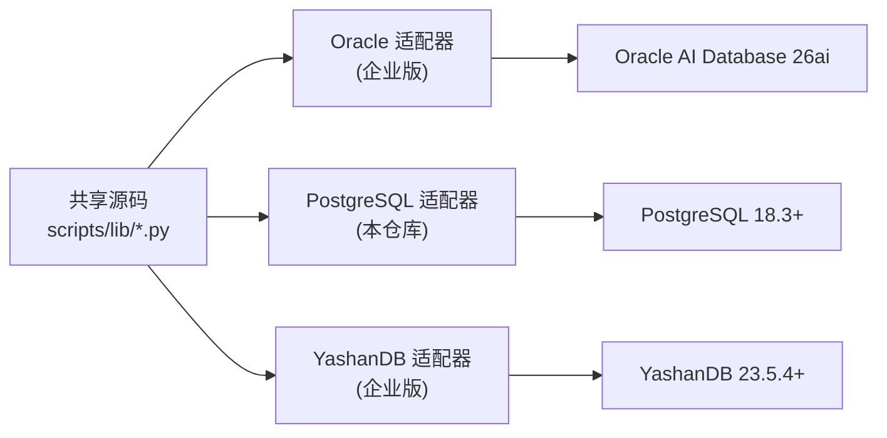
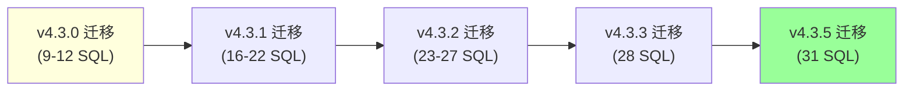
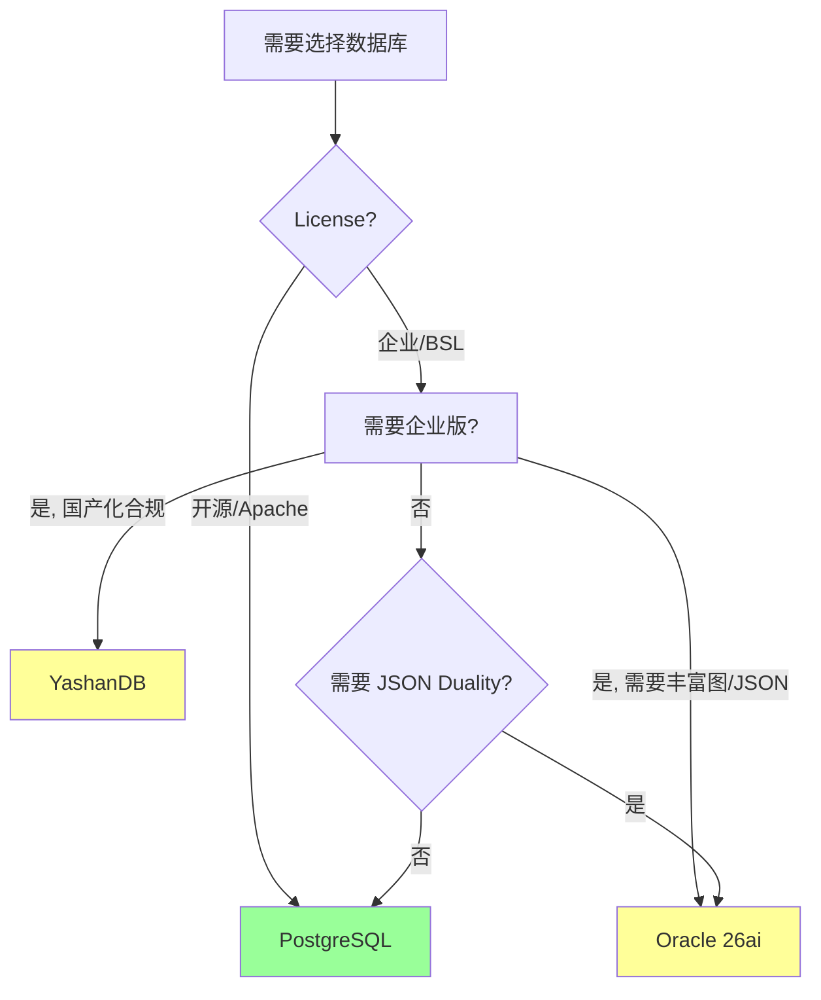

# §18 三数据库适配器边界

> 🏛️ 架构师 · 🧑‍💻 开发者
>
> **一句话定位**:川序是"统一技术项目",数据库**只是适配器**;关系表是执行权威,Native Property Graph / Apache AGE 只是只读投影。本章讲清三数据库各自的边界。

---

## 1. 适配器总览



> 📌 本仓库是 **PostgreSQL Community Edition**,只含 PostgreSQL 适配器。但共享的 Python 业务逻辑(`scripts/lib/`)保持跨数据库一致,只有 SQL/Driver 部分有差异。

---

## 2. 三数据库能力对比

| 维度 | Oracle 26ai | PostgreSQL 18 (本仓库) | YashanDB 23.5.4 |
|---|---|---|---|
| **版本要求** | 26ai | 18.3+ | 23.5.4+ |
| **License** | BSL 1.1 | Apache 2.0 | BSL 1.1 |
| **默认端口** | 18090 | 18080 | 18090 |
| **向量搜索** | Native VECTOR | pgvector | Native VECTOR |
| **模糊搜索** | Oracle Text | pg_trgm | 内置 |
| **全文搜索** | Oracle Text | tsvector + GIN | 内置 |
| **行级安全** | VPD / RLS | RLS (native) | 内置 RLS |
| **列级加密** | TDE / DBMS_CRYPTO | pgcrypto | 内置 |
| **定时任务** | DBMS_SCHEDULER | pg_cron | 内置 |
| **属性图** | Native Property Graph / SQL PGQ | Apache AGE 1.7+ | Native Property Graph |
| **JSON Duality** | JSON Relational Duality | 不支持 | 不支持 |
| **Deep Security** | End User + Data Grants | RLS only | Object Grants |

来源:[`docs/architecture.md:579-593`](architecture.md)、[`docs/deployment.md:9-21`](../deployment.md)

---

## 3. PostgreSQL 适配器(本仓库)

来源:[`lib/connection.py:DATABASE_DIALECT = "postgresql"`](../../scripts/lib/connection.py)

### 3.1 驱动

```python
# requirements.txt
psycopg2>=2.9
```

### 3.2 关键 PostgreSQL 扩展

| 扩展 | 用途 |
|---|---|
| `vector` (pgvector) | 向量嵌入 |
| `pg_trgm` | 模糊字符串匹配 |
| `pgcrypto` | 列级加密 |
| `pg_cron` | 定时任务 |
| Apache AGE 1.7+ | 属性图投影(只读) |

### 3.3 PostgreSQL RLS 实现

```sql
-- 示例:entities 表的 RLS 策略
CREATE POLICY entities_agent_isolation ON entities
  FOR ALL TO PUBLIC
  USING (
    owned_by_agent = current_setting('app.current_agent_id', true)
    OR visibility = 'PUBLIC'
    OR owned_by_agent = 'SYSTEM'
  );
```

应用层必须在每条连接上设置:

```python
# lib/connection.py
cursor.execute("SET app.current_agent_id = %s", (agent_id,))
```

> ⚠️ 漏掉这一行 = RLS 不生效。详见 [§43 加密机制与密钥管理](43-加密机制与密钥管理.md)。

### 3.4 PostgreSQL 调度

```sql
-- 3_jobs.sql 示例
SELECT cron.schedule('memory_fusion_job', '0 2 * * *',
  $$SELECT memory_fusion.fuse_similar()$$);
```

`pg_cron` 是 PostgreSQL 原生扩展,在数据库进程内调度,**不**需要外部 cron。

### 3.5 PostgreSQL 属性图投影

```sql
-- 用 Apache AGE 创建投影
SELECT create_graph('chuanxu_memory_graph');
SELECT create_vlabel('chuanxu_memory_graph', 'entity');
SELECT create_elabel('chuanxu_memory_graph', 'edge');
```

> ⚠️ AGE 是**只读投影**,关系表 (`entities`, `entity_edges`) 仍是权威。AGE 投影在 graph 视图中可能略有延迟(异步刷新)。

---

## 4. Oracle 适配器 ⚠️ 企业版

来源:[`docs/architecture.md:25-35`](architecture.md)、[`SKILL.md:38-41`](../SKILL.md)

| 特性 | 说明 |
|---|---|
| **Deep Security** | End User + Data Grants(比 PostgreSQL 更强) |
| **JSON Duality** | JSON Relational Duality Views(独有) |
| **属性图** | Native Property Graph + SQL PGQ |
| **加密** | TDE 列级 + DBMS_CRYPTO |
| **调度** | DBMS_SCHEDULER |
| **MAC** | Mandatory Access Control(7 个关键表强制) |
| **RLS** | VPD (Virtual Private Database) |

### 4.1 Data Grants vs PostgreSQL RLS

| 维度 | Oracle Data Grants | PostgreSQL RLS |
|---|---|---|
| 实现 | GRANT + 谓词 | CREATE POLICY |
| 角色数 | 多个 Data Role | 单个策略 |
| MAC | 强制 | 不强制 |
| End User | Direct Logon | session GUC |

---

## 5. YashanDB 适配器 ⚠️ 企业版

| 特性 | 说明 |
|---|---|
| **属性图** | Native Property Graph |
| **加密** | 内置 |
| **调度** | 内置 |
| **授权** | Object Grants(类似 Oracle,比 PG 更细) |

> YashanDB 是国产数据库,提供与 Oracle 相似的对象级授权,但不支持 VPD/MAC。

---

## 6. 哪些功能是 PostgreSQL 独占?

| 功能 | 数据库 | 说明 |
|---|---|---|
| **JSON Duality Views** | Oracle 独有 | 不能移植到 PG/YashanDB |
| **VPD/MAC** | Oracle 独有 | PG 用 RLS 替代 |
| **Apache AGE** | PG 独有 | Oracle/YashanDB 用 Native PG |
| **pg_cron** | PG 独有 | Oracle 用 DBMS_SCHEDULER |

> 💡 **设计原则**:不在 SQL 层用数据库独有特性。所有独有特性放在**适配器层**(`scripts/deploy/`),共享 Python 逻辑不依赖这些特性。

---

## 7. Migration 的可移植性



每个迁移都是**加性**的:

- ✅ 不修改已部署的表结构
- ✅ 不删除列
- ✅ 不改列名
- ✅ 不改索引名

> 因此从 PostgreSQL 适配器迁移到 Oracle/YashanDB 适配器**不会**有数据兼容性问题(数据需要重新初始化)。

---

## 8. 适配器选择的决策树



---

## 9. 交叉引用

- 部署:`docs/deployment.md`
- 加密:[§43 加密机制与密钥管理](43-加密机制与密钥管理.md)
- Schema Owner:[§12 身份与 Principal 控制面](12-身份与Principal控制面.md)
- 现有文档:[`docs/architecture.md:579-593`](architecture.md)

> 📌 **下一章**:[§19 Profile 与 Capability 配置平面](19-Profile与Capability配置平面.md) — v4.3.5 的核心:`CX_PLATFORM_CAPABILITIES` 三交集。