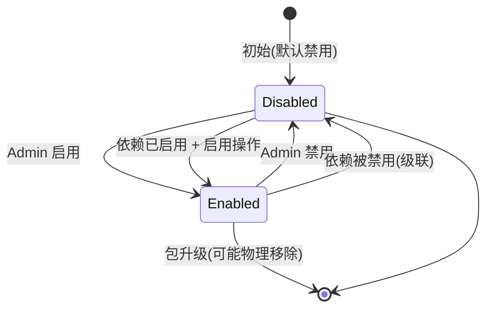
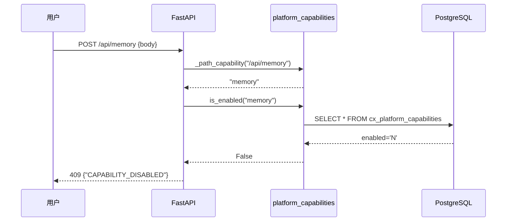
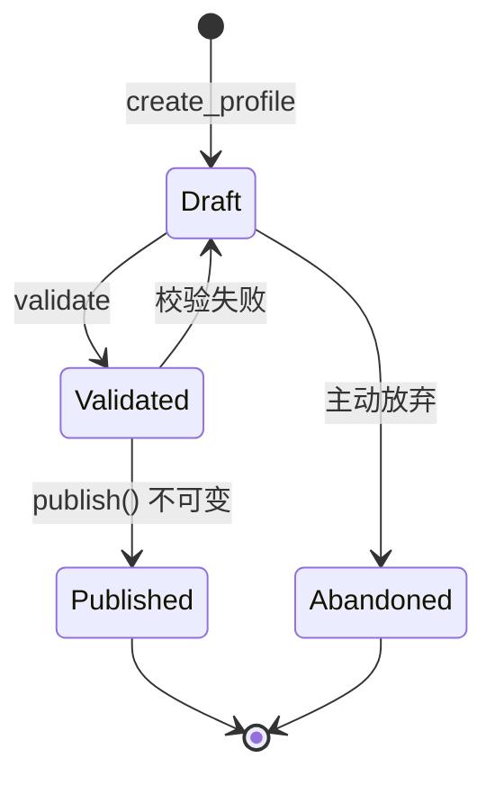
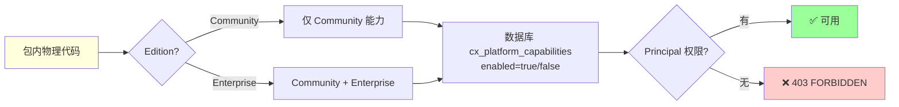

# §19 Profile 与 Capability 配置平面

> 🏛️ 架构师 · 👤 用户 · 🧑‍💻 开发者
>
> **一句话定位**:v4.3.5 把"能力可见性 ≠ 可用性"的不变量变成**数据库事实**,通过 Capability 三交集(包内 + 数据库启用 + Principal 授权)实现强制启用检查。

---

## 1. 核心命题

来源:[`RELEASE_NOTES_v4.3.5.md:7-25`](../RELEASE_NOTES_v4.3.5.md)、[`docs/security.md:5-19`](../security.md)

> **能力可用的充要条件**:
> 1. 包内物理包含该功能代码
> 2. 数据库注册表启用
> 3. 当前 Principal 拥有对应动作权限

三者缺一不可。前端隐藏只是"看不见",**不能**作为安全边界。

---

## 2. Capability 生命周期



> ⚠️ 如果 A 能力依赖 B,B 启用才能启用 A;A 已启用时,B 不能被禁用。

---

## 3. 关键表

来源:[`scripts/deploy/31_v4_3_5_platform_capabilities.sql`](../../scripts/deploy/31_v4_3_5_platform_capabilities.sql)

### 3.1 `cx_platform_capabilities`

| 字段 | 类型 | 说明 |
|---|---|---|
| `capability_key` | VARCHAR PK | 能力唯一键,如 `memory`、`compliance` |
| `enabled` | CHAR(1) | 'Y' / 'N' |
| `mandatory` | CHAR(1) | 'Y' 表示不可禁用(强制受保护) |
| `edition_available` | VARCHAR | 'community' / 'enterprise' / 'both' |
| `expected_version` | INT | 乐观锁版本 |
| `description` | TEXT | 人类可读描述 |
| `updated_by` | VARCHAR | 最后修改者 |
| `updated_at` | TIMESTAMP | 最后修改时间 |

### 3.2 `cx_platform_capability_dependencies`

| 字段 | 说明 |
|---|---|
| `capability_key` | 子能力 |
| `depends_on` | 父能力(必须先启用) |

### 3.3 `cx_platform_capability_history` (不可变)

| 字段 | 说明 |
|---|---|
| `history_id` | PK |
| `capability_key` | 能力 |
| `old_enabled` | 修改前状态 |
| `new_enabled` | 修改后状态 |
| `reason` | 必填原因 |
| `actor_principal_id` | 操作者 |
| `expected_version` | 乐观锁版本 |
| `created_at` | 时间戳 |

> 🔐 **不可变**:history 永远不能 UPDATE/DELETE。

---

## 4. 强制受保护的能力

| capability_key | 含义 | mandatory |
|---|---|---|
| `identity` | 身份与 Principal | ✅ |
| `authorization` | 授权决策 | ✅ |
| `security` | 安全控制 | ✅ |
| `audit_write` | 审计写入 | ✅ |
| `agent_identity` | Agent 身份 | ✅ |
| `user_management` | 用户管理 | ✅ |
| `platform_config` | Capability 配置本身 | ✅ |

> 这些能力**不能**被禁用,因为它们是其他能力的依赖/前提。

---

## 5. 后端强制检查(不是前端隐藏)

来源:[`web_app.py:_path_capability + enforce_platform_capability`](../../scripts/web_app.py)

```python
# web_app.py: 简化示例
@app.middleware("http")
async def enforce_platform_capability(request: Request, call_next):
    cap_key = _path_capability(request.url.path)
    if cap_key and not platform_capabilities.is_enabled(cap_key):
        return JSONResponse(
            {"error": "CAPABILITY_DISABLED"},
            status_code=409
        )
    return await call_next(request)
```



> 🔐 即使前端"看不见"Memory 页面,直接 POST `/api/memory` 也会被 409 拒绝。

---

## 6. 启用/禁用的安全约束

| 约束 | 实现 |
|---|---|
| **乐观锁** | `expected_version` 必须匹配最新 |
| **原因必填** | API 接受 `reason` 参数,非空校验 |
| **强制受保护** | `mandatory='Y'` 不能改 enabled |
| **依赖检查** | 双向校验(启用前 / 禁用后) |
| **同事务审计** | 状态行 + history 行 + security_event 同一事务 |
| **不存敏感数据** | 不会存密码/Token/私钥 |
| **Admin Skill Token** | 用 `X-Admin-Token` 头而非 URL 参数 |

---

## 7. Profile(企业版补充)

来源:[`docs/security.md:21-58`](../security.md)

Profile 是 **Agent 能力的"模板"**,与 Capability 是两个独立维度:

| 维度 | Capability | Profile |
|---|---|---|
| 粒度 | 系统级(粗) | Agent 级(细) |
| 受保护 | mandatory=true 不能禁用 | 不可变,parent lock 不能被 child 放松 |
| 创建 | Admin | Admin + Publish |
| 存储 | `cx_platform_capabilities` | `cx_compliance_profiles` |

### 7.1 Profile 状态机



### 7.2 Profile ≠ 授权边界

> **Profile 永远不能授予**:Principal、数据库、Tool、API、模型、密钥、网络权限。它只**约束**已授权操作。

---

## 8. Capability vs Edition 边界



---

## 9. 关键 API

| 端点 | 方法 | 用途 |
|---|---|---|
| `/api/platform/capabilities` | GET | 读取完整 capabilities + history |
| `/api/platform/capabilities/{key}` | PUT | 启用/禁用单个(带 reason + expected_version) |
| `/api/compliance/profiles` | GET/POST (企业版) | 列出/创建 Profile |
| `/api/compliance/profiles/{id}/publish` | POST (企业版) | 发布不可变版本 |
| `/api/agents/{id}/compliance-profile` | POST (企业版) | 分配 Profile |

---

## 10. 三个失败模式

| 模式 | 表现 | 排查 |
|---|---|---|
| **CAPABILITY_DISABLED** | 409,数据库启用为 N | Admin → Platform Capabilities 页启用 |
| **FORBIDDEN** | 403,Principal 缺权限 | 检查 role + scope + permission version |
| **EDITION_MISMATCH** | 404 或特定错误,包不含代码 | 升级到 Enterprise 包 |

---

## 11. 交叉引用

- 实操:[§30 首次部署与初始化](30-首次部署与初始化.md) — Admin 启用流程
- 安全:[§42 审计与证据导出](42-审计与证据导出.md) — capability change 写入 CX_SECURITY_EVENTS
- 合规:[§41 合规控制面](41-合规控制面v4.3.4.md) — Profile 详细
- 现有文档:[`RELEASE_NOTES_v4.3.5.md`](../RELEASE_NOTES_v4.3.5.md)、[`docs/security.md:5-19`](../security.md)

> 📌 **Part II 完**。下一章开始 [Part III 开发者视角 §20 本地开发环境搭建](20-本地开发环境搭建.md)。