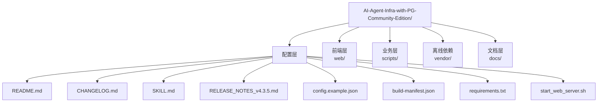
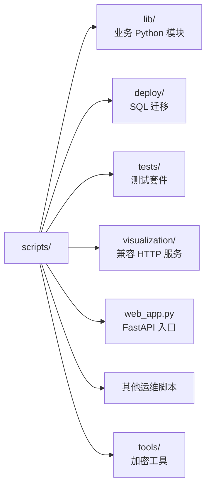
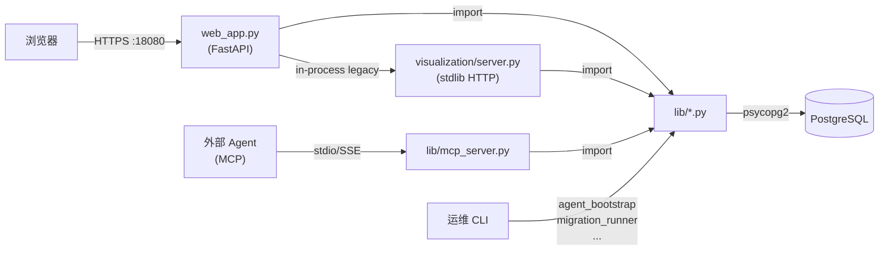

# §21 项目目录与代码结构

> 🧑‍💻 开发者
>
> **一句话定位**:理解"哪段代码放哪里" — 从顶层目录到具体模块的导览,以及 `scripts/lib/` 与 `scripts/deploy/` 的对应关系。

---

## 1. 顶层目录树



---

## 2. 各层职责

### 2.1 配置层(根目录)

| 文件 | 用途 |
|---|---|
| `README.md` | 项目说明 |
| `CHANGELOG.md` | 版本变更日志 |
| `SKILL.md` | Agent 操作手册 |
| `RELEASE_NOTES_v4.3.5.md` | 当前版本说明 |
| `config.example.json` | 配置模板(public) |
| `config.json` | 真实配置(运行时生成,owner-only) |
| `build-manifest.json` | 构建元数据 |
| `requirements.txt` | Python 依赖 |
| `package-files.sha256` | 打包校验 |
| `start_web_server.sh` | 启动入口 |

### 2.2 前端层 (`web/`)

```
web/
├── index.html         # 入口 HTML
├── package.json       # 前端依赖
├── vite.config.ts     # Vite 配置
├── tsconfig.json      # TS 配置
├── rollup-wasm-hook.cjs  # Rollup WASM 钩子
├── src/
│   ├── App.tsx        # 单文件 SPA(约 7000 行)
│   └── app.css        # 样式
└── dist/              # 构建产物(预编译)
```

来源:[`web/package.json`](../../web/package.json)

> 💡 **开发提示**:`web/dist/` 已预构建,生产环境**不需要** Node.js。仅当修改 `App.tsx` 时需要 Node 重构建。

### 2.3 业务层 (`scripts/`)



| 路径 | 行数 | 职责 |
|---|---|---|
| `scripts/web_app.py` | ~2900 | FastAPI 入口(规范) |
| `scripts/visualization/server.py` | ~4900 | 兼容入口(legacy bridge) |
| `scripts/lib/*.py` | ~60 文件 | 业务模块 |
| `scripts/deploy/*.sql` | ~30 文件 | SQL 迁移 |
| `scripts/tests/` | - | 测试 |
| `scripts/tools/encrypt_config.py` | - | 离线加密工具 |

---

## 3. `scripts/lib/` 模块地图

来源:[`scripts/lib/` 目录](../../scripts/lib/)

```mermaid
graph TB
    L["scripts/lib/"] --> Core["基础设施"]
    L --> Iden["身份/认证"]
    L --> Dom["领域 API"]
    L --> Graph["Graph 工程"]
    L --> Obs["可观测性"]
    L --> Skill["Skill/工具"]
    L --> MCP["MCP Server"]
    L --> Exec["执行控制"]
    L --> Conf["配置/加密"]

    Core --> C1["connection.py"]
    Core --> C2["config.py"]
    Core --> C3["security.py"]
    Core --> C4["edition_features.py"]

    Iden --> I1["agent_api.py"]
    Iden --> I2["agent_registration.py"]
    Iden --> I3["identity_api.py"]
    Iden --> I4["security_lifecycle.py"]
    Iden --> I5["agent_gateway_api.py"]
    Iden --> I6["user_api.py"]

    Dom --> D1["memory_api.py"]
    Dom --> D2["memory_lifecycle.py"]
    Dom --> D3["knowledge_api.py"]
    Dom --> D4["loop_api.py"]
    Dom --> D5["task_plan_api.py"]
    Dom --> D6["workspace_api.py"]
    Dom --> D7["branch_api.py"]
    Dom --> D8["spec_api.py"]
    Dom --> D9["harness_api.py"]
    Dom --> D10["collab_api.py"]
    Dom --> D11["organization_api.py"]
    Dom --> D12["embedding_api.py"]
    Dom --> D13["search_api.py"]
    Dom --> D14["graph_api.py"]
    Dom --> D15["profile_api.py"]
    Dom --> D16["compliance_api.py (Enterprise)"]
    Dom --> D17["platform_capabilities.py"]

    Graph --> G1["graph_runtime.py (139KB)"]
    Graph --> G2["graph_compiler.py"]
    Graph --> G3["graph_executor.py"]
    Graph --> G4["graph_contracts.py"]
    Graph --> G5["graph_state.py"]
    Graph --> G6["graph_governance.py"]
    Graph --> G7["graph_dynamic.py (preview)"]
    Graph --> G8["graph_predicate.py"]
    Graph --> G9["graph_assurance.py"]
    Graph --> G10["graph_supply_chain.py"]
    Graph --> G11["graph_compat.py"]
    Graph --> G12["graph_evaluators.py"]
    Graph --> G13["graph_adapter.py (AGE)"]
    Graph --> G14["graph_event_api.py"]
    Graph --> G15["graph_event_contract.py"]
    Graph --> G16["graph_scheduler.py"]
    Graph --> G17["graph_telemetry.py"]
    Graph --> G18["graph_worker.py"]
    Graph --> G19["graph_definition_api.py"]
    Graph --> G20["a2a_gateway.py (preview)"]

    Obs --> O1["monitor_api.py"]
    Obs --> O2["trace_api.py"]
    Obs --> O3["event_bus.py"]

    Skill --> SK1["skill_api.py"]
    Skill --> SK2["skill_acquire_api.py"]
    Skill --> SK3["skill_parser.py"]
    Skill --> SK4["skill_storage.py"]

    MCP --> M1["mcp_server.py"]

    Exec --> E1["execution_control.py"]
    Exec --> E2["message_api.py"]

    Conf --> CF1["connection_crypto.py"]
    Conf --> CF2["governed_contracts.py"]
    Conf --> CF3["agent_framework_adapters.py"]
```



---

## 4. `scripts/lib/` 与 `scripts/deploy/` 对应关系

来源:[`scripts/deploy/` 目录](../../scripts/deploy/)

| Python 模块 | 主要 SQL 表 | 迁移文件 |
|---|---|---|
| `agent_api.py` | `agent_registry`, `agent_credentials` | `1_schema.sql` |
| `identity_api.py` | `cx_principals`, `cx_human_identities` | `16_v4_3_0_identity_channels.sql` |
| `agent_registration.py` | `agent_registrations` | `8_v4_1_0_registration.sql` |
| `agent_gateway_api.py` | `cx_enrollment_grants`, `cx_agent_access_tokens` | `16-18_v4_3_0_*.sql` |
| `memory_api.py` | `entities_memory`, `entities` | `1_schema.sql` |
| `memory_lifecycle.py` | `cx_memory_families`, `cx_memory_versions` | `23_v4_3_2_memory_lifecycle.sql` |
| `knowledge_api.py` | `knowledge_meta`, `entities_knowledge` | `1_schema.sql` |
| `loop_api.py` | `cx_loops`, `cx_loop_runs` | `1_schema.sql` (loops) |
| `workspace_api.py` | `workspaces`, `workspace_context` | `1_schema.sql` |
| `branch_api.py` | `context_branches`, `branch_merge_log` | `1_schema.sql` |
| `task_plan_api.py` | `task_plans`, `task_steps` | `1_schema.sql` |
| `graph_api.py` | `entity_edges`, `entities` | `1_schema.sql` |
| `graph_runtime.py` | `graph_runs`, `graph_attempts` | `10_v4_2_0_graph_runtime.sql` |
| `graph_compiler.py` | `graph_definitions`, `graph_versions` | `9_v4_2_0_graph_engineering.sql` |
| `graph_assurance.py` | `graph_assurance_evidence` | `28_v4_3_3_graph_assurance.sql` |
| `organization_api.py` | `cx_organizations`, `cx_organization_closure` | `19_v4_3_1_organization_governance.sql` |
| `compliance_api.py` (⚠企业版) | `cx_compliance_*` | Enterprise-only SQL |
| `platform_capabilities.py` | `cx_platform_capabilities` | `31_v4_3_5_platform_capabilities.sql` |

---

## 5. 入口文件关系



> 📌 所有入口最终汇聚到 `scripts/lib/*.py` + `scripts/deploy/*.sql`。

---

## 6. 命名约定

### 6.1 SQL ID 前缀

| 前缀 | 含义 | 例 |
|---|---|---|
| `E_` | 边 | `E_8a3f...` |
| `SES_` | 会话 | `SES_a1b2...` |
| `LOG_` | 访问日志 | `LOG_c3d4...` |
| `COL_` | 协作 | `COL_e5f6...` |
| `PLAN_` | 任务计划 | `PLAN_g7h8...` |
| `STEP_` | 任务步骤 | `STEP_i9j0...` |
| `SNAP_` | 快照 | `SNAP_k1l2...` |
| `CALL_` | 工具调用 | `CALL_m3n4...` |
| `DEP_` | 依赖 | `DEP_o5p6...` |
| `HARNESS_` | Harness 模板 | `HARNESS_q7r8...` |
| `WS_` | Workspace | `WS_s9t0...` |
| `CTX_` | Context | `CTX_u1v2...` |
| `cx_` | v4.3.0+ 治理面表 | `cx_principals` |

### 6.2 Python 模块命名

- `*_api.py` — 业务 API facade
- `*_lifecycle.py` — 生命周期管理
- `*_runtime.py` — 运行时内核
- `*_compiler.py` — 编译/校验
- `*_contracts.py` — 契约/类型
- `*_api.py` + `*_lifecycle.py` 是常见组合

### 6.3 SQL 文件命名

```
<num>_<version>_<topic>.sql
```

例:`23_v4_3_2_memory_lifecycle.sql`(23 号脚本,v4.3.2,主题 memory_lifecycle)

数字编号允许"加性"插入(详见 [§22 SQL 迁移脚本导览](22-SQL迁移脚本导览.md))。

---

## 7. 交叉引用

- SQL 索引:[§51 SQL 迁移索引](51-SQL迁移索引.md)
- Python 模块索引:[§52 Python 模块索引](52-Python模块索引.md)
- 现有目录注释:[`README.md:91-150`](../README.md)

> 📌 **下一章**:[§22 SQL 迁移脚本导览](22-SQL迁移脚本导览.md) — 28+ SQL 文件的顺序、依赖、关键表。