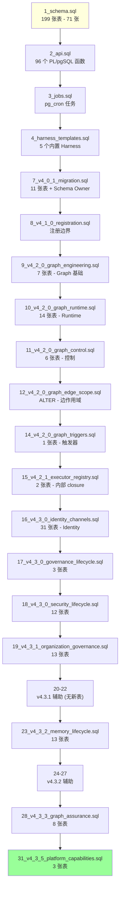
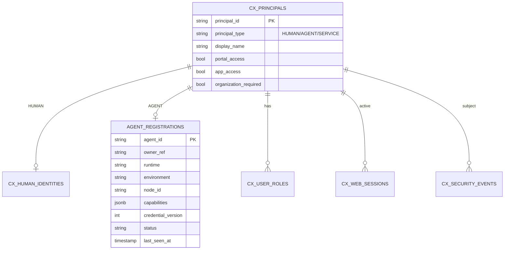
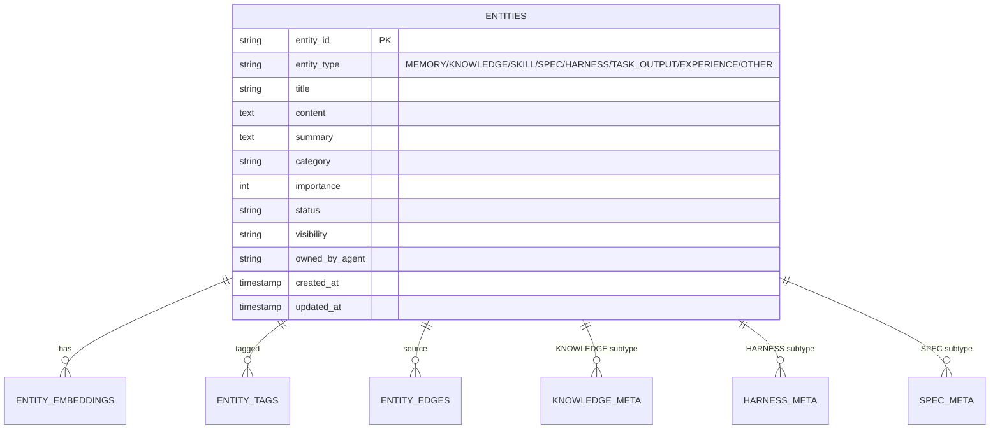
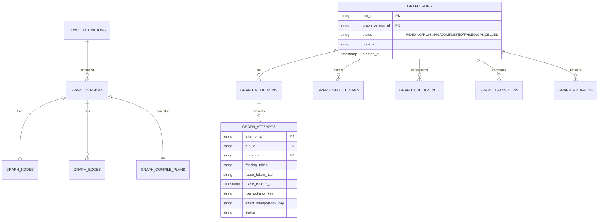
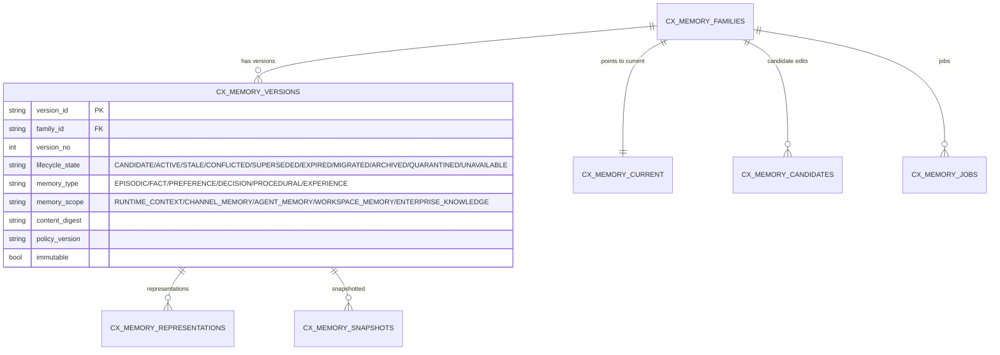
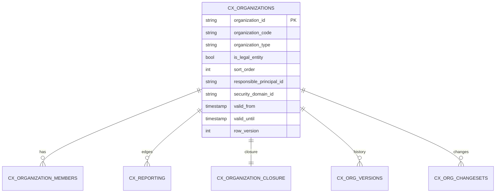
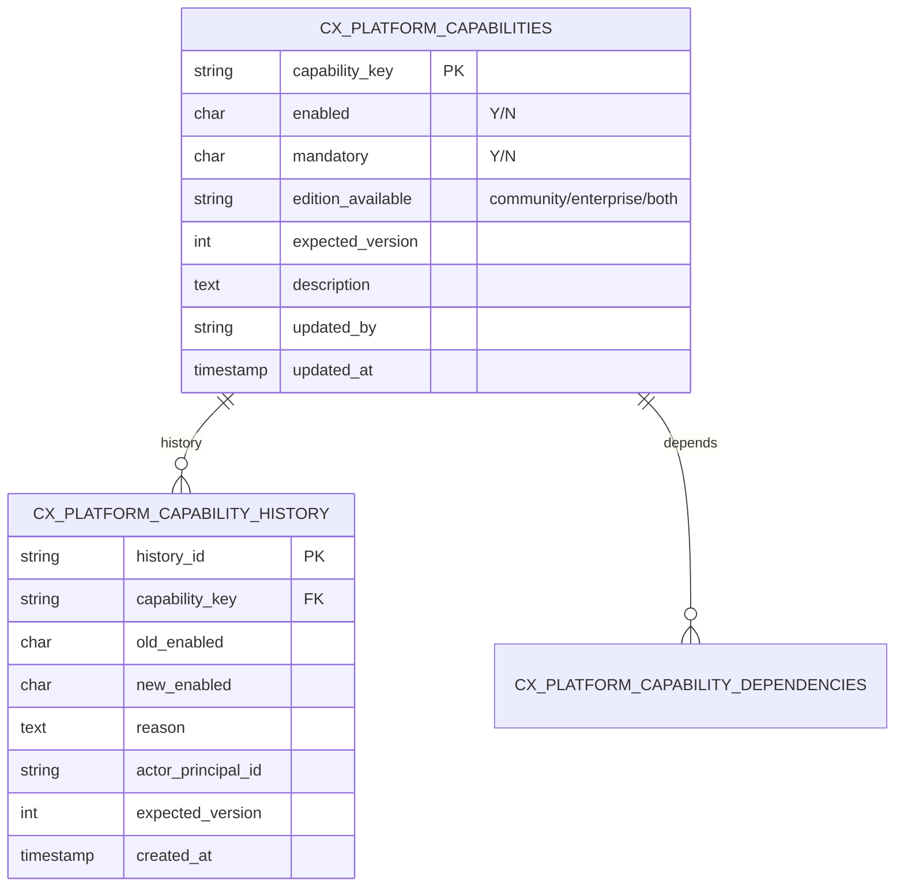

# §22 SQL 迁移脚本导览

> 🧑‍💻 开发者
>
> **一句话定位**:理解 28+ SQL 迁移文件的执行顺序、依赖图、关键表。本章以 Community Edition 为准,Enterprise 扩展用 ⚠️ 标注。

---

## 1. 总体顺序图



> ⚠️ 数字 5、6、13、29、30 故意跳过,留给 Enterprise 或未来扩展。

---

## 2. 迁移文件索引

| # | 文件 | 表数 | 主题 | 版本 |
|---|---|---|---|---|
| 1 | `1_schema.sql` | 71 | 核心 schema | v1.0.0 起 |
| 2 | `2_api.sql` | 0 | PL/pgSQL API | v1.0.0 起 |
| 3 | `3_jobs.sql` | 0 | pg_cron 任务 | v1.0.0 起 |
| 4 | `4_harness_templates.sql` | 0 | Harness 模板 | v1.0.0 起 |
| 5 | (跳过) | - | - | - |
| 6 | (跳过) | - | - | - |
| 7 | `7_v4_0_1_migration.sql` | 11 | baseline | v4.0.1 |
| 8 | `8_v4_1_0_registration.sql` | 1 | 注册边界 | v4.1.0 |
| 9 | `9_v4_2_0_graph_engineering.sql` | 7 | Graph 基础 | v4.2.0 |
| 10 | `10_v4_2_0_graph_runtime.sql` | 14 | Graph Runtime | v4.2.0 |
| 11 | `11_v4_2_0_graph_control.sql` | 6 | Graph 控制 | v4.2.0 |
| 12 | `12_v4_2_0_graph_edge_scope.sql` | 0 (ALTER) | 边作用域 | v4.2.0 |
| 13 | `13_v4_2_0_scheduler_ha.sql` | - | ⚠️ Enterprise only | v4.2.0 |
| 14 | `14_v4_2_0_graph_triggers.sql` | 1 | Graph 触发器 | v4.2.0 |
| 15 | `15_v4_2_1_executor_registry.sql` | 2 | Executor 注册 | v4.2.1 |
| 16 | `16_v4_3_0_identity_channels.sql` | 31 | Identity | v4.3.0 |
| 17 | `17_v4_3_0_governance_lifecycle.sql` | 3 | 治理生命周期 | v4.3.0 |
| 18 | `18_v4_3_0_security_lifecycle.sql` | 12 | 安全生命周期 | v4.3.0 |
| 19 | `19_v4_3_1_organization_governance.sql` | 13 | 组织治理 | v4.3.1 |
| 20 | `20_v4_3_1_human_display_name.sql` | 0 | 显示名 | v4.3.1 |
| 21 | `21_v4_3_1_entry_access.sql` | 0 | 入口访问 | v4.3.1 |
| 22 | `22_v4_3_1_identity_organization_alignment.sql` | 0 | 对齐约束 | v4.3.1 |
| 23 | `23_v4_3_2_memory_lifecycle.sql` | 13 | Memory 生命周期 | v4.3.2 |
| 24 | `24_v4_3_2_memory_digest_alignment.sql` | 0 | 摘要对齐 | v4.3.2 |
| 25 | `25_v4_3_2_disable_legacy_memory_fusion.sql` | 0 | 关闭旧融合 | v4.3.2 |
| 26 | `26_v4_3_2_snapshot_subject_fencing.sql` | 0 (ALTER) | 快照围栏 | v4.3.2 |
| 27 | `27_v4_3_2_memory_governance_completion.sql` | 3 | 治理补全 | v4.3.2 |
| 28 | `28_v4_3_3_graph_assurance.sql` | 8 | Graph 保障 | v4.3.3 |
| 29 | `29_v4_3_4_compliance.sql` | - | ⚠️ Enterprise only | v4.3.4 |
| 30 | `30_v4_3_4_compliance_hardening.sql` | - | ⚠️ Enterprise only | v4.3.4 |
| 31 | `31_v4_3_5_platform_capabilities.sql` | 3 | Platform Capabilities | v4.3.5 |

> 📌 总表数:**199 张**(71 + 0 + 0 + 0 + 11 + 1 + 7 + 14 + 6 + 0 + 1 + 2 + 31 + 3 + 12 + 13 + 0 + 0 + 0 + 13 + 0 + 0 + 0 + 3 + 8 + 3)。

---

## 3. 关键表按域分组

### 3.1 身份与认证



### 3.2 实体多态



> 📌 `entities` 表按 `entity_type` LIST + `created_at` RANGE 双重分区,详见 [`docs/architecture.md:215-260`](../architecture.md)。

### 3.3 Graph Runtime



### 3.4 Memory Lifecycle (v4.3.2)



### 3.5 Organization (v4.3.1)



### 3.6 Platform Capabilities (v4.3.5)



---

## 4. 加性原则

所有迁移都遵循:

| 原则 | 体现 |
|---|---|
| ✅ 不修改已部署表结构 | 极少有 ALTER 列名/类型 |
| ✅ 不删除列 | 即使列不再使用 |
| ✅ 不改索引名 | 保持兼容 |
| ✅ 加性加表 | 新功能 = 新表 + 新 PL/pgSQL 函数 |
| ✅ 幂等 | `IF NOT EXISTS`、`OR REPLACE` |

> 因此从 v4.0.x 升级到 v4.3.5 **不需要数据迁移**,只需按顺序应用新迁移。

---

## 5. 关键 PL/pgSQL 函数

来源:[`scripts/deploy/2_api.sql`](../../scripts/deploy/2_api.sql)

| Schema | 函数示例 | 用途 |
|---|---|---|
| `memory_fusion` | `fuse_similar`, `extract_knowledge` | 旧版 Memory 整合(已弃用) |
| `knowledge_api` | `schedule_review`, `record_review`, `validate_concept` | 知识复习 |
| `agent_perm` | `check_entity_access`, `check_workspace_access`, `log_access` | RLS 补充 |
| `session_cleanup` | `purge_access_logs`, `archive_old_entities` | 清理 |
| `workspace_manager` | `create`, `save_context`, `get_context_chain` | Workspace |
| `spec_manager` | `create`, `validate`, `derive` | Spec |
| `branch_manager` | `fork`, `merge`, `abandon`, `detect_conflicts` | Branch |
| `skill_manager` | `register`, `update`, `search` | Skill |
| `user_manager` | `create`, `authenticate`, `update_last_login` | User |
| `audit_api` | `log_access_event`, `get_compliance_report` | Audit |
| `ldap_auth` | `configure`, `test_connection` | LDAP (⚠️企业版) |
| `loop_manager` | `check_stop_conditions`, `cleanup_old_runs` | Loop |

> 💡 **设计原则**:业务逻辑优先放在 Python (`lib/`),只在需要"近数据"计算(如 RLS 谓词、批量清理)时用 PL/pgSQL。

---

## 6. 跨数据库差异

| 特性 | Oracle 26ai | PostgreSQL 18 | YashanDB 23.5.4 |
|---|---|---|---|
| 数据类型 | `VARCHAR2`, `CLOB`, `NUMBER` | `VARCHAR`, `TEXT`, `INTEGER` | 类似 Oracle |
| 触发器 | DML triggers | Row-level + statement-level | DML triggers |
| 序列 | `CREATE SEQUENCE` | `CREATE SEQUENCE` / `SERIAL` | `CREATE SEQUENCE` |
| 分区 | LIST + RANGE | LIST + RANGE | LIST + RANGE |
| 全文搜索 | Oracle Text | tsvector + GIN | 内置 |
| 向量 | VECTOR 类型 | pgvector | VECTOR 类型 |
| 图 | Native Property Graph | Apache AGE | Native Property Graph |

> ⚠️ 同一份 Python 代码在三数据库上行为一致,只有 `connection.py` 的 SQL 方言不同。

---

## 7. 迁移测试与回滚

### 7.1 测试

```bash
# 应用到测试库
psql -U ai_agent_runtime -d test_db_clone -f scripts/deploy/1_schema.sql

# 验证
"$PYTHON_BIN" scripts/live_db_validator.py --version 4.3.5
```

### 7.2 回滚

```sql
-- 谨慎使用,平台不支持自动回滚
-- 通常:创建新版本(同事务),应用反向迁移
DROP TABLE IF EXISTS cx_platform_capabilities_history;
DROP TABLE IF EXISTS cx_platform_capability_dependencies;
DROP TABLE IF EXISTS cx_platform_capabilities;
```

> ⚠️ **官方不推荐回滚**,推荐"应用下一版本修复"。

---

## 8. 交叉引用

- 迁移运行:[§47 数据库迁移运维](47-数据库迁移运维.md)
- 现有文档:[`docs/migration.md`](../migration.md)
- 完整索引:[§51 SQL 迁移索引](51-SQL迁移索引.md)

> 📌 **下一章**:[§23 Python 业务模块导览](23-Python业务模块导览.md) — `scripts/lib/` 60+ 模块按领域讲解。