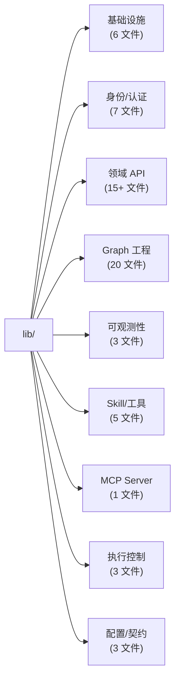
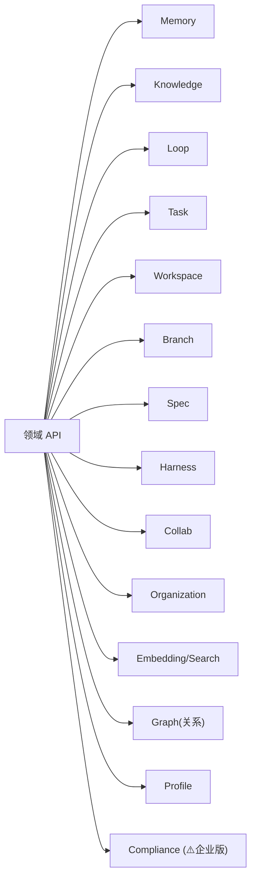
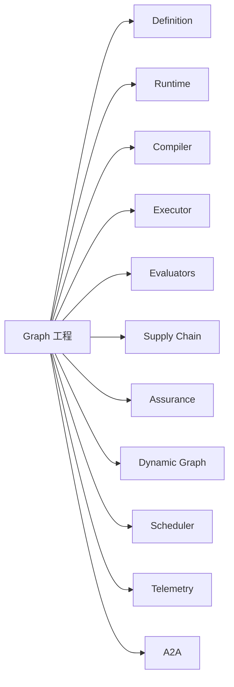
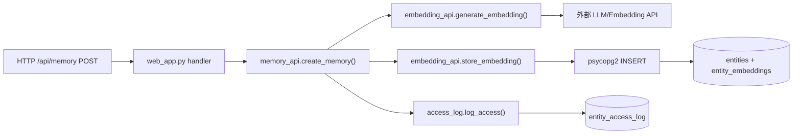
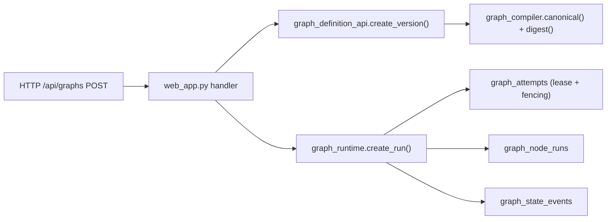

# §23 Python 业务模块导览

> 🧑‍💻 开发者
>
> **一句话定位**:`scripts/lib/` 60+ 模块按"领域"分组,理解每个模块的输入/输出/副作用。

---

## 1. 模块地图

来源:[`scripts/lib/` 目录](../../scripts/lib/)



---

## 2. 基础设施层

| 模块 | 主要 API | 说明 |
|---|---|---|
| `connection.py` | `get_pool()`, `get_connection()`, `get_connection_for_agent()`, `execute()`, `execute_query()` | psycopg2 连接池,设置 `app.current_agent_id` GUC |
| `config.py` | `load_config()`, `get_config()` | 配置 dataclass + 环境变量覆盖 |
| `connection_crypto.py` | `get_master_key()`, `encrypt_section()`, `decrypt_section()` | PBKDF2 + AES-256-GCM |
| `security.py` | `DataMaskingService`, `hash_password()`, `verify_password()` | 数据脱敏 + 密码哈希 |
| `edition_features.py` | `has_feature()` | Community/Enterprise 边界 |
| `governed_contracts.py` | `ContractDecision`, `channel_lifecycle_decision()` 等 | 纯函数契约 |

> 📌 这一层是**所有**其他模块的依赖根。

---

## 3. 身份/认证层

| 模块 | 主要 API | 关键功能 |
|---|---|---|
| `agent_api.py` | `register_agent()`, `heartbeat()`, `create_session()`, `hibernate_agent()`, `rotate_agent_crypto_key()`, `generate_admin_token()`, `recover_agent_via_admin()` | Agent 完整生命周期 + Recovery |
| `agent_registration.py` | `register_agent()`, `authenticate_agent()`, `adopt_legacy_agent()` | v4.1.0+ 注册流 |
| `identity_api.py` | `principal_summary()`, `hash_password_argon2id()`, `verify_password_hash()` | Human Principal |
| `security_lifecycle.py` | `link_external_identity()`, `enroll_totp()`, `verify_totp_secret()` | MFA / 外部身份链接 |
| `agent_gateway_api.py` | `authenticate_client_secret()`, `issue_access_token()`, `create_instance()`, `claim_events()` | Gateway + Channel |
| `user_api.py` | `register_user()`, `get_user_profile()`, `register_ldap_user()` | 用户 CRUD |
| `platform_capabilities.py` | `is_enabled()`, `page_states()`, `list_capabilities()` | v4.3.5 能力开关 |

---

## 4. 领域 API 层



| 模块 | 主要 API | 关键功能 |
|---|---|---|
| `memory_api.py` | `create_memory()`, `search_memories()`, `consolidate_branch_memories()`, `promote_to_semantic()` | 旧版 Memory CRUD |
| `memory_lifecycle.py` | `create_family()`, `create_successor()`, `mark_unavailable()`, `quarantine_family()`, `create_representation()` | v4.3.2 版本化 Memory |
| `knowledge_api.py` | `create_knowledge()`, `search_knowledge()`, `record_review()`, `merge_knowledge()`, `add_edge()` | Knowledge CRUD + 复习 |
| `embedding_api.py` | `generate_embedding()`, `store_embedding()`, `search_similar()`, `search_hybrid()`, `search_unified_sql()` | pgvector + pg_trgm |
| `search_api.py` | `search()`, `list_search_strategies()` | 统一多策略搜索 |
| `loop_api.py` | `create_loop()`, `start_run()`, `evaluate_iteration()`, `execute_loop_iteration()`, 6 种评估器 | Loop Engineering |
| `task_plan_api.py` | `create_plan()`, `add_step()`, `add_dependency()`, `log_tool_call()`, `save_snapshot()` | 任务计划 |
| `workspace_api.py` | `create_workspace()`, `save_context()`, `get_context_chain()`, `recover_workspace()` | Workspace + Context Chain |
| `branch_api.py` | `fork_branch()`, `merge_branch()`, `detect_conflicts()`, `mark_as_lesson()` | Context Branch |
| `spec_api.py` | `create_spec()`, `validate_plan_against_spec()`, `derive_spec()`, `create_spec_version()` | Spec-Driven |
| `harness_api.py` | `create_harness_template()`, `instantiate_harness_template()`, `get_template_inheritance_chain()` | Harness |
| `collab_api.py` | `create_collab_group()`, `share_memory_to_group()`, `create_group_loop()` | 协作组 |
| `organization_api.py` | `list_roots()`, `list_children()`, `search()`, `assemble_graph()` | v4.3.1 组织 |
| `graph_api.py` | `get_neighbors()`, `get_shortest_path()`, `find_communities()`, `pagerank()` | 关系图 + 算法 |
| `profile_api.py` | `current_profile()`, `active_work()`, `preflight()`, `activate()` | 当前 Profile |
| `compliance_api.py` (⚠️企业版) | `_validate_profile_publication_tx()`, `_active_profile_tx()` | 合规 Profile |

---

## 5. Graph 工程层(最大)



| 模块 | 主要 API | 关键功能 |
|---|---|---|
| `graph_definition_api.py` | `create_graph()`, `create_version()`, `canonical_json()`, `digest_json()` | Graph/Version CRUD |
| `graph_compiler.py` | `builtin_type_registry()`, `canonical()`, `digest()`, `_diag()` | 编译 + 校验 |
| `graph_runtime.py` | `register_worker()`, `create_run()`, `claim_ready()`, `heartbeat()`, `_verify_lease()` | **最大文件**(~139KB) — 运行时内核 |
| `graph_executor.py` | `validate_manifest()`, `builtin_executor_manifests()` | 节点执行器 |
| `graph_contracts.py` | `completion_request_digest()`, `is_valid_status_transition()` | 状态转换契约 |
| `graph_state.py` | `encode_secret_state()`, `decode_secret_state()` | 密钥信封 |
| `graph_governance.py` | `record_governance_event()`, `budget_decision()` | 治理事件 |
| `graph_dynamic.py` | `require_preview()`, `normalize_operations()`, `assess_risk()` | Dynamic Graph (预览) |
| `graph_predicate.py` | `compile_safe_predicate()`, `state_ref()` | 安全谓词 |
| `graph_assurance.py` | `arm_failpoint_for_test()`, `checkpoint()`, `record_evidence_tx()` | v4.3.3 保障证据 |
| `graph_supply_chain.py` | `canonical_json()`, `make_envelope()`, `verify_document()` | 供应链 + Ed25519 |
| `graph_compat.py` | `graph_status()`, `task_plan_definition()` | v4.1 兼容 |
| `graph_evaluators.py` | `builtin_evaluator_manifests()`, `compute_metrics()` | 评估器 |
| `graph_adapter.py` | `projection_statements()`, `capability_probe()` | Apache AGE |
| `graph_event_api.py` | `receive()`, `pending_inbox()`, `replay_dead_letter()` | 事件 Inbox/Outbox |
| `graph_event_contract.py` | `canonical()`, `validate_event()`, `sign_event()` | 事件契约 |
| `graph_scheduler.py` | `admission_decision()`, `fair_order()`, `acquire_scheduler_lease()` | 调度策略 |
| `graph_telemetry.py` | `enabled()`, `redact_metadata()` | 遥测(预览) |
| `graph_worker.py` | `advertise()`, `claim()`, `complete()`, `fail()` | Worker |
| `a2a_gateway.py` | `negotiate()`, `agent_card()`, `create_task()` | A2A 1.0.1 (预览) |

---

## 6. 可观测性层

| 模块 | 主要 API | 关键功能 |
|---|---|---|
| `monitor_api.py` | `get_agent_health()`, `get_system_overview()`, `detect_run_drift()`, `create_alert_rule()` | 系统总览 + 漂移检测 |
| `trace_api.py` | `init_trace()`, `get_trace_tree()`, `get_trace_summary()` | 调用链追踪 |
| `event_bus.py` | `publish_event()`, `subscribe_agent()`, `execute_hooks()` | Pub/Sub + Webhook |

---

## 7. Skill/工具层

| 模块 | 主要 API | 关键功能 |
|---|---|---|
| `skill_api.py` | `register_skill()`, `validate_skill()`, `deprecate_skill()` | Skill CRUD |
| `skill_acquire_api.py` | `discover_skills()`, `acquire_skill_text()`, `materialize_skill()` | 外部 Agent 获取 |
| `skill_parser.py` | `parse_skill_md()`, `parse_skill_package()` | SKILL.md 解析 |
| `skill_storage.py` | `save_resource()`, `get_resource_path()` | 文件系统存储 |
| `tool_registry.py` | `import_openapi()`, `import_from_url()`, `create_tool_chain()` | OpenAPI → Tool |

---

## 8. MCP Server

`mcp_server.py` — MCP 协议实现,提供工具:

| 工具 | 说明 |
|---|---|
| `memory_lifecycle_create` | 创建 Family |
| `memory_lifecycle_chain` | 读 Chain |
| `memory_lifecycle_feedback` | 提交反馈 |
| `memory_lifecycle_candidate` | 提交候选 |
| `graph_create_run` | 启动 Graph Run |
| `graph_claim` | Worker claim |
| `graph_complete` | Worker complete |
| `skill_discover` | 发现 Skill |
| `skill_acquire` | 获取 Skill |
| ... | (~10+ 工具) |

---

## 9. 执行控制层

| 模块 | 主要 API | 关键功能 |
|---|---|---|
| `execution_control.py` | `enqueue_job()`, `decide_job()`, `claim_job()`, `complete_job()` | 有界执行 |
| `message_api.py` | `send_message()`, `get_conversation()`, `reply_message()` | 消息 |
| `mcp_server.py` | (同上) | MCP |

---

## 10. 配置/契约层

| 模块 | 用途 |
|---|---|
| `connection_crypto.py` | 配置加密/解密 |
| `governed_contracts.py` | 纯函数决策(可移植 Python + PL/pgSQL) |
| `agent_framework_adapters.py` | OpenClaw / Hermes 适配 |

---

## 11. 调用关系(典型场景)

### 11.1 创建 Memory 并向量化



### 11.2 启动 Graph Run



---

## 12. 测试覆盖

`scripts/tests/` 下的测试覆盖:

| 测试类型 | 数量 | 覆盖 |
|---|---|---|
| 单元测试 | ~50 | 各模块 API |
| 集成测试 | ~20 | 多模块协作 |
| 端到端 | ~10 | HTTP API |
| 跨数据库 | ~10 | PG + Oracle + YashanDB |

```bash
"$PYTHON_BIN" -m pytest scripts/tests/ -q --tb=no
```

---

## 13. 交叉引用

- 模块索引:[§52 Python 模块索引](52-Python模块索引.md)
- Web 入口:[§24 FastAPI Web 服务剖析](24-FastAPI-Web服务剖析.md)
- 测试:[§27 测试体系与 pytest 实践](27-测试体系与pytest实践.md)

> 📌 **下一章**:[§24 FastAPI Web 服务剖析](24-FastAPI-Web服务剖析.md) — `web_app.py` 的路由、中间件、Principal-aware 流程。