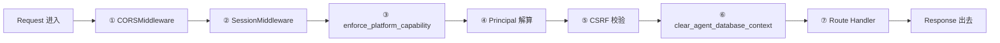
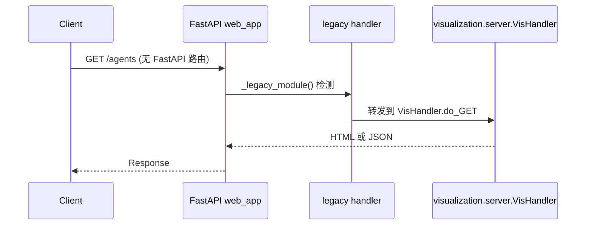
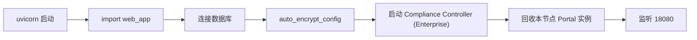

# §24 FastAPI Web 服务剖析

> 🧑‍💻 开发者
>
> **一句话定位**:`scripts/web_app.py` 是 v4.3.0+ 的**唯一规范 HTTP 入口**,理解它的中间件、路由注册、Principal 解算流程。

---

## 1. 应用入口

来源:[`scripts/web_app.py`](../../scripts/web_app.py)

```python
# web_app.py:99
app = FastAPI(
    title="Chuanxu AI Agent Management Platform",
    version="4.3.5"
)
```

| 行号 | 内容 |
|---|---|
| `web_app.py:1-50` | 模块 docstring、imports |
| `web_app.py:99` | FastAPI app 实例 |
| `web_app.py:102-149` | `_path_capability()` 路由→能力映射 |
| `web_app.py:150-220` | 中间件注册 |
| `web_app.py:220-580` | 模型定义 |
| `web_app.py:580-1100` | 路由注册(~144 个) |
| `web_app.py:1100-1300` | `/app/{page}` shell + 静态文件 |

---

## 2. 中间件链



### 2.1 enforce_platform_capability (v4.3.5 核心)

来源:[`web_app.py:102-149`](../../scripts/web_app.py)

```python
def _path_capability(path: str) -> str | None:
    # 路由 → capability_key 的硬编码映射
    if path.startswith("/api/agents"):
        return "agents"
    if path.startswith("/api/memory"):
        return "memory"
    # ... 19 个 capability_key

@app.middleware("http")
async def enforce_platform_capability(request: Request, call_next):
    cap_key = _path_capability(request.url.path)
    if cap_key and not platform_capabilities.is_enabled(cap_key):
        return JSONResponse(
            {"error": "CAPABILITY_DISABLED"},
            status_code=409
        )
    return await call_next(request)
```

> 🔐 这是 v4.3.5 的核心:**前端隐藏 ≠ 安全边界**,后端在每个 handler 前强制检查。

### 2.2 Principal 解算

```python
# 简化示例
@app.middleware("http")
async def authenticate_principal(request: Request, call_next):
    session = request.cookies.get("chuanxu_session")
    if session:
        principal = identity_api.authenticate_session(session)
        if principal:
            request.state.principal = principal
        else:
            request.state.principal = None
    else:
        request.state.principal = None

    if not request.state.principal and request.url.path not in PUBLIC_PATHS:
        return JSONResponse({"error": "UNAUTHENTICATED"}, status_code=401)

    return await call_next(request)
```

### 2.3 CSRF 校验

```python
@app.middleware("http")
async def csrf_check(request: Request, call_next):
    if request.method in ("POST", "PUT", "DELETE", "PATCH"):
        header_token = request.headers.get("X-CSRF-Token")
        cookie_token = request.cookies.get("chuanxu_csrf")
        if not header_token or header_token != cookie_token:
            return JSONResponse({"error": "CSRF_FAILED"}, status_code=403)
    return await call_next(request)
```

### 2.4 clear_agent_database_context

```python
@app.middleware("http")
async def clear_agent_database_context(request: Request, call_next):
    try:
        return await call_next(request)
    finally:
        # 防止连接泄漏导致 RLS 身份混淆
        connection.clear_agent_context()
```

---

## 3. 路由分组

来源:[`web_app.py` 路由注册段](../../scripts/web_app.py)

| 路径前缀 | 数量 | 用途 |
|---|---|---|
| `/api/health` | 1 | 健康检查 |
| `/api/auth/*` | ~10 | 登录/登出/MFA/密码重置 |
| `/api/capabilities` | 2 | 当前 Principal 可用能力 |
| `/api/platform/capabilities` | 2 | v4.3.5 能力管理 |
| `/api/organization/*` | ~15 | 组织查询 + 变更 |
| `/api/agents*` | ~10 | Agent CRUD + Posture |
| `/api/compliance/*` (⚠️企业版) | ~10 | 合规 |
| `/api/approvals/*` | ~5 | 审批 |
| `/api/audit/*` | ~5 | 审计 |
| `/api/governance/*` (⚠️企业版) | ~15 | 治理 |
| `/api/users/*` | ~10 | 用户 |
| `/api/roles/*` | ~5 | 角色 |
| `/api/sessions/*` | ~3 | 会话 |
| `/api/delegations/*` | ~3 | 委托 |
| `/api/channels/*` | ~10 | Channel |
| `/api/barriers/*` | ~5 | Barrier |
| `/api/memory-candidates/*` | ~3 | 候选 |
| `/api/static/{path}` | 1 | 静态资源 |
| `/app/{page}` | 1 | SPA shell |
| 兼容路由 | ~20 | 转发到 visualization/server.py |

> 📌 总计约 **144 个** 路由注册(`@app.get/post/put/delete`)。

---

## 4. 关键路由详解

### 4.1 POST /api/auth/login

```python
@app.post("/api/auth/login")
async def login(body: LoginBody, request: Request):
    principal = identity_api.authenticate(body.username, body.password)
    if not principal:
        raise HTTPException(401, "INVALID_CREDENTIALS")
    session = identity_api.create_session(principal.principal_id)
    response = JSONResponse({"principal": principal.summary()})
    response.set_cookie("chuanxu_session", session.session_id, httponly=True, secure=True)
    response.set_cookie("chuanxu_csrf", session.csrf_token, httponly=False, secure=True)
    return response
```

### 4.2 POST /api/memory

```python
@app.post("/api/memory")
async def create_memory(body: MemoryBody, request: Request):
    principal = request.state.principal
    # 强制要求 family_id
    family_id = memory_lifecycle.create_family(
        principal_id=principal.principal_id,
        memory_type=body.memory_type,
        scope=body.scope,
        content=body.content
    )
    return {"family_id": family_id}
```

### 4.3 PUT /api/platform/capabilities/{key}

```python
@app.put("/api/platform/capabilities/{capability_key}")
async def toggle_capability(
    capability_key: str,
    body: CapabilityToggleBody,
    request: Request
):
    principal = request.state.principal
    if "platform.manage" not in principal.permissions:
        raise HTTPException(403, "FORBIDDEN")
    try:
        platform_capabilities.toggle(
            capability_key=capability_key,
            enabled=body.enabled,
            reason=body.reason,
            actor_principal_id=principal.principal_id,
            expected_version=body.expected_version
        )
        return {"status": "OK"}
    except platform_capabilities.CapabilityConflict as e:
        raise HTTPException(409, "CONFLICT", detail=str(e))
```

---

## 5. 模型定义(Pydantic)

```python
# web_app.py: 简化示例
class LoginBody(BaseModel):
    username: str
    password: str

class RegistrationBody(BaseModel):
    agent_id: str
    sponsor: str
    runtime: str
    environment: str
    risk_tier: str
    quota: int
    policy_snapshot: dict

class MemoryBody(BaseModel):
    memory_type: Literal["EPISODIC", "FACT", "PREFERENCE", "DECISION", "PROCEDURAL", "EXPERIENCE"]
    scope: Literal["RUNTIME_CONTEXT", "CHANNEL_MEMORY", "AGENT_MEMORY", "WORKSPACE_MEMORY"]
    content: str
    summary: Optional[str] = None
    importance: int = 5

class CapabilityToggleBody(BaseModel):
    enabled: bool
    reason: str
    expected_version: int
```

---

## 6. 与 visualization/server.py 的兼容桥

来源:[`web_app.py:_legacy_module()`](../../scripts/web_app.py)



> 📌 兼容桥在同一进程内,**不**打开第二端口,**不**绕过 Principal-aware 中间件。

---

## 7. 启动与配置

```bash
# 默认启动
uvicorn web_app:app --host 0.0.0.0 --port 18080

# 生产环境(gunicorn)
gunicorn web_app:app -w 4 -k uvicorn.workers.UvicornWorker \
  --bind 0.0.0.0:18080 \
  --access-logfile /var/log/chuanu/access.log
```

### 7.1 启动时执行的关键步骤



---

## 8. 静态文件服务

```python
# web_app.py
from fastapi.staticfiles import StaticFiles
app.mount("/static", StaticFiles(directory="web/dist"), name="static")
app.mount("/app/static", StaticFiles(directory="scripts/visualization/static"), name="viz_static")
```

| 路径 | 来源 |
|---|---|
| `/static/*` | `web/dist/` (React 构建产物) |
| `/app/static/*` | `scripts/visualization/static/` (历史兼容) |

---

## 9. SPA Shell

```python
@app.get("/app/{page}")
async def app_shell(page: str):
    return FileResponse("web/dist/index.html")
```

来源:[`web_app.py:1107`](../../scripts/web_app.py)

> 所有 SPA 页面由 `/app/{page}` 返回同一 HTML,前端 `App.tsx` 根据 `window.location.pathname` 决定渲染哪个组件。

---

## 10. 关键文件引用

| 关注点 | 行号 |
|---|---|
| App 实例 | `web_app.py:99` |
| Capability 映射 | `web_app.py:102-149` |
| 中间件 | `web_app.py:150-220` |
| 登录 | `web_app.py:580-650` |
| Memory API | `web_app.py:700-850` |
| Platform Capabilities | `web_app.py:850-920` |
| Compliance Controller (⚠️企业版) | `web_app.py:1300-1400` |
| 静态挂载 | `web_app.py:578` |
| SPA Shell | `web_app.py:1107` |

---

## 11. 交叉引用

- MCP Server:[§25 MCP Server 与 SKILL 契约](25-MCP-Server与SKILL契约.md)
- Web 前端:[§26 Web 前端架构](26-Web前端架构.md)
- Capability:[§19 Profile 与 Capability 配置平面](19-Profile与Capability配置平面.md)
- 测试:[§27 测试体系](27-测试体系与pytest实践.md)

> 📌 **下一章**:[§25 MCP Server 与 SKILL 契约](25-MCP-Server与SKILL契约.md) — 外部 Agent 如何通过 MCP 与 SKILL.md 与平台交互。