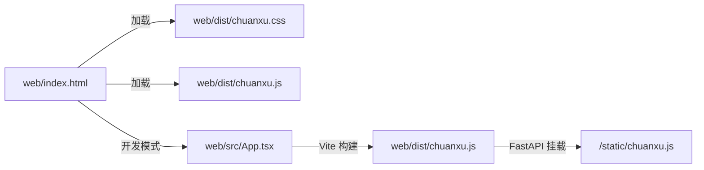
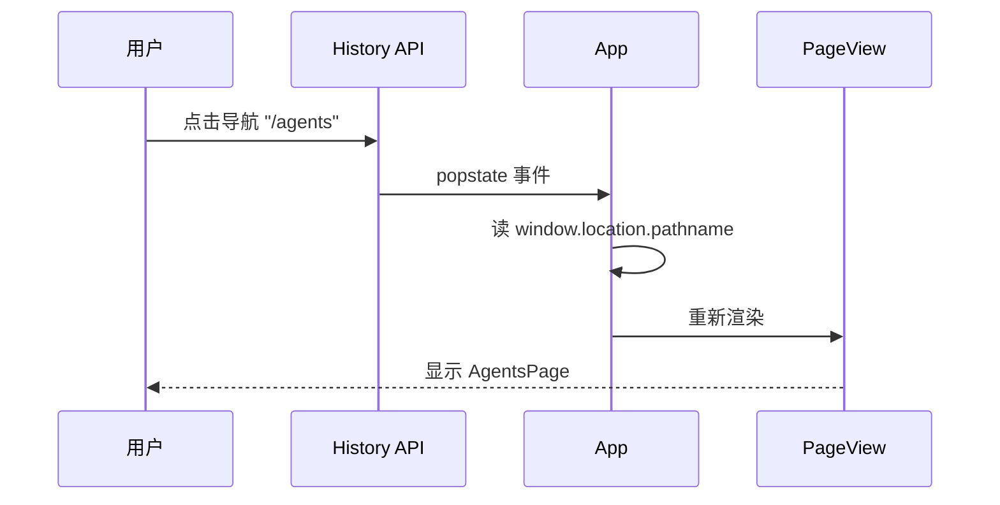
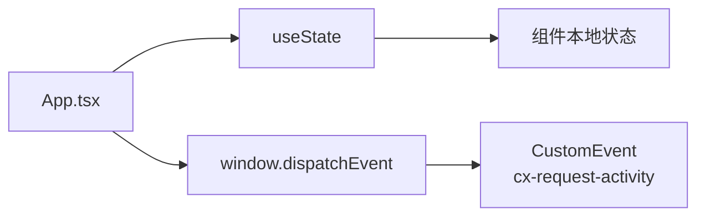
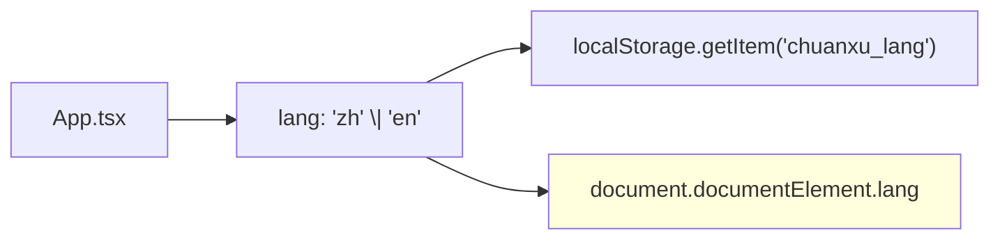
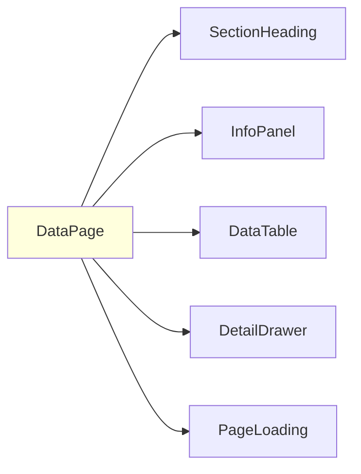
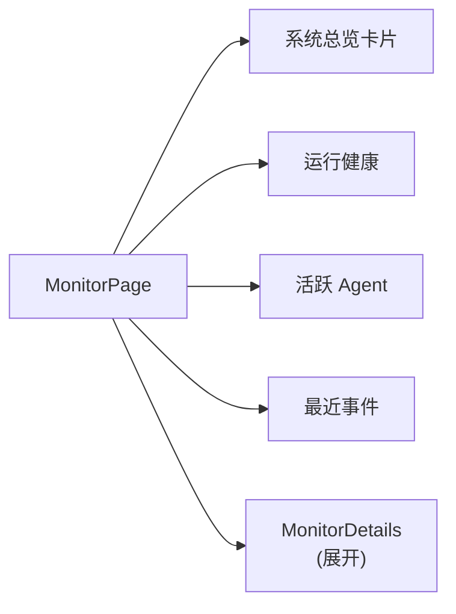
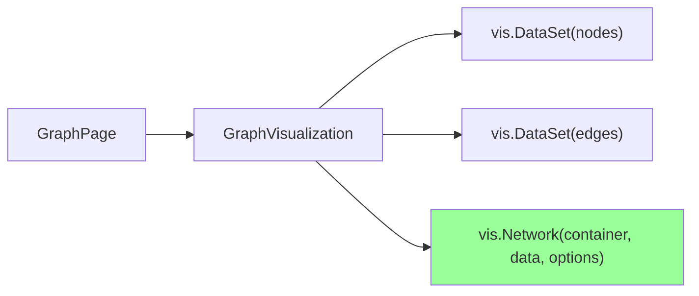

# §26 Web 前端架构

> 🧑‍💻 开发者
>
> **一句话定位**:`web/src/App.tsx` 是单文件 SPA(约 7000 行),通过 20 项 nav + pageFromPath() 路由器分发;支持中英双语。

---

## 1. 技术栈

来源:[`web/package.json`](../../web/package.json)

| 依赖 | 版本 | 用途 |
|---|---|---|
| `react` | 19.1.1 | UI 框架 |
| `react-dom` | 19.1.1 | 渲染 |
| `lucide-react` | 0.468.0 | 图标 |
| `vite` | 7.3.6 | 构建 |
| `@vitejs/plugin-react` | 4.7.0 | React 插件 |
| `typescript` | 5.9.2 | 类型 |
| `@rollup/wasm-node` | 4.62.3 | WASM 引擎 |

> 📌 **没有路由库,没有状态管理库,没有 UI 组件库** — 全靠手写。

---

## 2. 入口与构建



| 路径 | 用途 |
|---|---|
| `web/index.html` | 入口 HTML,声明 `data-cx-db/data-cx-tier/data-cx-version/data-theme/data-lang` |
| `web/src/App.tsx` | 整个 SPA(~7000 行,单文件) |
| `web/src/app.css` | 样式 |
| `web/dist/` | 构建产物,生产环境使用 |
| `web/rollup-vasm-hook.cjs` | Rollup WASM 钩子(构建用) |

---

## 3. 20 个 Nav 页面

来源:[`web/src/App.tsx:74-95`](../../web/src/App.tsx)

```javascript
const nav = [
  ["monitor", "监控", "Monitor", Activity],
  ["agents", "智能体", "Agents", Bot],
  ["tasks", "任务", "Tasks", PlayCircle],
  ["workspaces", "工作区", "Workspaces", Layers3],
  ["knowledge", "知识", "Knowledge", Database],
  ["memory", "记忆", "Memory", Network],
  ["skills", "技能", "Skills", FileKey2],
  ["specs", "规格", "Specs", FileKey2],
  ["branches", "分支", "Branches", GitBranch],
  ["collab", "协作", "Collaboration", Users],
  ["loops", "循环", "Loops", RefreshCw],
  ["graph", "图探索", "Graph", Network],
  ["channels", "频道", "Channels", MessageSquare],
  ["barriers", "协作关卡", "Collaboration gates", CircleHelp],
  ["approvals", "审批", "Approvals", ShieldCheck],
  ["compliance", "合规", "Compliance", ShieldCheck],
  ["audit", "审计", "Audit", FileKey2],
  ["users", "用户管理", "Users", Users],
  ["organization", "组织架构", "Organization", Building2],
  ["platform", "功能配置", "Capabilities", Settings2],
];
```

| slug | 中文 | 英文 | 图标 | 组件 |
|---|---|---|---|---|
| monitor | 监控 | Monitor | Activity | `MonitorPage` + `MonitorDetails` |
| agents | 智能体 | Agents | Bot | `AgentsPage` |
| tasks | 任务 | Tasks | PlayCircle | `TasksPage` |
| workspaces | 工作区 | Workspaces | Layers3 | `WorkspacesPage` |
| knowledge | 知识 | Knowledge | Database | `KnowledgePage` |
| memory | 记忆 | Memory | Network | `MemoryLifecyclePage` |
| skills | 技能 | Skills | FileKey2 | `SkillsPage` |
| specs | 规格 | Specs | FileKey2 | `SpecsPage` |
| branches | 分支 | Branches | GitBranch | `BranchesPage` |
| collab | 协作 | Collaboration | Users | `CollabPage` |
| loops | 循环 | Loops | RefreshCw | `LoopsPage` |
| graph | 图探索 | Graph | Network | `GraphPage` + `GraphVisualization` |
| channels | 频道 | Channels | MessageSquare | `Channels` |
| barriers | 协作关卡 | Collaboration gates | CircleHelp | `BarriersPage` |
| approvals | 审批 | Approvals | ShieldCheck | `ApprovalsPage` |
| compliance (⚠️企业版) | 合规 | Compliance | ShieldCheck | `CompliancePage` |
| audit | 审计 | Audit | FileKey2 | `AuditPage` |
| users | 用户管理 | Users | Users | `UsersPage` |
| organization | 组织架构 | Organization | Building2 | `OrganizationPage` + `OrganizationCanvas` |
| platform | 功能配置 | Capabilities | Settings2 | `PlatformCapabilitiesPage` |

---

## 4. 路由实现

来源:[`web/src/App.tsx:98`](../../web/src/App.tsx)

```javascript
function pageFromPath() {
  const path = window.location.pathname;
  return path.split("/")[1] || "monitor";
}

function PageView() {
  const page = pageFromPath();
  switch (page) {
    case "monitor": return <MonitorPage />;
    case "agents": return <AgentsPage />;
    case "tasks": return <TasksPage />;
    // ... 20 个 case
    default: return <MonitorPage />;
  }
}
```



> 💡 **没有 React Router**,只用 `window.history.pushState` + `popstate`。

---

## 5. 状态管理



- **全局状态**:通过 `window.dispatchEvent(new CustomEvent(...))`
- **本地状态**:`useState` / `useRef`
- **持久化**:Cookie(httpOnly session) + 数据库(主要事实)

> 💡 故意**没有** Redux/Zustand/Context,保持简单。

---

## 6. API 调用

来源:[`web/src/App.tsx:103`](../../web/src/App.tsx)

```javascript
function api(path, options = {}) {
  const csrf = document.cookie.match(/chuanxu_csrf=([^;]+)/)?.[1];
  return fetch(path, {
    ...options,
    headers: {
      "Content-Type": "application/json",
      "X-CSRF-Token": csrf || "",
      ...options.headers,
    },
    credentials: "include",
  });
}
```

| 字段 | 用途 |
|---|---|
| `X-CSRF-Token` | 来自 Cookie |
| `credentials: "include"` | 自动携带 Session Cookie |
| 返回 | JSON,`fetch().json()` |

---

## 7. Bilingual 支持



```javascript
// App.tsx: 简化示例
type Lang = "zh" | "en";

// nav 数组每个元素 [slug, zh, en, Icon]
// 渲染时根据 lang 决定显示 zh 还是 en
```

| 元素 | 中 | 英 |
|---|---|---|
| nav | 监控 | Monitor |
| 按钮 | 创建 | Create |
| 提示 | 保存成功 | Saved successfully |

> 用户可在设置中切换,持久化到 `localStorage`。

---

## 8. Theme(主题)

```javascript
// App.tsx: 简化示例
type Theme = "light" | "dark";

// 切换:document.documentElement.dataset.theme = theme
// 持久化:localStorage
// 默认:light
```

CSS 通过 `[data-theme="dark"]` 切换:

```css
:root { --bg: #ffffff; --fg: #000000; }
[data-theme="dark"] { --bg: #1a1a1a; --fg: #e0e0e0; }
```

---

## 9. 数据表格模式



| 组件 | 用途 |
|---|---|
| `SectionHeading` | 章节标题 |
| `InfoPanel` | 信息卡片 |
| `DataTable` | 通用表格 |
| `DetailDrawer` | 详情侧栏 |
| `PageLoading` | 加载态 |
| `ViewToggle` | 视图切换(列表/卡片) |
| `LegacyOperations` | 历史操作按钮 |
| `FilePicker` | 文件选择 |

---

## 10. 关键页面组件

### 10.1 MonitorPage



### 10.2 MemoryLifecyclePage

5 个子视图:

| 视图 | 路径 | 用途 |
|---|---|---|
| Overview | `memory/overview` | 总览 |
| Library | `memory/library` | 当前 Memory |
| Chain | `memory/chain` | 关系链 |
| Workbench | `memory/workbench` | 整理工作台 |
| Policies/Jobs | `memory/jobs` | 策略与作业 |

### 10.3 GraphPage + GraphVisualization

使用 `vis-network` 库(由 `window.vis` 注入):



### 10.4 PlatformCapabilitiesPage

- 列出所有 capability_key
- 显示 `enabled` / `mandatory` / `edition_available`
- 启用/禁用按钮(带乐观锁 + reason)
- Mandatory 项**禁用按钮**

---

## 11. 开发流程

```bash
# 安装依赖
cd web
npm install

# 开发模式
npm run build  # vite build

# 产出
web/dist/
├── chuanxu.css
├── chuanxu.js
├── chuanxu-icons.svg
├── chuanxu-prepaint.js
├── index.html
└── ...
```

> 📌 **生产部署不需要 Node.js** — `web/dist/` 已预构建,FastAPI 直接挂载。

---

## 12. 常见修改场景

| 我想改 | 改哪里 |
|---|---|
| 新增 nav | `nav` 数组 + `PageView` switch case + 组件 |
| 改中英文字符串 | 各组件内的 `zh`/`en` 字典 |
| 新增数据表格 | 复用 `DataTable` + `DetailDrawer` |
| 改主题色 | `app.css` 变量 |
| 调 API 调用 | `api()` 包装 |

---

## 13. 交叉引用

- 现有文件:[`web/src/App.tsx`](../../web/src/App.tsx) 全文
- UI 功能映射:[§31 监控仪表板](31-监控仪表板Monitor.md)、[§35 知识库](35-知识库管理.md)、[§36 记忆库](36-记忆库与生命周期.md)

> 📌 **下一章**:[§27 测试体系与 pytest 实践](27-测试体系与pytest实践.md) — pytest + verify_deps + live_db_validator 三件套。