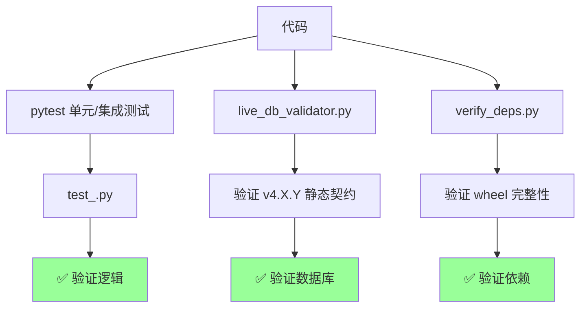
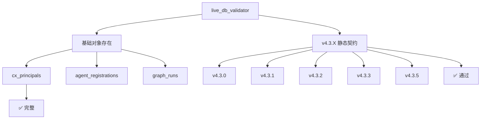

# §27 测试体系与 pytest 实践

> 🧑‍💻 开发者
>
> **一句话定位**:平台测试由三层构成 — `verify_deps.py`(依赖完整性)、`live_db_validator.py`(数据库契约)、`pytest scripts/tests/`(代码逻辑)。

---

## 1. 测试三层



---

## 2. pytest 套件

来源:[`scripts/tests/`](../../scripts/tests/)

### 2.1 运行

```bash
source scripts/python_runtime.sh
export PYTHON_BIN="$(cx_resolve_python)"
cx_prepare_python_environment "$PYTHON_BIN"

"$PYTHON_BIN" -m pytest scripts/tests/ -q --tb=no
```

### 2.2 测试类型

| 类型 | 路径 | 数量 | 覆盖 |
|---|---|---|---|
| 单元 | `scripts/tests/test_*.py` | ~50 | 各模块函数 |
| 集成 | `scripts/tests/integration/` | ~20 | 多模块 + 数据库 |
| 端到端 | `scripts/tests/e2e/` | ~10 | HTTP API |
| 跨数据库 | `scripts/tests/cross_db/` | ~10 | PG + Oracle + YashanDB |

### 2.3 跳过不可达的数据库

```bash
AIAGENT_SKIP_DB=oracle,yashandb "$PYTHON_BIN" -m pytest scripts/tests/ -q
```

### 2.4 典型测试用例

```python
# scripts/tests/test_memory_lifecycle.py
import pytest
from lib import memory_lifecycle

def test_create_family():
    family = memory_lifecycle.create_family(
        principal_id="test_principal",
        memory_type="FACT",
        scope="AGENT_MEMORY",
        content="测试"
    )
    assert family["family_id"].startswith("MEM_")
    assert family["current_version"]["lifecycle_state"] == "ACTIVE"
```

```python
# scripts/tests/test_graph_runtime.py
def test_lease_expiration():
    run = graph_runtime.create_run(graph_version_id="v_001")
    lease = graph_runtime.claim_ready_nodes(run["run_id"])
    # 模拟过期
    graph_runtime._force_expire_lease(lease["lease_token"])
    # 提交应失败
    with pytest.raises(StaleLeaseError):
        graph_runtime.complete_attempt(
            run["run_id"], lease["lease_token"], result={"ok": True}
        )
```

---

## 3. live_db_validator.py

来源:[`scripts/live_db_validator.py`](../../scripts/live_db_validator.py)

### 3.1 用途

针对已部署的数据库,验证它**符合**某个版本契约。

```bash
"$PYTHON_BIN" scripts/live_db_validator.py --version 4.3.5
```

### 3.2 检查项



### 3.3 验证类别

```python
# live_db_validator.py: 简化
def validate_v43_static_contract(conn):
    # 检查 cx_principals
    assert has_table(conn, "cx_principals")
    assert has_column(conn, "cx_principals", "principal_type")
    # 检查 cx_platform_capabilities
    assert has_table(conn, "cx_platform_capabilities")
    # 检查 PL/pgSQL 函数
    assert has_function(conn, "memory_fusion.fuse_similar")
```

### 3.4 输出

```text
[v4.3.5] Validating database contract...
  ✓ cx_principals exists
  ✓ cx_platform_capabilities exists
  ✓ All required functions present
  ✓ All required columns present
PASSED
```

---

## 4. verify_deps.py

来源:[`scripts/verify_deps.py`](../../scripts/verify_deps.py)

### 4.1 用途

验证 `requirements.txt` 与 `vendor/` wheel 文件兼容。

```bash
"$PYTHON_BIN" scripts/verify_deps.py
```

### 4.2 检查项

| 检查 | 失败行为 |
|---|---|
| `cryptography==49.0.0` wheel 存在 | exit 1 |
| glibc floor 兼容(2.28/2.34) | exit 1 |
| `Requires-Dist` 完整(递归依赖) | exit 1 |
| Python 版本兼容(3.14+) | exit 1 |

### 4.3 强制 Requires-Dist

来源:[`docs/python-runtime.md`](../python-runtime.md)

即使某个 wheel 不在 `requirements.txt` 中直接列出,但被它依赖的传递 wheel **也必须**存在。

```bash
# 示例: psycopg2-binary 需要 libpq wheel
# verify_deps.py 会检查 libpq 是否也在 vendor/
```

---

## 5. POC 验收

来源:[`scripts/poc_readiness.py`](../../scripts/poc_readiness.py)、[`scripts/poc_evidence.py`](../../scripts/poc_evidence.py)、[`scripts/support_bundle.py`](../../scripts/support_bundle.py)

### 5.1 poc_readiness.py

非破坏性的 POC 就绪检查:

```bash
"$PYTHON_BIN" scripts/poc_readiness.py
```

| 检查 | 输出 |
|---|---|
| 数据库版本 | PostgreSQL 18.3 |
| 扩展存在 | pgvector, pg_trgm, pgcrypto, pg_cron, age |
| Schema Owner 权限 | ok |
| Python 版本 | 3.14.x |
| 关键表存在 | yes |

### 5.2 poc_evidence.py

组装四周 POC 验收证据:

```bash
"$PYTHON_BIN" scripts/poc_evidence.py --output ./evidence/
```

输出结构:

```
evidence/
├── manifest.json          # 元数据
├── deployments/           # 部署报告
├── mode_matrix/           # capability 矩阵
├── governance_live/       # 治理证据
├── readiness/             # 就绪检查
└── skill.md               # Skill 信息
```

### 5.3 support_bundle.py

支持包(用于提交工单):

```bash
"$PYTHON_BIN" scripts/support_bundle.py --output ./support.zip
```

| 包含 | 脱敏 |
|---|---|
| 配置摘要 | password / api_key / token 替换 |
| 最近日志(1 MiB) | 敏感字段替换 |
| 版本信息 | 不变 |
| 健康检查输出 | 不变 |

---

## 6. package_guard.py

来源:[`scripts/package_guard.py`](../../scripts/package_guard.py)

验证打包后的目录树没有被修改:

```bash
"$PYTHON_BIN" scripts/package_guard.py --sha256file package-files.sha256 --root .
```

---

## 7. release_closure.py

来源:[`scripts/release_closure.py`](../../scripts/release_closure.py)

集成 v4.3.0 发布门禁:

```python
DEPENDENCY_ORDER = [
    "contracts", "dependencies", "compiler", "executor",
    "runtime_state_events", "compatibility", "governance_evidence",
    "database_migrations", "browser", "failure_recovery",
    "capacity", "packages_docs"
]
```

---

## 8. 测试覆盖率

```bash
"$PYTHON_BIN" -m pytest scripts/tests/ \
  --cov=scripts/lib \
  --cov-report=html \
  --cov-report=term-missing
```

| 模块 | 覆盖率目标 |
|---|---|
| `identity_api.py` | > 80% |
| `memory_lifecycle.py` | > 75% |
| `graph_runtime.py` | > 70% |
| `compliance_api.py` (⚠️企业版) | > 80% |
| `platform_capabilities.py` | > 90% |

---

## 9. CI/CD 集成

```yaml
# .github/workflows/test.yml (示例)
name: tests
on: [push, pull_request]
jobs:
  test:
    runs-on: ubuntu-latest
    steps:
      - uses: actions/checkout@v4
      - uses: actions/setup-python@v5
        with:
          python-version: "3.14"
      - run: pip install -r requirements.txt
      - run: python -m pytest scripts/tests/ -q --tb=short
      - run: python scripts/verify_deps.py
```

---

## 10. 故障排查(测试视角)

| 症状 | 排查 |
|---|---|
| 测试失败:连接拒绝 | 数据库未启动,或端口不对 |
| 测试失败:权限不足 | Schema Owner 缺权限 |
| 测试失败:GLIBC 不匹配 | 重新构建 cryptography wheel |
| 测试失败:cx_principals 不存在 | 漏应用 16_v4_3_0_identity_channels.sql |
| 测试失败:cx_platform_capabilities 不存在 | 漏应用 31_v4_3_5_platform_capabilities.sql |

---

## 11. 交叉引用

- 部署:[§20 本地开发环境搭建](20-本地开发环境搭建.md)
- 离线依赖:[§28 离线部署与 wheel 验证](28-离线部署与wheel验证.md)
- POC 流程:[§46 POC 验收与支持包](46-POC验收与支持包.md)
- 现有文档:[`docs/poc-readiness.md`](../poc-readiness.md)、[`docs/python-runtime.md`](../python-runtime.md)

> 📌 **下一章**:[§28 离线部署与 wheel 验证](28-离线部署与wheel验证.md) — `vendor/` wheel 机制与 `verify_deps.py` 强制校验。