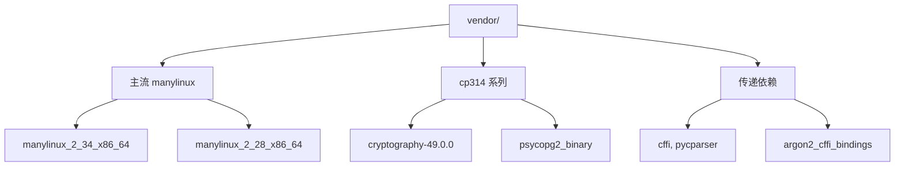
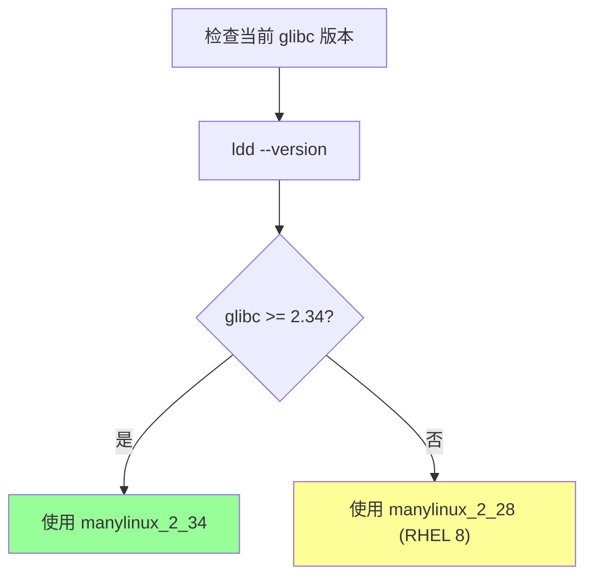
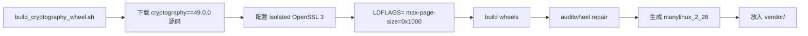
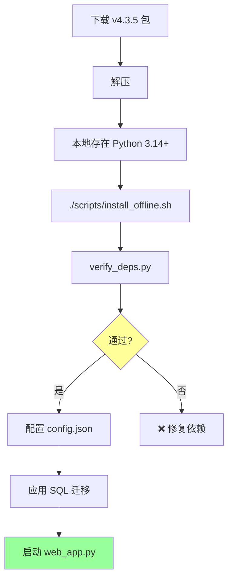

# §28 离线部署与 wheel 验证

> 🧑‍💻 开发者
>
> **一句话定位**:平台完全支持**离线部署**,所有依赖在 `vendor/` 内;`verify_deps.py` 强制校验 wheel 与 glibc 的兼容性。

---

## 1. 离线部署的必要性

来源:[`docs/deployment.md`](../deployment.md)、[`docs/python-runtime.md`](../python-runtime.md)

| 场景 | 为什么需要离线 |
|---|---|
| 金融/政府内网 | 不允许访问 PyPI |
| 工业控制网 | 网络隔离 |
| 跨国部署 | 国际带宽差 |
| 严格审计 | 必须知道**每一个**依赖 |
| 离线 POC | 客户现场没有外网 |

> 💡 平台设计原则:**部署不依赖任何外网资源**,且**所有依赖可验证**。

---

## 2. vendor/ 目录结构



| 关键 wheel | 说明 |
|---|---|
| `cryptography-49.0.0-cp314-cp314-manylinux_2_28_x86_64.whl` | RHEL 8 / glibc 2.28 |
| `cryptography-49.0.0-cp314-cp314-manylinux_2_34_x86_64.whl` | 新版 Linux |
| `psycopg2_binary-*.whl` | PostgreSQL 驱动 |
| `argon2_cffi-25.1.0-*.whl` | 密码哈希 |

---

## 3. install_offline.sh

来源:[`scripts/install_offline.sh`](../../scripts/install_offline.sh)

### 3.1 流程


### 3.2 使用

```bash
./scripts/install_offline.sh
```

内部流程:

```bash
# install_offline.sh (简化)
source scripts/python_runtime.sh
PYTHON_BIN=$(cx_resolve_python)
"$PYTHON_BIN" -m venv .venv
source .venv/bin/activate

# 安装所有 vendor/ 下的 wheel
pip install --no-index --no-deps ./vendor/*.whl

# 安装 vendor/ 下的传递依赖
pip install --no-index --find-links ./vendor/ ./vendor/*.whl

# 验证
"$PYTHON_BIN" scripts/verify_deps.py
```

---

## 4. verify_deps.py 详解

来源:[`scripts/verify_deps.py`](../../scripts/verify_deps.py)

### 4.1 glibc floor 选择



| Host glibc | 选用的 wheel |
|---|---|
| >= 2.34 | `manylinux_2_34_x86_64` |
| 2.28 - 2.33 | `manylinux_2_28_x86_64` |
| < 2.28 | ❌ 不支持(需升级 OS) |

> 📌 当前 v4.3.5 包内置 `manylinux_2_28` 兼容 wheel,**离线完整**,无需重建。

### 4.2 强制 Requires-Dist

来源:[`docs/python-runtime.md`](../python-runtime.md)

```python
# verify_deps.py: 简化
def verify_requires_dist(wheel_path):
    metadata = read_wheel_metadata(wheel_path)
    for req in metadata.requires_dist:
        # 递归解析,即使不在 requirements.txt 中也必须存在
        sub_wheel = find_wheel(req.name, vendor_dir)
        assert sub_wheel is not None, f"Missing transitive dep: {req.name}"
        verify_requires_dist(sub_wheel)  # 递归
```

| 例子 | 必须存在的传递依赖 |
|---|---|
| `psycopg2-binary` | `libpq`(已静态链接) |
| `argon2-cffi` | `argon2-cffi-bindings`, `cffi`, `pycparser` |
| `cryptography` | `cffi`, `pycparser` |

> ⚠️ 即使 `requirements.txt` 没列 `cffi`,但因为 `argon2-cffi` 需要,verify_deps 也会要求 `cffi` 存在。

---

## 5. cryptography wheel 构建

来源:[`docs/cryptography-build.md`](../cryptography-build.md)、[`scripts/tools/build_cryptography_wheel.sh`](../../scripts/tools/build_cryptography_wheel.sh)

### 5.1 为什么需要自己构建

| 问题 | 解决方案 |
|---|---|
| 官方 wheel 是 `manylinux_2_34` | 自构建 `manylinux_2_28` 兼容 |
| 4 KiB 页面对齐 | 自定义 LDFLAGS |
| 隔离 OpenSSL 3 | 避免污染系统库 |

### 5.2 构建流程



```bash
# scripts/tools/build_cryptography_wheel.sh
docker run --rm -v $(pwd)/vendor:/out \
  quay.io/pypa/manylinux_2_28_x86_64 \
  /bin/bash -c "
    cd /io
    curl -L https://github.com/pyca/cryptography/archive/refs/tags/49.0.0.tar.gz | tar xz
    cd cryptography-49.0.0
    pip wheel . --no-deps -w /out -C=--build-option=--plat-name=manylinux_2_28_x86_64
    auditwheel repair /out/cryptography-*.whl --plat manylinux_2_28_x86_64 -w /out
  "
```

### 5.3 何时需要重建

| 情况 | 操作 |
|---|---|
| 客户在 RHEL 8(glibc 2.28) | ✅ 使用内置,无需重建 |
| 客户在 Ubuntu 22.04(glibc 2.35) | ✅ 使用内置 |
| 客户在 CentOS 7(glibc 2.17) | ❌ 不支持,需升级 |
| 客户在 Alpine(musl) | ❌ 不支持,需切换到 glibc |

> 💡 大多数企业部署都在 glibc 2.28+,内置 wheel 直接可用。

---

## 6. 离线部署流程



---

## 7. 验证清单

离线部署成功后,验证:

```bash
# 1. 依赖
"$PYTHON_BIN" scripts/verify_deps.py
# 期望:exit 0,无报错

# 2. 数据库契约
"$PYTHON_BIN" scripts/live_db_validator.py --version 4.3.5
# 期望:PASSED

# 3. 健康检查
curl http://localhost:18080/api/health
# 期望:{"status": "ok", "version": "4.3.5"}

# 4. 加载页面
curl http://localhost:18080/app/monitor
# 期望:HTML
```

---

## 8. 故障排查

| 症状 | 原因 | 修复 |
|---|---|---|
| `cryptography` wheel 安装失败 | glibc 不匹配 | 用 `manylinux_2_28` 替代 |
| `verify_deps.py` 报告缺失 | vendor 不完整 | 检查 vendor/ 目录 |
| `psycopg2` import 失败 | 缺 libpq 系统库 | 用 `psycopg2-binary` |
| `argon2_cffi_bindings` 找不到 | 传递依赖未安装 | 检查 vendor 子目录 |

---

## 9. 升级时的依赖处理


---

## 10. 交叉引用

- 环境搭建:[§20 本地开发环境搭建](20-本地开发环境搭建.md)
- 构建 cryptography:[`docs/cryptography-build.md`](../cryptography-build.md)
- Python 运行时:[`docs/python-runtime.md`](../python-runtime.md)

> 📌 **下一章**:[§29 扩展开发指南](29-扩展开发指南.md) — 如何为平台添加新功能,从 DDL 到 UI 的完整流程。