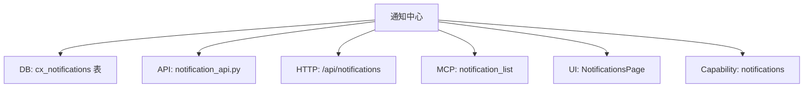
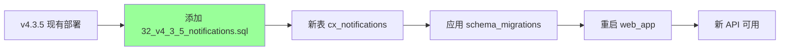

# §29 扩展开发指南

> 🧑‍💻 开发者
>
> **一句话定位**:为平台添加一个新功能的标准流程 — 从 SQL 迁移、Python 模块、API 路由、UI 页面到测试,完整闭环。

---

## 1. 扩展的类型

| 类型 | 示例 | 影响范围 |
|---|---|---|
| **新表 + 新 API + 新 UI** | 添加"通知中心" | 全栈 |
| **新 PL/pgSQL 函数** | 添加一个统计函数 | 数据库层 |
| **新 Python 模块** | 添加业务 facade | 后端 |
| **新 REST 路由** | 添加 HTTP 端点 | FastAPI |
| **新 MCP 工具** | 暴露给外部 Agent | MCP |
| **新 Dashboard 页面** | 添加 nav 项 | React |
| **新 Capability** | 添加可启用功能 | 全栈 |
| **新 Compliance Profile** ⚠️企业版 | 添加 Profile | Enterprise |

---

## 2. 全栈扩展示例

假设我们要添加一个"**通知中心**"功能。

### 2.1 设计



### 2.2 第一步:SQL 迁移

创建 `scripts/deploy/32_v4_3_5_notifications.sql`:

```sql
-- scripts/deploy/32_v4_3_5_notifications.sql
CREATE TABLE IF NOT EXISTS cx_notifications (
    notification_id VARCHAR(64) PRIMARY KEY,
    recipient_principal_id VARCHAR(64) NOT NULL,
    sender_principal_id VARCHAR(64),
    notification_type VARCHAR(50) NOT NULL,
    title VARCHAR(200) NOT NULL,
    body TEXT,
    severity VARCHAR(20) DEFAULT 'INFO',
    status VARCHAR(20) DEFAULT 'UNREAD',
    related_entity_type VARCHAR(50),
    related_entity_id VARCHAR(64),
    metadata JSONB,
    created_at TIMESTAMP DEFAULT CURRENT_TIMESTAMP,
    read_at TIMESTAMP
);

CREATE INDEX idx_notifications_recipient ON cx_notifications(recipient_principal_id, status);
CREATE INDEX idx_notifications_created ON cx_notifications(created_at DESC);

ALTER TABLE cx_notifications ENABLE ROW LEVEL SECURITY;
CREATE POLICY notifications_recipient_access ON cx_notifications
    FOR ALL TO PUBLIC
    USING (recipient_principal_id = current_setting('app.current_principal_id', true));
```

### 2.3 第二步:Python 模块

创建 `scripts/lib/notification_api.py`:

```python
# scripts/lib/notification_api.py
from lib import connection
from datetime import datetime
import secrets

def create_notification(
    recipient_principal_id: str,
    notification_type: str,
    title: str,
    body: str = None,
    related_entity_type: str = None,
    related_entity_id: str = None,
    sender_principal_id: str = None,
    metadata: dict = None
) -> dict:
    notification_id = "NOTIF_" + secrets.token_hex(8)
    with connection.get_connection() as conn:
        with conn.cursor() as cur:
            cur.execute("""
                INSERT INTO cx_notifications
                (notification_id, recipient_principal_id, sender_principal_id,
                 notification_type, title, body, related_entity_type,
                 related_entity_id, metadata)
                VALUES (%s, %s, %s, %s, %s, %s, %s, %s, %s::jsonb)
                RETURNING notification_id, created_at
            """, (
                notification_id, recipient_principal_id, sender_principal_id,
                notification_type, title, body, related_entity_type,
                related_entity_id, json.dumps(metadata or {})
            ))
            row = cur.fetchone()
            conn.commit()
            return {
                "notification_id": notification_id,
                "created_at": row[1].isoformat()
            }

def list_unread(principal_id: str, limit: int = 50) -> list:
    with connection.get_connection() as conn:
        with conn.cursor() as cur:
            cur.execute("""
                SELECT notification_id, title, body, severity, created_at
                FROM cx_notifications
                WHERE recipient_principal_id = %s AND status = 'UNREAD'
                ORDER BY created_at DESC
                LIMIT %s
            """, (principal_id, limit))
            return [_to_dict(row) for row in cur.fetchall()]

def mark_read(notification_id: str, principal_id: str) -> bool:
    with connection.get_connection() as conn:
        with conn.cursor() as cur:
            cur.execute("""
                UPDATE cx_notifications
                SET status = 'READ', read_at = CURRENT_TIMESTAMP
                WHERE notification_id = %s AND recipient_principal_id = %s
            """, (notification_id, principal_id))
            conn.commit()
            return cur.rowcount > 0
```

### 2.4 第三步:Capability 注册

修改 `scripts/deploy/31_v4_3_5_platform_capabilities.sql` 或新增 seed:

```sql
INSERT INTO cx_platform_capabilities
    (capability_key, enabled, mandatory, edition_available, expected_version, description, updated_by)
VALUES
    ('notifications', 'Y', 'N', 'community', 1, '通知中心', 'system');
```

修改 `web_app.py:_path_capability`:

```python
if path.startswith("/api/notifications"):
    return "notifications"
```

### 2.5 第四步:FastAPI 路由

修改 `scripts/web_app.py`:

```python
from lib import notification_api

@app.get("/api/notifications")
async def list_notifications(request: Request):
    principal = request.state.principal
    notifications = notification_api.list_unread(principal.principal_id)
    return {"notifications": notifications}

@app.post("/api/notifications/{notification_id}/read")
async def mark_notification_read(notification_id: str, request: Request):
    principal = request.state.principal
    success = notification_api.mark_read(notification_id, principal.principal_id)
    return {"success": success}
```

### 2.6 第五步:MCP 工具

修改 `scripts/lib/mcp_server.py`:

```python
@register_tool(
    name="notification_list",
    description="列出当前 Principal 的未读通知",
    input_schema={
        "type": "object",
        "properties": {"limit": {"type": "integer", "default": 50}},
        "required": []
    }
)
def notification_list(limit: int = 50, principal_id: str = None) -> dict:
    items = notification_api.list_unread(principal_id, limit=limit)
    return {"content": [{"type": "text", "text": json.dumps(items)}]}
```

### 2.7 第六步:UI 页面

修改 `web/src/App.tsx`:

```javascript
// 1. 在 nav 数组加入
["notifications", "通知", "Notifications", Bell]

// 2. 在 PageView 加 case
case "notifications": return <NotificationsPage />;

// 3. 实现 NotificationsPage
function NotificationsPage() {
    const [notifications, setNotifications] = useState([]);
    useEffect(() => {
        api("/api/notifications").then(r => r.json()).then(data => {
            setNotifications(data.notifications);
        });
    }, []);
    return (
        <DataPage>
            <SectionHeading title={t("通知中心", "Notifications")} />
            <DataTable rows={notifications} columns={[
                {key: "title", label: t("标题", "Title")},
                {key: "severity", label: t("严重性", "Severity")},
                {key: "created_at", label: t("时间", "Time")}
            ]} />
        </DataPage>
    );
}
```

### 2.8 第七步:测试

创建 `scripts/tests/test_notification_api.py`:

```python
import pytest
from lib import notification_api

def test_create_and_list_notification():
    notif = notification_api.create_notification(
        recipient_principal_id="test_p",
        notification_type="TEST",
        title="Test Notification",
        body="Hello"
    )
    assert notif["notification_id"].startswith("NOTIF_")

    unread = notification_api.list_unread("test_p")
    assert any(n["title"] == "Test Notification" for n in unread)

def test_mark_read():
    notif = notification_api.create_notification(
        recipient_principal_id="test_p",
        notification_type="TEST",
        title="Test"
    )
    success = notification_api.mark_read(notif["notification_id"], "test_p")
    assert success

    unread = notification_api.list_unread("test_p")
    assert all(n["notification_id"] != notif["notification_id"] for n in unread)
```

---

## 3. 命名约定

### 3.1 SQL ID 前缀

| 类型 | 前缀 | 例 |
|---|---|---|
| 实体 | `E_` | `E_8a3f...` |
| Memory Family | `MEM_` | `MEM_a1b2...` |
| Workspace | `WS_` | `WS_xxxx` |
| Context | `CTX_` | `CTX_xxxx` |
| Notification | `NOTIF_` | `NOTIF_xxxx` |
| v4.3.0+ 治理表 | `cx_` | `cx_principals` |

### 3.2 Python 模块命名

| 类型 | 命名 | 例 |
|---|---|---|
| 业务 API | `<domain>_api.py` | `notification_api.py` |
| 生命周期 | `<domain>_lifecycle.py` | `memory_lifecycle.py` |
| 运行时 | `<domain>_runtime.py` | `graph_runtime.py` |
| 契约 | `<domain>_contracts.py` | `graph_contracts.py` |

### 3.3 SQL 文件命名

```
<num>_<version>_<topic>.sql
```

例:`32_v4_3_5_notifications.sql`

数字编号按顺序,允许后续插入(必须保持数字严格递增或预留空间)。

---

## 4. 命名约束清单

| 约束 | 实现 |
|---|---|
| **不修改已有表** | 加性:新增列时用 `ADD COLUMN IF NOT EXISTS` |
| **不删除列** | 即使不再使用 |
| **不破坏 RLS** | 新表必须 `ENABLE ROW LEVEL SECURITY` |
| **新表必须含 `row_version`** | 用于乐观锁 |
| **新表必须含 `created_at`** | 默认 `CURRENT_TIMESTAMP` |
| **新表必须含 `created_by`** | Principal ID |
| **新表前缀 `cx_`** | v4.3.0+ 治理表 |

---

## 5. 测试要求

每个新功能必须:

| 测试类型 | 要求 |
|---|---|
| 单元测试 | 至少 3 个用例(正常/边界/异常) |
| 集成测试 | 至少 1 个跨模块 |
| RLS 测试 | 验证隔离(其他 Principal 看不到) |
| Capability 测试 | 禁用时 API 返回 409 |
| 审计测试 | 写入 `entity_access_log` |

---

## 6. 提交前清单

```markdown
- [ ] SQL 迁移幂等(IF NOT EXISTS)
- [ ] RLS 策略完整
- [ ] Python 模块有 docstring
- [ ] 路由注册到 _path_capability
- [ ] Capability 在 31_v4_3_5 中 seed
- [ ] MCP 工具已注册(若需要)
- [ ] UI 页面加入 nav
- [ ] pytest 通过
- [ ] live_db_validator 通过
- [ ] 文档章节更新(handbook §53 REST API 索引)
```

---

## 7. 常见错误

| 错误 | 修复 |
|---|---|
| 直接修改已有表 | 用 `ALTER TABLE ADD COLUMN IF NOT EXISTS` |
| 接受 body 中的 principal_id | 用 `request.state.principal` |
| 漏 RLS | 新表必须 `ENABLE ROW LEVEL SECURITY` |
| Capability 未注册 | API 路由无法访问 |
| 漏写测试 | 覆盖率不达标 |
| 漏更新文档 | handbook §53 不更新 |

---

## 8. 升级时的兼容性



> 📌 加性迁移 = **不需要**停机(只新增对象,无破坏)。

---

## 9. 完整扩展示例代码

完整代码模板见仓库内的 `templates/`(如果存在)或参考 `scripts/lib/` 中类似大小的模块。

---

## 10. 交叉引用

- 项目结构:[§21 项目目录与代码结构](21-项目目录与代码结构.md)
- SQL 迁移:[§22 SQL 迁移脚本导览](22-SQL迁移脚本导览.md)
- Python 模块:[§23 Python 业务模块导览](23-Python业务模块导览.md)
- FastAPI:[§24 FastAPI Web 服务剖析](24-FastAPI-Web服务剖析.md)
- MCP:[§25 MCP Server 与 SKILL 契约](25-MCP-Server与SKILL契约.md)
- 前端:[§26 Web 前端架构](26-Web前端架构.md)

> 📌 **Part III 完**。下一章开始 [Part IV 用户视角 §30 首次部署与初始化](30-首次部署与初始化.md)。