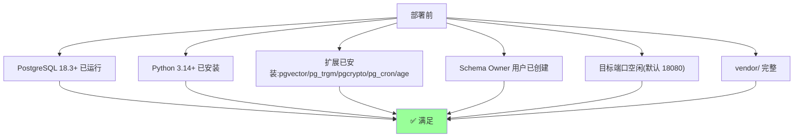
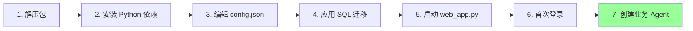
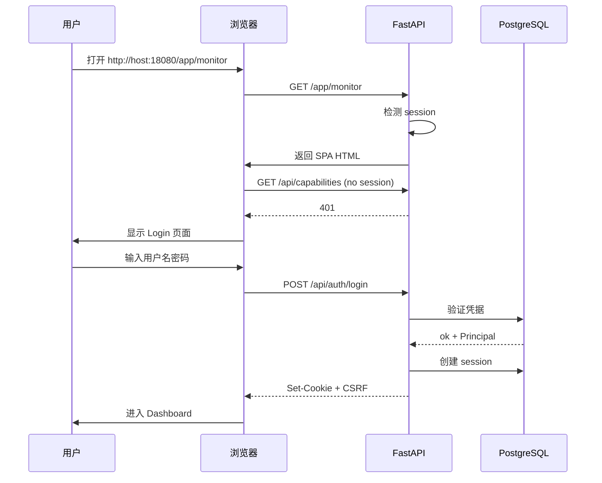

# §30 首次部署与初始化

> 👤 用户/运维
>
> **一句话定位**:从零开始,把 v4.3.5 PostgreSQL Community Edition 部署到生产环境并完成首次管理员登录。

---

## 1. 部署前检查清单



| 项 | 验证命令 |
|---|---|
| PostgreSQL 版本 | `psql -c "SELECT version();"` |
| Python 版本 | `python --version` |
| 扩展 | `psql -c "SELECT * FROM pg_available_extensions WHERE name IN ('vector', 'pg_trgm', 'pgcrypto', 'pg_cron', 'age');"` |
| Schema Owner | `psql -c "\du ai_agent_runtime"` |
| 端口 | `lsof -i :18080`(应无输出) |
| vendor | `ls vendor/*.whl | wc -l`(应有 30+) |

---

## 2. 部署流程



### 2.1 安装 Python 依赖

```bash
source scripts/python_runtime.sh
export PYTHON_BIN="$(cx_resolve_python)"
cx_prepare_python_environment "$PYTHON_BIN"

# 离线安装
./scripts/install_offline.sh

# 验证
"$PYTHON_BIN" scripts/verify_deps.py
```

### 2.2 编辑 config.json

```bash
cp config.example.json config.json
vim config.json
```

替换以下字段:

| 字段 | 值 |
|---|---|
| `database.user` | `ai_agent_runtime` |
| `database.password` | 您的密码 |
| `database.host` | `localhost`(或远程) |
| `database.port` | `5432` |
| `database.dbname` | `chuanxu` |
| `llm.api_url` | LLM 端点 |
| `llm.model` | 模型名(如 `bge-m3`) |
| `llm.api_key` | API Key |
| `embedding.api_url` | Embedding 端点 |
| `embedding.model` | Embedding 模型 |
| `embedding.dimension` | 向量维度(如 1024) |

### 2.3 应用 SQL 迁移

```bash
# 一键(migration_runner 会自动顺序应用)
"$PYTHON_BIN" scripts/migration_runner.py --version 4.3.5
```

或者手动:

```bash
for f in scripts/deploy/*.sql; do
  echo "应用 $f..."
  psql -U ai_agent_runtime -d chuanxu -f "$f" || exit 1
done
```

### 2.4 启动服务

```bash
./start_web_server.sh start
# 或
PYTHONPATH=scripts "$PYTHON_BIN" -m uvicorn web_app:app --host 0.0.0.0 --port 18080
```

### 2.5 健康检查

```bash
curl http://localhost:18080/api/health
# {"status": "ok", "version": "4.3.5", ...}
```

### 2.6 首次登录

来源:[`SKILL.md` §7](../SKILL.md)

> 没有默认密码。第一次启动时,系统会引导您创建**第一个管理员**(bootstrap 流程)。

```bash
# 通过 bootstrap API 创建第一个 admin
curl -X POST http://localhost:18080/api/auth/bootstrap \
  -H "Content-Type: application/json" \
  -H "X-CSRF-Token: bootstrap" \
  -d '{
    "username": "admin",
    "password": "YourStrongPassword!",
    "display_name": "First Admin"
  }'
```

> 🔐 bootstrap 端点**仅在数据库无任何 Principal 时可用**,创建完成后自动失效。

### 2.7 创建业务 Agent

来源:[`scripts/agent_bootstrap.py`](../../scripts/agent_bootstrap.py)

```bash
"$PYTHON_BIN" scripts/agent_bootstrap.py register \
  --agent-id my_business_agent \
  --admin-token AT_xxxxx \
  --name "My Business Agent" \
  --runtime platform
```

---

## 3. 首次登录 Dashboard



---

## 4. 最小可用配置(MVP)

| 步骤 | 操作 |
|---|---|
| 1 | 完成 2.1-2.4(安装 + 启动) |
| 2 | 2.6 创建第一个 Admin |
| 3 | 2.7 注册至少一个 Business Agent |
| 4 | 进入 Dashboard → Monitor 看到 "1 active session" |
| 5 | 进入 Agents 页,看到注册的 Agent |
| 6 | 启用 Memory 能力 → Platform → Memory 启用 |
| 7 | 创建第一条 Memory,验证端到端流程 |

---

## 5. 常见首次部署问题

| 问题 | 排查 |
|---|---|
| 启动失败:连接 PostgreSQL 失败 | 检查 config.json 的 database 节,确认密码正确 |
| 启动失败:扩展未找到 | `CREATE EXTENSION IF NOT EXISTS vector;` 等 |
| 启动失败:Schema Owner 权限不足 | 检查 `ai_agent_runtime` 是否在 CREATEROLE |
| 首次登录失败 | 检查 bootstrap 是否已完成,或 admin 是否已存在 |
| Dashboard 显示空白 | 检查 `/static/chuanxu.js` 是否可访问 |
| API 返回 409 CAPABILITY_DISABLED | Admin → Platform → 启用对应能力 |

---

## 6. 安全建议(生产部署)

| 项 | 建议 |
|---|---|
| **HTTPS** | 必须,反向代理(Nginx/Caddy) |
| **防火墙** | 仅允许信任 IP 访问 18080 |
| **数据库连接** | SSL required,`sslmode=verify-full` |
| **首次 Admin 密码** | 至少 16 字符,启用 MFA |
| **config.json 权限** | 自动设为 0600(平台已自动) |
| **定期备份** | `pg_dump` + PITR |
| **审计日志** | 启用 `entity_access_log` 监控 |
| **Session 超时** | 默认 300 秒,根据需要调整 |

---

## 7. 升级到 v4.3.5(从 v4.0.x 升级)

```bash
# 1. 备份
pg_dump chuanxu > backup_$(date +%Y%m%d).sql

# 2. 拉取新代码
# (解压新版本覆盖,保留 config.json)

# 3. 应用新迁移(自动顺序)
"$PYTHON_BIN" scripts/migration_runner.py --version 4.3.5

# 4. 验证
"$PYTHON_BIN" scripts/live_db_validator.py --version 4.3.5

# 5. 重启
./start_web_server.sh restart
```

> 📌 详细步骤见 [§47 数据库迁移运维](47-数据库迁移运维.md)。

---

## 8. 自动化部署(Ansible 示例)

```yaml
# playbook.yml
- hosts: chuanxu_servers
  tasks:
    - name: 安装 PostgreSQL 18
      apt:
        name: postgresql-18
        state: present

    - name: 创建数据库
      postgresql_db:
        name: chuanxu
        owner: ai_agent_runtime

    - name: 安装扩展
      postgresql_ext:
        name: "{{ item }}"
        db: chuanxu
      loop:
        - vector
        - pg_trgm
        - pgcrypto
        - pg_cron
        - age

    - name: 部署 v4.3.5
      unarchive:
        src: chuanxu-v4.3.5-pg-community.tar.gz
        dest: /opt/chuanxu

    - name: 应用 SQL 迁移
      command: >
        psql -U ai_agent_runtime -d chuanxu
        -f /opt/chuanxu/scripts/deploy/{{ item }}
      loop:
        - 1_schema.sql
        - 2_api.sql
        # ... 全部 28+ 文件

    - name: 启动服务
      systemd:
        name: chuanxu
        state: started
        enabled: yes
```

---

## 9. 交叉引用

- 开发者环境:[§20 本地开发环境搭建](20-本地开发环境搭建.md)
- 配置加密:[§43 加密机制与密钥管理](43-加密机制与密钥管理.md)
- 监控:[§31 监控仪表板 Monitor](31-监控仪表板Monitor.md)
- 升级:[§47 数据库迁移运维](47-数据库迁移运维.md)
- 现有文档:[`SKILL.md`](../SKILL.md)、[`docs/deployment.md`](../deployment.md)

> 📌 **下一章**:[§31 监控仪表板 Monitor](31-监控仪表板Monitor.md) — 第一次进入 Dashboard 后,看哪些指标。