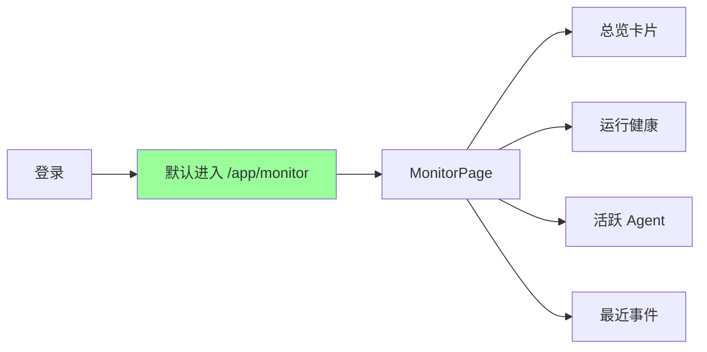
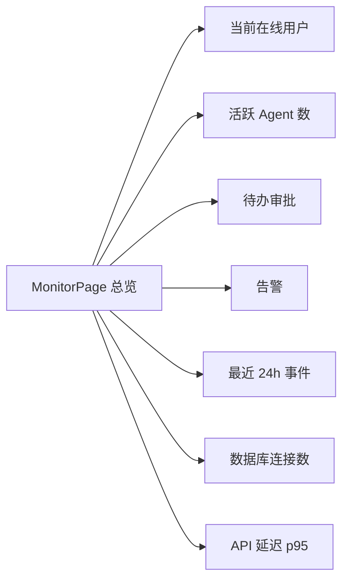
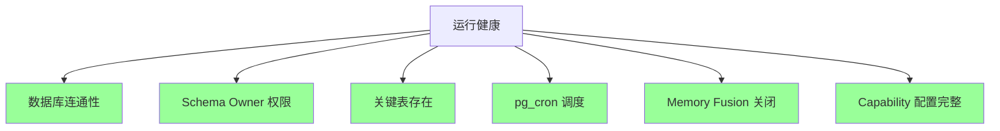
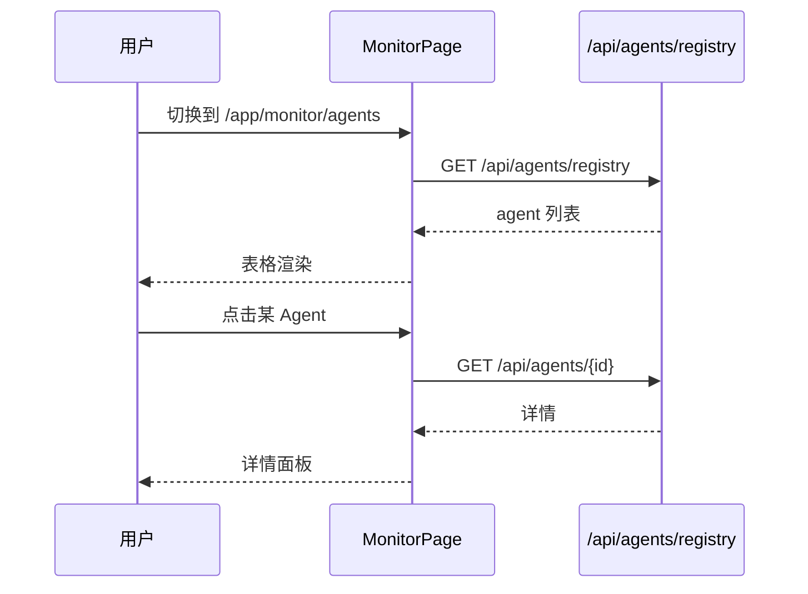
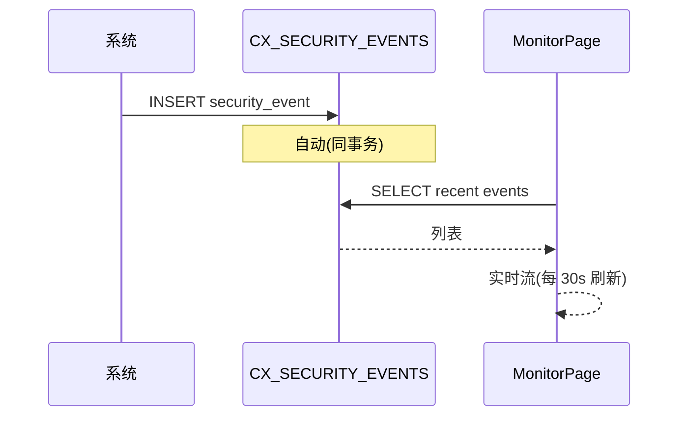
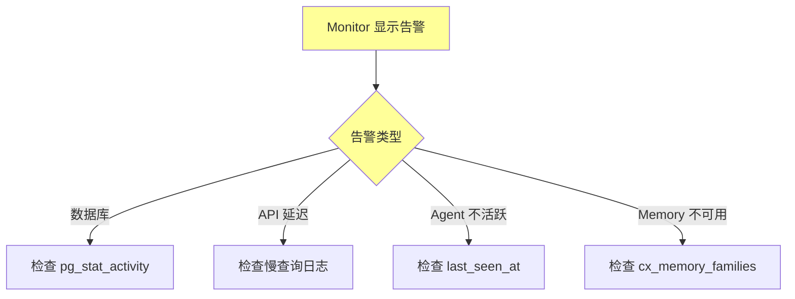

# §31 监控仪表板 Monitor

> 👤 用户/运维
>
> **一句话定位**:Monitor 页是 Dashboard 的入口,提供"系统健康 + 运行态 + 异常"三视图,帮你在第一眼发现事故。

---

## 1. 进入 Monitor 页



| URL | 视图 |
|---|---|
| `/app/monitor` | 总览 |
| `/app/monitor/agents` | Agent 详情 |
| `/app/monitor/graphs` | Graph Runtime |
| `/app/monitor/jobs` | 任务/作业 |

---

## 2. 总览卡片



| 指标 | 来源 | 含义 |
|---|---|---|
| 当前在线用户 | `cx_web_sessions WHERE expires_at > now()` | 活跃会话数 |
| 活跃 Agent 数 | `agent_registrations WHERE status='ACTIVE'` | 在线 Agent |
| 待办审批 | `cx_governance_approvals WHERE status='OPEN'` | ⚠️企业版 |
| 告警 | `monitor_api.get_active_alerts()` | 自定义规则 |
| 最近 24h 事件 | `CX_SECURITY_EVENTS` | 关键事件 |
| 数据库连接数 | `pg_stat_activity` | 并发连接 |
| API 延迟 p95 | 应用内统计 | 性能 |

---

## 3. 运行健康(Health)



来源:[`scripts/monitor_api.py`](../../scripts/monitor_api.py)

| 检查 | 命令 | 失败影响 |
|---|---|---|
| 数据库连通 | `SELECT 1` | 整个平台不可用 |
| Schema Owner 权限 | 检查 `ai_schema_migrations` 可写 | 无法升级 |
| 关键表 | `cx_principals`, `agent_registrations` | 主要功能不可用 |
| pg_cron | `cron.job` 表可读 | 调度失效 |
| Memory Fusion | `cron.job` 中无 `memory_fusion_job` | 关闭 v4.3.2 兼容 |
| Capability | `cx_platform_capabilities` 可读 | v4.3.5 失效 |

---

## 4. 活跃 Agent 详情

| 列 | 来源 |
|---|---|
| Agent ID | `agent_registrations.agent_id` |
| Runtime | `runtime` 列 |
| Environment | `environment` 列 |
| Status | `status` 列 |
| Last Seen | `last_seen_at` |
| Credential Version | `credential_version` |
| Node ID | `node_id` |



---

## 5. 最近事件流

来源:[`CX_SECURITY_EVENTS` 表](../../scripts/deploy/16_v4_3_0_identity_channels.sql)

| 事件类型 | 触发 |
|---|---|
| `LOGIN_SUCCESS` | 用户登录成功 |
| `LOGIN_FAILED` | 登录失败 |
| `CAPABILITY_TOGGLED` | Capability 启用/禁用 |
| `EMERGENCY_TRIGGERED` | 紧急停用启动 |
| `MEMORY_QUARANTINED` | Memory 隔离 |
| `APPROVAL_DECIDED` | 审批决策 ⚠️企业版 |



---

## 6. 告警规则

来源:[`scripts/lib/monitor_api.py:create_alert_rule`](../../scripts/lib/monitor_api.py)

```python
monitor_api.create_alert_rule(
    name="数据库连接数过高",
    metric="db_connection_count",
    threshold=80,  # 80% of max
    severity="WARNING",
    channels=["email", "webhook"],
    cooldown_seconds=300
)
```

| 告警级别 | 含义 |
|---|---|
| `INFO` | 信息性 |
| `WARNING` | 需要关注 |
| `CRITICAL` | 立即处理 |
| `EMERGENCY` | 触发应急流程 |

---

## 7. 关键监控指标

| 指标 | 公式 | 告警阈值 |
|---|---|---|
| **API p95 延迟** | 95% 请求延迟 | > 500ms WARNING |
| **数据库连接数** | `pg_stat_activity` 行数 | > 80% of `max_connections` CRITICAL |
| **未读 Memory** | `cx_memory_* WHERE status='ACTIVE'` | 单 Agent > 10k WARNING |
| **Graph Stale Lease** | `graph_attempts WHERE lease_expires_at < now() - 1h` | > 0 EMERGENCY |
| **Compliance Finding** ⚠️企业版 | `cx_compliance_findings WHERE severity=HIGH` | > 0 CRITICAL |
| **CPU/Memory** | 系统级 | > 85% WARNING |

---

## 8. 与现有 docs 的对应

- 监控 API:`docs/monitor_api.py` 模块
- 视图:`web/src/App.tsx` 的 MonitorPage
- 审计:[§42 审计与证据导出](42-审计与证据导出.md)

---

## 9. 故障排查流程



---

## 10. 交叉引用

- 应急控制:[§44 应急控制与紧急停用](44-应急控制与紧急停用.md)
- 审计:[§42 审计与证据导出](42-审计与证据导出.md)
- 故障排查:[§49 常见故障排查](49-常见故障排查.md)

> 📌 **下一章**:[§32 Agent 注册与管理](32-Agent注册与管理.md) — 如何在 Dashboard 注册、查看、处置 Agent。