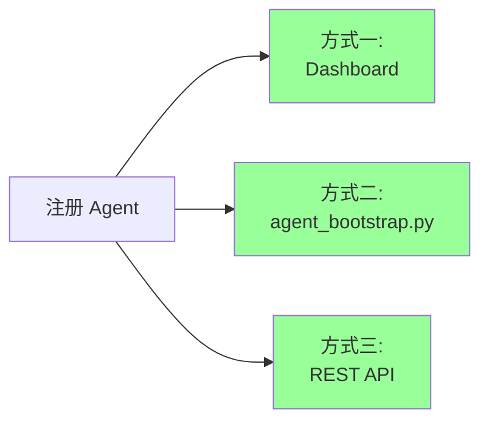
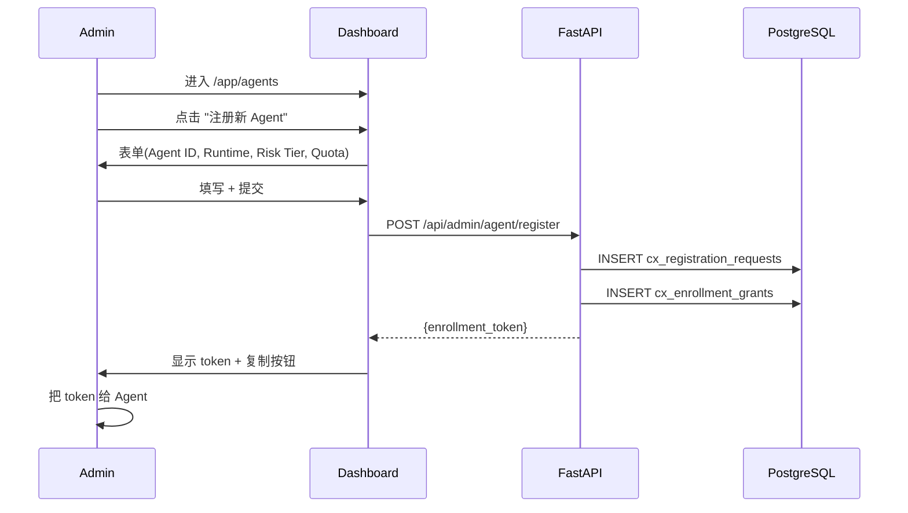
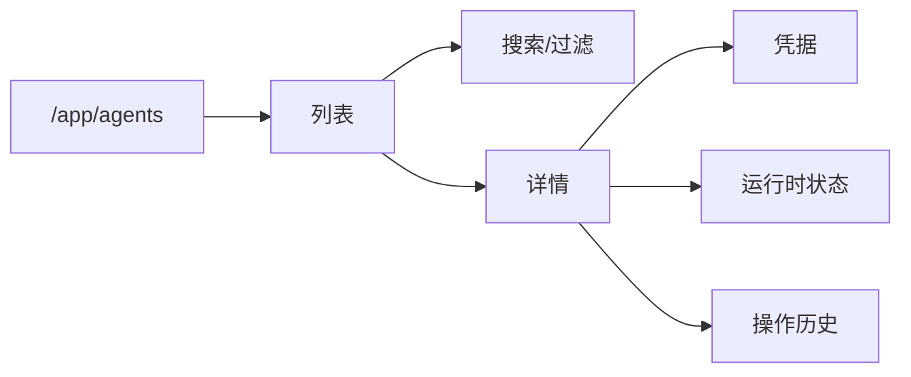
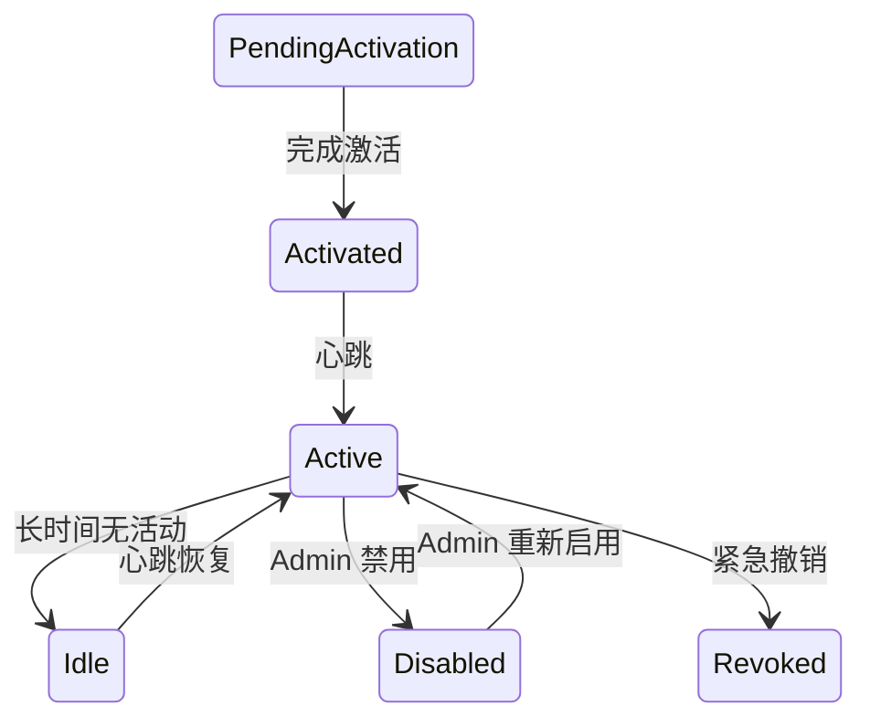

# §32 Agent 注册与管理

> 👤 用户/运维 · 🧑‍💻 开发者
>
> **一句话定位**:讲解注册 Business Agent 的完整流程,包括通过 Dashboard、CLI 和 API 三种方式。

---

## 1. 注册方式



---

## 2. 方式一:Dashboard



### 2.1 表单字段

| 字段 | 必填 | 说明 |
|---|---|---|
| `agent_id` | ✅ | 唯一,小写字母数字 |
| `display_name` | ✅ | 人类可读 |
| `runtime` | ✅ | platform / openclaw / hermes |
| `environment` | ✅ | dev / staging / prod |
| `risk_tier` | ✅ | low / medium / high |
| `quota` | ✅ | 每日请求上限 |
| `capabilities` | 可选 | 声明的能力清单 |

---

## 3. 方式二:agent_bootstrap.py

来源:[`scripts/agent_bootstrap.py`](../../scripts/agent_bootstrap.py)

### 3.1 register 子命令

```bash
"$PYTHON_BIN" scripts/agent_bootstrap.py register \
  --agent-id my_agent \
  --admin-token AT_xxxxx \
  --display-name "My Agent" \
  --runtime platform \
  --environment production \
  --risk-tier medium \
  --quota 1000
```

### 3.2 参数

| 参数 | 说明 |
|---|---|
| `--agent-id` | Agent 唯一 ID |
| `--admin-token` | 管理员 Token(从 `/api/admin/token` 获取) |
| `--display-name` | 显示名 |
| `--runtime` | 运行时 |
| `--environment` | 环境 |
| `--risk-tier` | 风险等级 |
| `--quota` | 配额 |

### 3.3 输出

```text
[INFO] Registering agent 'my_agent'...
[OK] Enrollment Token: eyJ-...
[INFO] Token expires in 1 hour
[INFO] Save this token, it will not be shown again
```

### 3.4 recover(凭据恢复)

```bash
"$PYTHON_BIN" scripts/agent_bootstrap.py recover \
  --agent-id my_agent \
  --recovery-code RC-XXXX-XXXX \
  --admin-token AT_xxxxx
```

来源:[`scripts/agent_bootstrap.py:recover`](../../scripts/agent_bootstrap.py)

### 3.5 test(测试连接)

```bash
"$PYTHON_BIN" scripts/agent_bootstrap.py test \
  --agent-id my_agent \
  --admin-token AT_xxxxx
```

来源:[`scripts/agent_bootstrap.py:test`](../../scripts/agent_bootstrap.py)

---

## 4. 方式三:REST API

### 4.1 获取 Admin Token

```bash
curl -X POST http://localhost:18080/api/admin/token \
  -H "Content-Type: application/json" \
  -H "X-CSRF-Token: ${CSRF}" \
  -d '{"username": "admin", "password": "..."}'
# 返回 {"admin_token": "AT_xxxxx", "expires_at": "..."}
```

### 4.2 注册 Agent

```bash
curl -X POST http://localhost:18080/api/admin/agent/register \
  -H "Content-Type: application/json" \
  -H "X-CSRF-Token: ${CSRF}" \
  -H "X-Admin-Token: AT_xxxxx" \
  -d '{
    "agent_id": "my_agent",
    "display_name": "My Agent",
    "runtime": "platform",
    "environment": "production",
    "risk_tier": "medium",
    "quota": 1000,
    "capabilities": ["memory.write", "graph.run"]
  }'
```

```json
{
  "enrollment_token": "eyJ-...",
  "agent_id": "my_agent",
  "expires_at": "2026-08-05T13:00:00Z"
}
```

### 4.3 凭据激活(v4.3.4+)

来源:[`SKILL.md:75-82`](../SKILL.md)

```bash
curl -X POST http://localhost:18080/api/gateway/activate \
  -H "Content-Type: application/json" \
  -d '{
    "enrollment_token": "eyJ-...",
    "agent_id": "my_agent",
    "public_key": "base64_ed25519_pub",
    "signature": "base64_signature"
  }'
```

---

## 5. Agent 列表查看



### 5.1 列表 API

```bash
GET /api/agents/registry
```

返回:

```json
{
  "agents": [
    {
      "agent_id": "my_agent",
      "display_name": "My Agent",
      "runtime": "platform",
      "environment": "production",
      "status": "ACTIVE",
      "last_seen_at": "2026-08-05T12:34:56Z",
      "credential_version": 3
    }
  ]
}
```

### 5.2 单个详情

```bash
GET /api/agents/{agent_id}
```

包含:注册时间、最后心跳、所属节点、能力清单、风险等级、配额使用、当前实例数。

---

## 6. Agent 状态变更



### 6.1 禁用

```bash
curl -X POST http://localhost:18080/api/admin/agent/disable \
  -H "X-Admin-Token: AT_xxxxx" \
  -d '{"agent_id": "my_agent", "reason": "violation"}'
```

### 6.2 启用

```bash
curl -X POST http://localhost:18080/api/admin/agent/enable \
  -H "X-Admin-Token: AT_xxxxx" \
  -d '{"agent_id": "my_agent", "reason": "fixed"}'
```

### 6.3 撤销(紧急)

```bash
curl -X POST http://localhost:18080/api/governance/emergency \
  -H "X-Admin-Token: AT_xxxxx" \
  -d '{"agent_id": "my_agent", "reason": "security incident"}'
```

> ⚠️ 紧急撤销不可逆,触发多步操作,详见 [§44 应急控制与紧急停用](44-应急控制与紧急停用.md)。

---

## 7. 凭据轮换

```bash
"$PYTHON_BIN" scripts/agent_bootstrap.py rotate \
  --agent-id my_agent \
  --admin-token AT_xxxxx
```

> 轮换后,旧凭据**立即**失效,Agent 必须使用新凭据。

---

## 8. 心跳

来源:[`scripts/lib/agent_api.py:heartbeat`](../../scripts/lib/agent_api.py)

```python
# Agent 端(伪代码)
import requests
while True:
    requests.post(
        "http://chuanxu/api/admin/agent/heartbeat",
        headers={"Authorization": f"Bearer {access_token}"},
        json={"instance_id": "...", "status": "ALIVE"}
    )
    time.sleep(60)  # 每 60 秒
```

### 8.1 心跳失败的影响

| 失败次数 | 后果 |
|---|---|
| 1 次 | 无影响 |
| 5 次(5 分钟) | 标记 `IDLE` |
| 30 次(30 分钟) | 触发运维告警 |
| 持续无心跳 | 凭据过期,需重新激活 |

---

## 9. 关键 API 速查

| 端点 | 方法 | 说明 |
|---|---|---|
| `/api/admin/agent/register` | POST | 注册 |
| `/api/admin/agent/disable` | POST | 禁用 |
| `/api/admin/agent/enable` | POST | 启用 |
| `/api/admin/agent/heartbeat` | POST | 心跳 |
| `/api/agents/registry` | GET | 列表 |
| `/api/agents/{id}` | GET | 详情 |
| `/api/gateway/activate` | POST | 凭据激活(v4.3.4+) |

完整索引:[§53 REST API 索引](53-REST-API索引.md)。

---

## 10. 故障排查

| 问题 | 排查 |
|---|---|
| Token 无效 | 检查 `X-Admin-Token` 是否过期(默认 1 小时) |
| Agent 显示 ACTIVE 但 Dashboard 看不到 | 检查 Capability 是否启用(Platform → agents) |
| 心跳 401 | 检查 `app.current_agent_id` 是否设置 |
| 注册失败:agent_id 已存在 | 用 `--update` 或换一个 ID |
| 凭据轮换后 Agent 报错 | 确认 Agent 已读取新凭据 |

---

## 11. 交叉引用

- 架构师深度:[§13 注册 Agent 治理平面](13-注册Agent治理平面.md)
- 合规控制:[§41 合规控制面 v4.3.4](41-合规控制面v4.3.4.md)
- 应急控制:[§44 应急控制与紧急停用](44-应急控制与紧急停用.md)

> 📌 **下一章**:[§33 任务计划与执行](33-任务计划与执行.md) — 如何创建并执行任务计划。