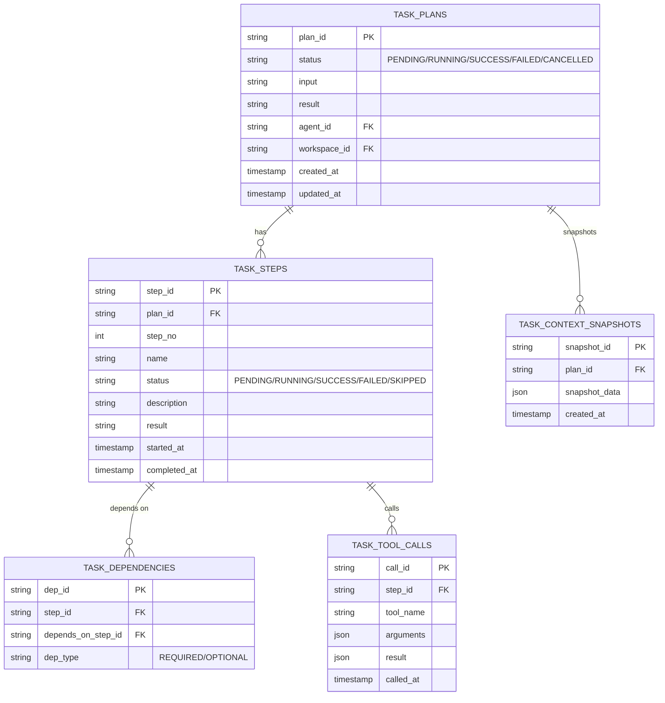
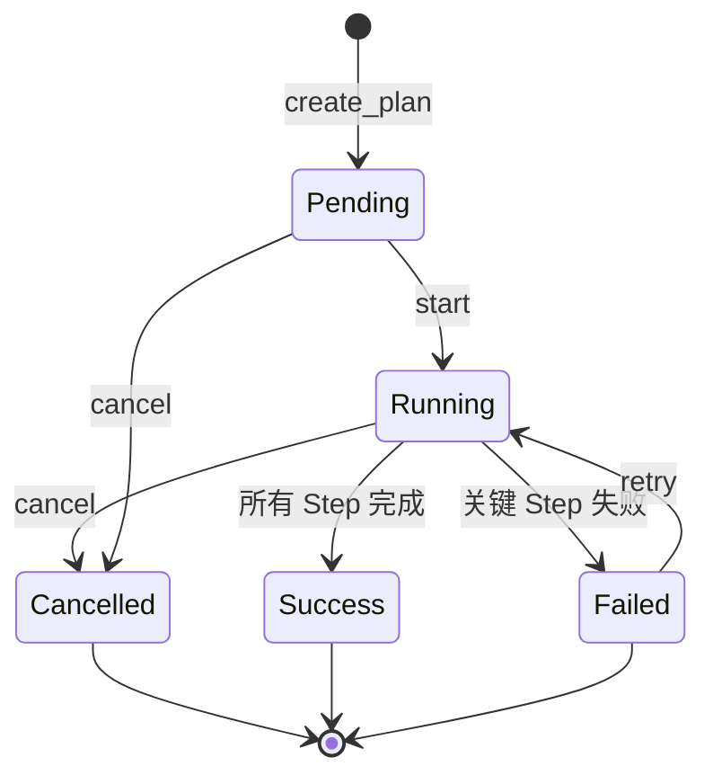
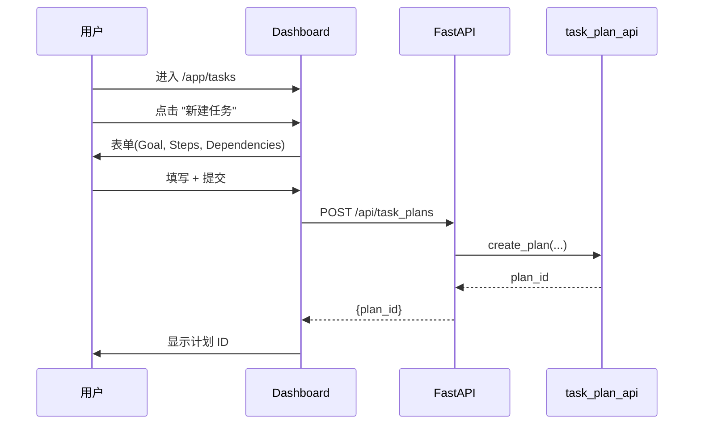
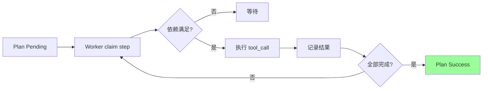
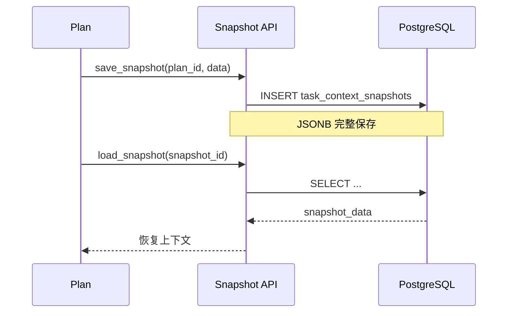
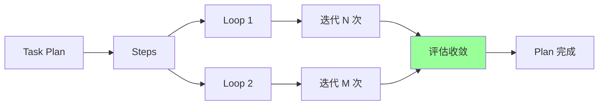

# §33 任务计划与执行

> 👤 用户/运维 · 🧑‍💻 开发者
>
> **一句话定位**:任务计划(Task Plan)是 Agent 执行的"有序步骤集合",包含依赖、工具调用、上下文快照、上下文分支。

---

## 1. 任务模型



来源:[`scripts/lib/task_plan_api.py`](../../scripts/lib/task_plan_api.py)

---

## 2. 计划状态机



---

## 3. 创建任务计划

### 3.1 通过 Dashboard



### 3.2 通过 API

```bash
curl -X POST http://localhost:18080/api/task_plans \
  -H "Content-Type: application/json" \
  -H "X-CSRF-Token: ${CSRF}" \
  -d '{
    "goal": "分析销售数据",
    "input": {"region": "华东", "year": 2026},
    "steps": [
      {"name": "fetch_data", "tool": "db_query", "args": {"sql": "SELECT ..."}},
      {"name": "analyze", "depends_on": ["fetch_data"], "tool": "llm_call"},
      {"name": "report", "depends_on": ["analyze"], "tool": "email_send"}
    ]
  }'
```

### 3.3 通过 Python

```python
from lib import task_plan_api

plan = task_plan_api.create_plan(
    principal_id=principal.principal_id,
    goal="分析销售数据",
    input={"region": "华东"},
)

task_plan_api.add_step(plan["plan_id"], name="fetch_data", tool="db_query")
task_plan_api.add_step(plan["plan_id"], name="analyze", tool="llm_call")
task_plan_api.add_dependency(plan["plan_id"], step="analyze", depends_on="fetch_data")
task_plan_api.add_step(plan["plan_id"], name="report", tool="email_send")
task_plan_api.add_dependency(plan["plan_id"], step="report", depends_on="analyze")
```

---

## 4. 步骤执行

### 4.1 自动执行



### 4.2 手动执行(单步)

```bash
curl -X POST http://localhost:18080/api/task_plans/{plan_id}/steps/{step_id}/execute \
  -H "X-CSRF-Token: ${CSRF}"
```

### 4.3 取消

```bash
curl -X POST http://localhost:18080/api/task_plans/{plan_id}/cancel \
  -H "X-CSRF-Token: ${CSRF}"
```

---

## 5. 工具调用

| 工具 | 用途 |
|---|---|
| `db_query` | 数据库只读查询 |
| `llm_call` | 调用 LLM |
| `embedding_call` | 生成嵌入 |
| `http_request` | HTTP 调用(白名单 URL) |
| `email_send` | 发邮件(企业版) |
| `tool_chain` | 工具链 |
| `skill_call` | 调用 Skill |

来源:[`lib/tool_registry.py`](../../scripts/lib/tool_registry.py)

---

## 6. 上下文快照



> 📌 快照用于:
> - 失败恢复
> - Fork 任务分支(详见 [§38](38-协作分支与循环工程.md))
> - 审计与重现

---

## 7. 与 Loop 的关系



> 📌 Loop 是"重复执行 + 自动评估"的步骤,详见 [§38 协作分支与循环工程](38-协作分支与循环工程.md)。

---

## 8. 关键 API

| 端点 | 方法 | 说明 |
|---|---|---|
| `/api/task_plans` | POST | 创建 |
| `/api/task_plans` | GET | 列表 |
| `/api/task_plans/{id}` | GET | 详情 |
| `/api/task_plans/{id}/start` | POST | 启动 |
| `/api/task_plans/{id}/cancel` | POST | 取消 |
| `/api/task_plans/{id}/steps` | GET | 步骤列表 |
| `/api/task_plans/{id}/snapshots` | POST | 保存快照 |
| `/api/task_plans/{id}/fork` | POST | Fork 分支 |

---

## 9. 任务与 Workspace 的绑定

```python
# 任务可以绑定到 Workspace
plan = task_plan_api.create_plan(
    workspace_id="WS_xxxxx",
    goal="..."
)
```

> 绑定后:
> - 任务的快照自动保存到 Workspace 上下文链
> - 任务的 Memory 写入属于 Workspace 作用域
> - 任务可见性跟随 Workspace 隔离模式

---

## 10. 故障排查

| 问题 | 排查 |
|---|---|
| Plan 一直 Pending | 检查是否有 Worker 在运行 |
| Step 一直 Running | 检查 tool 是否实现,或参数错误 |
| 依赖死锁 | 检查 dependency graph 无环 |
| 内存暴涨 | 检查 context_snapshot 过大,使用外部存储 |

---

## 11. 交叉引用

- 工作区:[§34 工作区与上下文连续性](34-工作区与上下文连续性.md)
- 分支:[§38 协作分支与循环工程](38-协作分支与循环工程.md)
- 架构深度:[`scripts/lib/task_plan_api.py`](../../scripts/lib/task_plan_api.py)

> 📌 **下一章**:[§34 工作区与上下文连续性](34-工作区与上下文连续性.md) — Workspace + Context Chain + Handoff。