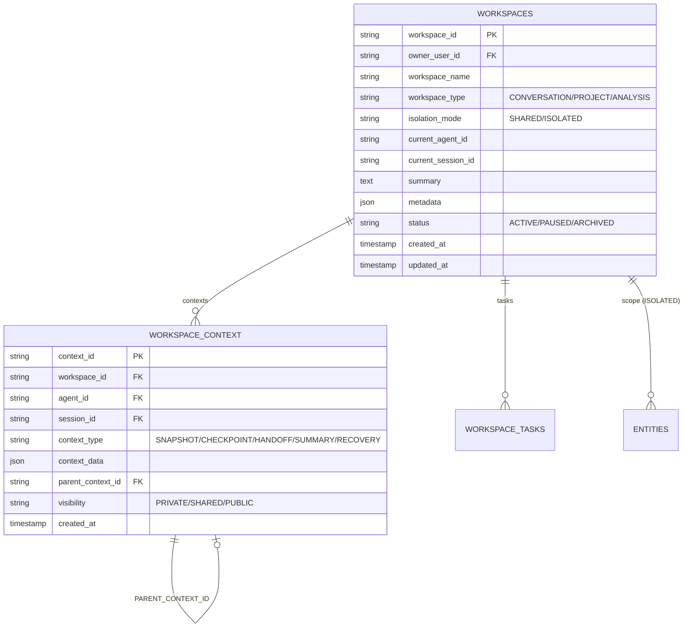
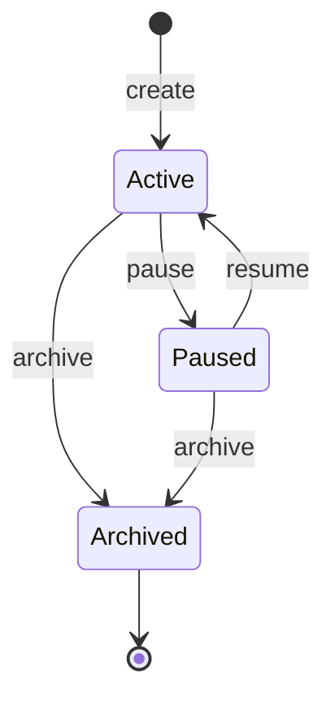
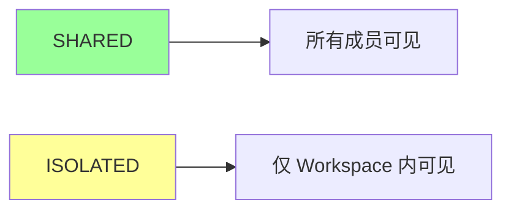
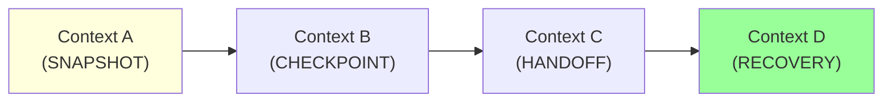
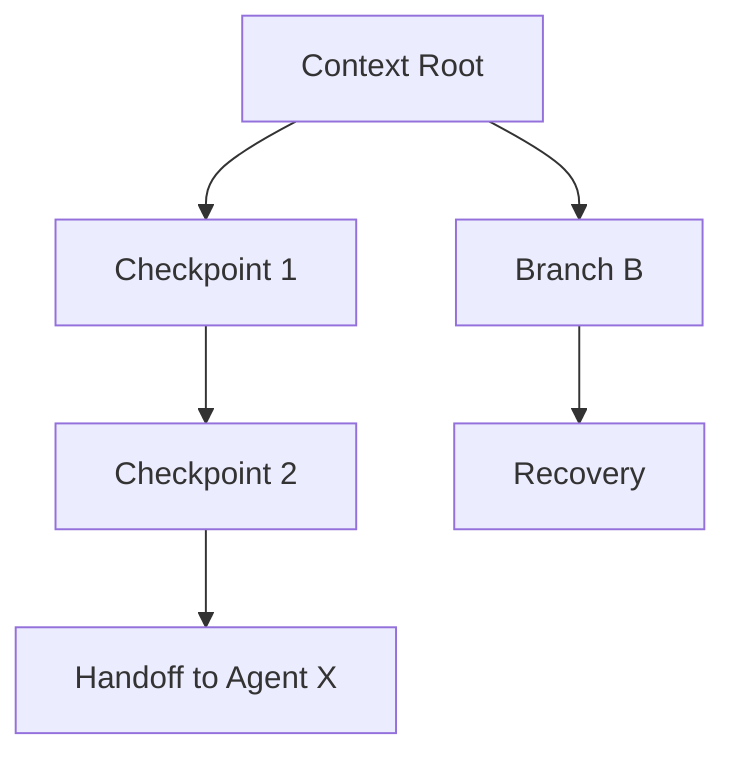
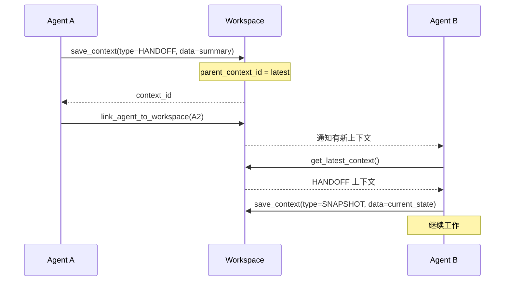
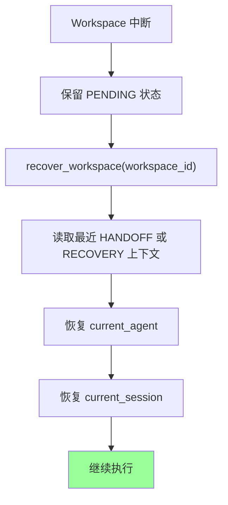
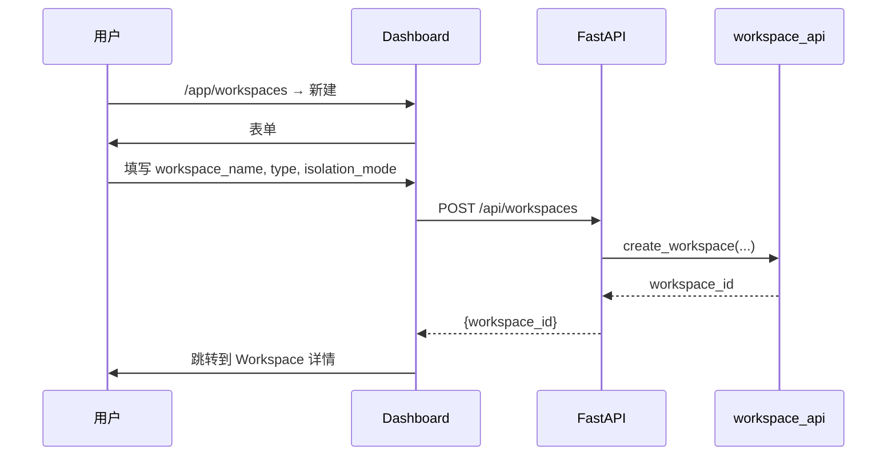
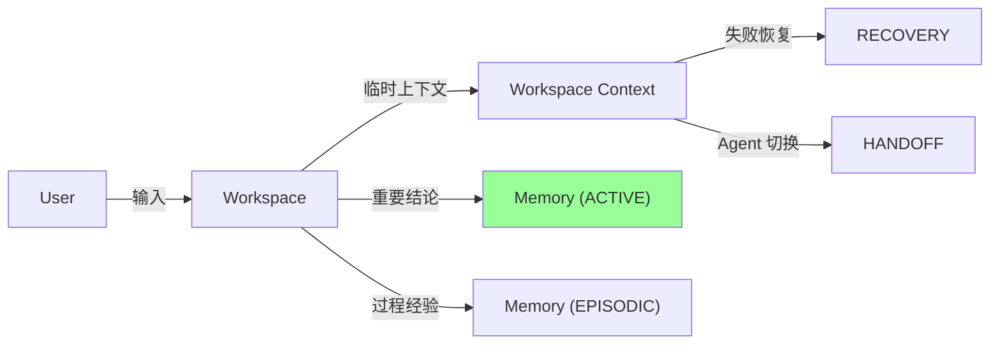

# §34 工作区与上下文连续性

> 👤 用户/运维 · 🧑‍💻 开发者
>
> **一句话定位**:Workspace 是 Agent 协作的"项目空间",通过 Context Chain 实现 Agent 间上下文交接与中断恢复。

---

## 1. Workspace 模型

来源:[`docs/workspace.md`](../workspace.md)、[`scripts/lib/workspace_api.py`](../../scripts/lib/workspace_api.py)



---

## 2. Workspace 生命周期



来源:[`lib/workspace_api.py:pause/archive/recover`](../../scripts/lib/workspace_api.py)

---

## 3. 3 种 Workspace 类型

| 类型 | 用途 |
|---|---|
| **CONVERSATION** | 持续对话(单一 Agent,持续上下文) |
| **PROJECT** | 多人多 Agent 协作项目 |
| **ANALYSIS** | 数据分析(临时,完成后归档) |

---

## 4. 2 种隔离模式



| 模式 | Entity 可见性 |
|---|---|
| **SHARED** | Entity 可选 `workspace_id`,默认全局可见 |
| **ISOLATED** | Entity 必须有 `workspace_id`,只在 Workspace 内可见 |

设置:`workspace_api.create(isolation_mode='ISOLATED')`

---

## 5. Context Chain

来源:[`docs/workspace.md`](../workspace.md)、[`lib/workspace_api.py:save_context/get_context_chain`](../../scripts/lib/workspace_api.py)



| 类型 | 用途 |
|---|---|
| **SNAPSHOT** | 完整状态快照 |
| **CHECKPOINT** | 中间检查点 |
| **HANDOFF** | Agent 间的上下文交接 |
| **SUMMARY** | 摘要压缩 |
| **RECOVERY** | 恢复用的上下文 |

### 5.1 PARENT_CONTEXT_ID

每条 Context 有 `parent_context_id`,形成**版本链**:



> 📌 用于:
> - 历史回放
> - 多分支并发
> - 失败恢复

---

## 6. Agent 间 Handoff

来源:[`docs/workspace.md`](../workspace.md)



---

## 7. 恢复流程

来源:[`lib/workspace_api.py:recover_workspace`](../../scripts/lib/workspace_api.py)



---

## 8. 上下文连续性 vs Memory

| 维度 | Workspace Context | Memory |
|---|---|---|
| **粒度** | Workspace 级 | Agent 级 |
| **生命周期** | Workspace 归档 | Memory 永久 |
| **写入** | 自动(SNAPSHOT/CHECKPOINT) | 显式 create |
| **可见性** | Workspace 隔离 | RLS 隔离 |

> 💡 **最佳实践**:
> - 高频状态变更用 Context Chain(自动,Workspace 内)
> - 重要结论提升为 Memory(显式,跨 Workspace)

---

## 9. 创建 Workspace

### 9.1 通过 Dashboard



### 9.2 通过 API

```bash
curl -X POST http://localhost:18080/api/workspaces \
  -H "Content-Type: application/json" \
  -H "X-CSRF-Token: ${CSRF}" \
  -d '{
    "workspace_name": "Project Alpha",
    "workspace_type": "PROJECT",
    "isolation_mode": "ISOLATED",
    "metadata": {"client": "Acme Corp"}
  }'
```

### 9.3 通过 Python

```python
from lib import workspace_api

ws = workspace_api.create_workspace(
    owner_user_id=principal.principal_id,
    workspace_name="Project Alpha",
    workspace_type="PROJECT",
    isolation_mode="ISOLATED"
)
```

---

## 10. 上下文操作

### 10.1 保存上下文

```python
ctx = workspace_api.save_context(
    workspace_id=ws["workspace_id"],
    agent_id="agent_x",
    session_id="ses_xxx",
    context_type="HANDOFF",
    context_data={
        "summary": "已完成数据收集,下一步分析",
        "memory_refs": ["MEM_001", "MEM_002"],
        "next_actions": ["调用 LLM 分析", "生成报告"]
    },
    visibility="SHARED"
)
```

### 10.2 读取上下文链

```python
chain = workspace_api.get_context_chain(workspace_id)
for ctx in chain:
    print(ctx["context_type"], ctx["created_at"])
```

### 10.3 Handoff

```python
# Agent A → Agent B
workspace_api.create_handoff_session(
    workspace_id=ws["workspace_id"],
    from_agent_id="agent_a",
    to_agent_id="agent_b",
    handoff_data={
        "summary": "...",
        "memory_refs": [...],
        "open_questions": [...]
    }
)
```

---

## 11. Workspace 与 Memory 的混合模式



---

## 12. 关键 API

| 端点 | 方法 | 说明 |
|---|---|---|
| `/api/workspaces` | POST | 创建 |
| `/api/workspaces` | GET | 列表 |
| `/api/workspaces/{id}` | GET | 详情 |
| `/api/workspaces/{id}/contexts` | POST | 保存上下文 |
| `/api/workspaces/{id}/contexts/chain` | GET | 读取上下文链 |
| `/api/workspaces/{id}/pause` | POST | 暂停 |
| `/api/workspaces/{id}/recover` | POST | 恢复 |
| `/api/workspaces/{id}/archive` | POST | 归档 |

---

## 13. 故障排查

| 问题 | 排查 |
|---|---|
| Workspace 不可见 | 检查 `workspace_type` 与当前 Principal 的角色 |
| Context Chain 中断 | 检查 `parent_context_id` 是否正确 |
| Handoff 失败 | 检查目标 Agent 是否在该 Workspace 内 |
| 恢复后状态错乱 | 检查 `isolation_mode` 和 Entity 的 `workspace_id` |

---

## 14. 交叉引用

- 任务计划:[§33 任务计划与执行](33-任务计划与执行.md)
- 分支:[§38 协作分支与循环工程](38-协作分支与循环工程.md)
- 现有文档:[`docs/workspace.md`](../workspace.md)

> 📌 **下一章**:[§35 知识库管理](35-知识库管理.md) — Knowledge 域与 5 信号混合搜索。