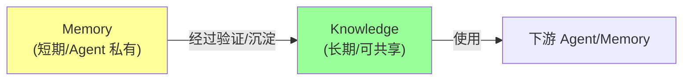
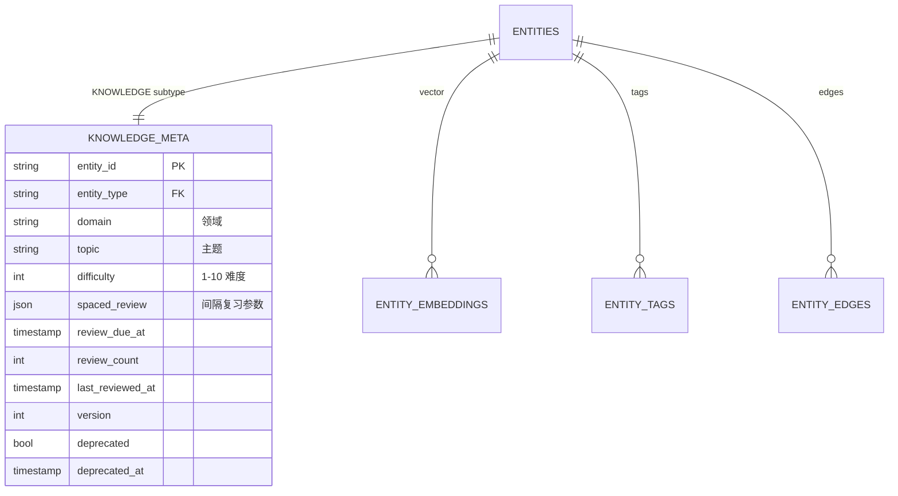
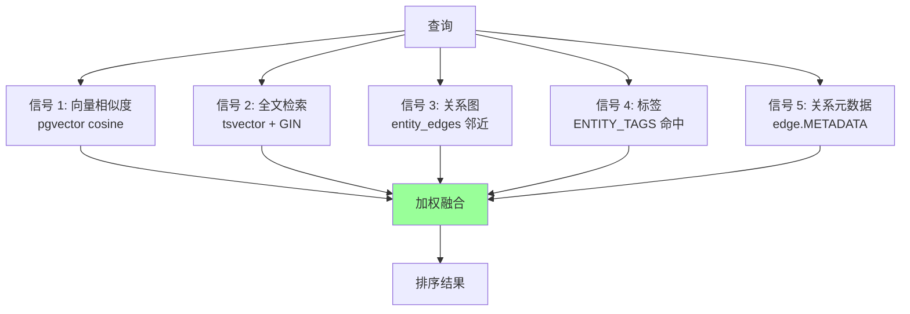
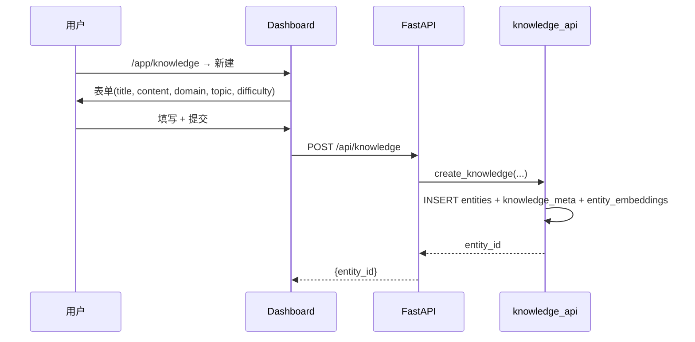
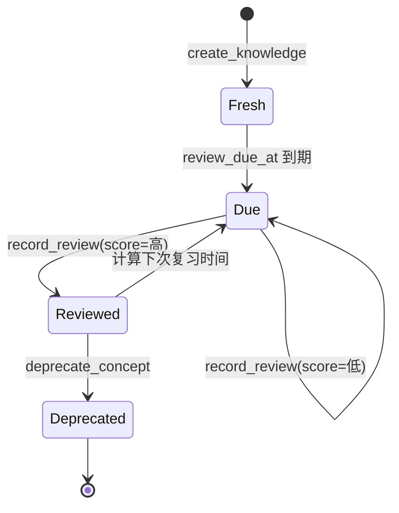
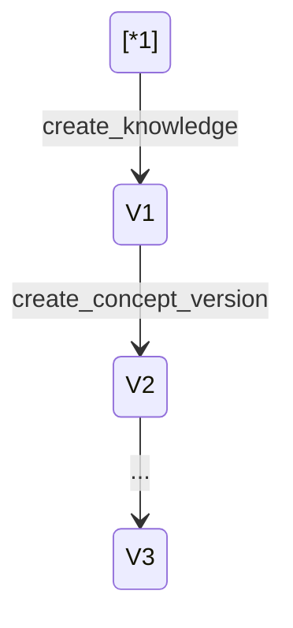

# §35 知识库管理

> 👤 用户/运维 · 🧑‍💻 开发者
>
> **一句话定位**:Knowledge 是平台"长期验证过的事实",支持 5 信号混合搜索(向量 + 全文 + 关系 + 标签 + 关系),有完整的复习机制。

---

## 1. Knowledge vs Memory



| 维度 | Memory | Knowledge |
|---|---|---|
| **生命周期** | 短期/活跃 | 长期/归档 |
| **作用域** | Agent 私有 | 可共享 |
| **验证** | 不验证 | 验证 + 复习 |
| **嵌入** | 立即生成 | 显式触发 |
| **可合并** | ❌ | ✅ `merge_knowledge` |

来源:[`docs/introduction_zh.md`](../introduction_zh.md) "5 信号统一混合搜索"

---

## 2. Knowledge 模型



来源:[`scripts/deploy/1_schema.sql` knowledge_meta 表](../../scripts/deploy/1_schema.sql)、[`lib/knowledge_api.py`](../../scripts/lib/knowledge_api.py)

---

## 3. 5 信号混合搜索

来源:[`lib/embedding_api.py:search_unified_sql`](../../scripts/lib/embedding_api.py)



### 3.1 5 个信号

| 信号 | 来源 | 权重(默认) |
|---|---|---|
| 向量相似 | `entity_embeddings.vector` (pgvector) | 0.4 |
| 全文 | `entities.ts_vector` (tsvector + pg_trgm) | 0.25 |
| 关系图 | `entity_edges` 邻近 | 0.15 |
| 标签 | `entity_tags` | 0.1 |
| 关系元数据 | `entity_edges.METADATA` | 0.1 |

> 权重可通过 `search_api.py:describe_search_strategy` 配置。

### 3.2 搜索 API

```bash
curl -X POST http://localhost:18080/api/knowledge/search \
  -H "Content-Type: application/json" \
  -H "X-CSRF-Token: ${CSRF}" \
  -d '{
    "query": "巴黎首都",
    "domain": "geography",
    "min_importance": 5,
    "limit": 10,
    "strategy": "unified"
  }'
```

返回:

```json
{
  "results": [
    {
      "entity_id": "E_xxx",
      "title": "巴黎是法国首都",
      "summary": "...",
      "score": 0.92,
      "signals": {
        "vector": 0.95,
        "fulltext": 0.88,
        "graph": 0.5,
        "tag": 1.0,
        "metadata": 0.0
      }
    }
  ]
}
```

---

## 4. 创建 Knowledge

### 4.1 通过 Dashboard



### 4.2 通过 API

```bash
curl -X POST http://localhost:18080/api/knowledge \
  -H "Content-Type: application/json" \
  -H "X-CSRF-Token: ${CSRF}" \
  -d '{
    "title": "巴黎是法国首都",
    "content": "巴黎是法国的首都和最大城市...",
    "summary": "简要描述",
    "domain": "geography",
    "topic": "Europe",
    "difficulty": 3,
    "importance": 8,
    "tags": ["Europe", "France", "Capital"]
  }'
```

---

## 5. 复习机制



### 5.1 间隔复习算法

来源:[`docs/architecture.md`](../architecture.md)

```sql
-- spaced_review 参数
{
  "interval_days": [1, 3, 7, 14, 30, 90],
  "ease_factor": 2.5,
  "consecutive_correct": 0
}
```

### 5.2 获取待复习列表

```bash
GET /api/knowledge/due_reviews
```

### 5.3 记录复习

```bash
curl -X POST http://localhost:18080/api/knowledge/{id}/review \
  -H "X-CSRF-Token: ${CSRF}" \
  -d '{
    "score": 0.9,
    "comment": "记忆清晰"
  }'
```

---

## 6. 关系图(Knowledge Graph)

```mermaid
erDiagram
    E1["Knowledge: 巴黎"] -->|CAPITAL_OF| E2["Knowledge: 法国"]
    E2 -->|PART_OF| E3["Knowledge: 欧盟"]
    E1 -->|LOCATED_IN| E4["Knowledge: 欧洲"]
    E1 -->|RIVER| E5["Knowledge: 塞纳河"]
```

### 6.1 添加边

```bash
curl -X POST http://localhost:18080/api/knowledge/edges \
  -H "X-CSRF-Token: ${CSRF}" \
  -d '{
    "source_id": "E_paris",
    "target_id": "E_france",
    "edge_type": "CAPITAL_OF",
    "strength": 1.0,
    "confidence": 0.95
  }'
```

### 6.2 23 种边类型

来源:[`docs/architecture.md`](../architecture.md)

`DEPENDS_ON, RELATED_TO, DERIVED_FROM, CAUSES, ENABLES, PREVENTS, SIMILAR_TO, EVOLVED_FROM, CONTRADICTS, SUPPORTS, CAPITAL_OF, LOCATED_IN, ...`

---

## 7. 合并与冲突检测

### 7.1 合并

```python
from lib import knowledge_api

# 把 entity_b 的内容合并到 entity_a
knowledge_api.merge_knowledge(
    target_entity_id="E_a",
    source_entity_id="E_b",
    principal_id=principal.principal_id
)
```

合并后:
- `entity_b` 标记 `deprecated`
- 引用 `entity_b` 的 Edge 重新指向 `entity_a`
- 嵌入重新计算

### 7.2 冲突检测

```python
conflicts = knowledge_api.detect_knowledge_conflicts(
    entity_id="E_a",
    min_similarity=0.8
)
```

> 冲突 = 两个 Knowledge 相似但内容不一致。系统提示但**不**自动解决。

---

## 8. 版本控制



每个 Knowledge 可以有多个版本,旧版本不删除(只标记 `deprecated`)。

```python
v2 = knowledge_api.create_concept_version(
    entity_id="E_a",
    new_content="更新后的内容",
    reason="发现错误",
    expected_version=1
)
```

---

## 9. Knowledge 的生命周期

```mermaid
flowchart LR
    A["Draft"] --> B["Active"]
    B --> C["Due for Review"]
    C --> D{"通过?"}
    D -->|是| B
    D -->|否| E["Contradicted"]
    E --> F{"解决?"}
    F -->|是| B
    F -->|否| G["Deprecated"]
    B --> G
    G --> [*]
    style B fill:#9f9
```

---

## 10. 关键 API

| 端点 | 方法 | 说明 |
|---|---|---|
| `/api/knowledge` | POST | 创建 |
| `/api/knowledge` | GET | 列表 |
| `/api/knowledge/search` | POST | 5 信号搜索 |
| `/api/knowledge/due_reviews` | GET | 待复习 |
| `/api/knowledge/{id}/review` | POST | 记录复习 |
| `/api/knowledge/{id}/deprecate` | POST | 弃用 |
| `/api/knowledge/edges` | POST | 加边 |
| `/api/knowledge/merge` | POST | 合并 |
| `/api/knowledge/{id}/versions` | POST | 创建新版本 |

完整索引:[§53 REST API 索引](53-REST-API索引.md)。

---

## 11. 故障排查

| 问题 | 排查 |
|---|---|
| 搜索无结果 | 检查 `embedding.dimension` 配置,确认与生成时一致 |
| 嵌入为空 | 检查外部 embedding API 是否可访问 |
| 复习列表为空 | 检查 `review_due_at` 是否到期 |
| 边添加失败 | 检查源/目标 Entity 是否存在 |
| 版本冲突 | `expected_version` 不匹配 |

---

## 12. 交叉引用

- Memory:[§36 记忆库与生命周期](36-记忆库与生命周期.md)
- 图探索:[§39 图探索与可视化](39-图探索与可视化.md)
- 嵌入:[`scripts/lib/embedding_api.py`](../../scripts/lib/embedding_api.py)
- 搜索:[`scripts/lib/search_api.py`](../../scripts/lib/search_api.py)

> 📌 **下一章**:[§36 记忆库与生命周期](36-记忆库与生命周期.md) — Memory Dashboard 5 大视图与 Family/Version 操作。