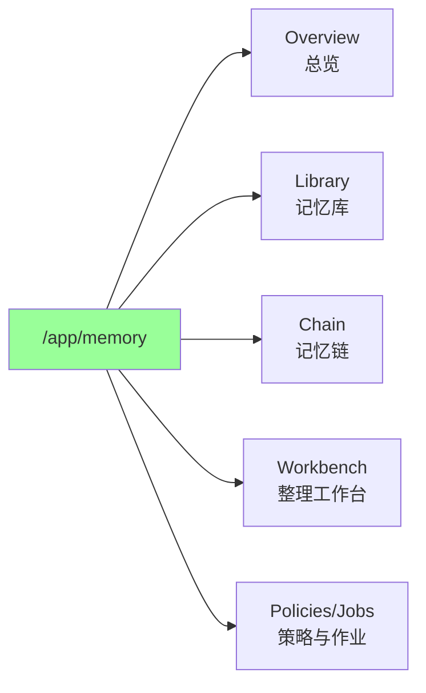
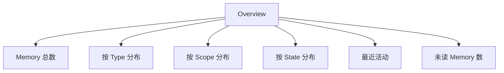
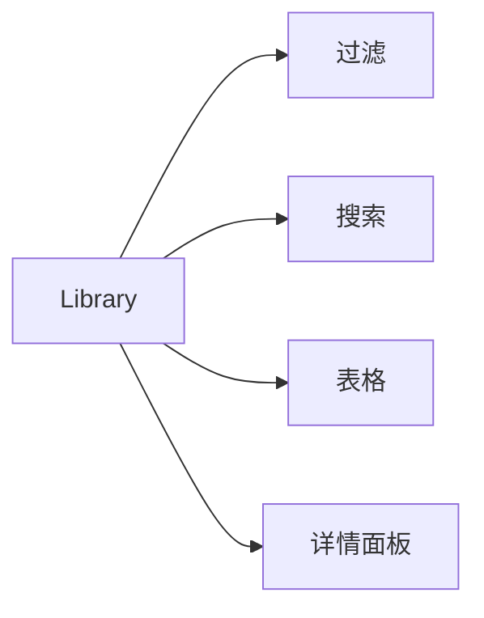
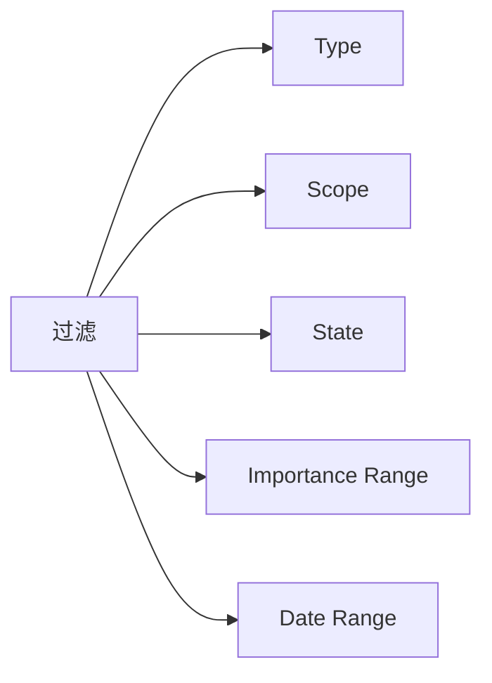
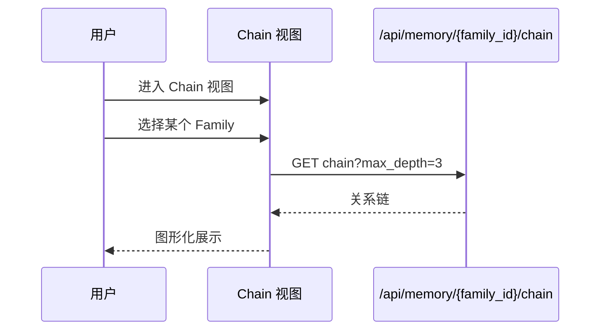
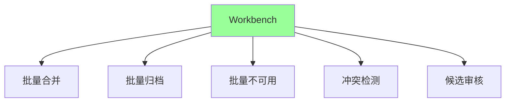
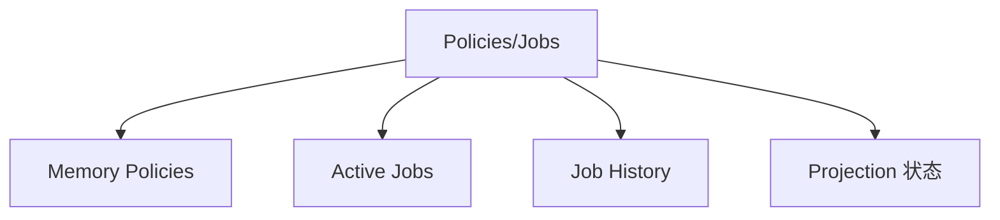
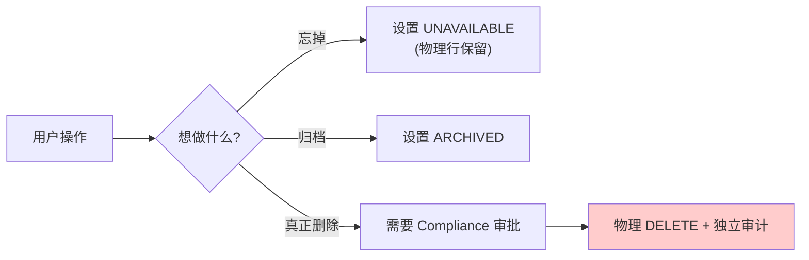

# §36 记忆库与生命周期

> 👤 用户/运维
>
> **一句话定位**:v4.3.2 起 Memory 是"版本化家族",Dashboard 提供 5 大视图(总览/库/链/工作台/策略作业)帮助管理整个 Memory 生命周期。

---

## 1. Memory Dashboard 5 视图

来源:[`web/src/App.tsx:1084-1086`](../../web/src/App.tsx)



| 视图 | 路径 | 用途 |
|---|---|---|
| **Overview** | `/app/memory/overview` | 当前所有 Memory 的统计 |
| **Library** | `/app/memory/library` | 当前 Memory 列表(可读) |
| **Chain** | `/app/memory/chain` | Family 关系链可视化 |
| **Workbench** | `/app/memory/workbench` | 整理/合并/归档 |
| **Policies/Jobs** | `/app/memory/jobs` | 策略与长期作业 |

---

## 2. Overview(总览)



| 卡片 | 数据源 |
|---|---|
| Memory 总数 | `cx_memory_families` |
| 按 Type 分布 | `GROUP BY memory_type` |
| 按 Scope 分布 | `GROUP BY memory_scope` |
| 按 State 分布 | `GROUP BY lifecycle_state` |
| 最近活动 | `cx_memory_usage_events` |
| 未读 | `WHERE last_used_at IS NULL OR` ... |

---

## 3. Library(记忆库)



### 3.1 表格列

| 列 | 含义 |
|---|---|
| Title | Memory 标题 |
| Type | EPISODIC / FACT / PREFERENCE / DECISION / PROCEDURAL / EXPERIENCE |
| Scope | RUNTIME_CONTEXT / CHANNEL_MEMORY / AGENT_MEMORY / WORKSPACE_MEMORY / ENTERPRISE_KNOWLEDGE |
| State | 10 种 lifecycle_state |
| Importance | 1-10 |
| Created | 创建时间 |
| Last Used | 最后使用时间 |

### 3.2 过滤



---

## 4. Chain(记忆链)



### 4.1 关系类型

| 类型 | 含义 |
|---|---|
| `DERIVED_FROM` | 派生自 |
| `SUPPORTS` | 支持 |
| `CONTRADICTS` | 矛盾 |
| `EXTENDS` | 扩展 |
| `REFERENCES` | 引用 |

---

## 5. Workbench(整理工作台)



### 5.1 批量合并

```python
# lib/memory_lifecycle.py
from lib import memory_lifecycle

memory_lifecycle.merge_families(
    target_family_id="MEM_target",
    source_family_ids=["MEM_a", "MEM_b", "MEM_c"],
    principal_id=principal.principal_id,
    reason="重复 Memory 整理"
)
```

### 5.2 批量归档

```python
memory_lifecycle.archive_version(
    family_id="MEM_xxx",
    version_id="VER_yyy",
    reason="已过时"
)
```

### 5.3 批量不可用

```python
memory_lifecycle.mark_unavailable(
    family_id="MEM_xxx",
    reason="用户主动遗忘"
)
```

### 5.4 冲突检测

```python
conflicts = memory_lifecycle.detect_conflicts(
    principal_id=principal.principal_id,
    min_similarity=0.85
)
```

### 5.5 候选审核

```python
# 列出候选
candidates = memory_lifecycle.list_candidates(principal_id)

# 审核通过
memory_lifecycle.review_candidate(
    candidate_id="CAND_xxx",
    decision="APPROVED",
    reviewer_id=principal.principal_id,
    comment="..."
)

# 激活(创建新 Version)
memory_lifecycle.activate_candidate(
    candidate_id="CAND_xxx",
    reason="...",
    principal_id=principal.principal_id
)
```

---

## 6. Policies / Jobs



### 6.1 Memory Policies

| Policy | 默认 | 说明 |
|---|---|---|
| `auto_archive_after_days` | 365 | 自动归档 |
| `auto_unavailable_after_days` | 1095 | 自动不可用 |
| `quarantine_requires_reason` | true | 隔离需原因 |
| `delete_requires_compliance` | true | 物理删除需 Compliance |

### 6.2 Active Jobs

| Job | 触发 |
|---|---|
| `cleanup_expired` | 每日 |
| `archive_old` | 每周 |
| `projection_rebuild` | 手动 |
| `consolidate` | 手动(管理员) |

### 6.3 Projection 状态

| 指标 | 含义 |
|---|---|
| `outbox_lag` | 投影延迟事件数 |
| `last_rebuild_at` | 上次重建时间 |
| `health` | HEALTHY / DEGRADED / STALE |

---

## 7. Memory 操作(快速参考)

| 操作 | 入口 | API |
|---|---|---|
| 创建 | Library → 新建 | `POST /api/memory` |
| 编辑 | Library → 详情 → Edit → Candidate | `POST /api/memory/{family_id}/candidates` |
| 升级候选 | Workbench | `POST /api/memory/candidates/{id}/activate` |
| 归档 | Workbench | `POST /api/memory/{family_id}/versions` (state=ARCHIVED) |
| 不可用 | Workbench | `POST /api/memory/{family_id}/unavailable` |
| 隔离(管理员) | Workbench | `POST /api/memory/{family_id}/quarantine` |
| 合并 | Workbench | `POST /api/memory/merge` |
| 快照 | Library → 详情 | `POST /api/memory/snapshots` |
| 还原快照 | Library → Snapshots | `GET /api/memory/snapshots/{id}/resolve` |

---

## 8. 关键概念复习

| 概念 | 含义 |
|---|---|
| **Family** | 稳定的"主题",有 `family_id` |
| **Version** | 不可变的"内容快照",每个 Family 有 N 个 |
| **Current Pointer** | Family 指向当前 Version(可改) |
| **Chain** | Family 间的关系 |
| **Candidate** | 待审核的编辑建议 |
| **Job** | 长期整理任务 |
| **Snapshot** | 绑 Principal/Instance 的上下文快照 |

---

## 9. 物理删除 vs 逻辑不可用



> ⚠️ **物理删除不是用户操作**。详见 [`docs/security.md:85-92`](../security.md)。

---

## 10. 故障排查

| 问题 | 排查 |
|---|---|
| Memory 看不到 | 检查 Capability `memory` 是否启用 |
| 候选审核后未生效 | 检查 `policy_version` 是否匹配 |
| Snapshot 解析失败 | 检查 Principal 状态变化(Subject Fencing) |
| Projection 延迟 | 检查 `cx_memory_projection_outbox` 表 |

---

## 11. 交叉引用

- 架构深度:[§15 Memory Lifecycle 架构](15-Memory-Lifecycle架构.md)
- 文档参考:[`docs/memory-lifecycle.md`](../memory-lifecycle.md)

> 📌 **下一章**:[§37 技能与规格管理](37-技能与规格管理.md) — Skill ZIP + Spec-Driven + Harness。