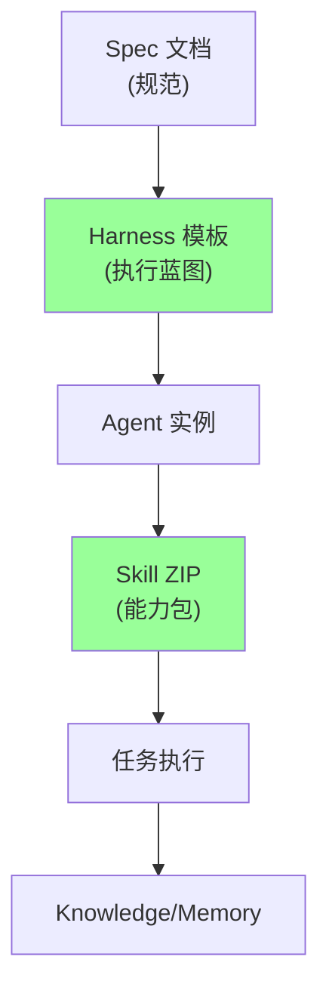
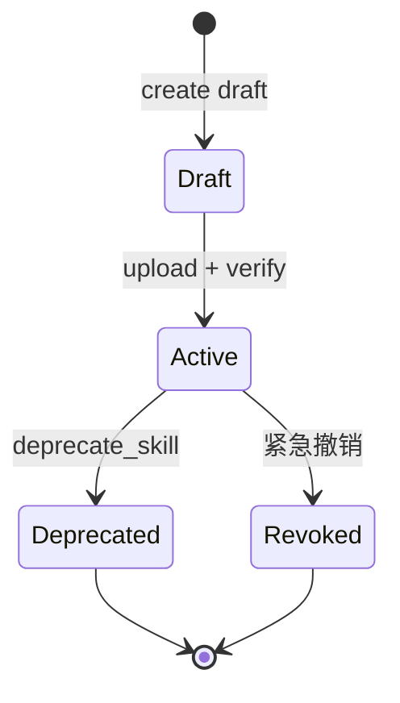
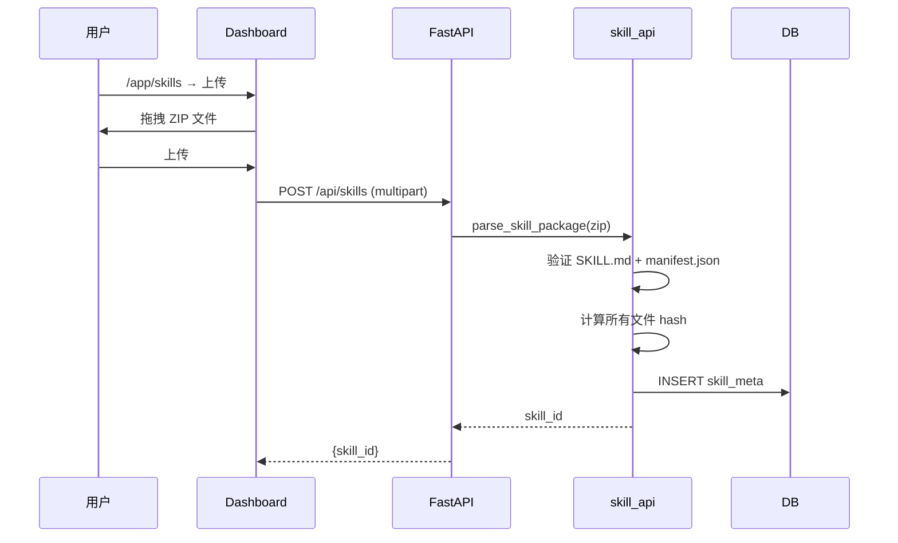
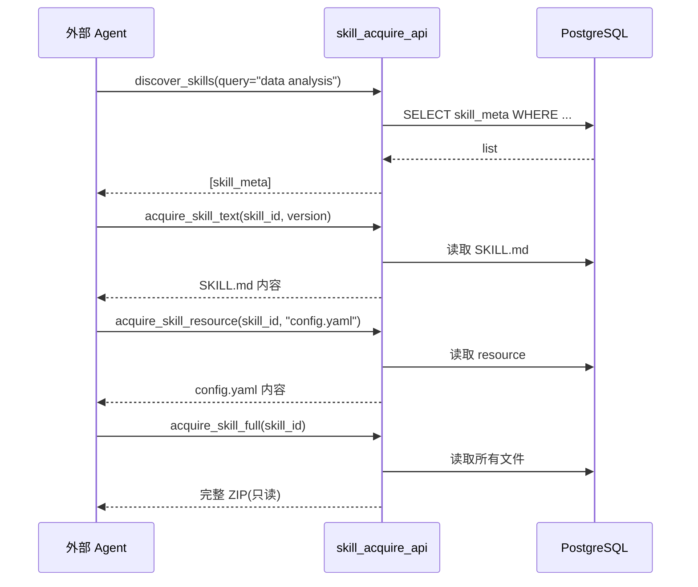
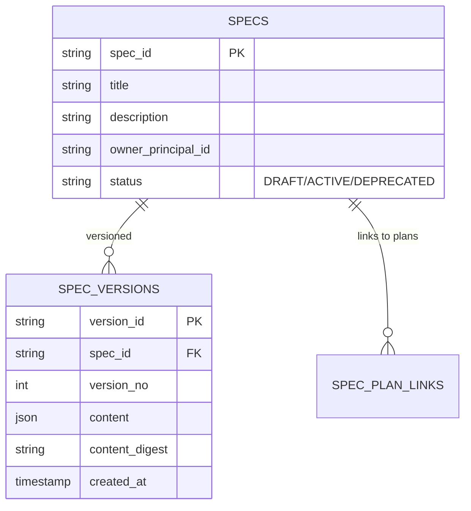
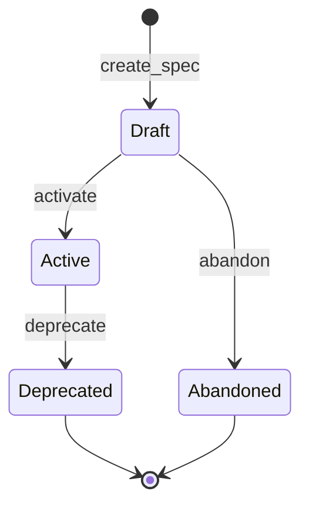

# §37 技能与规格管理

> 👤 用户/运维 · 🧑‍💻 开发者
>
> **一句话定位**:Skill 是 Agent 可获取的能力包(ZIP),Spec 是规范文档,Harness 是可复用的执行蓝图 — 三者共同实现"Spec-Driven + Skill-First"。

---

## 1. 三者关系



---

## 2. Skill 模型

来源:[`scripts/lib/skill_api.py`](../../scripts/lib/skill_api.py)、[`SKILL.md`](../SKILL.md)

### 2.1 目录结构

```text
my_skill/
├── SKILL.md              # 必填,操作手册
├── manifest.json         # 必填,元数据
├── scripts/              # 可选,脚本
│   └── run.py
├── resources/            # 可选,资源
│   └── config.yaml
└── README.md             # 可选
```

### 2.2 manifest.json

```json
{
  "skill_id": "data_analyzer",
  "version": "1.0.0",
  "display_name": "Data Analyzer",
  "description": "分析 CSV 数据并生成报告",
  "author": "Acme Corp",
  "tags": ["data", "analysis"],
  "runtime": "python3.14",
  "entry_point": "scripts/run.py",
  "input_schema": {...},
  "output_schema": {...},
  "dependencies": ["pandas>=2.0", "numpy>=1.24"],
  "resources": ["config.yaml"]
}
```

### 2.3 SKILL.md

```markdown
# Data Analyzer

> **Version:** 1.0.0 | **Author:** Acme Corp

## Usage

Run with input file...

## Examples
...
```

---

## 3. Skill 状态机



---

## 4. 上传 Skill

### 4.1 通过 Dashboard



### 4.2 通过 CLI

```bash
"$PYTHON_BIN" scripts/agent_bootstrap.py skill-create \
  --zip ./my_skill.zip \
  --admin-token AT_xxxxx
```

### 4.3 通过 API

```bash
curl -X POST http://localhost:18080/api/skills \
  -H "X-Admin-Token: AT_xxxxx" \
  -F "skill_zip=@./my_skill.zip"
```

---

## 5. Skill 获取(外部 Agent)

来源:[`lib/skill_acquire_api.py`](../../scripts/lib/skill_acquire_api.py)



### 5.1 关键不变量

> - Skill ZIP **永远只读**(上传后不可修改)
> - 所有文件 **SHA-256 hash** 存储
> - 资源访问受 `cx_skill_tokens` 控制

---

## 6. Spec 模型

来源:[`lib/spec_api.py`](../../scripts/lib/spec_api.py)、[`docs/loop-engineering.md`](../loop-engineering.md)



### 6.1 Spec 状态机



---

## 7. Spec 操作

### 7.1 创建

```bash
curl -X POST http://localhost:18080/api/specs \
  -H "X-CSRF-Token: ${CSRF}" \
  -d '{
    "title": "用户认证规范",
    "description": "...",
    "content": {
      "requirements": [
        "用户名密码登录",
        "MFA 支持",
        "Session 超时"
      ],
      "acceptance_criteria": [...]
    }
  }'
```

### 7.2 链接到 Plan

```python
spec_api.link_spec_to_plan(
    spec_id="SPEC_xxx",
    plan_id="PLAN_yyy"
)
```

### 7.3 验证 Plan

```python
result = spec_api.validate_plan_against_spec(
    spec_id="SPEC_xxx",
    plan_id="PLAN_yyy"
)
# 返回: {valid: bool, missing_requirements: [...], extra_steps: [...]}
```

### 7.4 派生 Spec

```python
# 从已有 Spec 派生(创建子版本)
new_spec = spec_api.derive_spec(
    parent_spec_id="SPEC_xxx",
    new_content={...},
    reason="..."
)
```

---

## 8. Harness 模板

来源:[`docs/harness.md`](../harness.md)、[`scripts/deploy/4_harness_templates.sql`](../../scripts/deploy/4_harness_templates.sql)

### 8.1 5 个内置 Harness

| 名称 | execution_mode | 用途 |
|---|---|---|
| **Research Analyst** | SEQUENTIAL | 研究型任务,顺序执行 |
| **Code Assistant** | SEQUENTIAL | 编程辅助 |
| **Data Analyst** | PARALLEL | 数据分析,可并行 |
| **Task Planner** | CONDITIONAL | 任务规划,条件分支 |
| **Security Auditor** | SEQUENTIAL | 安全审计 |

### 8.2 模板结构

```json
{
  "template_id": "research_analyst_v1",
  "name": "Research Analyst",
  "execution_mode": "SEQUENTIAL",
  "input_schema": {
    "type": "object",
    "properties": {
      "topic": {"type": "string"},
      "depth": {"type": "integer", "default": 3}
    },
    "required": ["topic"]
  },
  "output_schema": {
    "type": "object",
    "properties": {
      "summary": {"type": "string"},
      "sources": {"type": "array"}
    }
  },
  "importance": 2,
  "visibility": "SHARED",
  "owned_by_agent": "SYSTEM"
}
```

### 8.3 实例化

```python
harness_api.instantiate_harness_template(
    template_id="research_analyst_v1",
    input={"topic": "PostgreSQL 18 新特性", "depth": 3},
    workspace_id="WS_xxx"
)
```

### 8.4 继承

```python
# 创建派生模板
derived = harness_api.create_derived_template(
    parent_template_id="research_analyst_v1",
    name="Research Analyst - Academic",
    overrides={
        "execution_mode": "PARALLEL",
        "input_schema": {...}
    }
)

# 查询继承链
chain = harness_api.get_template_inheritance_chain(
    template_id="research_analyst_v1_academic"
)
```

---

## 9. Skill vs Spec vs Harness

| 维度 | Skill | Spec | Harness |
|---|---|---|---|
| **目的** | 能力包(可执行) | 规范(文档) | 蓝图(模板) |
| **形式** | ZIP | JSON/YAML | JSON |
| **生命周期** | 注册后可用 | 版本化 | 可继承 |
| **执行** | 直接执行 | 由 Plan 引用 | 实例化后执行 |
| **共享** | 跨 Agent | 跨 Plan | 跨 Workspace |

---

## 10. 关键 API

| 端点 | 方法 | 说明 |
|---|---|---|
| `/api/skills` | POST/GET | 创建/列表 |
| `/api/skills/{id}` | GET/DELETE | 详情/删除 |
| `/api/skills/{id}/acquire` | POST | 获取完整 Skill |
| `/api/specs` | POST/GET | 创建/列表 |
| `/api/specs/{id}/validate` | POST | 验证 |
| `/api/specs/{id}/versions` | POST | 新版本 |
| `/api/harness/templates` | POST/GET | 模板列表 |
| `/api/harness/templates/{id}/instantiate` | POST | 实例化 |

完整索引:[§53 REST API 索引](53-REST-API索引.md)。

---

## 11. 故障排查

| 问题 | 排查 |
|---|---|
| Skill 上传失败 | 检查 ZIP 完整性 + SKILL.md + manifest.json |
| 资源获取 404 | 检查 `cx_skill_tokens` |
| Spec 验证失败 | 检查 plan 缺少哪些 requirement |
| Harness 实例化失败 | 检查 input_schema 匹配 |

---

## 12. 交叉引用

- Loop:[§38 协作分支与循环工程](38-协作分支与循环工程.md)
- 任务:[§33 任务计划与执行](33-任务计划与执行.md)
- 现有文档:[`docs/harness.md`](../harness.md)、[`docs/loop-engineering.md`](../loop-engineering.md)

> 📌 **下一章**:[§38 协作分支与循环工程](38-协作分支与循环工程.md) — Branch (fork/merge) + Loop Engineering + 6 种评估类型。