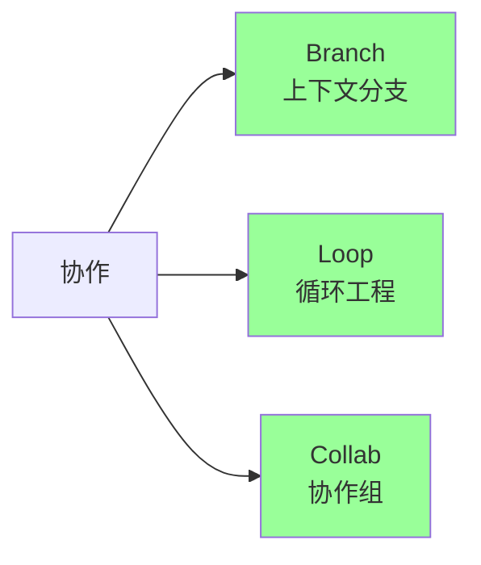
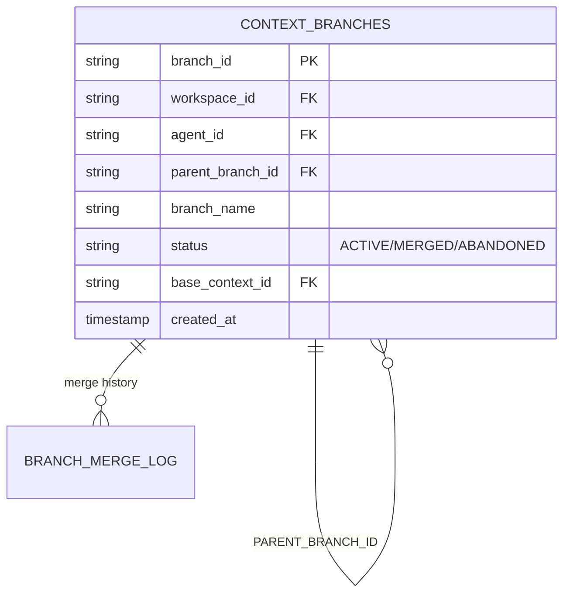
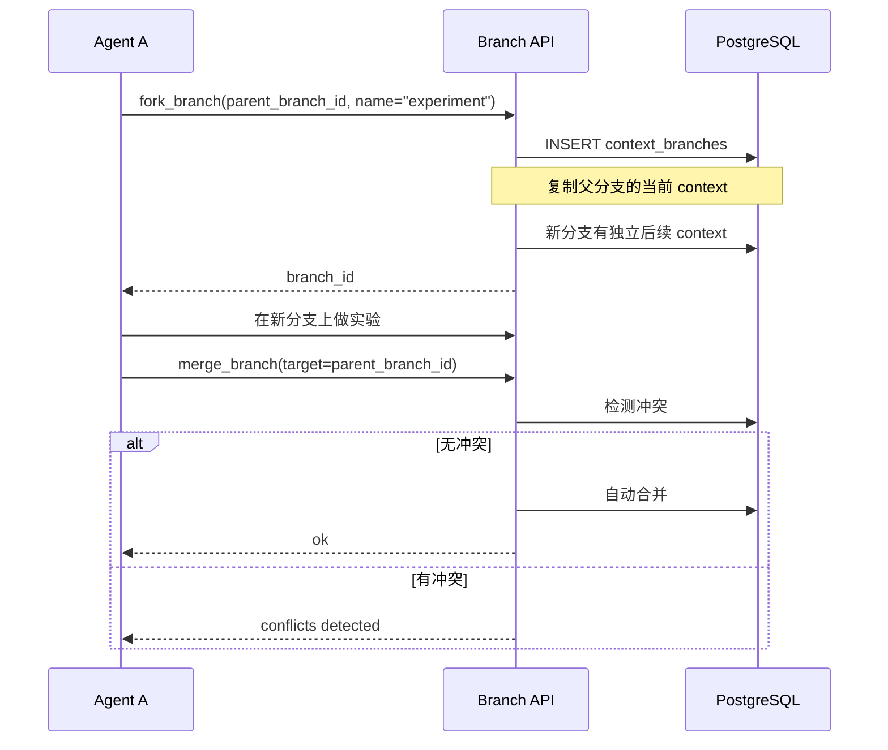
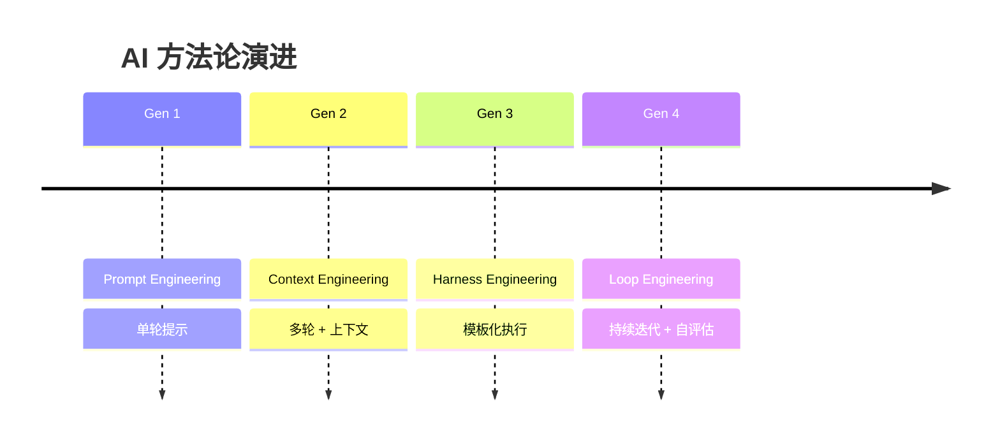
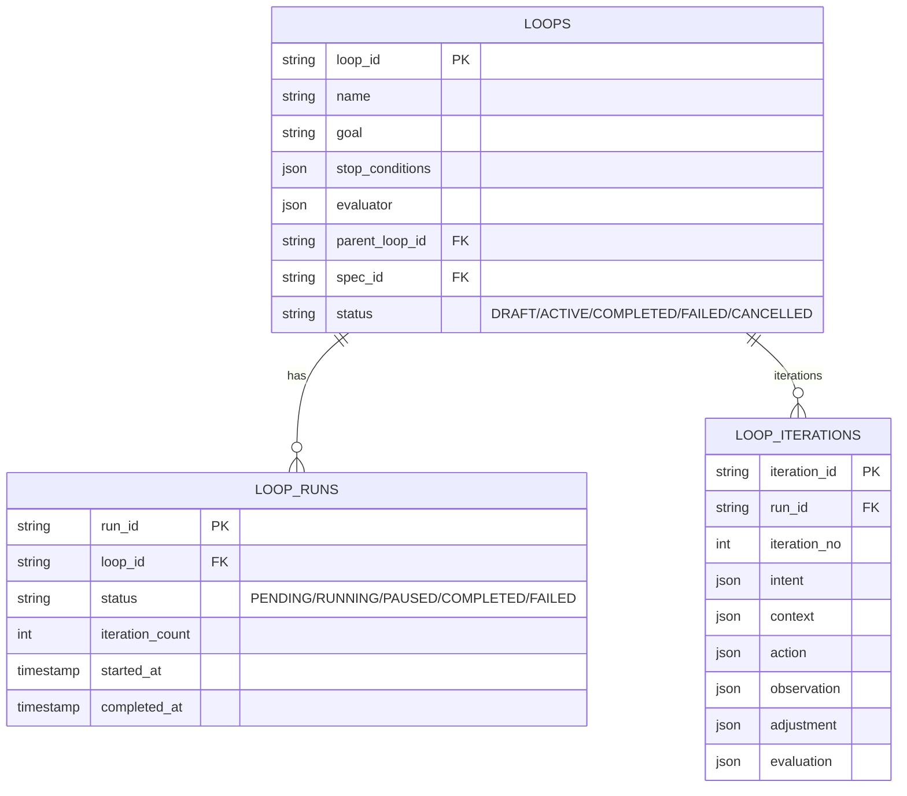
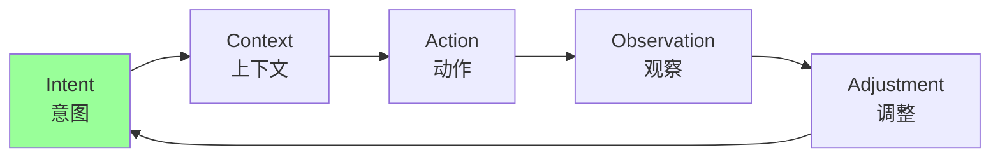
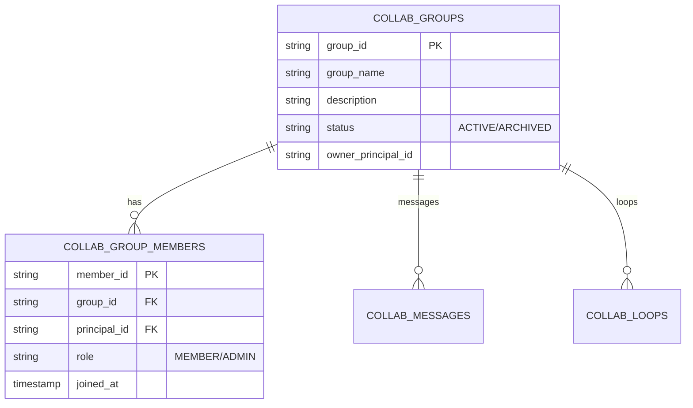
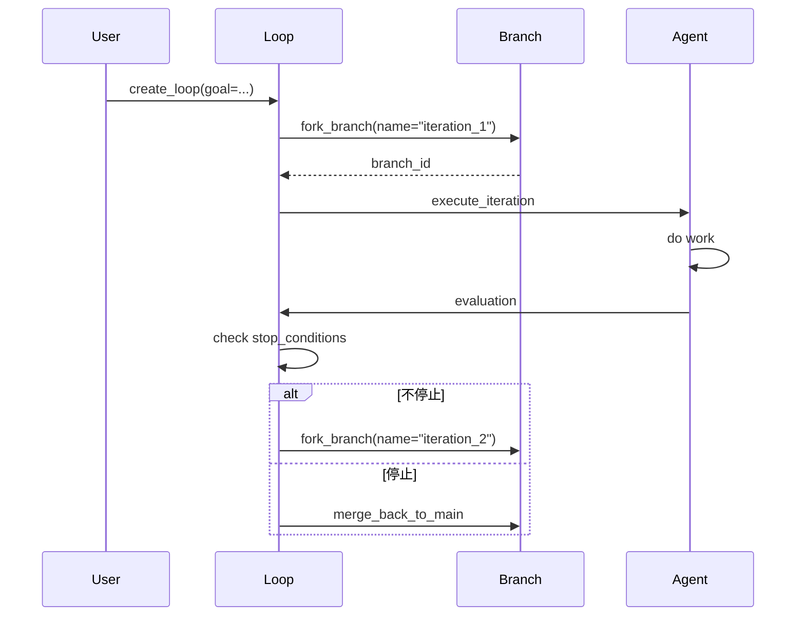

# §38 协作分支与循环工程

> 👤 用户/运维 · 🧑‍💻 开发者
>
> **一句话定位**:Branch(上下文分支)+ Loop(循环迭代) + Collab(协作组)是 4 代 AI 方法论的核心;让 Agent 像 Git 一样协作。

---

## 1. 三大协作能力



来源:[`docs/loop-engineering.md`](../loop-engineering.md)、[`docs/introduction_zh.md`](../introduction_zh.md)

---

## 2. Branch(上下文分支)

### 2.1 Branch 模型



来源:[`lib/branch_api.py`](../../scripts/lib/branch_api.py)

### 2.2 Branch 操作

| 操作 | 用途 |
|---|---|
| `fork_branch` | 从父分支创建子分支 |
| `get_branch` | 读取分支详情 |
| `diff_branches` | 比较两个分支 |
| `detect_conflicts` | 检测合并冲突 |
| `merge_branch` | 合并到父分支 |
| `abandon_branch` | 废弃分支 |
| `pause_branch` | 暂停 |
| `resume_branch` | 恢复 |
| `mark_as_lesson` | 标记为学习经验 |

### 2.3 Fork 示例



### 2.4 并行分支

```python
# 创建 3 个并行分支做 A/B/C 实验
branches = branch_api.fork_parallel_branches(
    parent_branch_id="BR_main",
    names=["experiment_a", "experiment_b", "experiment_c"]
)

# 实验完成后合并最佳结果
branch_api.merge_parallel_branches(
    parent_branch_id="BR_main",
    branch_ids=[b["branch_id"] for b in branches],
    strategy="best_score"
)
```

### 2.5 学习提取

```python
branch_api.mark_as_lesson(
    branch_id="BR_experiment_a",
    lesson_summary="此路不通,因为 X",
    tags=["negative_example"]
)

# 提取所有 lessons
lessons = branch_api.extract_lessons(
    workspace_id="WS_xxx",
    min_score=0.7
)
```

---

## 3. Loop Engineering

来源:[`docs/loop-engineering.md`](../loop-engineering.md)、[`lib/loop_api.py`](../../scripts/lib/loop_api.py)

### 3.1 4 代 AI 方法论演进



### 3.2 Loop 模型



### 3.3 Intent → Context → Action → Observation → Adjustment



### 3.4 6 种评估器

来源:[`lib/loop_api.py:_eval_*`](../../scripts/lib/loop_api.py)

| 评估器 | 用途 | 评估对象 |
|---|---|---|
| `_eval_test` | 单元测试结果 | code |
| `_eval_diff` | 差异比较 | text/code |
| `_eval_llm_judge` | LLM 评分 | text |
| `_eval_spec_validation` | Spec 验证 | plan vs spec |
| `_eval_aggregate` | 聚合多子评估 | multiple |
| `_eval_manual` | 人工确认 | 任意 |

### 3.5 生命周期钩子

```python
@loop_api.hook("PRE_RUN")
def pre_run(loop_id, run_id):
    print(f"Loop {loop_id} starting run {run_id}")

@loop_api.hook("POST_ITERATION")
def post_iteration(loop_id, run_id, iteration):
    print(f"Iteration {iteration['iteration_no']} done")

@loop_api.hook("ON_STOP")
def on_stop(loop_id, run_id, reason):
    print(f"Loop stopped: {reason}")
```

支持:`PRE_RUN`, `POST_ITERATION`, `ON_STOP`, `ON_FAIL`, `ON_TIMEOUT`, `ON_START`

### 3.6 创建 Loop

```python
from lib import loop_api

loop = loop_api.create_loop(
    name="Auto-improve",
    goal="持续改进代码质量",
    stop_conditions={
        "max_iterations": 10,
        "min_score": 0.95,
        "timeout_seconds": 3600
    },
    evaluator={"type": "test"}
)
```

### 3.7 从 Spec 创建

```python
loop = loop_api.create_loop_from_spec(
    spec_id="SPEC_xxx",
    evaluator={"type": "spec_validation"}
)
```

### 3.8 协作 Loop

```python
# 主 Loop
parent = loop_api.create_loop(name="Parent Loop")

# 多个子 Loop(并行处理)
child_loops = loop_api.create_sub_loops_for_group(
    parent_loop_id=parent["loop_id"],
    group_id="COLLAB_xxx",
    task_distribution={"agent_a": 5, "agent_b": 5}
)

# 聚合
result = loop_api.aggregate_child_runs(parent["loop_id"])
```

---

## 4. Collab(协作组)

来源:[`lib/collab_api.py`](../../scripts/lib/collab_api.py)

### 4.1 协作组模型



### 4.2 协作组操作

| 操作 | 用途 |
|---|---|
| `create_collab_group` | 创建组 |
| `add_group_member` | 加成员 |
| `share_memory_to_group` | 共享 Memory |
| `get_group_shared_memories` | 读共享 Memory |
| `create_group_loop` | 创建组级 Loop |
| `validate_group_against_spec` | Spec 验证 |
| `sync_group_context` | 同步上下文 |

### 4.3 共享 Memory

```python
collab_api.share_memory_to_group(
    memory_family_id="MEM_xxx",
    group_id="COLLAB_yyy",
    visibility="GROUP"
)
```

---

## 5. Branch + Loop 的组合



---

## 6. 关键 API

| 端点 | 方法 | 说明 |
|---|---|---|
| `/api/branches` | POST | Fork |
| `/api/branches/{id}/diff` | GET | Diff |
| `/api/branches/{id}/merge` | POST | Merge |
| `/api/branches/{id}/abandon` | POST | Abandon |
| `/api/loops` | POST | 创建 Loop |
| `/api/loops/{id}/start` | POST | 启动 |
| `/api/loops/{id}/pause` | POST | 暂停 |
| `/api/loops/{id}/resume` | POST | 恢复 |
| `/api/loops/{id}/stop` | POST | 停止 |
| `/api/collab/groups` | POST | 创建组 |
| `/api/collab/groups/{id}/members` | POST | 加成员 |

完整索引:[§53 REST API 索引](53-REST-API索引.md)。

---

## 7. 故障排查

| 问题 | 排查 |
|---|---|
| Loop 不停止 | 检查 `stop_conditions` 与 `evaluator` |
| Branch 合并冲突 | 使用 `detect_conflicts` 先分析 |
| 共享 Memory 不可见 | 检查 `visibility` 和 Principal 是否在组内 |
| Spec 验证失败 | 查看 `validation_report` 详情 |

---

## 8. 交叉引用

- 工作区:[§34 工作区与上下文连续性](34-工作区与上下文连续性.md)
- Skill/Spec:[§37 技能与规格管理](37-技能与规格管理.md)
- 现有文档:[`docs/loop-engineering.md`](../loop-engineering.md)

> 📌 **下一章**:[§39 图探索与可视化](39-图探索与可视化.md) — Property Graph 与 Apache AGE 投影。