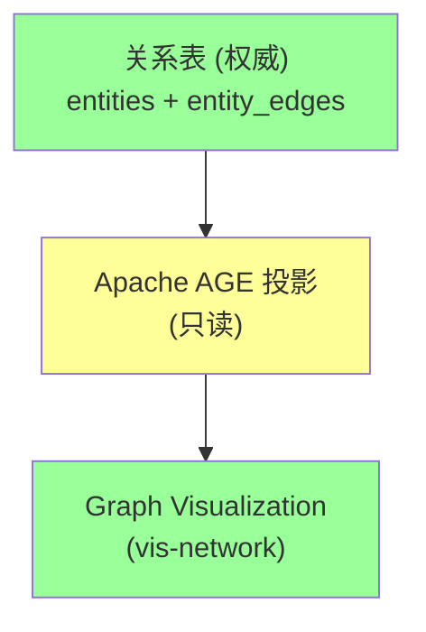
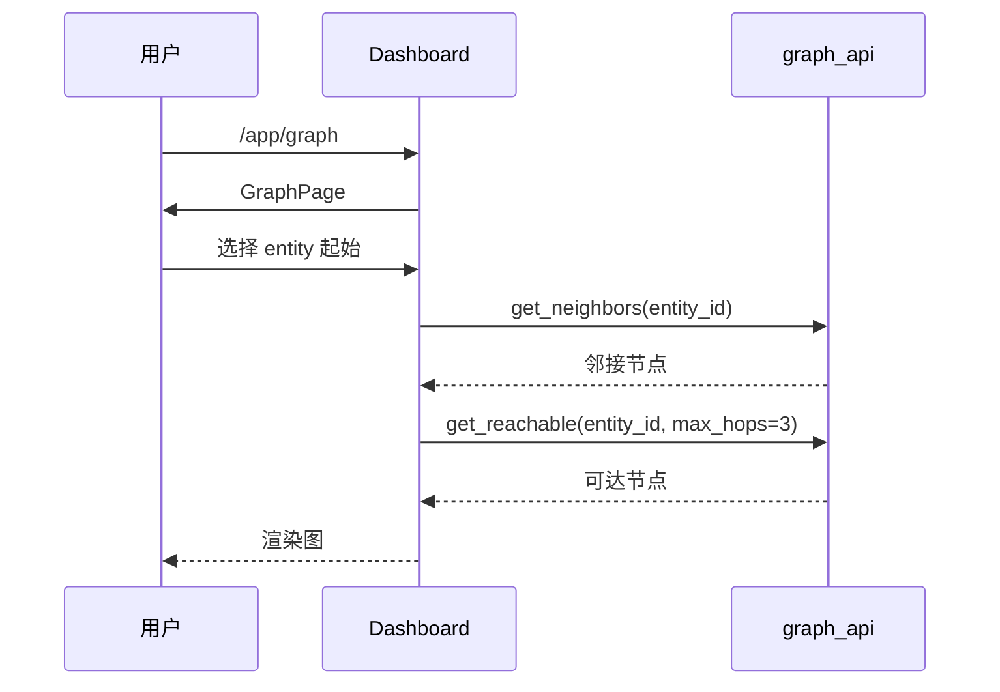
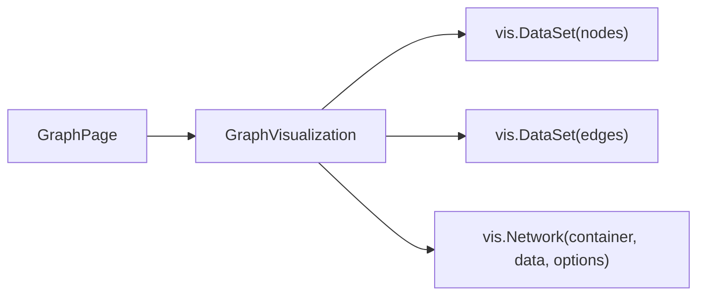
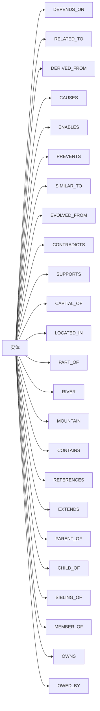

# §39 图探索与可视化

> 👤 用户/运维 · 🧑‍💻 开发者
>
> **一句话定位**:Graph 视图让用户"看见" Knowledge/Memory/Skill 之间的关系;PostgreSQL 用 Apache AGE 投影,关系表仍是权威。

---

## 1. Graph 三层模型



来源:[`docs/architecture.md:579-593`](architecture.md)

| 层 | 角色 | 来源 |
|---|---|---|
| 关系表 | 权威(写入) | `entities`, `entity_edges` |
| Apache AGE | 只读投影 | `ag_catalog` |
| 可视化 | 用户界面 | `vis-network` |

---

## 2. Graph 视图进入



---

## 3. 9 个核心图函数

来源:[`lib/graph_api.py`](../../scripts/lib/graph_api.py)

| 函数 | 用途 |
|---|---|
| `get_neighbors` | 邻接节点 |
| `get_reachable` | 多跳可达 |
| `get_shortest_path` | 最短路径 |
| `find_similar_entities` | 结构相似 |
| `get_entity_context` | 完整上下文 |
| `get_graph_stats` | 图统计 |
| `get_subgraph` | 子图提取 |
| `find_communities` | 社区发现 |
| `graph_search` | 图搜索 |

---

## 4. 函数详解

### 4.1 get_neighbors

```python
neighbors = graph_api.get_neighbors(
    entity_id="E_paris",
    direction="BOTH",        # IN/OUT/BOTH
    edge_type="CAPITAL_OF",
    min_strength=0.5,
    limit=50
)
```

返回:

```json
{
  "neighbors": [
    {
      "entity_id": "E_france",
      "title": "法国",
      "edge_type": "CAPITAL_OF",
      "strength": 1.0,
      "direction": "OUT"
    }
  ]
}
```

### 4.2 get_reachable

```python
reachable = graph_api.get_reachable(
    entity_id="E_paris",
    max_hops=3,
    edge_type=None,  # 全部
    limit=100
)
```

> ⚠️ 最大 6 跳,防止图爆炸。

### 4.3 get_shortest_path

```python
path = graph_api.get_shortest_path(
    source_id="E_paris",
    target_id="E_european_union",
    max_hops=6
)
# 返回: [E_paris, E_france, E_european_union]
```

### 4.4 find_similar_entities

```python
similar = graph_api.find_similar_entities(
    entity_id="E_paris",
    max_hops=2,
    limit=20
)
# 基于图结构相似度
```

### 4.5 get_entity_context

```python
context = graph_api.get_entity_context(
    entity_id="E_paris",
    depth=2
)
# 返回: 当前 entity + 1-hop + 2-hop 邻接
```

### 4.6 get_graph_stats

```python
stats = graph_api.get_graph_stats()
# {
#   "vertex_count": 12345,
#   "edge_count": 67890,
#   "degree_distribution": {...},
#   "edge_type_distribution": {...}
# }
```

### 4.7 get_subgraph

```python
subgraph = graph_api.get_subgraph(
    entity_ids=["E_paris", "E_france", "E_european_union"],
    include_intermediate=True
)
```

### 4.8 find_communities

```python
communities = graph_api.find_communities(
    entity_type="KNOWLEDGE",
    min_connections=3,
    limit=10
)
```

### 4.9 graph_search

```python
results = graph_api.graph_search(
    keyword="巴黎",
    entity_type="KNOWLEDGE",
    category="geography",
    min_importance=5,
    limit=20
)
```

---

## 5. 图算法(高级)

来源:[`lib/graph_api.py`](../../scripts/lib/graph_api.py)

| 函数 | 用途 |
|---|---|
| `find_causes` | 因果推理 |
| `find_contradictions` | 矛盾检测 |
| `trace_provenance` | 来源追溯 |
| `trace_data_lineage` | 数据血统 |
| `pagerank` | PageRank 重要性 |

### 5.1 PageRank

```python
ranking = graph_api.pagerank(
    entity_type="KNOWLEDGE",
    damping=0.85,
    iterations=100,
    limit=20
)
```

---

## 6. Apache AGE 投影

来源:[`lib/graph_adapter.py`](../../scripts/lib/graph_adapter.py)

### 6.1 创建投影

```sql
-- 自动在首次启动时创建
SELECT create_graph('chuanxu_memory_graph');
SELECT create_vlabel('chuanxu_memory_graph', 'entity');
SELECT create_elabel('chuanxu_memory_graph', 'edge');
```

### 6.2 Cypher 查询

```cypher
MATCH (n:entity)-[r:edge]->(m:entity)
WHERE n.title CONTAINS '巴黎'
RETURN n, r, m
LIMIT 20
```

### 6.3 capability_probe

```python
from lib import graph_adapter

caps = graph_adapter.capability_probe()
# {
#   "age_available": True,
#   "age_version": "1.7.0",
#   "cypher_supported": True,
#   "supports_shortest_path": True
# }
```

---

## 7. Graph Visualization

来源:[`web/src/App.tsx:GraphPage + GraphVisualization`](../../web/src/App.tsx)



### 7.1 节点配置

```javascript
const nodes = new vis.DataSet([
  {id: "E_paris", label: "巴黎", title: "巴黎是法国首都", group: "KNOWLEDGE"},
  {id: "E_france", label: "法国", group: "KNOWLEDGE"}
]);
```

### 7.2 边配置

```javascript
const edges = new vis.DataSet([
  {from: "E_paris", to: "E_france", label: "CAPITAL_OF", arrows: "to"}
]);
```

### 7.3 交互

| 操作 | 效果 |
|---|---|
| 单击节点 | 高亮 + 详情面板 |
| 双击节点 | 加载邻接 |
| 拖拽 | 重新布局 |
| 滚轮 | 缩放 |
| 拖动空白 | 平移 |

---

## 8. 23 种边类型

来源:[`docs/architecture.md`](../architecture.md)



每种边类型有:
- 颜色(可视化)
- 强度(默认 0.5-1.0)
- 置信度(0.0-1.0)
- 元数据(任意 JSON)

---

## 9. 图 vs Memory vs Knowledge

| 维度 | 图 | Memory | Knowledge |
|---|---|---|---|
| **类型** | 关系 | 内容 | 内容 |
| **生命周期** | 永久 | 短期 | 长期 |
| **可见性** | 跟着 entity | Agent 私有 | 可共享 |
| **可视化** | Graph 视图 | Memory Library | Knowledge 列表 |

> 📌 **同一张关系表**,不同视图。

---

## 10. 关键 API

| 端点 | 方法 | 说明 |
|---|---|---|
| `/api/graph/neighbors` | POST | 邻接 |
| `/api/graph/reachable` | POST | 可达 |
| `/api/graph/shortest_path` | POST | 最短路径 |
| `/api/graph/context` | POST | 上下文 |
| `/api/graph/stats` | GET | 统计 |
| `/api/graph/subgraph` | POST | 子图 |
| `/api/graph/communities` | POST | 社区 |
| `/api/graph/search` | POST | 搜索 |
| `/api/graph/pagerank` | POST | PageRank |

完整索引:[§53 REST API 索引](53-REST-API索引.md)。

---

## 11. 故障排查

| 问题 | 排查 |
|---|---|
| 图加载失败 | 检查 Apache AGE 是否安装 |
| 查询超时 | 限制 max_hops 或加过滤条件 |
| 边显示不正确 | 检查 edge_type 字符串拼写 |
| 投影数据陈旧 | AGE 投影是异步,可能略有延迟 |

---

## 12. 交叉引用

- 架构深度:[§10 数据库权威设计哲学](10-数据库权威设计哲学.md)
- Memory:[§36 记忆库与生命周期](36-记忆库与生命周期.md)
- Knowledge:[§35 知识库管理](35-知识库管理.md)

> 📌 **Part IV 完**。下一章开始 [Part V 进阶专题 §40 频道-关卡-审批](40-频道-关卡-审批.md)。