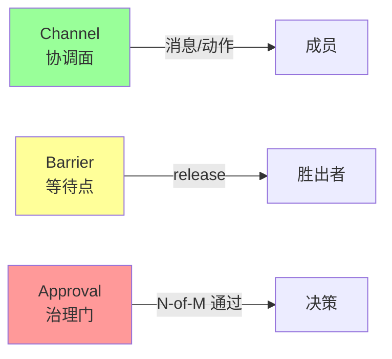
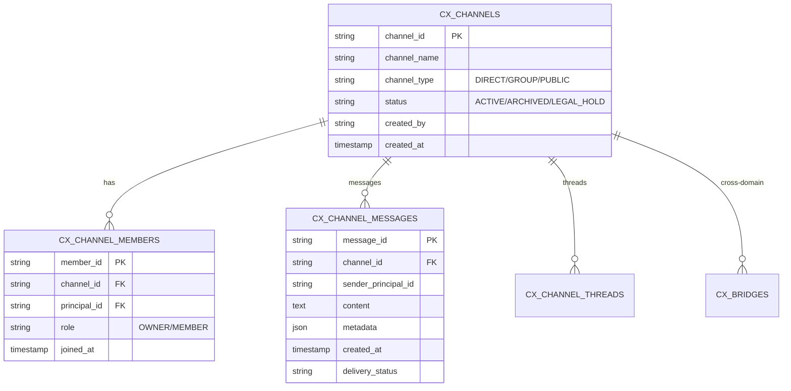
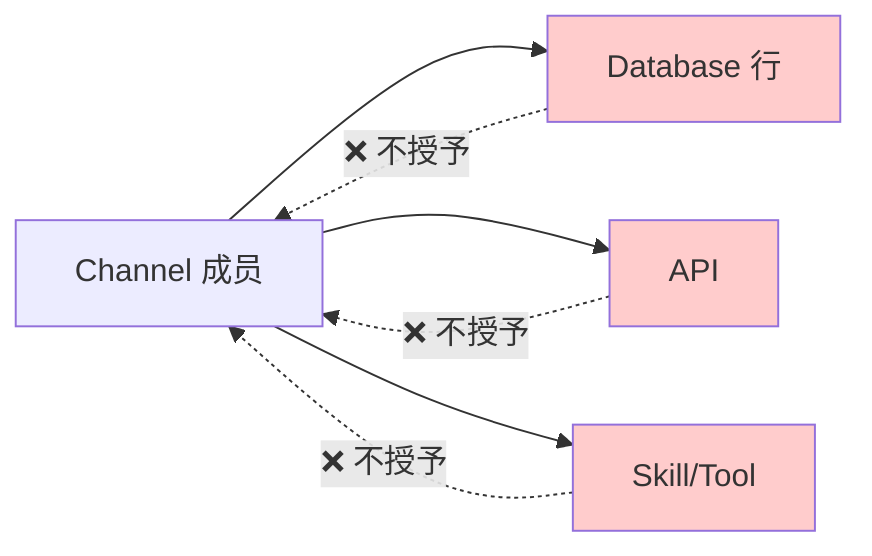
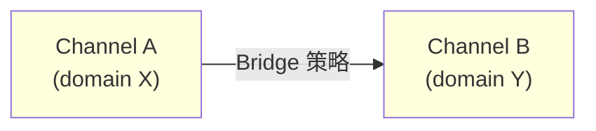
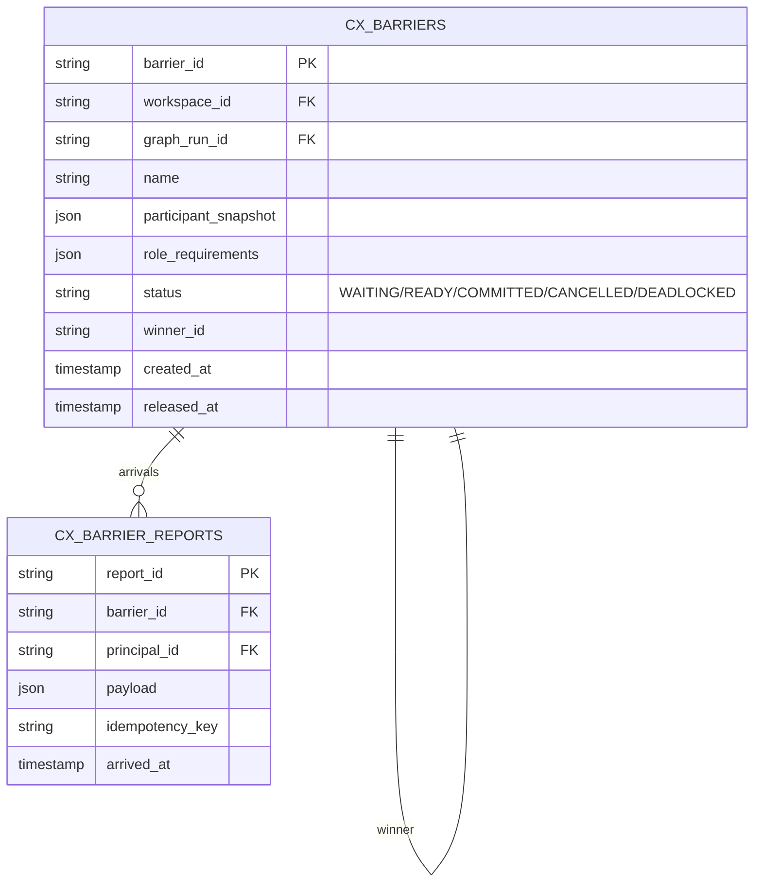
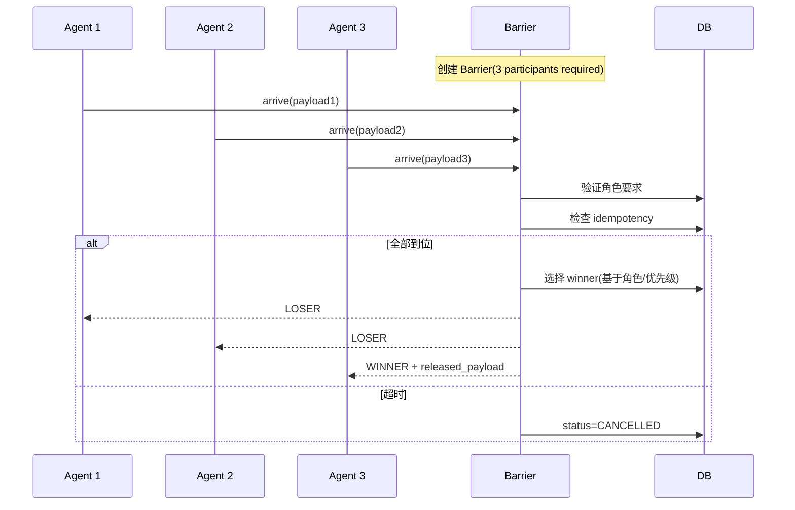
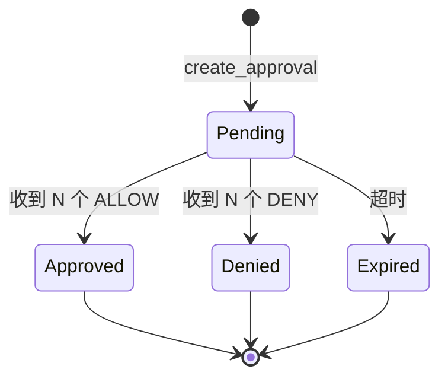
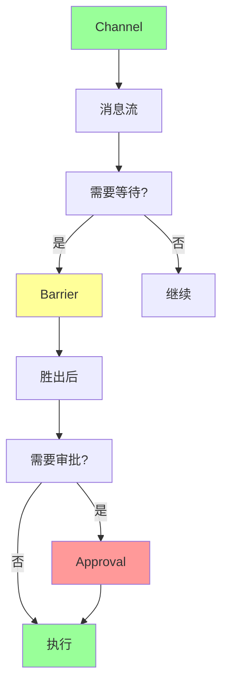

# §40 频道、关卡、审批

> 🏛️ 架构师 · 👤 用户 · 🧑‍💻 开发者
>
> **一句话定位**:Channel 是协调面、Barrier 是等待点、Approval 是治理门 — 三者共同支撑 Agent 间协作与流程门控。

---

## 1. 三者对比



| 维度 | Channel | Barrier | Approval |
|---|---|---|---|
| **角色** | 协调/消息 | 同步等待 | 治理决策 |
| **作用对象** | 成员(人类+Agent) | 参与者 | 审批者 |
| **生命周期** | 持久 | 单次 | 单次 |
| **门控** | ❌ | ✅ 唯一胜出 | ✅ 多人通过 |
| **可重入** | ✅ | ❌ | ❌ |

来源:[`docs/architecture.md:104-110`](architecture.md)

---

## 2. Channel

来源:[`scripts/deploy/16_v4_3_0_identity_channels.sql`](../../scripts/deploy/16_v4_3_0_identity_channels.sql)

### 2.1 模型



### 2.2 Channel 操作

| 操作 | 用途 |
|---|---|
| `create_channel` | 创建 |
| `add_member` | 加成员 |
| `send_message` | 发消息 |
| `get_messages` | 读消息 |
| `mark_read` | 标记已读 |
| `create_thread` | 创建主题 |
| `archive_channel` | 归档 |
| `legal_hold` | 法律保留 ⚠️企业版 |

### 2.3 关键不变量

> Channel 是**协调面**,**不是权限放大器**:
> - 加入 Channel 不授予数据库行
> - 不授予 API、Skill、Tool、Memory、Artifact、Export
> - 跨域传输需要 explicit Bridge 策略



### 2.4 创建 Channel

```python
from lib import message_api

ch = message_api.create_channel(
    channel_name="Project Alpha",
    channel_type="GROUP",
    initial_members=["agent_a", "agent_b", "user_x"]
)
```

---

## 3. Action Card

来源:[`16_v4_3_0_identity_channels.sql`](../../scripts/deploy/16_v4_3_0_identity_channels.sql) - `cx_action_cards`

### 3.1 用途

Action Card 是 Channel 内可执行的"动作卡片" — 成员可点击触发:

```python
action_api.create_action_card(
    channel_id="CH_xxx",
    title="批准部署",
    action_type="deployment_approve",
    action_data={"deployment_id": "DEP_yyy"},
    require_approval=True
)
```

| 字段 | 含义 |
|---|---|
| `action_id` | 唯一 |
| `action_type` | 类型(部署/审批/查询) |
| `action_data` | 参数 |
| `require_approval` | 是否需审批 |

---

## 4. Bridge(跨域通道)

### 4.1 用途

Bridge 是 Channel 之间的**有策略通道**,用于跨域传递消息:



### 4.2 Bridge 配置

| 字段 | 含义 |
|---|---|
| `bridge_id` | 唯一 |
| `source_channel_id` | 源 |
| `target_channel_id` | 目标 |
| `classification_check` | 是否检查分类 |
| `redaction_policy` | 脱敏策略 |
| `audit_required` | 是否强制审计 |

### 4.3 Bridge 转移

```python
governed_contracts.bridge_transfer_decision(
    bridge_id="BR_xxx",
    payload={"...": "..."}
)
# 返回: ALLOW / DENY / APPROVAL_REQUIRED
```

---

## 5. Barrier(关卡)

来源:[`16_v4_3_0_identity_channels.sql`](../../scripts/deploy/16_v4_3_0_identity_channels.sql) - `cx_barriers`

### 5.1 模型



### 5.2 关键不变量

- 等待的 Agent **不**持有 Worker Lease
- **一人胜出**(one-winner)
- 不可变参与快照(participant_snapshot)
- 不可变角色要求(role_requirements)
- 幂等证据(idempotency_key)
- Gateway 对 instance_token 做围栏
- **只释放本节点 instance**(不撤销其他节点)

### 5.3 Barrier 流程



### 5.4 Barrier vs Lock

| 维度 | Barrier | 分布式锁 |
|---|---|---|
| 一次性 | ✅ | ❌(可重入) |
| 角色约束 | ✅ | ❌ |
| 参与快照 | ✅ | ❌ |
| 胜出者明确 | ✅ | ❌ |

---

## 6. Approval(审批)

来源:[`docs/security.md`](../security.md) + Enterprise 治理

### 6.1 N-of-M Approval 模型



### 6.2 关键不变量

- **决策归属于认证 Principal**(不接受 `approver_id` from body)
- **默认排除 Requester**
- **职责分离**(角色/组分离规则)
- **Append-only**(决策不可改)
- **幂等**(重复决策返回 `ALREADY_TERMINAL`)

### 6.3 审批操作

```bash
# 创建审批
POST /api/governance/approvals
{
  "decision_target": "deployment_xyz",
  "required_count": 2,
  "candidate_approvers": ["role:admin"],
  "reason": "生产部署需要审批"
}

# 提交决策
POST /api/governance/approvals/{id}/decision
{
  "decision": "ALLOW",
  "comment": "已检查,风险可接受"
}
```

### 6.4 审批状态查询

```bash
GET /api/governance/approvals
# 返回:
{
  "approvals": [
    {
      "approval_id": "APPR_xxx",
      "status": "OPEN",
      "required_count": 2,
      "decisions": [
        {"approver": "user_a", "decision": "ALLOW", "at": "..."}
      ]
    }
  ]
}
```

---

## 7. 三者关系图



---

## 8. 关键 API

| 端点 | | 说明 |
|---|---|---|
| `/api/channels` | POST | 创建 Channel |
| `/api/channels/{id}/messages` | POST/GET | 消息 |
| `/api/channels/{id}/members` | POST | 加成员 |
| `/api/barriers` | POST | 创建 Barrier |
| `/api/barriers/{id}/arrive` | POST | 报到 |
| `/api/governance/approvals` | POST | 创建审批 |
| `/api/governance/approvals/{id}/decision` | POST | 决策 |

完整索引:[§53 REST API 索引](53-REST-API索引.md)。

---

## 9. 故障排查

| 问题 | 排查 |
|---|---|
| Channel 消息 403 | 检查 Principal 是否在 Channel 内 |
| Barrier 永远不释放 | 检查 required_count 和 arrivals |
| Approval 一直 OPEN | 检查 approvers 列表与角色 |
| Bridge 转移失败 | 检查 classification_check |

---

## 10. 交叉引用

- 治理:[§17 Enterprise 治理与合规控制面](17-Enterprise治理与合规控制面.md)
- 合规:[§41 合规控制面 v4.3.4](41-合规控制面v4.3.4.md)
- 应急:[§44 应急控制与紧急停用](44-应急控制与紧急停用.md)
- 现有文档:[`docs/architecture.md:104-110`](architecture.md)

> 📌 **下一章**:[§41 合规控制面 v4.3.4](41-合规控制面v4.3.4.md) — Enterprise Agent Compliance Plane。