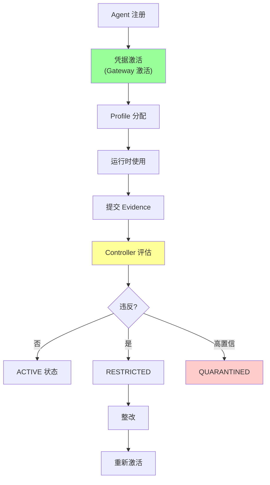
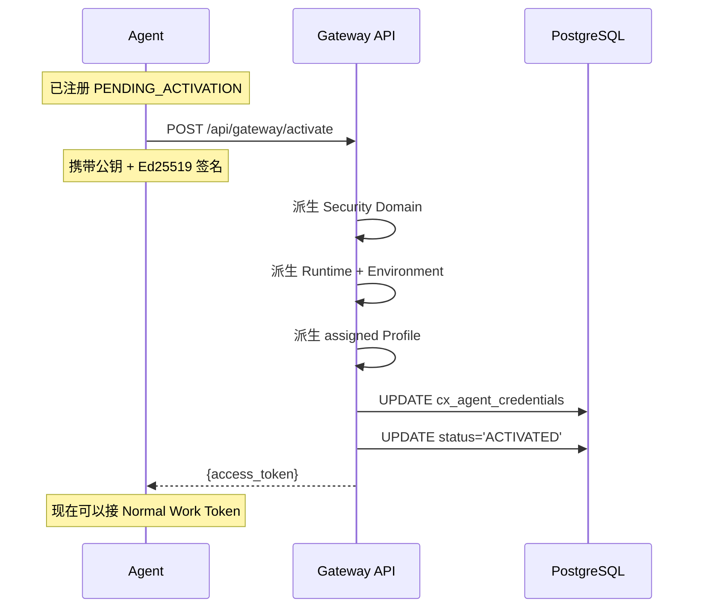
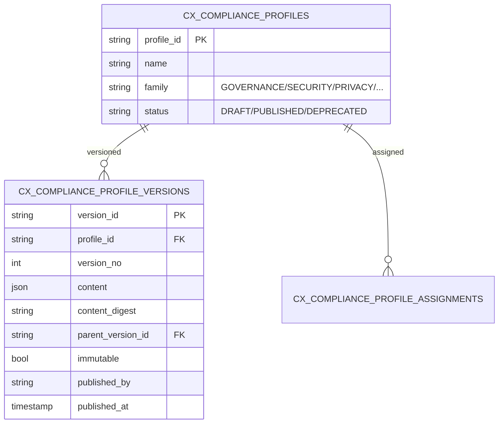
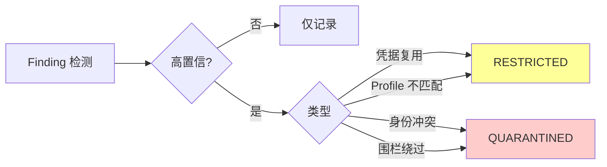
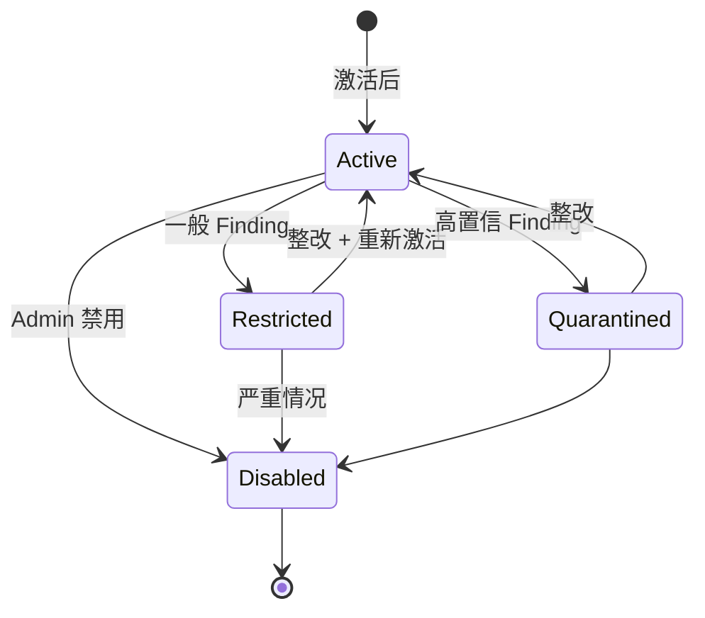
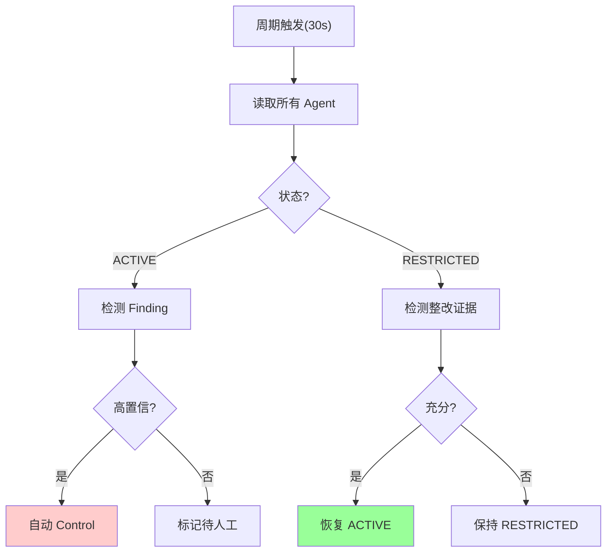

# §41 合规控制面 v4.3.4 ⚠️ 企业版

> 🏛️ 架构师 · 👤 用户 · 🧑‍💻 开发者
>
> **一句话定位**:v4.3.4 在 Enterprise 版引入完整的 Agent Compliance Plane,从 Gateway 激活到 Profile、Controller、处置的闭环。

---

## 1. v4.3.4 核心命题

来源:[`docs/security.md:21-58`](../security.md)、[`CHANGELOG.md:16-29`](../CHANGELOG.md)

> **Agent 注册、运行时、合规姿态、控制状态是独立的数据库权威事实**。缺失 Skill 调用、空闲运行时、未完成申报、咨询性模型输出、普通聊天消息**不是**策略违规的证据。这些事实可以导致 `UNKNOWN`、新鲜度警告、运维审查,但**不能**自动隔离 Agent。

---

## 2. 合规闭环



---

## 3. Gateway 激活

### 3.1 流程



### 3.2 关键不变量

来源:[`docs/security.md:29-36`](../security.md)

- 激活服务从**存储的权威**派生(Security Domain, Runtime, Environment, Profile)
- 永远**不接受** Agent 提供的扩展
- **激活前** Normal Work Token 不可用
- `CLIENT_SECRET` 证明**仅边界**外部集成
- Ed25519 适配器可记录为 `SIGNED_ADAPTER`
- **两者都不**证明未观察到的内部行为

---

## 4. Compliance Profile

### 4.1 模型



### 4.2 关键不变量

- ✅ 不可变(Published)
- ✅ Parent lock 不能被 Child 放松
- ✅ 拒绝 secret-like 内容
- ❌ **永远不授予**:Principal、Database、Tool、API、Model、Secret、Network 权限
- 只**约束**已授权操作

### 4.3 Profile 操作

```bash
# 创建草稿
POST /api/compliance/profiles

# 校验
POST /api/compliance/profiles/{id}/validate

# 发布(不可变)
POST /api/compliance/profiles/{version_id}/publish
{
  "reason": "..."
}

# 分配给 Agent
POST /api/agents/{agent_id}/compliance-profile
{
  "profile_version_id": "...",
  "reason": "..."
}
```

### 4.4 5 个内置 Profile Family

| Family | 用途 |
|---|---|
| `GENERAL_RESTRICTED` | 默认受限 Profile |
| `STANDARD_GOVERNANCE` | 标准治理 |
| `ENHANCED_PRIVACY` | 增强隐私 |
| `AUDIT_FOCUSED` | 审计重点 |
| `DEVELOPMENT` | 开发环境 |

> ⚠️ 5 个内置 Profile 是**未分配的模板**,不是默认授权。

---

## 5. Evidence & Findings

### 5.1 Evidence 模型

| 字段 | 含义 |
|---|---|
| `evidence_id` | PK |
| `agent_id` | 主体 |
| `evidence_type` | 类型(Gateway/运行时/审计) |
| `content` | 内容(可哈希) |
| `validity` | 有效期 |
| `attestation` | 签名 |
| `submitted_at` | 提交时间 |

### 5.2 提交 Evidence

```bash
POST /api/gateway/evidence
{
  "agent_id": "agent_x",
  "evidence_type": "GATEWAY_HEARTBEAT",
  "content": {...},
  "validity": "1h"
}
```

### 5.3 Findings

来源:[`docs/security.md:21-58`](../security.md)

| Finding | 含义 |
|---|---|
| `CREDENTIAL_REUSE` | 凭据复用 ⚠️自动 |
| `IDENTITY_BINDING_CONFLICT` | 身份绑定冲突 ⚠️自动 |
| `PROFILE_DIGEST_MISMATCH` | Profile digest 不匹配 ⚠️自动 |
| `FENCING_BYPASS` | 围栏绕过 ⚠️自动 |
| `STALE_EVIDENCE` | Evidence 过时 |
| `MANUAL_FLAG` | 人工标记 |

### 5.4 自动处置(仅高置信)



> 🔐 **Controller 是唯一的自动 quarantine authority**。LLM/Agent 输出**不能**触发自动 quarantine。

---

## 6. Control States



### 6.1 状态能力

| 状态 | 保留能力 | 失去能力 |
|---|---|---|
| **ACTIVE** | 全部 | - |
| **RESTRICTED** | 心跳、Evidence、整改、恢复 | 正常业务 |
| **QUARANTINED** | - | Gateway Token、Instance |
| **DISABLED** | - | 全部 |

### 6.2 状态变更

```bash
POST /api/agents/{agent_id}/compliance-control
{
  "control_state": "RESTRICTED",
  "reason": "...",
  "expected_version": 1
}
```

---

## 7. Exception(限时例外)

```python
exception = compliance_api.create_exception(
    agent_id="agent_x",
    scope="specific_capability",
    duration_hours=24,
    reason="...",
    compensating_controls=["manual_review"]
)
```

### 7.1 例外审批

```bash
# 第二个独立 Human 批准
POST /api/compliance/exceptions/{id}/approve
{
  "reason": "..."
}

# 拒绝
POST /api/compliance/exceptions/{id}/reject

# 撤销
POST /api/compliance/exceptions/{id}/revoke
```

---

## 8. Compliance Controller

来源:[`docs/security.md:43-58`](../security.md)

### 8.1 特性

- ✅ 数据库租约 + 围栏
- ✅ **不做**模型调用
- ✅ **不读** Prompt
- ✅ **不做** LLM 判断
- ✅ 周期性触发(默认 30s)
- ✅ 重复评估更新 logical_finding

### 8.2 启动

```python
# web_app.py
def _start_compliance_controller():
    thread = threading.Thread(
        target=compliance_controller.run_once,
        args=(local_node_id,),
        daemon=True
    )
    thread.start()
```

### 8.3 评估流程



---

## 9. 关键 API ⚠️企业版

| 端点 | 方法 | 说明 |
|---|---|---|
| `/api/gateway/activate` | POST | 凭据激活 |
| `/api/gateway/evidence` | POST | 提交 Evidence |
| `/api/gateway/remediations/{id}/respond` | POST | 整改 |
| `/api/agents/{id}/posture` | GET | 综合姿态 |
| `/api/compliance/summary` | GET | 总览 |
| `/api/compliance/findings` | GET | Findings |
| `/api/compliance/profiles` | GET/POST | Profiles |
| `/api/compliance/profiles/{id}/publish` | POST | 发布不可变版本 |
| `/api/agents/{id}/compliance-profile` | POST | 分配 Profile |
| `/api/agents/{id}/compliance-control` | POST | 控制状态 |
| `/api/compliance/exceptions` | GET/POST | 例外 |
| `/api/compliance/exceptions/{id}/{d}` | POST | 例外决策 |

---

## 10. Seeded Compliance Admin

> 来源:[`docs/security.md:53-58`](../security.md)

| 维度 | 值 |
|---|---|
| 类型 | `AGENT` |
| Profile | `GENERAL_RESTRICTED` |
| Schema Owner | ❌ 无 |
| Human/Admin Agent 凭据 | ❌ 无 |
| Gateway 凭据 | ❌ 无 |
| 状态 | `PENDING_ACTIVATION` |
| 能力 | 不能审批例外、不能改 Profile、不能批准 Evidence、不能授权、不能改姿态 |

> 🔐 它**不是**自主模型运行时。

---

## 11. 故障排查

| 问题 | 排查 |
|---|---|
| Activation 失败 | 检查 Ed25519 签名 + 公钥 |
| Evidence 提交 403 | 检查 Agent 状态 |
| 自动 Quarantine | 检查 Finding 类型 + 是否高置信 |
| Profile 发布失败 | 检查 parent lock + secret-like 内容 |
| Exception 申请失败 | 检查 compensating_controls 配置 |

---

## 12. 交叉引用

- 架构深度:[§17 Enterprise 治理与合规控制面](17-Enterprise治理与合规控制面.md)
- 注册 Agent:[§13 注册 Agent 治理平面](13-注册Agent治理平面.md)
- 应急:[§44 应急控制与紧急停用](44-应急控制与紧急停用.md)
- 现有文档:[`docs/security.md:21-58`](../security.md)

> 📌 **下一章**:[§42 审计与证据导出](42-审计与证据导出.md) — entity_access_log + CX_SECURITY_EVENTS + Evidence Export。