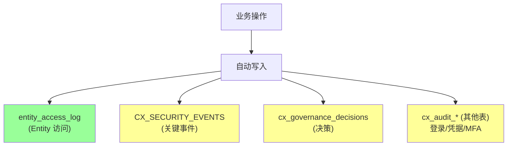
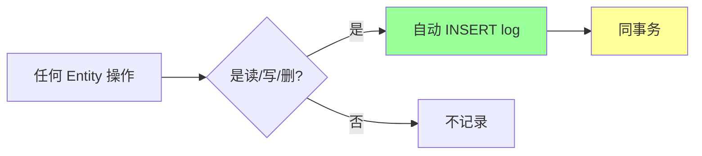
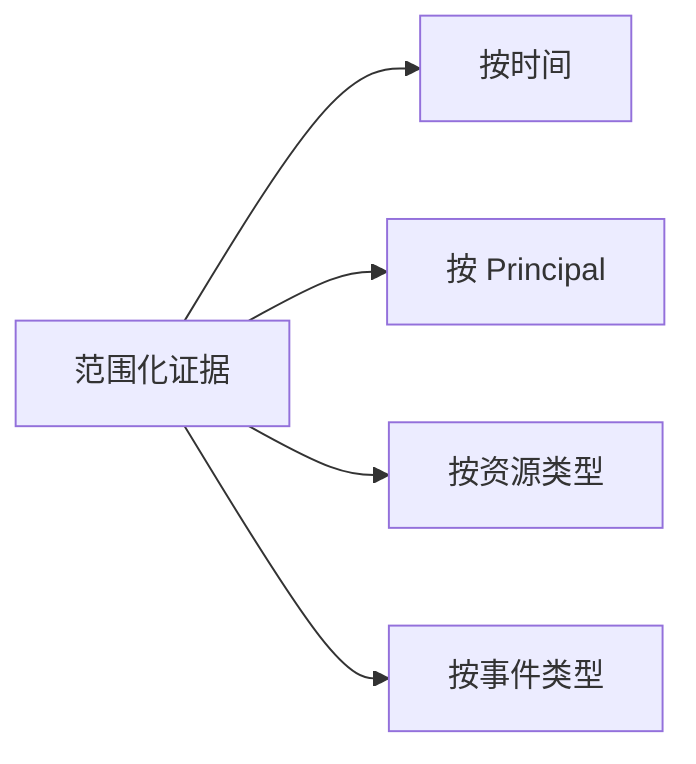
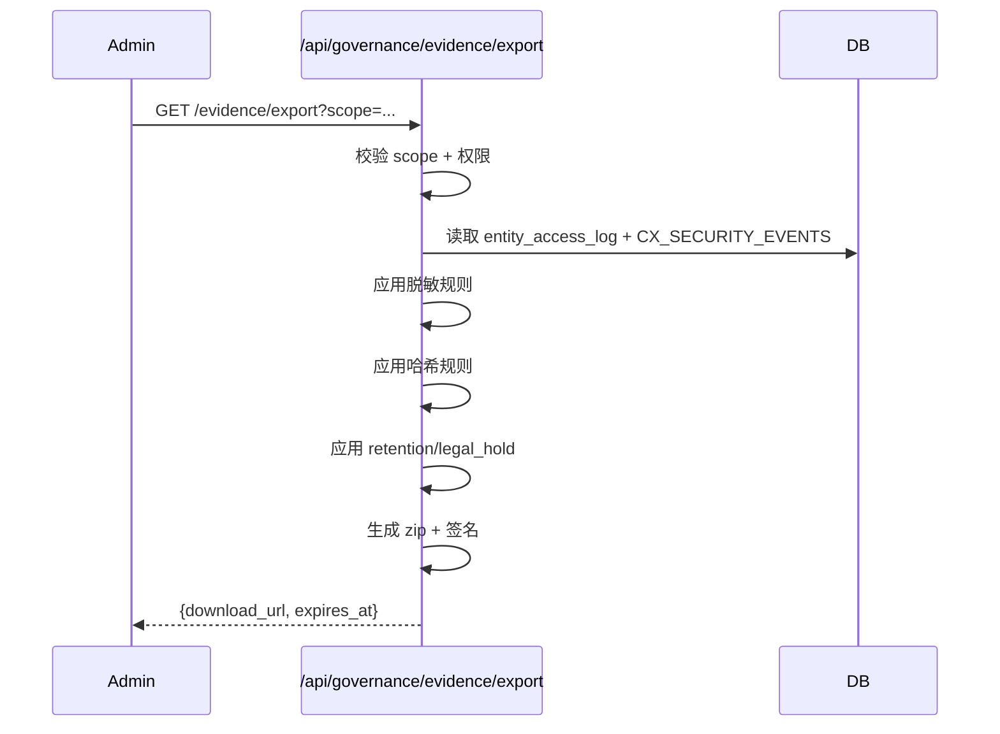
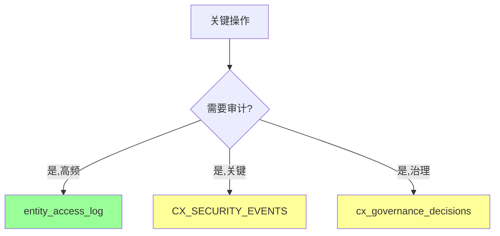

# §42 审计与证据导出

> 🏛️ 架构师 · 👤 用户 · 🧑‍💻 开发者
>
> **一句话定位**:平台所有关键操作都是不可变审计行;企业版支持范围化证据导出,带哈希/脱敏/留存/法律保留。

---

## 1. 审计数据源



---

## 2. entity_access_log(Entity 访问日志)

来源:[`scripts/deploy/1_schema.sql`](../../scripts/deploy/1_schema.sql) - `entity_access_log` 表

### 2.1 模型

| 字段 | 含义 |
|---|---|
| `log_id` | PK |
| `entity_id` | 访问的 entity |
| `entity_type` | entity 类型 |
| `agent_id` | 访问者 Agent |
| `principal_id` | 访问者 Principal |
| `access_type` | READ/WRITE/DELETE/EXPORT |
| `access_time` | 时间 |
| `metadata` | JSONB 详情 |

### 2.2 分区

```sql
-- 按 RANGE + HASH 分区
PARTITION BY RANGE (access_time)
  SUBPARTITION BY HASH (agent_id) SUBPARTITIONS 4;
```

每月一个分区,便于归档。

### 2.3 写入策略



> ⚠️ **同事务**:Entity 操作 + access_log 在同一 `BEGIN/COMMIT`,失败时一起回滚。

### 2.4 查询

```sql
-- 某 Agent 访问过的所有 Entity
SELECT * FROM entity_access_log
WHERE agent_id = 'agent_xxx'
  AND access_time > now() - interval '7 days'
ORDER BY access_time DESC;

-- 某 Entity 的所有访问者
SELECT * FROM entity_access_log
WHERE entity_id = 'E_xxx'
  AND access_type = 'READ'
LIMIT 100;
```

---

## 3. CX_SECURITY_EVENTS

来源:[`scripts/deploy/16_v4_3_0_identity_channels.sql`](../../scripts/deploy/16_v4_3_0_identity_channels.sql)

### 3.1 用途

记录**关键安全事件**,与 `entity_access_log`(高频访问日志)分离:

| 事件类型 | 触发 |
|---|---|
| `LOGIN_SUCCESS` / `LOGIN_FAILED` | 用户登录 |
| `MFA_ENROLLED` | MFA 注册 |
| `PASSWORD_RESET` | 密码重置 |
| `CAPABILITY_TOGGLED` | Capability 启用/禁用 |
| `EMERGENCY_TRIGGERED` | 紧急停用启动 |
| `AGENT_REGISTERED` | Agent 注册 |
| `AGENT_QUARANTINED` | Agent 隔离 |
| `PROFILE_PUBLISHED` | Profile 发布 |
| `APPROVAL_DECIDED` | 审批决策 ⚠️企业版 |
| `MEMORY_QUARANTINED` | Memory 隔离 |

### 3.2 字段

| 字段 | 含义 |
|---|---|
| `event_id` | PK |
| `event_type` | 事件类型 |
| `subject_principal_id` | 主体 |
| `actor_principal_id` | 操作者 |
| `resource_type` | 资源类型 |
| `resource_id` | 资源 ID |
| `severity` | INFO/WARNING/CRITICAL |
| `details` | JSONB |
| `created_at` | 时间 |

### 3.3 同事务审计

来源:[`RELEASE_NOTES_v4.3.5.md:20-23`](../RELEASE_NOTES_v4.3.5.md)

> **Capability 状态行 + history 行 + CX_SECURITY_EVENTS 审计记录**使用**一个事务**提交。

```python
# platform_capabilities.py
def toggle(...):
    with connection.get_connection() as conn:
        with conn.cursor() as cur:
            cur.execute("BEGIN")
            try:
                # 1. 更新状态(乐观锁)
                cur.execute("UPDATE cx_platform_capabilities SET ... WHERE expected_version = %s", ...)
                # 2. 写入 history
                cur.execute("INSERT INTO cx_platform_capability_history ...")
                # 3. 写入 security_event
                cur.execute("INSERT INTO CX_SECURITY_EVENTS ...")
                cur.execute("COMMIT")
            except:
                cur.execute("ROLLBACK")
                raise
```

> 🔐 失败时,审计 + 状态一起回滚,**不会**出现"看起来成功但实际失败"。

---

## 4. cx_governance_decisions(治理决策)

来源:[`scripts/deploy/16_v4_3_0_identity_channels.sql`](../../scripts/deploy/16_v4_3_0_identity_channels.sql)

| 字段 | 含义 |
|---|---|
| `decision_id` | PK |
| `policy_version` | 策略版本 |
| `decision` | ALLOW / DENY / APPROVAL_REQUIRED |
| `subject_principal_id` | 主体 |
| `resource_type` | 资源类型 |
| `resource_id` | 资源 ID |
| `reason` | 原因 |
| `validity` | 有效期 |
| `correlation_id` | 关联 ID |
| `created_at` | 时间(不可变) |

> ✅ **不可变**:append-only,不能 UPDATE/DELETE。

---

## 5. Evidence Export ⚠️企业版

### 5.1 范围



### 5.2 导出流程



### 5.3 脱敏规则

| 字段类型 | 处理 |
|---|---|
| 密码 | 完全移除 |
| API Key | 完全移除 |
| Token | 完全移除 |
| 邮箱 | 部分脱敏 |
| IP | 末段脱敏 |
| 姓名 | 按规则 |

### 5.4 哈希规则

```python
# 关键事件带 SHA-256 摘要
{
    "event_id": "EVT_xxx",
    "event_type": "LOGIN_SUCCESS",
    "subject": "agent_001",
    "timestamp": "2026-08-05T...",
    "content_hash": "sha256:abc123..."
}
```

### 5.5 留存与法律保留

| 状态 | 含义 |
|---|---|
| `NORMAL` | 默认留存期 |
| `EXTENDED` | 延长留存(企业版) |
| `LEGAL_HOLD` | 法律保留 ⚠️不可删除 |

```python
legal_hold_api.apply_legal_hold(
    resource_type="CX_SECURITY_EVENTS",
    resource_ids=["EVT_001", "EVT_002"],
    reason="Litigation case 12345"
)
```

---

## 6. 审计查询 API

| 端点 | 方法 | 说明 |
|---|---|---|
| `/api/audit/access` | GET | Entity 访问审计 |
| `/api/audit/workspace` | GET | Workspace 审计 |
| `/api/audit/security-events` | GET | 安全事件 |
| `/api/audit/governance-decisions` | GET | 治理决策 ⚠️企业版 |
| `/api/governance/evidence/export` | GET | 证据导出 ⚠️企业版 |

### 6.1 access 端点示例

```bash
GET /api/audit/access?agent_id=agent_x&since=2026-08-01
```

返回:

```json
{
  "entries": [
    {
      "log_id": "LOG_xxx",
      "entity_id": "E_paris",
      "entity_type": "KNOWLEDGE",
      "access_type": "READ",
      "access_time": "2026-08-05T12:34:56Z"
    }
  ]
}
```

### 6.2 安全事件端点

```bash
GET /api/audit/security-events?event_type=CAPABILITY_TOGGLED&severity=CRITICAL
```

---

## 7. 审计最佳实践



| 操作类型 | 写入位置 |
|---|---|
| 读/写 Memory | `entity_access_log` |
| 用户登录 | `CX_SECURITY_EVENTS` |
| Capability 变更 | `CX_SECURITY_EVENTS` + 同事务 |
| 资源访问决策 | `cx_governance_decisions` |
| Agent 隔离 | `CX_SECURITY_EVENTS` |
| Memory 隔离 | `CX_SECURITY_EVENTS` |
| Evidence 提交 | `CX_SECURITY_EVENTS` |

---

## 8. retention(留存)策略

来源:[`docs/security.md:50-58`](../security.md)

| 资源类型 | 默认留存 | 延长留存 ⚠️企业版 |
|---|---|---|
| `entity_access_log` | 90 天 | 可配置 |
| `CX_SECURITY_EVENTS` | 1 年 | 可配置 |
| `cx_governance_decisions` | 7 年 | 法律要求 |
| `cx_memory_*` (ARCHIVED) | 永久 | 永久(合规) |
| `cx_audit_*` | 7 年 | 法律要求 |

### 8.1 清理任务

来源:[`scripts/deploy/3_jobs.sql`](../../scripts/deploy/3_jobs.sql) - `session_cleanup.purge_access_logs`

```sql
-- 默认每天清理过期 log
SELECT session_cleanup.purge_access_logs(retention_days => 90);
```

> ⚠️ **LEGAL_HOLD** 状态**永不**被自动清理。

---

## 9. 故障排查

| 问题 | 排查 |
|---|---|
| 审计查询慢 | 加 `access_time` 索引或分区裁剪 |
| Evidence Export 超时 | 缩小 scope,分批导出 |
| Legal Hold 失效 | 检查 retention 配置 |

---

## 10. 交叉引用

- 合规:[§41 合规控制面 v4.3.4](41-合规控制面v4.3.4.md)
- 应急:[§44 应急控制与紧急停用](44-应急控制与紧急停用.md)
- 现有文档:[`docs/security.md`](../security.md) 全文

> 📌 **下一章**:[§43 加密机制与密钥管理](43-加密机制与密钥管理.md) — PBKDF2 + AES-256-GCM + pgcrypto + 自动加密。